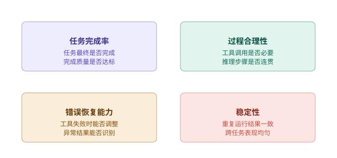
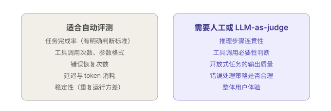

+++
title = "如何评测一个 Agent：不只是看它回答得好不好"
date = 2026-03-23T10:00:00+08:00
draft = false
author = "Hex4C59"
description = "解释 Agent 评测为什么不能只看最终答案，并给出覆盖任务完成率、过程合理性、错误恢复与稳定性的评测框架。"
summary = "系统分析 Agent 评测与模型评测的差异，说明如何构建测试集、结合自动评测与 LLM-as-judge，并把失败案例转化成可持续的改进信号。"
tags = ["Agent", "Evaluation", "Reliability", "Testing", "LLM"]
categories = ["Agent"]
series = ["agent-engineering"]
series_order = 6
difficulty = "intermediate"
article_type = "concept"
topics = ["eval", "agent", "reliability", "task-completion", "testing"]
frameworks = ["OpenAI", "Anthropic"]
ShowToc = true
+++

这个系列到目前为止，已经把 Agent 的核心结构讲清楚了：Tool Use 是它与外部世界的接口，上下文管理决定它在长任务中能否保持方向感，ReAct 是它的推理-行动范式，Planning 是它处理复杂任务的全局结构。

但有一个问题一直被绕开了：**你怎么知道你做的 Agent 是好的？**

“它看起来能用”不是答案。“我测了几个例子，效果不错”也不是答案。这篇文章要回答的是：Agent 评测应该测什么、怎么测、以及如何把评测结果转化成真正有用的改进信号。

---

## 先给结论

1. **Agent 评测和模型评测是两件不同的事。** 模型评测关注单次输出质量；Agent 评测关注多步执行过程中的整体行为，包括工具选择、错误恢复、任务完整性和稳定性。
2. **“回答得好不好”只是评测的一个维度，而且通常不是最重要的那个。** 更关键的问题是：它能不能稳定地把任务做完、做错了能不能恢复、工具调用是否合理。
3. **Agent 评测需要同时关注结果和过程。** 结果评测告诉你任务有没有完成；过程评测告诉你为什么完成或为什么失败，以及哪里可以改进。
4. **稳定性比单次表现更重要。** 一个偶尔表现出色但经常出错的 Agent，工程价值远低于一个稳定完成 80% 任务的 Agent。
5. **评测本身需要系统化。** 临时测几个例子只能告诉你“现在能不能用”，无法告诉你“改动之后变好了还是变坏了”。

---

## 为什么 Agent 评测比模型评测难

先把问题说清楚。

评测一个语言模型相对直接：给定输入，看输出是否符合预期。评测指标通常是准确率、BLEU 分、人类偏好评分等，每个样本是独立的。

Agent 评测难在三个地方：

**执行路径不唯一。** 同一个任务，Agent 可以用不同的工具序列完成。搜索两次和搜索三次都可能得到正确答案，但哪种更好？只看最终结果无法区分。

**错误有传播效应。** Agent 某一步的错误会影响后续所有步骤。如果工具调用失败但 Agent 没有正确处理，它可能在错误的前提上继续执行，最终得出一个“看起来合理但实际错误”的结论——这比直接失败更难发现。

**随机性导致结果不稳定。** 语言模型有温度参数，相同输入可能产生不同输出。Agent 的多步执行会放大这种随机性：第一步略有不同，可能导致后续完全不同的执行路径。

这三个特点决定了：Agent 评测必须同时覆盖**结果**（任务有没有完成）、**过程**（执行路径是否合理）和**稳定性**（在重复运行中表现是否一致）。

---

## 评测的四个维度

Agent 评测应该覆盖四个维度，每个维度回答不同的问题：



*图 1：一个工程上可用的 Agent 评测框架，至少要同时覆盖任务完成率、过程合理性、错误恢复能力和稳定性。*

### 维度一：任务完成率

最直接的指标。给定一批测试任务，Agent 成功完成了多少？

但“完成”的定义需要仔细设计。不同任务类型有不同的完成标准：

- 信息检索类任务：答案是否准确、完整
- 代码生成类任务：代码能否运行、输出是否正确
- 文件处理类任务：目标文件是否被正确创建/修改
- 多步分析类任务：结论是否有数据支撑、覆盖所有必要角度

完成率通常需要细分成两层：**任务级完成率**（整个任务是否完成）和**子任务级完成率**（每个步骤的成功率）。子任务级别的数据更有调试价值——它能告诉你具体是哪个环节出问题。

### 维度二：过程合理性

任务完成了，不代表执行过程是合理的。过程合理性关注：

- 工具调用次数是否合理（是否存在冗余调用或漏调用）
- 工具参数填写是否准确
- 推理步骤是否连贯，有没有跳跃或自相矛盾
- 是否在信息已足够时及时停止，而不是继续无效调用

过程合理性的评测通常需要人工审查执行轨迹，或者用另一个模型来打分（LLM-as-judge）。

### 维度三：错误恢复能力

这是最容易被忽视、但对生产环境最重要的维度。

真实环境里工具会失败：搜索返回空结果、API 超时、数据库查询报错。一个好的 Agent 应该能识别这些情况并做出合理调整，而不是直接崩溃或继续基于错误数据推进。

测试错误恢复能力需要专门构造“故障注入”测试用例：在特定步骤强制让工具失败，观察 Agent 如何响应。

### 维度四：稳定性

相同任务运行多次，结果是否一致？

稳定性低的 Agent 在演示时可能表现出色，但在生产中会让用户困惑——同样的问题，有时能完成，有时不能，没有明显原因。

稳定性的测量方式是：对同一批任务重复运行 N 次（通常 5-10 次），计算每个任务的成功率分布。理想状态是任务要么稳定成功、要么稳定失败——随机成功是最难处理的情况，因为它无法可靠地复现和调试。

---

## 构建测试集

评测的质量上限取决于测试集的质量。测试集的构建是整个评测体系里最需要仔细设计的部分。

### 测试用例的四个来源

**1. 真实用户请求（最有价值）**

从实际使用日志里采样真实任务。这些任务反映了用户真正想做的事，不会有“理论上合理但实际不存在”的偏差。

问题是：真实请求往往没有现成的标准答案，需要额外标注。

**2. 手工构造的边界用例**

覆盖那些真实请求里概率较低但很重要的场景：
- 工具调用失败的情况
- 任务描述模糊的情况
- 需要多轮推理才能解决的情况
- 信息相互矛盾需要判断的情况

**3. 历史失败案例**

Agent 曾经失败过的任务是最好的回归测试集。每次修复一个 bug，就把对应的失败案例加进测试集，防止同样的问题再次出现。

**4. 对抗性用例**

专门设计来测试 Agent 边界的任务：故意给出不完整的信息、故意让工具返回冲突的结果、故意给出超出 Agent 能力范围的请求。

### 测试集的结构

一个好的测试集不只是一堆输入输出对，还需要：

```python
from dataclasses import dataclass, field
from typing import Optional, Callable

@dataclass
class TestCase:
    id: str
    description: str
    input: str                          # 用户输入
    expected_outcome: str               # 预期结果的文字描述
    success_criteria: list[Callable]    # 可执行的成功判断函数
    tags: list[str]                     # 分类标签，如 ["tool_failure", "multi_step"]
    difficulty: str                     # "easy" | "medium" | "hard"
    required_tools: list[str]           # 这个任务理论上需要用到哪些工具
    max_steps: int = 15                 # 允许的最大执行步数
    timeout_seconds: int = 60          # 超时时间
    notes: Optional[str] = None        # 测试设计说明


@dataclass
class TestResult:
    case_id: str
    success: bool
    completion_rate: float              # 0.0 - 1.0，子任务完成比例
    steps_taken: int
    tools_called: list[str]
    error_recoveries: int               # 遇到工具失败后成功恢复的次数
    final_output: str
    execution_trace: list[dict]         # 完整执行轨迹
    latency_seconds: float
    total_tokens: int
    failure_reason: Optional[str] = None
```

`success_criteria` 设计成可执行函数列表，而不是字符串描述，是为了让评测可以自动化运行：

```python
def make_criteria():
    return [
        # 结果中包含具体数字
        lambda output: any(char.isdigit() for char in output),
        # 结果长度合理（不是空的，也不是截断的）
        lambda output: 100 < len(output) < 5000,
        # 包含特定关键词（根据任务定制）
        lambda output: "分析" in output and "建议" in output,
    ]
```

---

## 自动评测 vs 人工评测

不同维度的评测适合不同的方式：



*图 2：自动评测更适合规则明确、可量化的指标；开放式输出质量和过程合理性通常仍需要人工或 LLM-as-judge。*

### 自动评测的实现

```python
import asyncio
import statistics
from typing import Any

async def run_evaluation(
    agent_fn: Callable,
    test_cases: list[TestCase],
    repeat: int = 3              # 每个用例重复运行次数，用于测稳定性
) -> dict[str, Any]:

    results: dict[str, list[TestResult]] = {}

    for case in test_cases:
        case_results = []
        for run_idx in range(repeat):
            try:
                result = await run_single_case(agent_fn, case)
                case_results.append(result)
            except Exception as e:
                case_results.append(TestResult(
                    case_id=case.id,
                    success=False,
                    completion_rate=0.0,
                    steps_taken=0,
                    tools_called=[],
                    error_recoveries=0,
                    final_output="",
                    execution_trace=[],
                    latency_seconds=0,
                    total_tokens=0,
                    failure_reason=str(e)
                ))
        results[case.id] = case_results

    return compute_metrics(results, test_cases)


def compute_metrics(
    results: dict[str, list[TestResult]],
    test_cases: list[TestCase]
) -> dict[str, Any]:

    all_success_rates = []
    stability_scores  = []
    recovery_rates    = []
    step_efficiencies = []

    for case in test_cases:
        case_results = results[case.id]
        successes = [r.success for r in case_results]

        # 任务完成率
        success_rate = sum(successes) / len(successes)
        all_success_rates.append(success_rate)

        # 稳定性：成功率的一致程度（1.0 = 完全稳定，0.0 = 完全随机）
        # 稳定失败（0.0）和稳定成功（1.0）都是高稳定性
        stability = 1.0 - (2 * abs(success_rate - round(success_rate)))
        stability_scores.append(stability)

        # 错误恢复率：遇到工具失败时成功恢复的比例
        tool_failures = sum(
            1 for r in case_results
            for step in r.execution_trace
            if step.get("tool_failed")
        )
        recoveries = sum(r.error_recoveries for r in case_results)
        if tool_failures > 0:
            recovery_rates.append(recoveries / tool_failures)

        # 步骤效率：实际步骤数 / 理论最少步骤数
        for r in case_results:
            if r.success and r.steps_taken > 0:
                efficiency = len(case.required_tools) / r.steps_taken
                step_efficiencies.append(min(efficiency, 1.0))

    return {
        "task_success_rate":    statistics.mean(all_success_rates),
        "stability_score":      statistics.mean(stability_scores),
        "error_recovery_rate":  statistics.mean(recovery_rates) if recovery_rates else None,
        "step_efficiency":      statistics.mean(step_efficiencies) if step_efficiencies else None,
        "by_difficulty": _breakdown_by_tag(results, test_cases, "difficulty"),
        "by_tag":        _breakdown_by_tag(results, test_cases, "tags"),
    }
```

### LLM-as-judge：用模型评测模型

对于无法自动判断的维度（推理连贯性、工具调用必要性），可以用另一个模型来打分：

```python
async def judge_execution_trace(
    task: str,
    trace: list[dict],
    final_output: str,
    judge_model: str = "gpt-4o"
) -> dict[str, float]:

    trace_text = "\n".join([
        f"[{step['type']}] {step['content'][:300]}"
        for step in trace
    ])

    response = await client.chat.completions.create(
        model=judge_model,
        messages=[{
            "role": "user",
            "content": f"""
你是一个 Agent 执行质量评审员。请评估以下 Agent 的执行过程。

任务：{task}

执行轨迹：
{trace_text}

最终输出：
{final_output}

请对以下维度打分（0.0 - 1.0），并给出简短理由：
1. 推理连贯性：每步 Thought 是否有依据、逻辑是否自洽
2. 工具使用合理性：工具调用是否必要、参数是否准确
3. 错误处理质量：遇到工具失败或意外结果时处理是否合理
4. 输出质量：最终输出是否完整、准确、有价值

只输出 JSON，格式：
{{
  "reasoning_coherence": 0.0-1.0,
  "tool_usage_quality":  0.0-1.0,
  "error_handling":      0.0-1.0,
  "output_quality":      0.0-1.0,
  "reasoning_notes":     "简短说明"
}}
"""
        }],
        response_format={"type": "json_object"}
    )

    return json.loads(response.choices[0].message.content)
```

使用 LLM-as-judge 有几个注意点：

用比被测 Agent 更强的模型来做 judge，否则 judge 会系统性地无法识别被测模型的错误。评分结果要做人工抽样验证，确认 judge 的判断和人类判断的一致性在可接受范围内。同一份执行轨迹用多个不同的 prompt 来打分，取平均，减少单次打分的随机性。

---

## 把评测结果转化成改进信号

拿到评测数据只是起点。真正有价值的是把数据转化成具体的改进方向。

### 失败分类

每次评测后，对失败案例做系统性分类：

```python
FAILURE_CATEGORIES = {
    "tool_selection":    "选错了工具，或该调用时没有调用",
    "tool_parameter":    "工具参数填写错误",
    "no_recovery":       "工具失败后没有恢复，继续在错误前提上执行",
    "goal_drift":        "执行过程中偏离了原始目标",
    "premature_stop":    "信息不足时过早给出答案",
    "over_execution":    "信息已足够但继续调用工具",
    "context_loss":      "在长任务中忘记了之前的关键信息",
    "format_error":      "输出格式不符合要求",
    "hallucination":     "引用了工具未返回的信息",
}
```

每个失败案例打上类别标签，然后按类别统计频率。频率最高的失败类别，就是最值得优先解决的问题。

### 从失败类别到改进方向

不同的失败类别对应不同的改进方向：

| 失败类别 | 最可能的根本原因 | 改进方向 |
|---|---|---|
| tool_selection | 工具描述不清晰 | 重写工具描述，明确触发条件 |
| tool_parameter | 参数描述缺少示例 | 在参数描述里加格式和示例 |
| no_recovery | 错误处理逻辑缺失 | 在 system prompt 里明确错误处理策略 |
| goal_drift | 任务状态管理不足 | 引入显式任务状态对象（参考[上下文与记忆](/agent/context-memory-state-management/)） |
| premature_stop | 完成标准不明确 | 在 prompt 里明确“什么情况下才算完成” |
| over_execution | 缺少停止信号 | 加入“信息已足够时直接回答”的指令 |
| context_loss | 上下文管理问题 | 引入任务状态对象或压缩策略 |
| hallucination | 模型过度推断 | 在 prompt 里加入“只使用工具返回的信息”的约束 |

### 回归测试：防止好不容易修好的问题再次出现

每次修复一个失败类别后：

1. 把触发这次修复的失败案例加进固定测试集
2. 运行完整评测，确认指标有改善
3. 确认其他维度没有因为这次修改而退步（这是最常见的问题——修好了一个地方，破坏了另一个地方）

这个循环——评测、分析、修改、回归测试——是让 Agent 持续进步的核心机制。

---

## 评测体系的演化路径

不同阶段的 Agent 项目适合不同复杂度的评测体系。

**原型阶段**：手工测试 10-20 个核心用例，重点验证基本流程能否走通。不需要自动化，不需要稳定性测试。目标是快速发现方向性问题。

**开发阶段**：建立 50-100 个测试用例，覆盖主要任务类型和边界情况。实现基本的自动化评测，能够在每次修改后快速跑一遍。开始记录失败案例和失败类别。

**上线前**：测试集扩展到 200+ 用例，覆盖真实用户请求样本。加入稳定性测试（每个用例重复运行 3-5 次）。引入 LLM-as-judge 对过程合理性打分。明确上线的最低指标门槛。

**生产阶段**：持续从线上日志采样新用例，补充到测试集。建立指标监控，出现下降时自动告警。定期做全量评测，追踪长期趋势。

---

## 常见的评测误区

**只测“能不能用”，不测“稳不稳定”**

最常见的错误。在开发环境里反复运行直到成功，认为问题解决了。但同一个任务在线上可能只有 60% 的成功率，因为从来没有做过稳定性测试。

**测试集和开发集重叠**

用来调试和改进 Agent 的用例，不能同时作为评测用例。否则评测结果会系统性地高估真实表现。测试集应该包含 Agent 在调试时没见过的用例。

**只关注平均指标，忽略分布**

平均任务完成率 75% 可能意味着：所有任务都有 75% 的成功率（稳定但不够好），或者一半任务 100% 成功、另一半从来不成功（两极分化）。这两种情况需要完全不同的改进策略，但平均数掩盖了差异。

**把评测结果当成绝对真理**

评测结果只反映了测试集上的表现。如果测试集构建有偏差（比如只包含简单任务），高分不代表线上也会好。评测是信号，不是结论。

---

## 总结

评测不是 Agent 开发的最后一步，而是贯穿整个开发周期的基础设施。

一个没有评测体系的 Agent 项目，改动就像在黑暗中行走——你不知道每次修改是让系统变好了还是变坏了，也不知道在哪里停下来。

评测的四个维度——任务完成率、过程合理性、错误恢复能力、稳定性——分别从不同角度衡量 Agent 的工程质量。单独看任何一个都不够，组合起来才能得到完整的画面。

最重要的一点：**把失败案例系统性地转化成测试用例，然后把测试用例转化成改进方向**。这个循环跑起来，Agent 才会真正进步，而不只是看起来进步。

---

