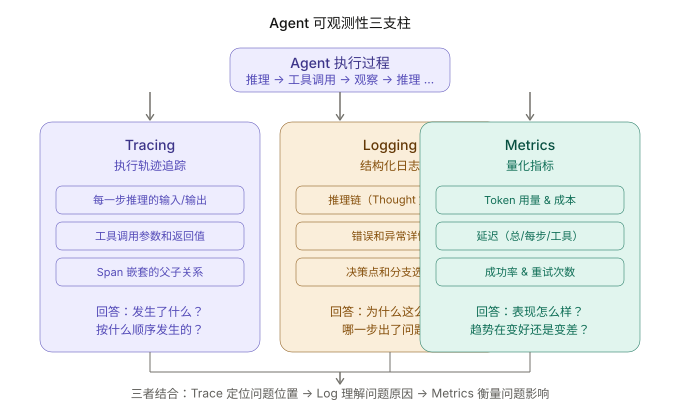
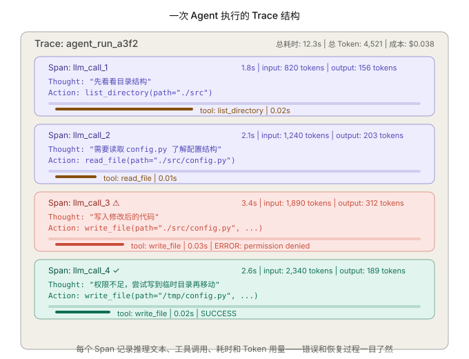
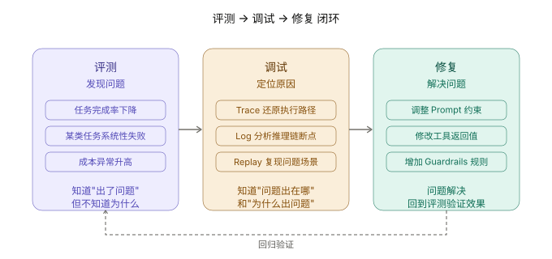

+++
title = "调试 Agent：当你不知道它为什么做了那件事"
date = 2026-03-28T22:00:00+08:00
draft = false
author = "Hex4C59"
description = "从传统软件调试与 Agent 调试的根本差异出发，系统讲解 Agent 可观测性的三支柱——Tracing、Logging、Metrics——的设计与实现，以及如何用 Replay 复现问题、用结构化方法定位 Agent 的隐性错误。"
summary = "补完评测-调试-修复闭环：Agent 评测告诉你出了问题，可观测性告诉你问题在哪、为什么出问题。涵盖 Trace 设计、结构化日志、关键指标、Replay 复现、常见调试模式和工具链选型。"
tags = ["Agent", "Observability", "Debugging", "Tracing", "Logging", "LLM"]
categories = ["Agent"]
series = ["agent-engineering"]
series_order = 19
difficulty = "intermediate"
article_type = "concept"
topics = ["observability", "debugging", "tracing", "logging", "metrics", "evaluation"]
frameworks = ["OpenAI", "Anthropic"]
ShowToc = true
+++

在 [评测那篇文章](/agent/agent-evaluation/) 里，我们讨论了如何判断一个 Agent 做得好不好——四维评测框架帮助你发现"任务完成率下降了""某类任务系统性失败""成本异常升高"这些问题。

但评测只告诉你**出了问题**。它不告诉你**为什么**。

一个 Agent 在 10 步推理后给出了错误答案，你从评测报告里看到"失败"。然后呢？10 步推理里哪一步出了问题？是推理逻辑错了，还是工具返回了错误的数据，还是上下文窗口溢出导致模型"忘记"了早期信息？

这就是可观测性和调试要解决的问题。如果评测是 Agent 的"体检报告"，那可观测性就是"CT 扫描"——它让你看到 Agent 内部发生了什么。

---

## 先给结论

1. **Agent 调试和传统软件调试是两件不同的事。** 传统软件里 bug 是确定性的——相同输入产生相同输出。Agent 的"bug"通常是概率性的——同一个输入可能产生不同的推理路径和结果，你需要追踪的是推理过程而不是代码逻辑。
2. **Agent 可观测性有三个支柱：Tracing、Logging、Metrics。** Tracing 记录执行轨迹（发生了什么），Logging 记录推理和决策细节（为什么这么做），Metrics 量化整体表现（趋势在变好还是变差）。三者结合才能完整定位问题。
3. **Replay 是 Agent 调试最有力的工具。** 把一次失败执行的完整上下文（消息历史 + 工具返回值）保存下来，在相同条件下重放，可以复现绝大多数问题——即使模型的非确定性输出不完全相同，推理路径通常是一致的。
4. **Agent 的大多数"bug"不在代码里，而在 Prompt、工具描述或上下文组织里。** 所以调试的重点不是单步断点调试，而是分析推理链中的信息流——模型在每一步看到了什么、推理出了什么、为什么做了那个决策。
5. **可观测性不是事后补丁，应该在 Agent 的第一行代码就设计进去。** 后期加入的可观测性往往覆盖不全面，成本也更高。

---

## 为什么 Agent 调试和传统调试不一样

传统软件的 bug 模式：给一个输入，代码走了一条错误的分支，输出了错误的结果。你加断点、看变量值、找到那行有问题的代码、修复。

Agent 的"bug"模式完全不同。看一个例子：

```text
任务：帮我把 src/utils.py 里的 parse_date 函数改成支持 ISO 8601 格式

Agent 实际行为：
  Step 1: read_file("src/utils.py")          ← 正确
  Step 2: 分析代码，找到 parse_date 函数      ← 正确
  Step 3: write_file("src/utils.py", ...)    ← 写了修改后的代码
  Step 4: run_command("python -m pytest")     ← 测试失败
  Step 5: read_file("src/utils.py")          ← 重新读取
  Step 6: write_file("src/utils.py", ...)    ← 又写了一版
  Step 7: run_command("python -m pytest")     ← 还是失败
  Step 8: ...反复尝试...
  Step 15: 达到最大迭代次数，任务失败
```

从外部看，你只知道"任务失败了"。但问题出在哪？可能是：

- **推理错误**：模型对 ISO 8601 格式的理解有误
- **信息丢失**：Step 5 重新读取文件时，上下文窗口已经很长，模型"忘记"了之前的错误信息
- **工具问题**：`write_file` 覆盖了整个文件，但模型只想改其中一个函数
- **测试环境问题**：pytest 的报错信息被截断了，模型没有看到关键错误行

要定位真正的原因，你需要看到每一步的**输入**（模型收到了什么上下文）、**推理**（模型想做什么）和**输出**（实际结果是什么）。这就是可观测性的价值。

### Agent 调试的三个根本差异

**差异一：非确定性。** 传统软件给相同输入总是走相同路径。Agent 不是——温度参数、上下文的微小变化都可能导致不同的推理路径。你不能简单地"重跑一遍"来复现问题。

**差异二：推理过程是黑盒。** 传统软件的每一步逻辑都写在代码里，你可以逐行阅读。Agent 的推理过程发生在模型内部，你只能看到模型的输出（Thought 文本），无法看到它内部的权重计算。

**差异三：错误的隐蔽性。** 传统软件的错误通常是崩溃或抛异常，很显眼。Agent 的错误往往是"推理方向偏了但每一步都看起来合理"——它不会崩溃，只是给了一个有道理但实际上错误的结果。

---

## 可观测性的三个支柱



*图 1：Tracing 回答"发生了什么"，Logging 回答"为什么这么做"，Metrics 回答"表现怎么样"。三者结合定位问题的位置、原因和影响。*

---

## 第一支柱：Tracing——执行轨迹追踪

Trace 是一次完整 Agent 执行的结构化记录。它把 Agent 的每一步——LLM 调用、工具执行、状态变更——组织成一棵有时间顺序和父子关系的 Span 树。



*图 2：每个 Span 记录了推理文本、工具调用、耗时和 Token 用量。错误（红色 Span）和恢复（绿色 Span）在 Trace 中一目了然。*

### Trace 的实现

```python
import time
import uuid
from dataclasses import dataclass, field


@dataclass
class Span:
    """一个执行单元——可以是 LLM 调用、工具执行或其他操作。"""
    span_id: str = field(default_factory=lambda: str(uuid.uuid4())[:8])
    name: str = ""
    span_type: str = ""       # llm_call, tool_call, guardrail_check
    parent_id: str | None = None
    start_time: float = 0
    end_time: float = 0
    status: str = "running"   # running, success, error
    attributes: dict = field(default_factory=dict)
    events: list[dict] = field(default_factory=list)

    @property
    def duration_ms(self) -> float:
        if self.end_time and self.start_time:
            return (self.end_time - self.start_time) * 1000
        return 0


class Tracer:
    """
    Agent 执行追踪器。
    记录一次完整执行的所有 Span，支持嵌套结构。
    """

    def __init__(self, trace_id: str | None = None):
        self.trace_id = trace_id or str(uuid.uuid4())[:12]
        self.spans: list[Span] = []
        self._active_span: Span | None = None

    def start_span(
        self,
        name: str,
        span_type: str,
        attributes: dict | None = None,
    ) -> Span:
        """开始一个新的 Span。"""
        span = Span(
            name=name,
            span_type=span_type,
            parent_id=self._active_span.span_id if self._active_span else None,
            start_time=time.time(),
            attributes=attributes or {},
        )
        self.spans.append(span)
        self._active_span = span
        return span

    def end_span(self, status: str = "success", attributes: dict | None = None):
        """结束当前活跃的 Span。"""
        if self._active_span:
            self._active_span.end_time = time.time()
            self._active_span.status = status
            if attributes:
                self._active_span.attributes.update(attributes)
            # 回到父 Span
            parent_id = self._active_span.parent_id
            self._active_span = next(
                (s for s in self.spans if s.span_id == parent_id), None
            )

    def add_event(self, name: str, attributes: dict | None = None):
        """在当前 Span 上添加一个事件。"""
        if self._active_span:
            self._active_span.events.append({
                "name": name,
                "timestamp": time.time(),
                "attributes": attributes or {},
            })

    def get_summary(self) -> dict:
        """生成 Trace 的摘要统计。"""
        total_llm_time = sum(
            s.duration_ms for s in self.spans if s.span_type == "llm_call"
        )
        total_tool_time = sum(
            s.duration_ms for s in self.spans if s.span_type == "tool_call"
        )
        total_tokens = sum(
            s.attributes.get("total_tokens", 0)
            for s in self.spans if s.span_type == "llm_call"
        )
        error_spans = [s for s in self.spans if s.status == "error"]

        return {
            "trace_id": self.trace_id,
            "total_spans": len(self.spans),
            "llm_calls": len([s for s in self.spans if s.span_type == "llm_call"]),
            "tool_calls": len([s for s in self.spans if s.span_type == "tool_call"]),
            "total_llm_time_ms": round(total_llm_time, 1),
            "total_tool_time_ms": round(total_tool_time, 1),
            "total_tokens": total_tokens,
            "errors": len(error_spans),
            "error_details": [
                {"span": s.name, "error": s.attributes.get("error")}
                for s in error_spans
            ],
        }
```

### 把 Tracer 嵌入 ReAct 循环

Tracer 嵌入 Agent 核心循环的方式很简洁——在每次 LLM 调用和工具调用的前后各加一行：

```python
async def run_agent_with_tracing(
    user_message: str,
    tools: dict,
    tracer: Tracer,
) -> str:
    messages = [{"role": "system", "content": SYSTEM_PROMPT}]
    messages.append({"role": "user", "content": user_message})

    for iteration in range(MAX_ITERATIONS):
        # ===== LLM 调用 Span =====
        tracer.start_span(
            name=f"llm_call_{iteration + 1}",
            span_type="llm_call",
            attributes={"iteration": iteration + 1},
        )

        response = await client.chat.completions.create(
            model="gpt-4o",
            messages=messages,
            tools=TOOL_SCHEMAS,
        )

        msg = response.choices[0].message
        usage = response.usage

        tracer.end_span(
            status="success",
            attributes={
                "input_tokens": usage.prompt_tokens,
                "output_tokens": usage.completion_tokens,
                "total_tokens": usage.total_tokens,
                "thought": msg.content[:200] if msg.content else None,
                "finish_reason": response.choices[0].finish_reason,
            },
        )

        # 处理工具调用
        if msg.tool_calls:
            for tc in msg.tool_calls:
                tool_name = tc.function.name
                tool_args = json.loads(tc.function.arguments)

                # ===== 工具调用 Span =====
                tracer.start_span(
                    name=f"tool_{tool_name}",
                    span_type="tool_call",
                    attributes={
                        "tool_name": tool_name,
                        "tool_args": tool_args,
                    },
                )

                try:
                    result = await tools[tool_name](**tool_args)
                    tracer.end_span(
                        status="success",
                        attributes={"result_preview": str(result)[:200]},
                    )
                except Exception as e:
                    tracer.end_span(
                        status="error",
                        attributes={"error": str(e)},
                    )
                    result = {"error": str(e)}

                # ... 把结果追加到 messages ...

        if response.choices[0].finish_reason == "stop":
            break

    return msg.content
```

嵌入 Tracer 只增加了几行代码，但获得了完整的执行轨迹。这些轨迹在生产环境中，是排查问题最重要的信息源。

---

## 第二支柱：Logging——结构化日志

Tracing 记录的是执行的**结构**（什么时候调用了什么、花了多长时间），Logging 记录的是执行的**语义**（模型在想什么、为什么做了那个决策、哪里出了岔子）。

### Agent 日志应该记什么

Agent 的日志需求和传统应用不同。传统应用记录的是"系统状态变化"，Agent 需要记录的是"推理过程和决策点"：

```python
import logging
import json
from datetime import datetime

# 使用结构化日志格式，便于后续查询和分析
logger = logging.getLogger("agent")


class AgentLogger:
    """
    Agent 专用日志器。
    按 Agent 的执行阶段记录不同粒度的信息。
    """

    def __init__(self, session_id: str):
        self.session_id = session_id

    def log_thought(self, iteration: int, thought: str):
        """记录模型的推理文本——这是调试推理问题的核心信息。"""
        logger.info(json.dumps({
            "event": "thought",
            "session_id": self.session_id,
            "iteration": iteration,
            "thought": thought,
            "timestamp": datetime.now().isoformat(),
        }, ensure_ascii=False))

    def log_tool_call(
        self,
        iteration: int,
        tool_name: str,
        tool_args: dict,
        result: dict,
        duration_ms: float,
    ):
        """记录工具调用的完整信息。"""
        # 对大结果做截断，避免日志膨胀
        result_str = json.dumps(result, ensure_ascii=False)
        if len(result_str) > 1000:
            result_preview = result_str[:1000] + "...[truncated]"
        else:
            result_preview = result_str

        logger.info(json.dumps({
            "event": "tool_call",
            "session_id": self.session_id,
            "iteration": iteration,
            "tool_name": tool_name,
            "tool_args": tool_args,
            "result_preview": result_preview,
            "result_success": result.get("success", True),
            "duration_ms": round(duration_ms, 1),
            "timestamp": datetime.now().isoformat(),
        }, ensure_ascii=False))

    def log_decision_point(
        self,
        iteration: int,
        description: str,
        chosen_action: str,
        alternatives: list[str] | None = None,
    ):
        """
        记录关键决策点——Agent 在多个选项中做了选择。
        这是调试"为什么走了那条路"的关键信息。
        """
        logger.info(json.dumps({
            "event": "decision",
            "session_id": self.session_id,
            "iteration": iteration,
            "description": description,
            "chosen": chosen_action,
            "alternatives": alternatives,
            "timestamp": datetime.now().isoformat(),
        }, ensure_ascii=False))

    def log_context_state(self, iteration: int, messages: list[dict]):
        """
        记录上下文状态——当前消息历史有多长、Token 预算还剩多少。
        这是调试"信息丢失"问题的关键信息。
        """
        total_chars = sum(len(str(m.get("content", ""))) for m in messages)
        logger.info(json.dumps({
            "event": "context_state",
            "session_id": self.session_id,
            "iteration": iteration,
            "message_count": len(messages),
            "estimated_chars": total_chars,
            "estimated_tokens": total_chars // 4,  # 粗略估算
            "timestamp": datetime.now().isoformat(),
        }, ensure_ascii=False))

    def log_error(self, iteration: int, error_type: str, error_msg: str):
        """记录错误。"""
        logger.error(json.dumps({
            "event": "error",
            "session_id": self.session_id,
            "iteration": iteration,
            "error_type": error_type,
            "error_msg": error_msg,
            "timestamp": datetime.now().isoformat(),
        }, ensure_ascii=False))
```

### 日志分析的关键模式

有了结构化日志，你可以做几种关键分析：

**推理链断点分析**：找到 Agent 的推理从"正确"变成"错误"的那一步。通常的方法是顺序阅读每一步的 `thought` 日志，标记每一步的推理是否合理，直到找到第一步不合理的推理——那就是断点。

**上下文膨胀检测**：通过 `context_state` 日志监控消息历史的长度。如果在某一步 `estimated_tokens` 突然接近模型的上下文窗口上限，后续步骤的推理质量很可能会下降——因为模型被迫丢弃了早期信息。

**工具调用模式异常**：如果同一个工具被反复调用（比如 `read_file` 连续被调用 5 次，每次参数一样），说明 Agent 可能陷入了循环。

---

## 第三支柱：Metrics——量化指标

Metrics 不关心单次执行的细节，它关心的是整体趋势。

### Agent 的核心指标

```python
from dataclasses import dataclass, field
import time


@dataclass
class AgentMetrics:
    """
    Agent 运行指标收集器。
    在每次执行中更新，定期聚合查看趋势。
    """

    # 任务维度
    total_tasks: int = 0
    successful_tasks: int = 0
    failed_tasks: int = 0

    # 成本维度
    total_input_tokens: int = 0
    total_output_tokens: int = 0
    total_cost_usd: float = 0

    # 效率维度
    total_iterations: int = 0
    total_tool_calls: int = 0
    total_duration_seconds: float = 0

    # 质量维度
    tool_errors: int = 0
    retry_count: int = 0
    max_iteration_hits: int = 0  # 触发最大迭代次数的次数

    @property
    def success_rate(self) -> float:
        return self.successful_tasks / max(self.total_tasks, 1)

    @property
    def avg_iterations(self) -> float:
        return self.total_iterations / max(self.total_tasks, 1)

    @property
    def avg_cost_per_task(self) -> float:
        return self.total_cost_usd / max(self.total_tasks, 1)

    @property
    def avg_duration_seconds(self) -> float:
        return self.total_duration_seconds / max(self.total_tasks, 1)

    @property
    def tool_error_rate(self) -> float:
        return self.tool_errors / max(self.total_tool_calls, 1)

    def report(self) -> dict:
        return {
            "tasks": {
                "total": self.total_tasks,
                "success_rate": f"{self.success_rate:.1%}",
            },
            "cost": {
                "total_usd": f"${self.total_cost_usd:.4f}",
                "avg_per_task": f"${self.avg_cost_per_task:.4f}",
                "total_tokens": self.total_input_tokens + self.total_output_tokens,
            },
            "efficiency": {
                "avg_iterations": f"{self.avg_iterations:.1f}",
                "avg_duration": f"{self.avg_duration_seconds:.1f}s",
                "tool_error_rate": f"{self.tool_error_rate:.1%}",
            },
            "warnings": {
                "max_iteration_hits": self.max_iteration_hits,
                "retry_count": self.retry_count,
            },
        }
```

### 应该设告警的指标

不是所有指标都需要实时告警。以下是最应该设告警的几个：

| 指标 | 告警阈值 | 说明 |
|------|----------|------|
| `success_rate` | < 80% | 任务成功率显著下降 |
| `avg_cost_per_task` | > 历史均值 × 2 | 成本异常——可能因为推理循环 |
| `max_iteration_hits` | 连续 3 次 | Agent 反复触发迭代上限 |
| `tool_error_rate` | > 20% | 工具层有系统性问题 |
| `avg_iterations` | > 历史均值 × 1.5 | Agent 效率下降 |

---

## Replay：复现问题的最有力工具

Agent 调试中最大的挑战是**复现**。因为模型的输出是非确定性的，同样的输入可能产生不同的推理路径。

Replay 机制的核心思想是：**保存一次执行的完整上下文（包括所有工具返回值），在相同条件下重跑或逐步重放。**

```python
import json
from dataclasses import dataclass


@dataclass
class ExecutionSnapshot:
    """一次完整执行的快照，包含复现所需的全部信息。"""
    session_id: str
    task: str
    system_prompt: str
    messages: list[dict]          # 完整的消息历史
    tool_results: list[dict]      # 每次工具调用的参数和返回值
    model: str
    temperature: float
    trace_summary: dict


class ReplayEngine:
    """
    执行重放引擎。
    两种模式：模拟重放（不调用真实 API）和真实重放（重跑 LLM）。
    """

    def save_snapshot(self, snapshot: ExecutionSnapshot, path: str):
        """保存执行快照到文件。"""
        data = {
            "session_id": snapshot.session_id,
            "task": snapshot.task,
            "system_prompt": snapshot.system_prompt,
            "messages": snapshot.messages,
            "tool_results": snapshot.tool_results,
            "model": snapshot.model,
            "temperature": snapshot.temperature,
            "trace_summary": snapshot.trace_summary,
        }
        with open(path, "w", encoding="utf-8") as f:
            json.dump(data, f, ensure_ascii=False, indent=2)

    def load_snapshot(self, path: str) -> ExecutionSnapshot:
        """加载执行快照。"""
        with open(path, "r", encoding="utf-8") as f:
            data = json.load(f)
        return ExecutionSnapshot(**data)

    def simulate_replay(self, snapshot: ExecutionSnapshot):
        """
        模拟重放：按时间顺序展示每一步的输入、推理和输出，
        不调用真实 API。用于分析问题发生的过程。
        """
        print(f"=== Replay: {snapshot.session_id} ===")
        print(f"Task: {snapshot.task}\n")

        tool_idx = 0
        for i, msg in enumerate(snapshot.messages):
            role = msg["role"]

            if role == "system":
                print(f"[SYSTEM] (prompt, {len(msg['content'])} chars)")

            elif role == "user":
                print(f"\n[USER] {msg['content'][:200]}")

            elif role == "assistant":
                if msg.get("content"):
                    print(f"\n[THOUGHT] {msg['content'][:300]}")
                if msg.get("tool_calls"):
                    for tc in msg["tool_calls"]:
                        fn = tc["function"]
                        print(f"[ACTION] {fn['name']}({fn['arguments'][:100]})")

            elif role == "tool":
                content = msg["content"]
                # 高亮错误
                if '"success": false' in content.lower():
                    print(f"[RESULT] ⚠️ ERROR: {content[:200]}")
                else:
                    print(f"[RESULT] ✓ {content[:200]}")

        print(f"\n=== Trace Summary ===")
        for k, v in snapshot.trace_summary.items():
            print(f"  {k}: {v}")

    async def live_replay(
        self,
        snapshot: ExecutionSnapshot,
        stop_at_iteration: int | None = None,
    ):
        """
        真实重放：用保存的工具返回值 mock 工具调用，
        但使用真实的 LLM API。用于验证 prompt 修改是否解决了问题。
        """
        # 使用保存的工具结果作为 mock
        tool_results_iter = iter(snapshot.tool_results)

        async def mock_tool(name: str, args: dict) -> dict:
            """用保存的结果替代真实工具调用。"""
            saved = next(tool_results_iter, None)
            if saved and saved["tool_name"] == name:
                return saved["result"]
            return {"error": f"No saved result for {name}"}

        # 用真实 LLM + mock 工具重跑
        # 这让你可以测试 prompt 修改的效果，
        # 而不需要重新执行真实的工具调用
        # ...
```

### 什么时候用 Replay

- **模拟重放**：你想理解一次失败执行的过程——每一步做了什么、在哪一步出了岔子。不消耗 API 调用。
- **真实重放**：你修改了 prompt 或工具描述后，想验证对同一个任务是否能给出更好的结果。用保存的工具返回值 mock 工具调用，只用真实 LLM 重跑推理。

---

## 评测-调试-修复闭环



*图 3：评测发现问题（任务完成率下降）→ 调试定位原因（Trace + Log + Replay）→ 修复解决问题（调整 Prompt/工具/Guardrails）→ 回到评测验证修复效果。*

这个闭环的关键在于**回归验证**。修复完成后，必须用和发现问题相同的评测基准重新测试，确认修复真的解决了问题，而且没有引入新问题。[评测那篇](/agent/agent-evaluation/) 里讨论的评测用例集就是回归验证的基准。

---

## 五种常见的 Agent 调试模式

### 模式一：推理链断裂

**症状**：Agent 在某一步突然"忘记"了任务目标，开始做无关的事情。

**调试方法**：查看 `context_state` 日志，找到 `estimated_tokens` 接近上下文窗口上限的那一步。通常这一步之后，模型因为截断丢失了系统提示或早期的关键信息。

**修复**：优化上下文管理策略——在截断前做摘要压缩，确保系统提示和任务目标始终保留在上下文中。参见 [上下文与记忆那篇](/agent/context-memory-state-management/)。

### 模式二：工具调用循环

**症状**：Agent 反复调用同一个工具，参数几乎相同，进入死循环直到触发 `MAX_ITERATIONS`。

**调试方法**：查看 `tool_call` 日志，找到重复调用的模式。然后查看对应的 `thought` 日志——通常模型没有从错误中提取有效的诊断信息。

**修复**：改进工具的错误返回值。比如 `read_file` 失败时，不只返回"文件不存在"，还返回"当前目录下有这些文件：[...]"，帮助模型从错误中恢复。参见 [工具接口设计那篇](/agent/tool-interface-design/)。

### 模式三：工具返回污染

**症状**：Agent 的推理在某一步之后突然变得奇怪——语气变了、开始做之前没有要求的事情。

**调试方法**：查看那一步之前的 `tool_call` 日志，检查工具返回的内容。很可能是间接 Prompt Injection——工具返回的数据中包含了操纵性的文本。

**修复**：加强输入防护层的工具返回内容扫描。参见 [Guardrails 那篇](/agent/guardrails-safety-boundary/) 关于间接 Prompt Injection 的讨论。

### 模式四：幻觉式工具调用

**症状**：Agent 调用了一个不存在的工具，或者传了根本不合法的参数格式。

**调试方法**：查看出错前几步的 `thought` 日志和 `context_state`。通常这发生在上下文很长时——模型"忘记"了可用的工具列表，开始从训练知识中"回忆"工具名称。

**修复**：在上下文截断策略中，确保工具定义始终存在。或者降低 `temperature`，减少模型的"创造性"。

### 模式五：成本失控

**症状**：某些任务的成本是正常任务的 5-10 倍。

**调试方法**：查看 Metrics 中的 `avg_iterations` 和 `total_tokens`。如果迭代次数正常但 Token 用量异常高，通常是某个工具返回了过大的内容（比如读取了一个很大的文件，整个内容进入了上下文）。如果迭代次数异常高，通常是推理循环问题。

**修复**：在工具返回值上加长度限制。设置 Token 预算——当一次执行的 Token 用量超过阈值时，主动终止并告知用户。

---

## 可观测性工具链

自己从零实现 Tracing 和 Logging 适合学习和小规模使用。在生产环境中，通常会接入专门的可观测性平台：

### LangSmith（LangChain 生态）

LangChain 团队提供的可观测性平台。如果你使用 LangGraph 构建 Agent，LangSmith 是最自然的选择——它可以自动捕获 LangGraph 执行流中的所有 Span。

核心能力：Trace 可视化、Prompt Playground（修改 prompt 后在同一输入上测试效果）、评测数据集管理。

### Langfuse（开源）

开源的 LLM 可观测性平台，**不绑定任何框架**。如果你的 Agent 是自研的（像我们系列里的实现），Langfuse 是最灵活的选择。

核心能力：Trace 和 Span 管理、成本分析、Prompt 版本管理、评测。可以自托管。

接入方式很简单：

```python
from langfuse import Langfuse

langfuse = Langfuse()

# 创建一个 Trace
trace = langfuse.trace(name="research_agent_run", input=user_task)

# 在 LLM 调用时记录 Span
span = trace.span(name="llm_call_1", input=messages)
response = await client.chat.completions.create(...)
span.end(output=response.choices[0].message.content)

# 在工具调用时记录 Span
tool_span = trace.span(name="web_search", input={"query": query})
result = await web_search(query)
tool_span.end(output=result)
```

### Arize Phoenix（开源）

专注于 LLM 评估和排障的开源工具。它的特色是**Trace 的可视化和对比分析**——可以对比两次执行的 Trace 差异，帮助你理解为什么一次成功一次失败。

### 工具选型建议

| 场景 | 推荐工具 |
|------|----------|
| 用 LangGraph 构建 | LangSmith |
| 自研 Agent，想自托管 | Langfuse |
| 重点在 Trace 对比分析 | Arize Phoenix |
| 学习和原型验证 | 自研（本文的实现） |

---

## 总结

评测告诉你"出了问题"，可观测性和调试告诉你"问题在哪、为什么出问题"。两者结合才是完整的质量保证闭环。

三个支柱各有分工：Tracing 记录执行轨迹，回答"发生了什么""按什么顺序发生的"；Logging 记录推理和决策细节，回答"为什么这么做""哪一步出了岔子"；Metrics 量化整体表现，回答"趋势在变好还是变差"。

Agent 调试最难的地方，不是技术实现，而是接受一个事实：**你无法对模型的内部推理设断点。** 你能做的是尽可能完整地记录模型的输入、输出和工具交互，通过分析这些外部可观测信号来推断内部出了什么问题。Replay 机制把一次失败执行的完整上下文保存下来，是缩小排查范围最有效的手段。

最后，可观测性不是事后补丁。在 Agent 开发的第一天就把 Tracer 嵌入 ReAct 循环——它只增加几行代码，但在你第一次遇到"不知道它为什么做了那件事"时，会省下几个小时的排查时间。

---

*上一篇：[文件管理 Agent 实战：Guardrails 怎么落地](/agent/build-file-management-agent/)*

*下一篇预告：Multi-Agent 实战——用 Supervisor 模式构建代码审查系统*
