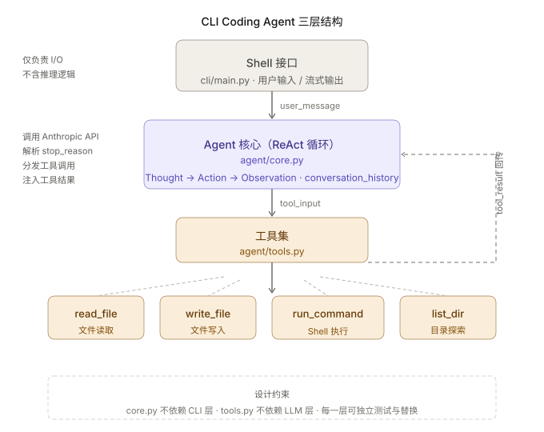
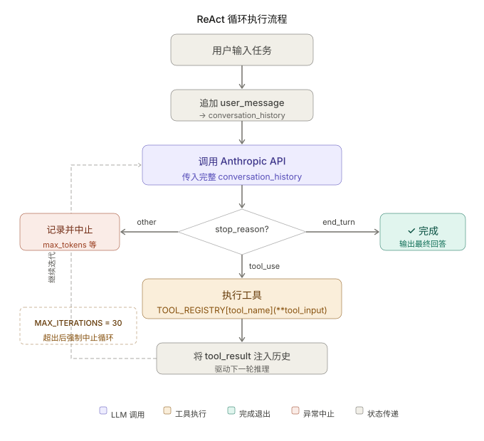

+++
title = "从零构建 CLI Coding Agent：ReAct 驱动的实战实现"
date = 2026-03-24T20:00:00+08:00
draft = false
author = "Hex4C59"
description = "用 Python 从零构建一个结构真实的 CLI Coding Agent，涵盖工具注册、ReAct 循环、上下文管理和安全边界的完整实现。"
summary = "不只是造玩具——这篇文章构建一个结构上真实的 CLI Coding Agent：ReAct 循环驱动多步推理、完整的工具注册机制、上下文窗口管理，以及你在真实工程里必须处理的失败模式。"
tags = ["Agent", "Coding Agent", "CLI", "Tool Use", "ReAct", "State Management"]
categories = ["Agent"]
series = ["agent-engineering"]
series_order = 13
difficulty = "advanced"
article_type = "tutorial"
topics = ["coding-agent", "cli", "tool-use", "react", "state-management"]
frameworks = ["Anthropic"]
ShowToc = true
+++

Claude Code 和 Codex 的出现让"AI 写代码"从概念变成了日常工具。但如果你只是用它们，你并不真正理解它们。

在前面几篇文章里，我们把 Agent 的核心机制逐一拆解清楚了：[ReAct 范式](/agent/react-paradigm/)提供了推理-行动交替的基础结构，[Tool Use](/agent/tool-use-core-of-agent/) 是 Agent 与外部世界连接的接口层，[上下文与记忆](/agent/context-memory-state-management/)解决了长任务中的状态维持问题，[System Prompt 设计](/agent/prompt-design-agent/)决定了 Agent 的行为质量。

这篇文章把这些机制拼在一起，做一件具体的事：**用 Python 从零构建一个结构上真实的 CLI Coding Agent**。

理解一个系统最好的方式，是把它从零构建一遍。

---

## 先给结论

1. **Coding Agent 的本质是"上下文即状态"的 ReAct 循环。** 每次工具调用的结果都追加进对话历史，驱动下一轮推理——这是它与普通代码补全工具的根本区别。
2. **工具的粒度要粗，返回值要丰富。** `read_file` 要同时返回内容和行数，`run_command` 要同时返回 stdout、stderr 和退出码。LLM 获得的信息越完整，决策质量越高。
3. **System prompt 的"先探索，再行动"原则，解决了 Coding Agent 最常见的失败模式。** 不了解项目结构就直接写代码，是导致路径错误和代码冲突的首要原因。
4. **每个能控制路径的工具都必须做边界检查。** 任何允许 LLM 控制文件路径的工具，不做路径越界检查就是一个安全漏洞。
5. **MAX_ITERATIONS 不是可选的。** 没有硬上限的 Agent，遇到推理循环时会不停调用 API 直到账单爆炸。

---

## 整体架构

在写任何代码之前，先把架构想清楚。

一个 CLI Coding Agent 由三层组成：用户通过 Shell 界面输入任务，Agent 核心（ReAct 循环）负责推理和调度，工具集是 Agent 与文件系统和操作系统交互的唯一接口。



*图 1：CLI Coding Agent 的三层结构。Shell 接口只负责 I/O，Agent 核心只负责推理循环，工具集只负责执行——每一层的职责边界清晰，互不依赖。*

这个结构里最关键的是 **ReAct 循环**。它不是一次性的"输入→输出"，而是一个持续运转的推理引擎：每次行动的结果都作为新的上下文注入，驱动下一步决策。这正是 Coding Agent 与普通代码补全工具的本质区别。

---

## 项目结构

```
coding-agent/
├── agent/
│   ├── __init__.py
│   ├── core.py          # ReAct 循环主逻辑
│   ├── tools.py         # 工具定义与注册
│   └── prompts.py       # System prompt
├── cli/
│   └── main.py          # CLI 入口
├── requirements.txt
└── README.md
```

设计原则：**`core.py` 不依赖 CLI，`tools.py` 不依赖 LLM**。这让每一层都可以独立测试，也方便以后替换任意一层的实现。

---

## 第一步：定义工具集

工具是 Agent 和外部世界之间的唯一接口。设计工具时有一个反直觉的原则：**工具的粒度要粗，返回值要丰富**。

`read_file` 应该同时返回内容和行数，而不是只返回内容；`run_command` 应该同时返回 stdout、stderr 和退出码，而不是只返回 stdout。LLM 需要的信息越完整，它做出正确决策的概率越高。

```python
# agent/tools.py
import subprocess
from pathlib import Path
from typing import Any

WORKSPACE = Path(".").resolve()


def _safe_path(path: str) -> Path:
    """
    将相对路径解析为绝对路径，并验证路径在工作区范围内。
    path: 用户或 LLM 提供的文件路径字符串
    """
    target = (WORKSPACE / path).resolve()
    if not str(target).startswith(str(WORKSPACE)):
        raise ValueError(f"路径越界：{path}")
    return target


def read_file(path: str) -> dict[str, Any]:
    """
    读取文件内容，同时返回行数信息。
    path: 相对于工作区根目录的文件路径
    """
    try:
        p = _safe_path(path)
        content = p.read_text(encoding="utf-8")
        lines = content.splitlines()
        return {
            "success": True,
            "content": content,
            "lines": len(lines),
            "path": str(p.relative_to(WORKSPACE)),
        }
    except FileNotFoundError:
        return {"success": False, "error": f"文件不存在：{path}"}
    except Exception as e:
        return {"success": False, "error": str(e)}


def write_file(path: str, content: str) -> dict[str, Any]:
    """
    将内容写入文件，自动创建不存在的父目录。
    path: 目标文件路径（相对路径）
    content: 要写入的完整文件内容
    """
    try:
        p = _safe_path(path)
        p.parent.mkdir(parents=True, exist_ok=True)
        p.write_text(content, encoding="utf-8")
        return {
            "success": True,
            "path": str(p.relative_to(WORKSPACE)),
            "bytes_written": len(content.encode()),
        }
    except Exception as e:
        return {"success": False, "error": str(e)}


def run_command(command: str, timeout: int = 30) -> dict[str, Any]:
    """
    在工作区目录执行 Shell 命令，返回完整的执行结果。
    command: 要执行的 Shell 命令字符串
    timeout: 命令超时秒数，超时后强制终止
    """
    if is_dangerous(command):
        return {"success": False, "error": f"拒绝执行危险命令：{command}"}
    try:
        result = subprocess.run(
            command,
            shell=True,
            capture_output=True,
            text=True,
            timeout=timeout,
            cwd=str(WORKSPACE),
        )
        return {
            "success": result.returncode == 0,
            "stdout": result.stdout,
            "stderr": result.stderr,
            "returncode": result.returncode,
        }
    except subprocess.TimeoutExpired:
        return {"success": False, "error": f"命令超时（{timeout}s）：{command}"}
    except Exception as e:
        return {"success": False, "error": str(e)}


def list_dir(path: str = ".") -> dict[str, Any]:
    """
    列出目录下的文件和子目录（跳过隐藏文件）。
    path: 目录路径，默认为工作区根目录
    """
    try:
        p = _safe_path(path)
        items = []
        for item in sorted(p.iterdir()):
            if item.name.startswith("."):
                continue
            entry = {
                "name": item.name,
                "type": "dir" if item.is_dir() else "file",
                "path": str(item.relative_to(WORKSPACE)),
            }
            if item.is_file():
                entry["size"] = item.stat().st_size
            items.append(entry)
        return {"success": True, "path": str(p.relative_to(WORKSPACE)), "items": items}
    except Exception as e:
        return {"success": False, "error": str(e)}


DANGEROUS_PATTERNS = ["rm -rf", "sudo", "curl | bash", "wget | sh", "> /dev/"]


def is_dangerous(command: str) -> bool:
    """
    检测命令是否包含危险操作模式。
    command: 待检测的命令字符串
    """
    return any(p in command for p in DANGEROUS_PATTERNS)


# 工具注册表：name → callable，格式直接对应 Anthropic tool_use API
TOOL_REGISTRY = {
    "read_file": read_file,
    "write_file": write_file,
    "run_command": run_command,
    "list_dir": list_dir,
}

TOOL_SCHEMAS = [
    {
        "name": "read_file",
        "description": "读取指定路径的文件内容。返回文件内容和行数。",
        "input_schema": {
            "type": "object",
            "properties": {
                "path": {"type": "string", "description": "相对于工作区根目录的文件路径"}
            },
            "required": ["path"],
        },
    },
    {
        "name": "write_file",
        "description": "将内容写入指定路径的文件。如果目录不存在，会自动创建。",
        "input_schema": {
            "type": "object",
            "properties": {
                "path": {"type": "string", "description": "目标文件路径"},
                "content": {"type": "string", "description": "要写入的内容"},
            },
            "required": ["path", "content"],
        },
    },
    {
        "name": "run_command",
        "description": "在工作区目录执行 Shell 命令。返回 stdout、stderr 和退出码。",
        "input_schema": {
            "type": "object",
            "properties": {
                "command": {"type": "string", "description": "要执行的 Shell 命令"},
                "timeout": {"type": "integer", "description": "超时秒数，默认 30", "default": 30},
            },
            "required": ["command"],
        },
    },
    {
        "name": "list_dir",
        "description": "列出目录下的文件和子目录。",
        "input_schema": {
            "type": "object",
            "properties": {
                "path": {"type": "string", "description": "目录路径，默认为工作区根目录", "default": "."}
            },
        },
    },
]
```

注意 `_safe_path` 这个函数——任何允许 LLM 控制路径的工具都必须做路径边界检查，防止 Agent 意外（或被诱导）访问工作区以外的文件。`is_dangerous` 也已经内嵌进 `run_command`，在执行前拦截危险命令。

---

## 第二步：设计 System Prompt

System prompt 是 Coding Agent 最容易被忽视的部分，但它几乎决定了 Agent 的行为质量。在 [System Prompt 设计那篇](/agent/prompt-design-agent/)里，我们已经讨论了一般性的设计原则。对于 Coding Agent，有几个针对性的约束格外重要。

```python
# agent/prompts.py

SYSTEM_PROMPT = """你是一个运行在命令行的 Coding Agent，帮助用户完成编程任务。

## 能力范围
你可以读取、创建、修改文件，执行 Shell 命令，并基于执行结果继续推理。

## 工作原则

**先探索，再行动。** 在修改任何文件之前，先用 list_dir 和 read_file 了解项目结构。
不要假设文件的内容或结构。

**小步执行，验证推进。** 每次只做一件事。写完代码就运行测试。执行命令后检查输出。
不要一次写完所有代码再测试。

**错误是信息。** 命令返回非零退出码、文件读取失败，都是你需要处理的信息，而不是需要隐藏的问题。
把错误信息传递给用户。

**保守修改。** 只修改任务要求修改的文件。不要"顺便"优化无关代码。

## 工具使用规范
- 每次 tool_use 只调用一个工具
- run_command 执行的命令必须是幂等的，或者你已经理解它的副作用
- write_file 会完全覆盖目标文件，写入前确认内容正确
- 路径使用相对路径，相对于工作区根目录

## 完成标准
当任务完成时，向用户简洁地说明：做了什么、验证结果是什么、有什么需要用户注意的地方。
"""
```

这个 system prompt 有几个值得注意的设计决策：

**"先探索，再行动"** 解决了 Coding Agent 最常见的失败模式——在不了解项目结构的情况下直接写代码，导致路径错误或与现有代码冲突。这一条规则能消除大约一半的无效工具调用。

**"小步执行，验证推进"** 对应的是 [ReAct](/agent/react-paradigm/) 的核心思想：每个 Action 之后都应该有 Observation 来验证结果，而不是一次性执行大量操作。

**"错误是信息"** 这一条解决了 Agent 的一个微妙倾向：在遇到错误时倾向于"假装没看见"，绕过错误继续执行，而不是分析并上报。明确说出来可以抑制这种倾向。

---

## 第三步：实现 ReAct 循环

这是整个项目的核心。ReAct 循环做的事情很简单：持续调用 LLM，LLM 要么返回工具调用（继续循环），要么返回文本（结束任务）。



*图 2：Coding Agent 的 ReAct 执行循环。每轮循环从 LLM 调用开始；如果停止原因是 `tool_use`，执行工具并将结果注入对话历史；如果是 `end_turn`，任务完成退出。硬上限 MAX_ITERATIONS 保证循环不会无限进行。*

```python
# agent/core.py
import json
import anthropic
from typing import Iterator
from .tools import TOOL_REGISTRY, TOOL_SCHEMAS
from .prompts import SYSTEM_PROMPT

client = anthropic.Anthropic()
MODEL = "claude-opus-4-5"
MAX_ITERATIONS = 30


def trim_history(history: list[dict], max_turns: int = 20) -> list[dict]:
    """
    截断过长的对话历史，只保留最近 max_turns 轮。
    history: 当前完整对话历史
    max_turns: 保留的最大轮次数
    """
    if len(history) <= max_turns * 2:
        return history
    trimmed = history[-(max_turns * 2):]
    while trimmed and trimmed[0]["role"] != "user":
        trimmed = trimmed[1:]
    return trimmed


def run_agent(
    user_message: str,
    conversation_history: list[dict],
) -> Iterator[str]:
    """
    运行一轮 Agent 交互，以 generator 形式流式 yield 状态和输出。
    user_message: 用户本轮输入的任务描述
    conversation_history: 跨轮次共享的对话历史列表（会被原地修改）
    """
    conversation_history.append({"role": "user", "content": user_message})

    for iteration in range(MAX_ITERATIONS):
        yield f"\n[思考中... 第 {iteration + 1} 轮]\n"

        response = client.messages.create(
            model=MODEL,
            max_tokens=8096,
            system=SYSTEM_PROMPT,
            tools=TOOL_SCHEMAS,
            messages=trim_history(conversation_history),
        )

        stop_reason = response.stop_reason
        assistant_content = response.content
        conversation_history.append({"role": "assistant", "content": assistant_content})

        for block in assistant_content:
            if block.type == "text" and block.text:
                yield block.text

        if stop_reason == "end_turn":
            yield "\n[✓ 任务完成]\n"
            break

        if stop_reason == "tool_use":
            tool_results = []

            for block in assistant_content:
                if block.type != "tool_use":
                    continue

                tool_name = block.name
                tool_input = block.input
                tool_use_id = block.id

                yield f"\n[调用工具] {tool_name}({json.dumps(tool_input, ensure_ascii=False)})\n"

                if tool_name in TOOL_REGISTRY:
                    try:
                        result = TOOL_REGISTRY[tool_name](**tool_input)
                    except Exception as e:
                        result = {"success": False, "error": f"工具执行异常：{str(e)}"}
                else:
                    result = {"success": False, "error": f"未知工具：{tool_name}"}

                result_str = json.dumps(result, ensure_ascii=False, indent=2)
                yield f"[工具结果] {result_str[:200]}{'...' if len(result_str) > 200 else ''}\n"

                tool_results.append({
                    "type": "tool_result",
                    "tool_use_id": tool_use_id,
                    "content": result_str,
                })

            # 将工具结果注入对话历史，驱动下一轮推理
            conversation_history.append({"role": "user", "content": tool_results})

        else:
            yield f"\n[停止原因：{stop_reason}]\n"
            break

    else:
        yield f"\n[达到最大迭代次数 {MAX_ITERATIONS}，任务中止]\n"
```

这里有几个工程细节值得展开：

**`conversation_history` 是整个 Agent 的"记忆"。** 每一轮循环都把 assistant 的输出（包括工具调用）和工具结果追加进去，下一轮 LLM 调用时完整传入。这就是 ReAct 的状态管理机制——**上下文即状态**。这与 [上下文与记忆那篇](/agent/context-memory-state-management/)里讨论的"过程记忆"是同一件事，只是用在了 Coding Agent 的具体场景里。

**`MAX_ITERATIONS = 30` 是一个硬上限。** 没有它，一个陷入推理循环的 Agent 会不停调用 API。这个值不是随意选的——30 轮对应的是一个中等复杂任务（读文件 → 写代码 → 运行测试 → 修复 → 验证）的上限，超过这个通常意味着 Agent 陷入了循环。

**工具执行用 `try/except` 包裹，异常作为 `tool_result` 返回。** 这让 Agent 有机会在遇到错误时自我恢复——比如发现路径不存在后，先调用 `list_dir` 探索目录结构，再重试。

---

## 第四步：构建 CLI 界面

CLI 层的职责很单纯：接收用户输入，展示 Agent 输出，管理会话历史。

```python
# cli/main.py
import sys
from pathlib import Path

sys.path.insert(0, str(Path(__file__).parent.parent))

from agent.core import run_agent
from agent.tools import WORKSPACE


def print_banner():
    """打印启动横幅，显示工作区路径。"""
    print("\n╔════════════════════════════════╗")
    print("║     Coding Agent (CLI)         ║")
    print(f"║  工作区：{str(WORKSPACE)[:20]:<20} ║")
    print("╚════════════════════════════════╝\n")
    print("输入你的编程任务，按 Enter 执行。")
    print("输入 /exit 退出，/clear 清空对话历史。\n")


def main():
    """CLI 主入口，负责读取用户输入并调用 Agent。"""
    print_banner()
    conversation_history = []

    while True:
        try:
            user_input = input("\n> ").strip()
        except (KeyboardInterrupt, EOFError):
            print("\n再见！")
            break

        if not user_input:
            continue

        if user_input == "/exit":
            print("再见！")
            break

        if user_input == "/clear":
            conversation_history.clear()
            print("[对话历史已清空]")
            continue

        if user_input == "/history":
            print(f"[当前对话轮次：{len(conversation_history)}]")
            continue

        print("\n" + "─" * 50)

        try:
            for chunk in run_agent(
                user_message=user_input,
                conversation_history=conversation_history,
            ):
                print(chunk, end="", flush=True)
        except KeyboardInterrupt:
            print("\n\n[用户中断]")
        except Exception as e:
            print(f"\n[错误] {e}")

        print("\n" + "─" * 50)


if __name__ == "__main__":
    main()
```

---

## 一次完整的执行过程

以"给这个项目写一个简单的单元测试"为例：

```
> 帮我创建一个 Python 函数，计算斐波那契数列的前 n 项，并写测试

[思考中... 第 1 轮]
我来先创建实现文件，然后写测试。

[调用工具] write_file({"path": "fib.py", "content": "..."})
[工具结果] {"success": true, "path": "fib.py", "bytes_written": 156}

[调用工具] write_file({"path": "test_fib.py", "content": "..."})
[工具结果] {"success": true, "path": "test_fib.py", "bytes_written": 312}

[调用工具] run_command({"command": "python -m pytest test_fib.py -v"})
[工具结果] {"success": true, "stdout": "3 passed in 0.12s", ...}

[✓ 任务完成]
已创建 fib.py（递推实现）和 test_fib.py（3 个测试用例），
全部测试通过（0.12s）。
```

每一轮"思考"对应 LLM 的一次文本输出，每一轮"行动"对应一次 `tool_use` 调用。这个模式持续循环，直到 LLM 判断任务完成返回 `end_turn`。

---

## 必须处理的工程细节

### 上下文窗口管理

随着对话轮次增加，`conversation_history` 会越来越长，最终超出上下文窗口限制。`trim_history` 已经内嵌进 `run_agent`，保留最近 20 轮对话。

如果你需要更精细的控制，可以在截断时先做摘要压缩——让 LLM 把早期对话总结成一段文字，作为"第一条消息"保留语义。但对于本地 CLI 工具，简单截断通常够用。

### 流式输出

当前实现用 generator yield 状态信息，但没有真正的流式 LLM 输出。如果你想要像 Claude Code 那样的流式体验，可以把 `client.messages.create` 换成流式 API：

```python
with client.messages.stream(
    model=MODEL,
    max_tokens=8096,
    system=SYSTEM_PROMPT,
    tools=TOOL_SCHEMAS,
    messages=trim_history(conversation_history),
) as stream:
    for text in stream.text_stream:
        print(text, end="", flush=True)
    full_response = stream.get_final_message()
```

### 安全边界

允许 Agent 执行 Shell 命令是一个高风险能力。`is_dangerous` 检测已经内嵌在 `run_command` 里，但这只是第一道防线。生产环境还应该考虑：

- 在 Docker 容器或沙箱中执行命令（隔离副作用）
- 对写操作请求用户确认（`write_file` 前显示 diff）
- 记录所有工具调用到审计日志（便于事后排查）

---

## 常见失败模式

在实际使用中，这个 Coding Agent 有几种典型的失败场景：

**失败模式一：跳过探索直接写代码。** Agent 在没有调用 `list_dir` 和 `read_file` 了解项目结构的情况下，直接猜测文件路径写代码。结果是路径错误或与现有代码冲突。根本原因是 system prompt 里的"先探索，再行动"没有被严格执行——有时 LLM 会在任务描述非常明确时跳过探索步骤。修复方法：在 system prompt 里把"探索"定义为强制的第一步，而不是建议。

**失败模式二：工具结果截断导致信息丢失。** `result_str[:200]` 的截断在工具返回大量内容时会丢失关键信息（比如一个有 500 行的文件，截断后 LLM 只看到前几行）。修复方法：对于 `read_file`，返回文件内容时不截断；对于 `run_command`，只在 stdout/stderr 超过阈值时才截断，并附上"输出已截断，共 N 行"的提示。

**失败模式三：推理循环。** Agent 陷入"调用工具 → 得到错误 → 以同样方式再次调用工具"的死循环，直到触发 `MAX_ITERATIONS`。根本原因是 LLM 没有从错误中提取有效信息。修复方法：在工具结果里加入更结构化的错误诊断信息，比如"文件不存在，当前目录下有以下文件：[...]"，而不是只返回一个错误字符串。

---

## 安装与运行

```bash
pip install anthropic

export ANTHROPIC_API_KEY=sk-ant-...

python cli/main.py
```

---

## 从这里出发，能扩展什么

这个实现是一个有意保持简单的骨架。基于它，可以向几个方向自然演进：

**更强的工具集**：加入 `search_files`（grep）、`get_git_diff`、`run_linter` 等，让 Agent 具备更完整的代码理解和审查能力。这些工具的加入不需要修改 `core.py`，只需要扩展 `TOOL_REGISTRY` 和 `TOOL_SCHEMAS`。

**持久化记忆**：把 `conversation_history` 序列化到磁盘，支持跨会话继续之前的任务，就像 Claude Code 的 `--resume` 功能。这是 [上下文与记忆那篇](/agent/context-memory-state-management/)里讨论的"外部存储"在 Coding Agent 场景的直接应用。

**Planning 层**：对于复杂任务（"重构这个模块"），在 ReAct 循环之前加一个规划步骤，让 Agent 先把任务分解成若干子任务，再逐一执行。这对应的是 [Plan-and-Execute 那篇](/agent/planning-plan-and-execute/)里的结构。

**多 Agent 协作**：把这个 Agent 变成一个可调用的子 Agent，由一个 Orchestrator 统一调度——一个负责写功能代码，一个负责写测试，并行执行后 Orchestrator 合并结果。这正是 [多 Agent 协作那篇](/agent/multi-agent-collaboration/)里讨论的"分工 + 并行"模式。

**MCP 接入**：把工具层迁移到 MCP 协议，让这个 Agent 可以和其他支持 MCP 的工具生态互通。具体的接入方式在 [MCP 那篇](/agent/mcp-model-context-protocol/)里有详细讨论。

这些扩展方向，本质上都是在当前骨架的某一层上加结构。骨架本身的清晰设计，让每个扩展都有明确的着力点。

---

## 总结

1. **Coding Agent = ReAct 循环 + 工具集 + 上下文管理。** 三层结构各司其职，每一层都可以独立替换。
2. **"上下文即状态"是核心机制。** 工具调用的结果通过 `conversation_history` 传递给下一轮推理，这就是 Agent 与外部世界交互的完整闭环。
3. **System prompt 的行为约束，比工具实现更重要。** 大多数 Coding Agent 的失败，不是因为工具写错了，而是因为 Agent 的行为约束不够清晰。
4. **工程细节不可省略。** 路径边界检查、危险命令拦截、硬迭代上限、上下文截断——这些不是优化项，是基础保障。
5. **理解这个骨架，就理解了 Claude Code 的内部结构。** 它的工具集更丰富、工程更完善，但驱动它的 ReAct 循环，和这里实现的是同一个东西。

---

*上一篇：[Skill：如何教会 Agent 如何工作](/agent/skill-teach-agent-how-to-work/)*
