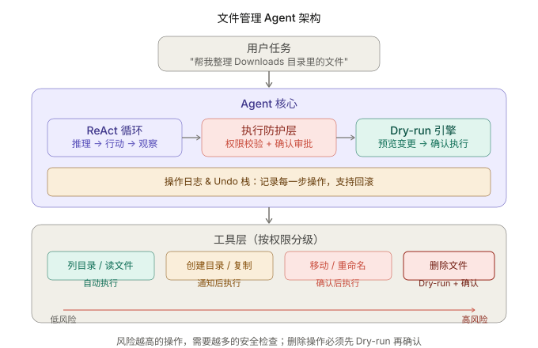
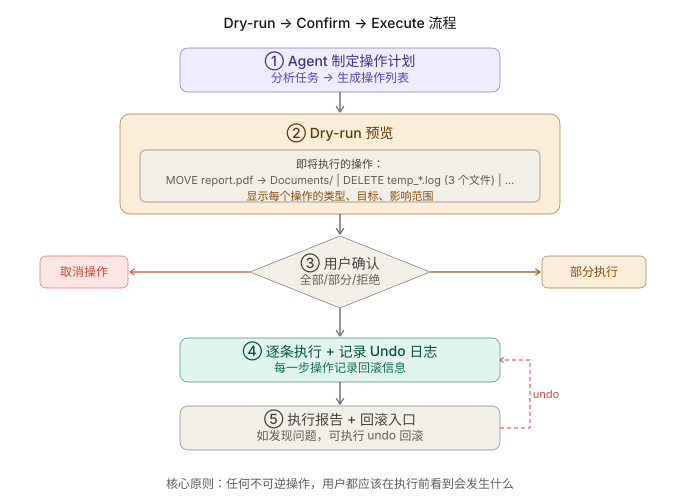

+++
title = "文件管理 Agent 实战：当操作不可逆时，Guardrails 怎么落地"
date = 2026-03-28T20:00:00+08:00
draft = false
author = "Hex4C59"
description = "用 Python 构建一个带完整安全防护的文件管理 Agent——权限分级的工具集、Dry-run 预览机制、操作审批流程和 Undo 回滚能力，展示 Guardrails 如何嵌入 ReAct 执行循环。"
summary = "不只是文件操作——这篇文章的核心是展示 Guardrails 如何在有不可逆操作的 Agent 系统中落地：四级权限工具、Dry-run 预览、用户审批流程、Undo 日志和回滚，以及这些机制如何与 ReAct 循环无缝集成。"
tags = ["Agent", "Guardrails", "File Management", "Tool Use", "ReAct", "Safety"]
categories = ["Agent"]
series = ["agent-engineering"]
series_order = 18
difficulty = "intermediate"
article_type = "tutorial"
topics = ["file-management", "guardrails", "dry-run", "undo", "permissions", "tool-use"]
frameworks = ["OpenAI"]
ShowToc = true
+++

前两篇实战文章里，我们构建了 [CLI Coding Agent](/agent/build-cli-coding-agent/) 和 [Research Agent](/agent/build-research-agent/)。这两个 Agent 有一个共同特点：它们的大多数操作是**可逆的**。Coding Agent 写错了代码可以 `git checkout` 回来，Research Agent 搜索到的信息最多就是不准确，不会造成实际损失。

文件管理 Agent 不一样。

当 Agent 删除了一个文件，它就没了。当 Agent 把 100 个文件批量重命名成错误的名字，你需要手动一个个改回来。当 Agent 把文件移到了错误的目录，而你找不到它移到了哪里，你会花大量时间搜索。

这就是为什么文件管理 Agent 是 [Guardrails](/agent/guardrails-safety-boundary/) 的最佳实战场景——**Agent 的每一个操作都可能是不可逆的，安全防护不再是"有了更好"，而是"没有就不能用"。**

这篇文章的重点不在文件管理本身，而在于展示 Guardrails 如何与 ReAct 循环集成：权限分级的工具设计、Dry-run 预览机制、操作审批流程和 Undo 回滚能力。

---

## 先给结论

1. **当 Agent 操作不可逆时，"先预览再执行"不是可选的便利功能，而是必需的安全保障。** Dry-run 机制让用户在任何文件被修改之前，看到完整的操作计划。
2. **工具的权限等级应该由操作的可逆性决定，而不是操作的复杂度。** 读文件和删文件都很简单，但它们的风险差了几个数量级。
3. **Undo 能力把不可逆操作变成了可逆的。** 在执行每一步之前记录回滚信息，让"犯了错可以撤回"成为系统级保障，而不是依赖用户自己备份。
4. **批量操作需要特别的安全处理。** Agent 一次删除 1 个文件和一次删除 100 个文件，风险完全不同。批量操作应该有额外的确认步骤和更严格的限制。
5. **Guardrails 和 ReAct 循环的集成点在工具调用环节。** 不需要修改推理逻辑，只需要在工具执行之前插入权限检查和确认步骤。

---

## 整体架构



*图 1：文件管理 Agent 的核心特征是执行防护层和 Dry-run 引擎——每个工具按风险分级，高风险操作必须经过预览和确认才能执行。*

与 Coding Agent 和 Research Agent 的对比：

| | Coding Agent | Research Agent | 文件管理 Agent |
|---|---|---|---|
| 核心能力 | 读写代码、执行命令 | 搜索、阅读、综合 | 浏览、整理、迁移文件 |
| 主要风险 | 代码写错（可 git 回滚） | 信息不准（不影响文件） | 文件删错（可能不可逆） |
| 安全机制 | 路径检查 + 危险命令拦截 | 无需特别防护 | **四级权限 + Dry-run + Undo** |
| Guardrails 复杂度 | 低 | 极低 | **高** |

---

## 项目结构

```
file-agent/
├── agent/
│   ├── __init__.py
│   ├── core.py          # ReAct 循环 + Guardrails 集成
│   ├── guardrails.py    # 权限检查、Dry-run、审批
│   ├── undo.py          # 操作日志与回滚
│   └── prompts.py       # System prompt
├── tools/
│   ├── __init__.py
│   ├── read_tools.py    # 只读工具（自动执行）
│   ├── write_tools.py   # 写操作工具（需确认）
│   └── schemas.py       # OpenAI function calling 定义
├── cli/
│   └── main.py          # CLI 入口
└── requirements.txt
```

关键设计：工具按读写分文件，`guardrails.py` 和 `undo.py` 是独立模块——它们不依赖具体工具实现，可以复用到任何需要安全防护的 Agent 中。

---

## 第一步：定义分级工具集

文件管理的工具集按操作的可逆性和影响范围分为四级，和 [Guardrails 那篇](/agent/guardrails-safety-boundary/) 里定义的权限模型一一对应。

### 只读工具（自动执行）

```python
# tools/read_tools.py
import os
from pathlib import Path
from datetime import datetime


WORKSPACE = Path.home()  # 文件管理 Agent 的工作区是用户主目录


def _safe_path(path: str) -> Path:
    """解析路径，禁止访问系统关键目录。"""
    target = Path(path).expanduser().resolve()
    blocked = ["/etc", "/var", "/usr", "/bin", "/sbin", "/System"]
    for b in blocked:
        if str(target).startswith(b):
            raise ValueError(f"禁止访问系统目录：{b}")
    return target


def list_directory(path: str = ".", show_hidden: bool = False) -> dict:
    """
    列出目录内容，包含文件大小和修改时间。
    """
    try:
        p = _safe_path(path)
        if not p.is_dir():
            return {"success": False, "error": f"不是目录：{path}"}

        items = []
        for item in sorted(p.iterdir()):
            if not show_hidden and item.name.startswith("."):
                continue
            stat = item.stat()
            entry = {
                "name": item.name,
                "type": "dir" if item.is_dir() else "file",
                "path": str(item),
                "size_bytes": stat.st_size if item.is_file() else None,
                "modified": datetime.fromtimestamp(
                    stat.st_mtime
                ).strftime("%Y-%m-%d %H:%M"),
            }
            if item.is_file():
                entry["extension"] = item.suffix.lower()
            if item.is_dir():
                try:
                    entry["child_count"] = len(list(item.iterdir()))
                except PermissionError:
                    entry["child_count"] = "permission_denied"
            items.append(entry)

        return {
            "success": True,
            "path": str(p),
            "total_items": len(items),
            "items": items,
        }
    except Exception as e:
        return {"success": False, "error": str(e)}


def get_file_info(path: str) -> dict:
    """获取单个文件的详细信息。"""
    try:
        p = _safe_path(path)
        if not p.exists():
            return {"success": False, "error": f"文件不存在：{path}"}

        stat = p.stat()
        return {
            "success": True,
            "path": str(p),
            "name": p.name,
            "extension": p.suffix.lower(),
            "size_bytes": stat.st_size,
            "size_human": _human_size(stat.st_size),
            "modified": datetime.fromtimestamp(stat.st_mtime).isoformat(),
            "created": datetime.fromtimestamp(stat.st_ctime).isoformat(),
            "is_dir": p.is_dir(),
            "is_symlink": p.is_symlink(),
        }
    except Exception as e:
        return {"success": False, "error": str(e)}


def search_files(
    directory: str,
    pattern: str,
    max_results: int = 50
) -> dict:
    """
    按文件名模式搜索文件。
    pattern: glob 模式，如 "*.pdf"、"report*"。
    """
    try:
        p = _safe_path(directory)
        matches = []
        for match in p.rglob(pattern):
            if len(matches) >= max_results:
                break
            if match.name.startswith("."):
                continue
            matches.append({
                "path": str(match),
                "name": match.name,
                "size_human": _human_size(match.stat().st_size)
                    if match.is_file() else None,
                "type": "dir" if match.is_dir() else "file",
            })

        return {
            "success": True,
            "pattern": pattern,
            "directory": str(p),
            "count": len(matches),
            "truncated": len(matches) >= max_results,
            "matches": matches,
        }
    except Exception as e:
        return {"success": False, "error": str(e)}


def _human_size(size_bytes: int) -> str:
    """把字节数转换为人类可读的格式。"""
    for unit in ["B", "KB", "MB", "GB"]:
        if size_bytes < 1024:
            return f"{size_bytes:.1f} {unit}"
        size_bytes /= 1024
    return f"{size_bytes:.1f} TB"
```

注意 `list_directory` 的返回值包含了 `size_bytes`、`modified`、`extension` 和 `child_count`。这些额外信息对 Agent 做文件整理决策至关重要——它需要知道文件有多大、什么时候修改的、什么类型，才能做出合理的分类和移动建议。这是 [工具接口设计](/agent/tool-interface-design/) 里"返回值要丰富"原则的直接体现。

### 写操作工具（需确认）

写操作工具的设计和只读工具有一个根本区别：**它们不直接执行操作，而是返回一个操作描述（Operation），由 Guardrails 层决定是否执行。**

```python
# tools/write_tools.py
import shutil
from pathlib import Path
from dataclasses import dataclass, field
from tools.read_tools import _safe_path


@dataclass
class FileOperation:
    """描述一个待执行的文件操作。"""
    action: str          # move, copy, rename, delete, create_dir
    source: str          # 源路径
    destination: str     # 目标路径（delete 时为空）
    description: str     # 人类可读的操作描述
    risk_level: str      # auto, notify, confirm, dry_run_confirm
    reversible: bool     # 是否可回滚
    undo_info: dict = field(default_factory=dict)  # 回滚所需的信息


def move_file(source: str, destination: str) -> FileOperation:
    """
    生成移动文件的操作描述。
    不执行实际操作——执行权交给 Guardrails 层。
    """
    src = _safe_path(source)
    dst = _safe_path(destination)

    if not src.exists():
        raise FileNotFoundError(f"源文件不存在：{source}")

    # 如果目标是目录，移动到该目录内
    if dst.is_dir():
        dst = dst / src.name

    return FileOperation(
        action="move",
        source=str(src),
        destination=str(dst),
        description=f"移动 {src.name} → {dst.parent.name}/{dst.name}",
        risk_level="confirm",
        reversible=True,
        undo_info={"action": "move", "source": str(dst), "destination": str(src)},
    )


def copy_file(source: str, destination: str) -> FileOperation:
    """生成复制文件的操作描述。"""
    src = _safe_path(source)
    dst = _safe_path(destination)

    if not src.exists():
        raise FileNotFoundError(f"源文件不存在：{source}")
    if dst.is_dir():
        dst = dst / src.name

    return FileOperation(
        action="copy",
        source=str(src),
        destination=str(dst),
        description=f"复制 {src.name} → {dst.parent.name}/{dst.name}",
        risk_level="notify",
        reversible=True,
        undo_info={"action": "delete", "source": str(dst)},
    )


def rename_file(path: str, new_name: str) -> FileOperation:
    """生成重命名的操作描述。"""
    p = _safe_path(path)
    if not p.exists():
        raise FileNotFoundError(f"文件不存在：{path}")

    new_path = p.parent / new_name
    return FileOperation(
        action="rename",
        source=str(p),
        destination=str(new_path),
        description=f"重命名 {p.name} → {new_name}",
        risk_level="confirm",
        reversible=True,
        undo_info={
            "action": "rename",
            "source": str(new_path),
            "new_name": p.name,
        },
    )


def delete_file(path: str) -> FileOperation:
    """生成删除文件的操作描述。删除操作始终需要 dry-run + 确认。"""
    p = _safe_path(path)
    if not p.exists():
        raise FileNotFoundError(f"文件不存在：{path}")

    size = p.stat().st_size if p.is_file() else _dir_size(p)
    return FileOperation(
        action="delete",
        source=str(p),
        destination="",
        description=f"删除 {p.name}（{_human_size(size)}）",
        risk_level="dry_run_confirm",  # 最高风险等级
        reversible=False,              # 删除不可回滚
        undo_info={},
    )


def create_directory(path: str) -> FileOperation:
    """生成创建目录的操作描述。"""
    p = _safe_path(path)
    return FileOperation(
        action="create_dir",
        source="",
        destination=str(p),
        description=f"创建目录 {p.name}",
        risk_level="notify",
        reversible=True,
        undo_info={"action": "delete_empty_dir", "source": str(p)},
    )


def _dir_size(path: Path) -> int:
    return sum(f.stat().st_size for f in path.rglob("*") if f.is_file())

def _human_size(size_bytes: int) -> str:
    for unit in ["B", "KB", "MB", "GB"]:
        if size_bytes < 1024:
            return f"{size_bytes:.1f} {unit}"
        size_bytes /= 1024
    return f"{size_bytes:.1f} TB"
```

这里最关键的设计决策：**写操作工具不执行任何实际操作，只返回 `FileOperation` 对象。** 它只是"提案"，真正的执行权在 Guardrails 层。这样做的好处是：

1. Agent 的 ReAct 循环不需要关心安全逻辑——它只管决定"做什么"
2. Guardrails 层不需要关心业务逻辑——它只管决定"允不允许"
3. 两者完全解耦，可以独立测试和修改

---

## 第二步：Guardrails 层——权限检查与审批

这是整篇文章的核心模块。它在工具调用和实际执行之间插入了一层安全检查。

```python
# agent/guardrails.py
import shutil
from pathlib import Path
from tools.write_tools import FileOperation


class ExecutionGuardrail:
    """
    执行防护层：根据操作的风险等级决定执行策略。
    """

    def __init__(self, undo_log: "UndoLog"):
        self.undo_log = undo_log
        self.pending_operations: list[FileOperation] = []

    def submit_operation(self, op: FileOperation) -> dict:
        """
        提交一个操作。根据风险等级决定：
        - auto: 直接执行
        - notify: 执行后通知
        - confirm: 暂存等待确认
        - dry_run_confirm: 暂存等待确认，且必须在 dry-run 报告中展示
        """
        if op.risk_level == "auto":
            return self._execute(op)

        if op.risk_level == "notify":
            result = self._execute(op)
            result["notification"] = f"已执行：{op.description}"
            return result

        # confirm 和 dry_run_confirm 都进入待确认队列
        self.pending_operations.append(op)
        return {
            "status": "pending_confirmation",
            "description": op.description,
            "risk_level": op.risk_level,
            "reversible": op.reversible,
        }

    def get_pending_summary(self) -> dict:
        """
        生成待确认操作的 Dry-run 摘要。
        这是给用户看的——在任何文件被修改之前，用户先看到完整的操作列表。
        """
        if not self.pending_operations:
            return {"count": 0, "operations": [], "warnings": []}

        summary = {
            "count": len(self.pending_operations),
            "operations": [],
            "warnings": [],
        }

        irreversible_count = 0
        total_delete_size = 0

        for op in self.pending_operations:
            entry = {
                "action": op.action,
                "description": op.description,
                "reversible": op.reversible,
            }
            summary["operations"].append(entry)

            if not op.reversible:
                irreversible_count += 1
            if op.action == "delete":
                p = Path(op.source)
                if p.exists():
                    size = (
                        p.stat().st_size if p.is_file()
                        else sum(
                            f.stat().st_size
                            for f in p.rglob("*") if f.is_file()
                        )
                    )
                    total_delete_size += size

        # 添加风险提示
        if irreversible_count > 0:
            summary["warnings"].append(
                f"⚠️  {irreversible_count} 个操作不可回滚（删除操作）"
            )
        if total_delete_size > 100 * 1024 * 1024:  # > 100MB
            summary["warnings"].append(
                f"⚠️  即将删除的文件总计 "
                f"{total_delete_size / 1024 / 1024:.1f} MB"
            )
        if len(self.pending_operations) > 20:
            summary["warnings"].append(
                f"⚠️  批量操作涉及 {len(self.pending_operations)} 个文件，"
                f"请仔细检查"
            )

        return summary

    def confirm_all(self) -> list[dict]:
        """用户确认后，执行所有待确认操作。"""
        results = []
        for op in self.pending_operations:
            results.append(self._execute(op))
        self.pending_operations.clear()
        return results

    def confirm_selected(self, indices: list[int]) -> list[dict]:
        """用户选择性确认部分操作。"""
        results = []
        remaining = []
        for i, op in enumerate(self.pending_operations):
            if i in indices:
                results.append(self._execute(op))
            else:
                remaining.append(op)
        self.pending_operations = remaining
        return results

    def cancel_all(self) -> dict:
        """取消所有待确认操作。"""
        count = len(self.pending_operations)
        self.pending_operations.clear()
        return {"cancelled": count}

    def _execute(self, op: FileOperation) -> dict:
        """实际执行一个文件操作，并记录 Undo 日志。"""
        try:
            src = Path(op.source) if op.source else None
            dst = Path(op.destination) if op.destination else None

            if op.action == "move":
                dst.parent.mkdir(parents=True, exist_ok=True)
                shutil.move(str(src), str(dst))
            elif op.action == "copy":
                dst.parent.mkdir(parents=True, exist_ok=True)
                if src.is_dir():
                    shutil.copytree(str(src), str(dst))
                else:
                    shutil.copy2(str(src), str(dst))
            elif op.action == "rename":
                src.rename(dst)
            elif op.action == "delete":
                if src.is_dir():
                    shutil.rmtree(str(src))
                else:
                    src.unlink()
            elif op.action == "create_dir":
                dst.mkdir(parents=True, exist_ok=True)

            # 记录 Undo 信息
            if op.reversible and op.undo_info:
                self.undo_log.record(op)

            return {
                "success": True,
                "action": op.action,
                "description": op.description,
            }
        except Exception as e:
            return {
                "success": False,
                "action": op.action,
                "error": str(e),
            }
```

---

## 第三步：Undo 日志——把不可逆变成可逆

Undo 机制是一个栈结构：最后执行的操作最先回滚。

```python
# agent/undo.py
import shutil
from pathlib import Path
from dataclasses import dataclass
from tools.write_tools import FileOperation


class UndoLog:
    """
    操作回滚日志。记录每个可逆操作的回滚信息，
    支持逐步回滚或一键全部回滚。
    """

    def __init__(self):
        self.stack: list[dict] = []

    def record(self, op: FileOperation):
        """记录一个操作的回滚信息。"""
        if op.reversible and op.undo_info:
            self.stack.append({
                "original_action": op.action,
                "original_description": op.description,
                "undo_info": op.undo_info,
            })

    def undo_last(self) -> dict:
        """回滚最近一个操作。"""
        if not self.stack:
            return {"success": False, "error": "没有可回滚的操作"}

        entry = self.stack.pop()
        return self._execute_undo(entry)

    def undo_all(self) -> list[dict]:
        """按逆序回滚所有操作。"""
        results = []
        while self.stack:
            entry = self.stack.pop()
            results.append(self._execute_undo(entry))
        return results

    def get_history(self) -> list[dict]:
        """查看操作历史（从最早到最新）。"""
        return [
            {
                "index": i,
                "action": e["original_action"],
                "description": e["original_description"],
            }
            for i, e in enumerate(self.stack)
        ]

    def _execute_undo(self, entry: dict) -> dict:
        """执行单条回滚操作。"""
        undo = entry["undo_info"]
        try:
            if undo["action"] == "move":
                src = Path(undo["source"])
                dst = Path(undo["destination"])
                dst.parent.mkdir(parents=True, exist_ok=True)
                shutil.move(str(src), str(dst))
            elif undo["action"] == "rename":
                src = Path(undo["source"])
                new_name = undo["new_name"]
                src.rename(src.parent / new_name)
            elif undo["action"] == "delete":
                Path(undo["source"]).unlink(missing_ok=True)
            elif undo["action"] == "delete_empty_dir":
                Path(undo["source"]).rmdir()

            return {
                "success": True,
                "undone": entry["original_description"],
            }
        except Exception as e:
            return {
                "success": False,
                "error": f"回滚失败：{str(e)}",
                "attempted": entry["original_description"],
            }
```

注意 `delete` 操作没有 `undo_info`——因为文件删除后，我们没有保存文件内容，无法恢复。这是一个有意识的设计取舍：完整的回滚需要在删除前复制文件到临时目录，这增加了复杂度和存储成本。在生产系统中你应该加上这个能力，但在这个教程里我们选择诚实面对：**删除就是不可逆的，所以删除需要最严格的确认。**

---

## 第四步：设计 System Prompt

```python
# agent/prompts.py

SYSTEM_PROMPT = """你是一个文件管理助手，帮助用户整理、搜索、组织文件系统中的文件。

## 能力范围
你可以浏览目录、搜索文件、移动文件、复制文件、重命名文件、创建目录和删除文件。

## 安全规则（必须严格遵守）

**最重要的规则：先探索，再计划，再执行。**

1. 在做任何修改之前，先用 list_directory 和 search_files 了解当前文件结构
2. 基于探索结果，告诉用户你计划做什么，等用户确认
3. 对于批量操作（涉及 5 个以上的文件），必须先列出完整的操作清单
4. 删除操作需要额外谨慎——告诉用户将要删除什么、多大、确认后才执行

## 操作权限

每个写操作工具会返回操作状态而非直接执行：
- "pending_confirmation" 表示操作需要用户确认，使用 confirm_operations 工具来请求确认
- 这是安全机制，不是错误

## 文件整理建议原则

当用户要求"整理文件"时，遵循这些分类原则：
- 按文件类型分类：文档(pdf/doc/txt)、图片(jpg/png/gif)、视频(mp4/mov)、压缩包(zip/tar)
- 按时间分类：最近30天 / 上月 / 更早
- 不要移动用户没有提到的目录里的文件
- 如果不确定某个文件应该放在哪里，问用户

## 完成标准
任务完成后，报告：做了什么、移动了几个文件、当前文件结构是什么样的。
"""
```

和 Coding Agent 的 system prompt 相比，文件管理 Agent 的 prompt 增加了两个重要约束：

1. **"先探索，再计划，再执行"**——三步而不是两步。在 Coding Agent 里是"先探索再行动"，这里多了"计划"步骤，因为文件操作的不可逆性要求 Agent 在行动前先把计划展示给用户。

2. **对批量操作的特别要求**——5 个文件以上必须列完整清单。这防止了 Agent 在用户说"清理一下"时，一口气把 100 个文件批量操作了。

---

## 第五步：构建带 Guardrails 的 ReAct 循环

现在把所有模块组合起来。核心在于 ReAct 循环中工具调用的处理方式——写操作工具的结果不是直接返回执行结果，而是返回待确认状态。

```python
# agent/core.py
import json
import openai
from tools.read_tools import list_directory, get_file_info, search_files
from tools.write_tools import (
    move_file, copy_file, rename_file, delete_file, create_directory,
)
from agent.guardrails import ExecutionGuardrail
from agent.undo import UndoLog
from agent.prompts import SYSTEM_PROMPT
from tools.schemas import TOOL_SCHEMAS

client = openai.OpenAI()
MODEL = "gpt-4o"
MAX_ITERATIONS = 20


# 只读工具：直接执行
READ_TOOLS = {
    "list_directory": list_directory,
    "get_file_info": get_file_info,
    "search_files": search_files,
}

# 写操作工具：返回 FileOperation，由 Guardrails 处理
WRITE_TOOLS = {
    "move_file": move_file,
    "copy_file": copy_file,
    "rename_file": rename_file,
    "delete_file": delete_file,
    "create_directory": create_directory,
}


def run_agent(user_message: str, conversation_history: list[dict]):
    """
    运行文件管理 Agent。
    写操作经过 Guardrails 层处理，需要用户确认后才执行。
    """
    undo_log = UndoLog()
    guardrail = ExecutionGuardrail(undo_log)

    conversation_history.append({"role": "user", "content": user_message})

    # 添加控制类工具（确认、取消、undo、查看待确认）
    control_schemas = [
        {
            "type": "function",
            "function": {
                "name": "confirm_operations",
                "description": (
                    "请求用户确认所有待执行的操作。"
                    "调用前请先说明即将执行哪些操作。"
                ),
                "parameters": {"type": "object", "properties": {}},
            },
        },
        {
            "type": "function",
            "function": {
                "name": "cancel_operations",
                "description": "取消所有待确认的操作。",
                "parameters": {"type": "object", "properties": {}},
            },
        },
        {
            "type": "function",
            "function": {
                "name": "undo_last",
                "description": "回滚最近一步操作。",
                "parameters": {"type": "object", "properties": {}},
            },
        },
        {
            "type": "function",
            "function": {
                "name": "get_operation_history",
                "description": "查看已执行操作的历史记录。",
                "parameters": {"type": "object", "properties": {}},
            },
        },
    ]

    all_schemas = TOOL_SCHEMAS + control_schemas

    for iteration in range(MAX_ITERATIONS):
        print(f"\n[第 {iteration + 1} 轮]")

        messages = [
            {"role": "system", "content": SYSTEM_PROMPT}
        ] + conversation_history[-30:]  # 保留最近 30 条消息

        response = client.chat.completions.create(
            model=MODEL,
            messages=messages,
            tools=all_schemas,
        )

        choice = response.choices[0]
        message = choice.message

        # 构建 assistant 消息
        assistant_msg = {"role": "assistant", "content": message.content}
        if message.tool_calls:
            assistant_msg["tool_calls"] = [
                {
                    "id": tc.id,
                    "type": "function",
                    "function": {
                        "name": tc.function.name,
                        "arguments": tc.function.arguments,
                    },
                }
                for tc in message.tool_calls
            ]
        conversation_history.append(assistant_msg)

        if message.content:
            print(f"\n{message.content}")

        if choice.finish_reason == "stop":
            print("\n[✓ 任务完成]")
            break

        if choice.finish_reason == "tool_calls":
            for tc in message.tool_calls:
                tool_name = tc.function.name
                tool_args = json.loads(tc.function.arguments)
                tool_call_id = tc.id

                result = _dispatch_tool(
                    tool_name, tool_args, guardrail, undo_log
                )

                result_str = json.dumps(
                    result, ensure_ascii=False, indent=2
                )
                print(f"  [{tool_name}] {result_str[:300]}")

                conversation_history.append({
                    "role": "tool",
                    "tool_call_id": tool_call_id,
                    "content": result_str,
                })

    # 任务结束时，如果还有未确认的操作，提示用户
    pending = guardrail.get_pending_summary()
    if pending["count"] > 0:
        print(f"\n⚠️  还有 {pending['count']} 个操作待确认")

    return undo_log


def _dispatch_tool(
    tool_name: str,
    tool_args: dict,
    guardrail: ExecutionGuardrail,
    undo_log: UndoLog,
) -> dict:
    """
    工具调度器——根据工具类型走不同的执行路径。
    只读工具直接执行，写操作工具经过 Guardrails。
    """

    # 1. 只读工具：直接执行
    if tool_name in READ_TOOLS:
        try:
            return READ_TOOLS[tool_name](**tool_args)
        except Exception as e:
            return {"success": False, "error": str(e)}

    # 2. 写操作工具：生成 Operation → 提交给 Guardrails
    if tool_name in WRITE_TOOLS:
        try:
            operation = WRITE_TOOLS[tool_name](**tool_args)
            return guardrail.submit_operation(operation)
        except Exception as e:
            return {"success": False, "error": str(e)}

    # 3. 控制类工具
    if tool_name == "confirm_operations":
        summary = guardrail.get_pending_summary()
        if summary["count"] == 0:
            return {"message": "没有待确认的操作"}

        # 在真实系统中，这里应该等待用户交互
        # 这里简化为显示摘要并自动确认
        print("\n" + "=" * 50)
        print("📋 以下操作等待确认：")
        for i, op in enumerate(summary["operations"]):
            icon = "🔄" if op["reversible"] else "⚠️"
            print(f"  {i+1}. {icon} {op['description']}")
        for warning in summary.get("warnings", []):
            print(f"  {warning}")
        print("=" * 50)

        # 获取用户输入
        user_input = input("\n确认执行？(y=全部/n=取消/数字=选择性执行): ")
        if user_input.lower() == "y":
            results = guardrail.confirm_all()
            return {
                "executed": len(results),
                "results": results,
            }
        elif user_input.lower() == "n":
            return guardrail.cancel_all()
        else:
            try:
                indices = [int(x.strip()) - 1 for x in user_input.split(",")]
                results = guardrail.confirm_selected(indices)
                return {
                    "executed": len(results),
                    "results": results,
                }
            except ValueError:
                return guardrail.cancel_all()

    if tool_name == "cancel_operations":
        return guardrail.cancel_all()

    if tool_name == "undo_last":
        return undo_log.undo_last()

    if tool_name == "get_operation_history":
        return {"history": undo_log.get_history()}

    return {"success": False, "error": f"未知工具：{tool_name}"}
```

这段代码的核心是 `_dispatch_tool` 函数。它根据工具类型走三条不同的路径：

1. **只读工具**：直接执行，零延迟。用户不需要确认"读目录"这种操作。
2. **写操作工具**：先生成 `FileOperation`，提交给 Guardrails。Guardrails 根据风险等级决定直接执行还是进入待确认队列。
3. **控制类工具**：`confirm_operations` 展示 Dry-run 摘要并等待用户确认，`undo_last` 执行回滚。

Guardrails 和 ReAct 循环的集成点非常清晰：**只是在工具调用的执行环节加了一层判断，不需要修改推理逻辑。** Agent 不知道自己被"管着"了——它像平常一样调用 `delete_file`，只是返回的结果告诉它"操作待确认"而不是"操作已完成"。

---

## Dry-run 预览机制



*图 2：Dry-run 的核心原则——任何不可逆操作，用户都应该在执行前看到完整的操作列表和风险提示。*

Dry-run 不只是"显示将要做什么"。好的 Dry-run 应该包含三层信息：

1. **操作清单**：具体要做什么（移动哪个文件到哪里、删除哪些文件）
2. **风险标注**：哪些操作是不可逆的、涉及多少磁盘空间
3. **选择性执行**：用户可以只批准部分操作

```text
═══════════════════════════════════════════════
📋 以下操作等待确认：
  1. 🔄 移动 report_v2.pdf → Documents/reports/report_v2.pdf
  2. 🔄 移动 photo_001.jpg → Pictures/2025/photo_001.jpg
  3. 🔄 移动 notes.txt → Documents/notes.txt
  4. ⚠️ 删除 temp_log_001.txt（2.3 KB）
  5. ⚠️ 删除 temp_log_002.txt（1.8 KB）
  ⚠️  2 个操作不可回滚（删除操作）
═══════════════════════════════════════════════
确认执行？(y=全部 / n=取消 / 数字=选择性执行):
```

用户输入 `1,2,3` 表示只执行移动操作、跳过删除操作。这种粒度的控制在 Agent 系统中非常重要——"全部同意或全部拒绝"会让用户要么过度放权，要么过度干预。

---

## 一次完整的执行过程

以"帮我整理 Downloads 目录"为例：

```text
> 帮我整理一下 ~/Downloads 里的文件，按类型分类

[第 1 轮]
好的，我先看看 Downloads 目录里有什么文件。
  [list_directory] {"success": true, "total_items": 12, ...}

[第 2 轮]
Downloads 目录里有以下文件：

| 文件 | 类型 | 大小 | 修改时间 |
|------|------|------|----------|
| report_q1.pdf | PDF | 2.4 MB | 2025-03-15 |
| screenshot_01.png | 图片 | 1.1 MB | 2025-03-20 |
| setup.dmg | 安装包 | 156 MB | 2025-03-01 |
| notes.txt | 文本 | 4.2 KB | 2025-03-22 |
| vacation.mp4 | 视频 | 342 MB | 2025-02-28 |
| temp_build.log | 日志 | 8.1 KB | 2025-03-18 |
| ...

我建议按以下方式整理：
- 文档 (pdf, txt) → ~/Documents/from_downloads/
- 图片 (png, jpg) → ~/Pictures/from_downloads/
- 视频 (mp4) → ~/Movies/from_downloads/
- 安装包 (dmg) → 建议删除（已安装的话）
- 日志 (log) → 建议删除

需要我按这个方案执行吗？

> 可以，但安装包先不删，帮我移到一个 archives 目录

[第 3 轮]
明白。我来创建目录并移动文件。
  [create_directory] → ~/Documents/from_downloads/ (通知后执行)
  [create_directory] → ~/Pictures/from_downloads/  (通知后执行)
  [create_directory] → ~/Movies/from_downloads/    (通知后执行)
  [create_directory] → ~/Downloads/archives/       (通知后执行)

  [move_file] report_q1.pdf → Documents/from_downloads/ (待确认)
  [move_file] screenshot_01.png → Pictures/from_downloads/ (待确认)
  [move_file] vacation.mp4 → Movies/from_downloads/ (待确认)
  [move_file] setup.dmg → Downloads/archives/ (待确认)
  [move_file] notes.txt → Documents/from_downloads/ (待确认)
  [delete_file] temp_build.log (待确认)

  [confirm_operations]

═══════════════════════════════════════════════
📋 以下操作等待确认：
  1. 🔄 移动 report_q1.pdf → Documents/from_downloads/report_q1.pdf
  2. 🔄 移动 screenshot_01.png → Pictures/from_downloads/screenshot_01.png
  3. 🔄 移动 vacation.mp4 → Movies/from_downloads/vacation.mp4
  4. 🔄 移动 setup.dmg → Downloads/archives/setup.dmg
  5. 🔄 移动 notes.txt → Documents/from_downloads/notes.txt
  6. ⚠️ 删除 temp_build.log（8.1 KB）
  ⚠️  1 个操作不可回滚（删除操作）
═══════════════════════════════════════════════
确认执行？(y=全部 / n=取消 / 数字=选择性执行): y

[第 4 轮]
所有操作已执行完成。整理结果：
- 移动了 5 个文件到对应的分类目录
- 删除了 1 个日志文件
- 如果发现任何问题，可以说"撤回"来回滚操作

> 等等，notes.txt 我其实不想动

[第 5 轮]
  [undo_last]  → 回滚：移动 notes.txt（最后一步移动操作）
  
  不对，notes.txt 的移动不是最后一个操作，让我查看历史。
  [get_operation_history] → 显示 6 步操作

  notes.txt 是第 5 步操作。回滚了最近的删除（第 6 步），现在回滚第 5 步。
  [undo_last] → 回滚：删除 temp_build.log
  [undo_last] → 回滚：移动 notes.txt

已经把 notes.txt 移回了 Downloads 目录。
注意：日志文件 temp_build.log 的删除也被回滚了（因为操作栈是倒序的），
它现在也回到了 Downloads。如果你还是要删除它，请告诉我。
```

这个执行过程展示了几个关键行为：

1. **先探索**：Agent 先列出目录内容，分析文件类型
2. **先计划**：Agent 把分类方案告诉用户，等用户确认后才开始
3. **用户修改计划**：用户说安装包不删，Agent 调整方案
4. **Dry-run 预览**：所有写操作都进入待确认队列，用户看到完整操作清单后才执行
5. **Undo 回滚**：用户改主意后，Agent 通过 undo 回滚操作

---

## 批量操作的安全处理

批量操作的风险和单个操作完全不同。一次删除 1 个文件和一次删除 100 个文件，风险差了两个数量级。

```python
def submit_batch(
    self,
    operations: list[FileOperation],
    batch_limit: int = 50,
) -> dict:
    """
    提交批量操作，额外安全检查。
    """
    # 批量大小限制
    if len(operations) > batch_limit:
        return {
            "success": False,
            "error": (
                f"批量操作上限为 {batch_limit} 个文件，"
                f"当前提交 {len(operations)} 个。"
                f"请分批执行或提高上限。"
            ),
        }

    # 统计风险
    delete_count = sum(1 for op in operations if op.action == "delete")
    irreversible_count = sum(1 for op in operations if not op.reversible)

    # 批量删除的额外确认
    if delete_count > 10:
        return {
            "success": False,
            "error": (
                f"一次性删除 {delete_count} 个文件风险过高。"
                f"请分批处理，每批不超过 10 个。"
            ),
        }

    for op in operations:
        self.submit_operation(op)

    return {
        "status": "pending_confirmation",
        "total": len(operations),
        "delete_count": delete_count,
        "irreversible_count": irreversible_count,
    }
```

这里的设计原则是：**对批量操作做更严格的约束，而不是和单个操作用同样的规则。** 一次删除 1 个临时文件是合理的，但一次删除 100 个文件几乎一定需要人类审查。

---

## 常见失败模式

### Agent 跳过探索直接操作

Agent 收到"整理 Downloads"后，不列目录就直接开始移动文件。这意味着它在假设文件结构——而假设往往是错的。

修复：在 system prompt 里把"先探索"设为**强制第一步**。同时在 Guardrails 里加一个前置检查：如果 Agent 的第一个工具调用是写操作，自动拒绝并提示它先探索。

### 回滚顺序错误

当用户说"撤回 notes.txt 的移动"时，Agent 试图直接回滚那一步。但 undo 栈是倒序的——如果中间有其他操作，它们会被一起回滚。

这是一个已知的限制。更好的实现是按操作 ID 做精确回滚，而不是严格的栈结构。但精确回滚需要处理操作间的依赖关系（比如先创建了目录再移动文件进去，不能只回滚创建目录那步），实现复杂度会显著增加。

### 权限不足

Agent 尝试访问用户没有权限的目录（比如另一个用户的 home）。`_safe_path` 阻止了系统目录，但不阻止同级用户目录。

修复：在 `_safe_path` 里把允许的路径改为白名单模式——只允许访问用户自己的 home 目录和它的子目录。

---

## 这个模式可以复用到哪里

文件管理 Agent 的安全架构不是只适用于文件操作。任何 Agent 涉及不可逆操作的场景，都可以复用这套模式：

**数据库管理 Agent**：读查询自动执行，UPDATE 需要确认，DELETE 需要 Dry-run + 确认，DROP TABLE 完全禁止。Undo 通过事务回滚实现。

**DevOps Agent**：查看日志自动执行，重启服务需要确认，修改配置需要 Dry-run（显示 diff），删除资源需要二次确认 + 冷却期。

**邮件管理 Agent**：搜索邮件自动执行，归档需要确认，删除需要 Dry-run，发送邮件需要预览 + 确认。

核心模式是一致的：

1. **操作和执行分离**：工具返回"操作描述"而不是直接执行
2. **按风险分级**：低风险自动执行，高风险需要确认
3. **Dry-run 预览**：在执行前让人类看到完整的影响
4. **Undo 能力**：让可逆操作真的可以回滚

---

## 总结

文件管理 Agent 的技术复杂度不高——文件操作本身就是 `shutil.move` 和 `Path.unlink` 这些简单的函数调用。真正的工程挑战在于安全防护：**怎么让一个有能力删除你所有文件的 Agent，既能高效地帮你整理文件，又不会犯下不可挽回的错误。**

解决方案不是限制 Agent 的能力，而是在能力和控制之间找到平衡。四级权限确保低风险操作不打断工作流、高风险操作必须经过人类确认。Dry-run 预览确保用户在任何文件被修改之前，看到完整的操作计划。Undo 日志把"不可逆操作"变成"可纠正操作"，给用户一个安全网。

这些机制和 ReAct 循环的集成方式很简洁：只在工具调用的执行环节加一层判断。Agent 不需要知道自己被"管着"了——它像平常一样推理和调用工具，Guardrails 在暗处确保每一步都是安全的。

这套模式——操作和执行分离、按风险分级、Dry-run 预览、Undo 回滚——不止适用于文件管理。任何 Agent 涉及不可逆的真实世界操作时，这四个机制都是基础设施级的安全保障。

---

*上一篇：[Research Agent 实战：从 RAG 到自主研究](/agent/build-research-agent/)*

*下一篇预告：Multi-Agent 实战——用 Supervisor 模式构建代码审查系统*
