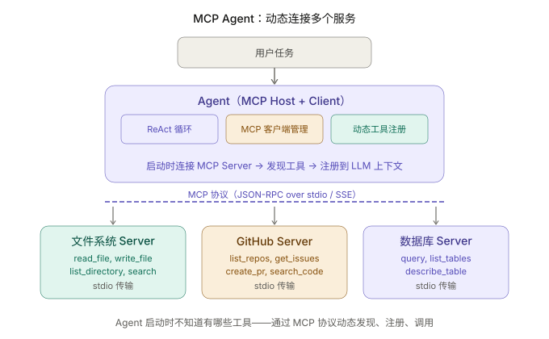
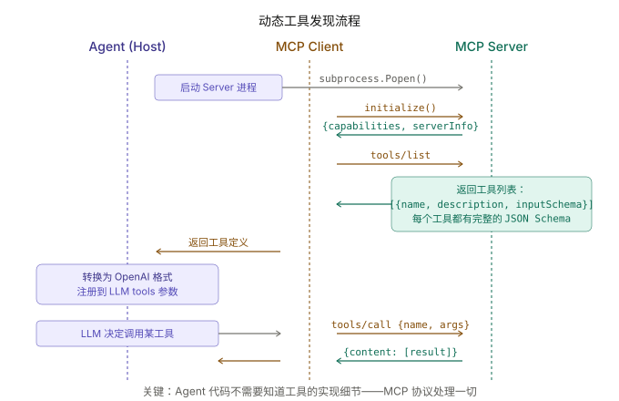

+++
title = "MCP 集成实战：让 Agent 连接真实服务"
date = 2026-03-29T14:00:00+08:00
draft = false
author = "Hex4C59"
description = "用 Python 构建一个通过 MCP 协议动态发现和调用工具的 Agent——连接文件系统、GitHub 和 SQLite 三个真实的 MCP Server，展示从硬编码工具到协议驱动工具的架构升级。"
summary = "前面所有实战教程的工具都是硬编码注册的。这篇展示一种完全不同的方式：Agent 启动时不知道有哪些工具，运行时通过 MCP 协议动态发现、注册和调用——连接文件系统、GitHub 和 SQLite 三个真实的 MCP Server。"
tags = ["Agent", "MCP", "Tool Use", "Protocol", "Dynamic Tools"]
categories = ["Agent"]
series = ["agent-engineering"]
series_order = 21
difficulty = "intermediate"
article_type = "tutorial"
topics = ["mcp", "tool-use", "dynamic-tools", "protocol", "integration"]
frameworks = ["OpenAI", "Anthropic"]
ShowToc = true
+++

前面四篇实战教程——[Coding Agent](/agent/build-cli-coding-agent/)、[Research Agent](/agent/build-research-agent/)、[文件管理 Agent](/agent/build-file-management-agent/)、[代码审查](/agent/build-multi-agent-code-review/)——有一个共同点：**工具都是硬编码的。**

你在 `TOOL_REGISTRY` 里手动注册 `read_file`、`web_search`、`move_file`，在 `TOOL_SCHEMAS` 里手动写每个工具的 JSON Schema 描述。Agent 能用哪些工具，在代码写好的那一刻就确定了。

这篇文章展示一种完全不同的方式。

Agent 启动时不知道自己有哪些工具。它通过 [MCP 协议](/agent/mcp-model-context-protocol/) 连接到外部的 MCP Server，**动态发现**这些 Server 提供的工具，自动转换成 LLM 能理解的格式，然后像使用硬编码工具一样调用它们。

加一个新服务？不用改 Agent 代码。在配置文件里加一行 MCP Server 的地址就行。

---

## 先给结论

1. **MCP 让 Agent 的工具集从"编译时确定"变成"运行时发现"。** Agent 代码不需要知道工具的实现细节——它只需要知道怎么通过 MCP 协议和 Server 通信。
2. **MCP Client 的核心职责是三件事：启动 Server 进程、发现工具列表、转发工具调用。** 理解了这三步，就理解了整个集成逻辑。
3. **MCP 工具定义自带 JSON Schema，可以直接转换成 OpenAI function calling 格式。** 不需要手动写 `TOOL_SCHEMAS`——MCP Server 已经定义好了。
4. **多个 MCP Server 的工具可以混合使用。** Agent 同时连接文件系统、GitHub 和数据库三个 Server，三个 Server 的工具在同一个 ReAct 循环里被统一调用。
5. **MCP 和硬编码工具可以共存。** 你不需要一次性把所有工具都迁移到 MCP。对于核心工具用硬编码，对于扩展工具用 MCP——两种方式可以在同一个 Agent 里混合。

---

## 硬编码工具 vs MCP 工具

先看直观对比：

```python
# ===== 硬编码方式：你需要自己写每一个工具的实现 =====

TOOL_SCHEMAS = [
    {
        "type": "function",
        "function": {
            "name": "read_file",
            "description": "读取文件内容",
            "parameters": {
                "type": "object",
                "properties": {
                    "path": {"type": "string", "description": "文件路径"}
                },
                "required": ["path"],
            },
        },
    },
    # ... 每个工具都要手写 Schema ...
]

TOOL_REGISTRY = {
    "read_file": read_file,       # 每个工具都要手写实现
    "write_file": write_file,
    "list_directory": list_directory,
}
```

```python
# ===== MCP 方式：工具由 Server 提供，Agent 只需要连接 =====

async def setup():
    client = MCPClient()
    await client.connect("npx @modelcontextprotocol/server-filesystem /Users/me")
    tools = await client.list_tools()   # 自动发现所有工具
    schemas = client.to_openai_schemas()  # 自动转换格式
    # 完成。不需要手写任何工具实现或 Schema。
```

区别很明显：硬编码方式每加一个工具要写实现 + Schema；MCP 方式只需要连接一个新 Server，工具定义和实现全部由 Server 端提供。

---

## 整体架构



*图 1：Agent 作为 MCP Host 管理多个 MCP Client，每个 Client 连接一个 Server。启动时通过协议发现工具，运行时通过协议调用工具。Agent 代码不包含任何工具实现。*

---

## 项目结构

```
mcp-agent/
├── agent/
│   ├── __init__.py
│   ├── core.py          # ReAct 循环
│   ├── mcp_manager.py   # MCP 连接管理器
│   └── prompts.py       # System prompt
├── config.json           # MCP Server 配置
├── main.py               # 入口
└── requirements.txt
```

整个项目的核心只有两个文件：`mcp_manager.py`（管理 MCP 连接）和 `core.py`（ReAct 循环）。没有 `tools/` 目录——因为工具全部来自 MCP Server。

---

## 第一步：MCP 连接管理器

这是整篇文章最核心的模块。它负责三件事：启动 MCP Server 进程、发现工具列表、代理工具调用。

```python
# agent/mcp_manager.py
import json
import asyncio
import subprocess
from dataclasses import dataclass, field


@dataclass
class MCPTool:
    """从 MCP Server 发现的工具。"""
    name: str
    description: str
    input_schema: dict       # MCP 原生的 JSON Schema
    server_name: str         # 来源 Server 的名称


@dataclass
class MCPServerConnection:
    """一个 MCP Server 的连接。"""
    name: str
    command: str             # 启动命令，如 "npx @modelcontextprotocol/server-filesystem /path"
    args: list[str] = field(default_factory=list)
    env: dict = field(default_factory=dict)
    process: subprocess.Popen | None = None
    tools: list[MCPTool] = field(default_factory=list)
    _request_id: int = 0

    def next_id(self) -> int:
        self._request_id += 1
        return self._request_id


class MCPManager:
    """
    MCP 连接管理器——管理多个 MCP Server 的生命周期。
    负责：启动 Server → 初始化协议 → 发现工具 → 代理调用 → 关闭。
    """

    def __init__(self):
        self.servers: dict[str, MCPServerConnection] = {}
        self.tool_map: dict[str, MCPServerConnection] = {}  # tool_name → server

    async def connect_server(self, name: str, command: str, args: list[str] = None, env: dict = None):
        """
        启动并连接一个 MCP Server。
        command: Server 的启动命令
        args: 传给 Server 的参数
        """
        full_cmd = [command] + (args or [])

        # 合并环境变量
        import os
        server_env = {**os.environ, **(env or {})}

        # 通过 stdio 传输启动 Server 进程
        process = await asyncio.create_subprocess_exec(
            *full_cmd,
            stdin=asyncio.subprocess.PIPE,
            stdout=asyncio.subprocess.PIPE,
            stderr=asyncio.subprocess.PIPE,
            env=server_env,
        )

        server = MCPServerConnection(
            name=name,
            command=command,
            args=args or [],
            env=env or {},
            process=process,
        )
        self.servers[name] = server

        # MCP 协议初始化：发送 initialize 请求
        init_result = await self._send_request(server, "initialize", {
            "protocolVersion": "2025-03-26",
            "capabilities": {},
            "clientInfo": {"name": "mcp-agent", "version": "1.0"},
        })
        print(f"  ✓ 连接 {name}: {init_result.get('serverInfo', {}).get('name', 'unknown')}")

        # 发送 initialized 通知
        await self._send_notification(server, "notifications/initialized", {})

        # 发现工具
        tools_result = await self._send_request(server, "tools/list", {})
        for tool_data in tools_result.get("tools", []):
            tool = MCPTool(
                name=tool_data["name"],
                description=tool_data.get("description", ""),
                input_schema=tool_data.get("inputSchema", {}),
                server_name=name,
            )
            server.tools.append(tool)
            self.tool_map[tool.name] = server

        print(f"    发现 {len(server.tools)} 个工具: {[t.name for t in server.tools]}")

    async def call_tool(self, tool_name: str, arguments: dict) -> dict:
        """
        通过 MCP 协议调用工具。
        Agent 代码调用这个方法——它不需要知道工具在哪个 Server 上。
        """
        server = self.tool_map.get(tool_name)
        if not server:
            return {"error": f"未知工具：{tool_name}"}

        result = await self._send_request(server, "tools/call", {
            "name": tool_name,
            "arguments": arguments,
        })

        # MCP 的工具返回格式：{content: [{type: "text", text: "..."}]}
        contents = result.get("content", [])
        text_parts = []
        for c in contents:
            if c.get("type") == "text":
                text_parts.append(c.get("text", ""))

        return {
            "success": not result.get("isError", False),
            "result": "\n".join(text_parts),
        }

    def get_all_tools(self) -> list[MCPTool]:
        """获取所有连接的 Server 提供的工具。"""
        all_tools = []
        for server in self.servers.values():
            all_tools.extend(server.tools)
        return all_tools

    def to_openai_schemas(self) -> list[dict]:
        """
        把 MCP 工具定义转换为 OpenAI function calling 格式。
        这是连接 MCP 和 LLM 的桥梁——MCP Server 定义工具，
        这个方法把定义转换成 LLM 能理解的格式。
        """
        schemas = []
        for tool in self.get_all_tools():
            schemas.append({
                "type": "function",
                "function": {
                    "name": tool.name,
                    "description": tool.description,
                    "parameters": tool.input_schema,
                },
            })
        return schemas

    async def close_all(self):
        """关闭所有 Server 连接。"""
        for server in self.servers.values():
            if server.process:
                server.process.terminate()
                try:
                    await asyncio.wait_for(server.process.wait(), timeout=5)
                except asyncio.TimeoutError:
                    server.process.kill()
        self.servers.clear()
        self.tool_map.clear()

    async def _send_request(self, server: MCPServerConnection, method: str, params: dict) -> dict:
        """发送 JSON-RPC 请求并等待响应。"""
        request_id = server.next_id()
        request = {
            "jsonrpc": "2.0",
            "id": request_id,
            "method": method,
            "params": params,
        }

        request_line = json.dumps(request) + "\n"
        server.process.stdin.write(request_line.encode())
        await server.process.stdin.drain()

        # 读取响应
        response_line = await server.process.stdout.readline()
        response = json.loads(response_line.decode())

        if "error" in response:
            raise RuntimeError(
                f"MCP error: {response['error'].get('message', 'unknown')}"
            )

        return response.get("result", {})

    async def _send_notification(self, server: MCPServerConnection, method: str, params: dict):
        """发送 JSON-RPC 通知（无需响应）。"""
        notification = {
            "jsonrpc": "2.0",
            "method": method,
            "params": params,
        }
        notification_line = json.dumps(notification) + "\n"
        server.process.stdin.write(notification_line.encode())
        await server.process.stdin.drain()
```



*图 2：Agent 启动时通过 MCP 协议发现工具的完整流程。关键步骤：initialize → tools/list → 转换为 OpenAI 格式 → 注册到 LLM 上下文。运行时 LLM 调用工具，Agent 通过 tools/call 转发给对应的 Server。*

这段代码的核心是 `to_openai_schemas()` 方法——它把 MCP 的工具定义自动转换成 OpenAI function calling 格式。**你不需要手写任何 `TOOL_SCHEMAS`。** MCP Server 已经定义好了每个工具的名称、描述和参数的 JSON Schema，这个方法只做格式转换。

---

## 第二步：配置 MCP Server

用一个 JSON 配置文件管理所有 MCP Server 的连接信息：

```json
{
  "servers": {
    "filesystem": {
      "command": "npx",
      "args": ["-y", "@modelcontextprotocol/server-filesystem", "/Users/me/projects"],
      "description": "本地文件系统访问"
    },
    "github": {
      "command": "npx",
      "args": ["-y", "@modelcontextprotocol/server-github"],
      "env": {
        "GITHUB_PERSONAL_ACCESS_TOKEN": "ghp_xxxxxxxxxxxx"
      },
      "description": "GitHub API 访问"
    },
    "sqlite": {
      "command": "npx",
      "args": ["-y", "@modelcontextprotocol/server-sqlite", "/Users/me/data/app.db"],
      "description": "SQLite 数据库查询"
    }
  }
}
```

加一个新服务，只需要在这个文件里加一个条目。Agent 代码完全不用改。

这三个 MCP Server 都是 [Anthropic 官方维护的开源实现](https://github.com/modelcontextprotocol/servers)，可以直接用 `npx` 运行。

---

## 第三步：构建 ReAct 循环

ReAct 循环和前面教程里的几乎一样——唯一的区别是工具的来源和调用方式：

```python
# agent/core.py
import json
import openai
from agent.mcp_manager import MCPManager

client = openai.AsyncOpenAI()
MODEL = "gpt-4o"
MAX_ITERATIONS = 20

SYSTEM_PROMPT = """你是一个通用助手，可以访问多种外部服务和工具。

## 能力范围
你通过工具连接了以下服务（具体工具列表会在对话中动态提供）：
- 文件系统：浏览、读取、搜索本地文件
- GitHub：查看仓库、Issues、PR
- 数据库：查询 SQLite 数据库

## 工作原则
- 先探索再行动：使用工具前，先了解可用的信息
- 组合使用多个服务：如果任务涉及多个数据源，主动从不同服务收集信息
- 错误是信息：工具调用失败时，分析错误原因，调整策略重试

## 关于工具
你可用的工具是动态发现的，不是硬编码的。
工具的名称和描述会告诉你它们能做什么。请仔细阅读工具描述后再调用。
"""


async def run_agent(
    user_message: str,
    mcp: MCPManager,
    conversation_history: list[dict],
):
    """
    运行 MCP Agent。
    和硬编码工具的 Agent 唯一的区别：
    - 工具 Schema 来自 mcp.to_openai_schemas()
    - 工具调用转发给 mcp.call_tool()
    """
    conversation_history.append({"role": "user", "content": user_message})

    # 从 MCP 动态获取工具定义
    tool_schemas = mcp.to_openai_schemas()

    for iteration in range(MAX_ITERATIONS):
        print(f"\n[第 {iteration + 1} 轮]")

        messages = [
            {"role": "system", "content": SYSTEM_PROMPT}
        ] + conversation_history[-30:]

        response = await client.chat.completions.create(
            model=MODEL,
            messages=messages,
            tools=tool_schemas if tool_schemas else None,
        )

        choice = response.choices[0]
        message = choice.message

        # 构建 assistant 消息
        assistant_msg = {"role": "assistant", "content": message.content}
        if message.tool_calls:
            assistant_msg["tool_calls"] = [
                {
                    "id": tc.id,
                    "type": "function",
                    "function": {
                        "name": tc.function.name,
                        "arguments": tc.function.arguments,
                    },
                }
                for tc in message.tool_calls
            ]
        conversation_history.append(assistant_msg)

        if message.content:
            print(f"\n{message.content}")

        if choice.finish_reason == "stop":
            print("\n[✓ 任务完成]")
            break

        if choice.finish_reason == "tool_calls":
            for tc in message.tool_calls:
                tool_name = tc.function.name
                tool_args = json.loads(tc.function.arguments)

                print(f"  [工具] {tool_name}({json.dumps(tool_args, ensure_ascii=False)[:100]})")

                # 核心区别：工具调用通过 MCP 协议转发
                result = await mcp.call_tool(tool_name, tool_args)

                result_str = json.dumps(result, ensure_ascii=False)
                if len(result_str) > 3000:
                    result_str = result_str[:3000] + "\n[结果已截断]"

                print(f"  [结果] {result_str[:200]}")

                conversation_history.append({
                    "role": "tool",
                    "tool_call_id": tc.id,
                    "content": result_str,
                })
```

注意 `run_agent` 函数和 [Coding Agent](/agent/build-cli-coding-agent/) 里的 `run_agent` 结构几乎完全一样。唯一的两个区别用注释标出了：

1. `tool_schemas = mcp.to_openai_schemas()` —— Schema 是动态获取的，不是硬编码的
2. `result = await mcp.call_tool(tool_name, tool_args)` —— 工具调用通过 MCP 转发，不是调用本地函数

**Agent 的推理逻辑完全不变。** 它不知道也不需要知道工具是 MCP 提供的还是硬编码的——它只管推理和调用，底层的工具发现和路由由 MCPManager 处理。

---

## 第四步：入口与组装

```python
# main.py
import asyncio
import json
from agent.core import run_agent
from agent.mcp_manager import MCPManager


async def main():
    # 1. 加载配置
    with open("config.json") as f:
        config = json.load(f)

    # 2. 启动 MCP 连接
    mcp = MCPManager()

    print("🔌 连接 MCP Server...\n")
    for name, server_config in config["servers"].items():
        try:
            await mcp.connect_server(
                name=name,
                command=server_config["command"],
                args=server_config.get("args", []),
                env=server_config.get("env"),
            )
        except Exception as e:
            print(f"  ✗ {name}: {e}")

    # 3. 显示发现的工具
    all_tools = mcp.get_all_tools()
    print(f"\n📦 共发现 {len(all_tools)} 个工具:")
    for tool in all_tools:
        print(f"  - {tool.name} ({tool.server_name}): {tool.description[:60]}")

    # 4. 交互循环
    print("\n" + "=" * 50)
    print("MCP Agent 已就绪。输入任务，按 Enter 执行。")
    print("输入 /tools 查看可用工具，/exit 退出。")
    print("=" * 50)

    conversation_history = []

    while True:
        try:
            user_input = input("\n> ").strip()
        except (KeyboardInterrupt, EOFError):
            break

        if not user_input:
            continue
        if user_input == "/exit":
            break
        if user_input == "/tools":
            for tool in mcp.get_all_tools():
                print(f"  [{tool.server_name}] {tool.name}: {tool.description[:80]}")
            continue

        await run_agent(user_input, mcp, conversation_history)

    # 5. 清理
    await mcp.close_all()
    print("\n再见！")


if __name__ == "__main__":
    asyncio.run(main())
```

---

## 一次完整的执行过程

```text
🔌 连接 MCP Server...

  ✓ 连接 filesystem: Filesystem MCP Server
    发现 11 个工具: ['read_file', 'write_file', 'list_directory', ...]
  ✓ 连接 github: GitHub MCP Server
    发现 18 个工具: ['list_repos', 'get_issues', 'create_issue', ...]
  ✓ 连接 sqlite: SQLite MCP Server
    发现 4 个工具: ['query', 'list_tables', 'describe_table', ...]

📦 共发现 33 个工具
==================================================
MCP Agent 已就绪。

> 帮我查一下 GitHub 上 Hex4C59/my-app 仓库最近的 issues，
  然后看看本地项目里的 README 是否需要更新

[第 1 轮]
好的，我先查看 GitHub 上的 issues，再读取本地 README。

  [工具] get_issues({"repo": "Hex4C59/my-app", "state": "open"})
  [结果] {"success": true, "result": "[{\"number\": 42, \"title\": \"文档缺少安装说明\"..."}

[第 2 轮]
GitHub 上有 3 个 open issues。其中 #42 提到文档缺少安装说明。
让我看看本地的 README。

  [工具] read_file({"path": "/Users/me/projects/my-app/README.md"})
  [结果] {"success": true, "result": "# My App\n\nA simple web application..."}

[第 3 轮]
对比分析：

1. GitHub Issue #42 说"缺少安装说明"——确实，README 里只有项目描述，
   没有 Installation 部分。
2. Issue #38 说"缺少 API 文档"——README 里也没有 API 相关内容。

README 确实需要更新。建议：
- 添加 Installation 部分
- 添加 Quick Start 部分
- 添加 API 概述

需要我帮你写更新后的内容吗？

[✓ 任务完成]
```

注意这个执行过程里，Agent **同时使用了两个不同 Server 的工具**——先调用 GitHub Server 的 `get_issues`，再调用 Filesystem Server 的 `read_file`。Agent 不知道这些工具来自不同的 Server，它只看到一个统一的工具列表。

---

## 混合模式：MCP 工具 + 硬编码工具共存

你不需要把所有工具都迁移到 MCP。实际上，最实用的做法是混合模式：

```python
# 核心工具硬编码（更可控、更快）
BUILTIN_TOOLS = {
    "think": lambda thought: {"noted": thought},  # 内部推理
}
BUILTIN_SCHEMAS = [
    {
        "type": "function",
        "function": {
            "name": "think",
            "description": "内部思考工具，用于推理和规划。不会产生外部副作用。",
            "parameters": {
                "type": "object",
                "properties": {
                    "thought": {"type": "string", "description": "思考内容"}
                },
                "required": ["thought"],
            },
        },
    },
]


async def run_agent_hybrid(user_message: str, mcp: MCPManager, history: list[dict]):
    """混合模式：内置工具 + MCP 工具。"""

    # 合并工具定义
    all_schemas = BUILTIN_SCHEMAS + mcp.to_openai_schemas()

    # ... ReAct 循环 ...

    # 工具调用时区分来源
    if tool_name in BUILTIN_TOOLS:
        result = BUILTIN_TOOLS[tool_name](**tool_args)
    else:
        result = await mcp.call_tool(tool_name, tool_args)
```

什么时候用硬编码，什么时候用 MCP：

| 场景 | 推荐方式 | 原因 |
|------|----------|------|
| Agent 内部推理工具（think） | 硬编码 | 不需要外部依赖 |
| 自定义业务逻辑 | 硬编码 | 实现和 Agent 强耦合 |
| 标准化外部服务（GitHub、DB） | MCP | Server 由社区维护，即插即用 |
| 需要跨 Agent 复用的工具 | MCP | 一个 Server 服务多个 Agent |

---

## MCP Server 的生态

截至 2025 年，MCP 社区已经有大量可直接使用的 Server：

| Server | 提供的工具 | 维护方 |
|--------|-----------|--------|
| `server-filesystem` | 文件读写、目录操作、搜索 | Anthropic 官方 |
| `server-github` | 仓库、Issues、PR、代码搜索 | Anthropic 官方 |
| `server-sqlite` | SQL 查询、表结构查看 | Anthropic 官方 |
| `server-postgres` | PostgreSQL 查询 | Anthropic 官方 |
| `server-brave-search` | 网络搜索 | Anthropic 官方 |
| `server-slack` | 消息、频道管理 | Anthropic 官方 |
| `server-memory` | 知识图谱式记忆 | Anthropic 官方 |
| `server-puppeteer` | 浏览器自动化 | 社区 |
| `server-notion` | Notion 页面和数据库 | 社区 |

用我们的 `config.json` 接入任何一个 Server，只需要加一个条目：

```json
{
  "brave-search": {
    "command": "npx",
    "args": ["-y", "@modelcontextprotocol/server-brave-search"],
    "env": {
      "BRAVE_API_KEY": "your-api-key"
    }
  }
}
```

重启 Agent，它就自动发现了搜索工具。**零代码修改。**

---

## 常见问题与解决

### Server 启动失败

最常见的问题是 `npx` 找不到包或者 Node.js 版本不够。确保 Node.js >= 18，并且网络可以访问 npm registry。

调试方法：直接在终端跑 Server 命令，看报错信息：
```bash
npx -y @modelcontextprotocol/server-filesystem /tmp/test
```

### 工具名称冲突

两个 Server 可能提供同名工具（比如都有 `search`）。当前的实现用后连接的覆盖先连接的。

更好的做法是给工具名加 Server 前缀（如 `filesystem_search`、`github_search`），但这需要修改 LLM 看到的工具名和 MCP 调用时用的工具名之间的映射。

### 性能开销

每次工具调用都经过 JSON-RPC + 进程间通信，比直接调用本地函数慢几毫秒。对大多数场景影响不大，但如果你的 Agent 需要在一轮推理中做几十次文件操作，考虑用硬编码工具。

---

## 总结

MCP 集成改变的不是 Agent 的推理方式——ReAct 循环完全没变——它改变的是**工具的来源和管理方式**。从"开发者手动写实现 + Schema"变成"Agent 启动时通过协议自动发现"。

这个变化的工程意义很大：加一个新服务不用改代码，只改配置文件；工具的实现由专门的 Server 维护，质量更稳定；同一个 Server 可以被多个 Agent 复用，不用重复实现。

但 MCP 不是万能的。对于和 Agent 业务逻辑强耦合的工具（比如 Coding Agent 的路径检查、文件管理 Agent 的权限分级），硬编码仍然是更好的选择。最实用的模式是混合：核心工具硬编码保证可控性，扩展工具通过 MCP 保证可扩展性。

MCP 协议本身在 [MCP 概念篇](/agent/mcp-model-context-protocol/) 里已经详细讲过了——三层架构、三种原语、安全模型。这篇文章把那些概念落地成了可运行的代码。如果你还没读过概念篇，建议先读概念再看代码，理解会更完整。

---

*上一篇：[Multi-Agent 实战：代码审查系统](/agent/build-multi-agent-code-review/)*

*下一篇预告：Skill 驱动的专家 Agent——教 Agent 写你风格的博客*
