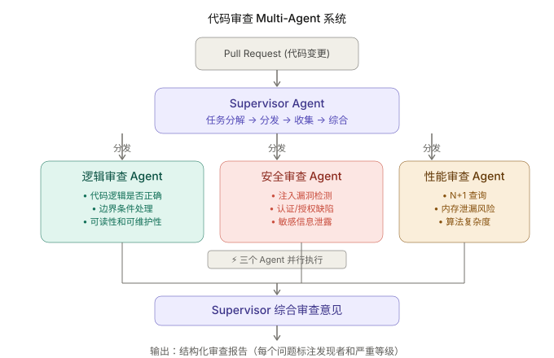
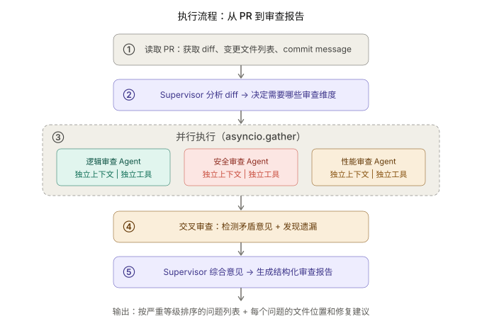

+++
title = "Multi-Agent 实战：用 Supervisor 模式构建代码审查系统"
date = 2026-03-29T10:00:00+08:00
draft = false
author = "Hex4C59"
description = "用 Python 构建一个多 Agent 代码审查系统——Supervisor Agent 协调逻辑、安全、性能三个专家 Agent 并行审查 PR，交叉检验后生成结构化审查报告。"
summary = "不只是多个 Agent 跑在一起——这篇文章的核心在于 Supervisor 编排模式的工程落地：任务分发策略、Agent 间上下文隔离、并行执行、交叉审查（Reflection 的多Agent 形态）、矛盾仲裁和结构化报告输出。"
tags = ["Agent", "Multi-Agent", "Supervisor", "Code Review", "Reflection", "Parallel"]
categories = ["Agent"]
series = ["agent-engineering"]
series_order = 20
difficulty = "advanced"
article_type = "tutorial"
topics = ["multi-agent", "supervisor", "code-review", "parallel-execution", "cross-review"]
frameworks = ["OpenAI"]
ShowToc = true
+++

在 [多 Agent 协作那篇](/agent/multi-agent-collaboration/) 里，我们讨论了四种编排模式和它们各自适用的场景。其中 Supervisor 模式——一个主管 Agent 统一调度多个 Worker Agent——是最易理解、最好调试的模式，适合作为多 Agent 系统的第一个实战项目。

这篇文章拿代码审查来做。代码审查是 Supervisor 模式的天然最佳场景，原因有三个：

1. **任务天然可分解**——逻辑正确性、安全漏洞、性能问题是三个独立的审查维度，互不依赖
2. **需要独立视角**——一个 Agent 既写分析又做审查，会陷入 [Reflection 那篇](/agent/reflection-agent/) 里说的"自我一致性陷阱"；不同 Agent 各自独立审查，视角真正独立
3. **并行能显著加速**——三个维度串行审查要 30 秒，并行只要 10 秒

---

## 先给结论

1. **Supervisor 模式的核心价值不是"多个 Agent 一起干活"，而是任务分解后的独立执行和结果综合。** 每个 Worker Agent 有自己独立的上下文窗口和 system prompt，各自只关注一个维度。Supervisor 负责分发和综合，不参与具体审查。
2. **每个 Worker Agent 应该是一个完整的 ReAct Agent，不是一次性的 LLM 调用。** 安全审查 Agent 可能需要多步推理——先读代码、再查依赖、再分析数据流——这需要完整的 ReAct 循环，不是一次问答能搞定的。
3. **交叉审查是 Reflection 的多 Agent 形态。** 一个 Agent 审查另一个 Agent 的结论，效果比自我审查好得多——因为审查者没有被执行者的推理路径"锚定"。
4. **并行执行是多 Agent 最直接的收益。** 三个 Agent 用 `asyncio.gather` 并行运行，wall-clock time 等于最慢的那个 Agent，而不是三个的总和。
5. **Agent 间不应该共享上下文。** 每个 Worker Agent 只看到自己需要的信息（diff + 相关文件），不看其他 Worker 的中间结果。这既是安全边界，也防止 Agent 之间互相干扰。

---

## 整体架构



*图 1：Supervisor 接收 PR → 分发给三个专家 Agent 并行审查 → 收集结果 → 综合为结构化报告。每个 Agent 有独立的上下文和工具集。*

---

## 项目结构

```
code-review-agent/
├── agents/
│   ├── __init__.py
│   ├── supervisor.py     # Supervisor：任务分发与结果综合
│   ├── reviewer.py       # Worker Agent 通用框架
│   └── prompts.py        # 各 Agent 的 System Prompt
├── tools/
│   ├── __init__.py
│   ├── git_tools.py      # Git/PR 相关工具
│   └── code_tools.py     # 代码分析工具
├── models/
│   ├── __init__.py
│   └── review.py         # 审查结果数据模型
├── main.py               # 入口
└── requirements.txt
```

---

## 第一步：定义数据模型

在写任何 Agent 逻辑之前，先把审查结果的数据结构定义清楚。这是多 Agent 系统中最重要的事情之一——**Agent 之间传递的数据结构就是它们的"协议"**，定义不清会导致综合阶段无法对齐。

```python
# models/review.py
from dataclasses import dataclass, field
from enum import Enum


class Severity(Enum):
    CRITICAL = "critical"    # 必须修复，阻止合并
    WARNING = "warning"      # 应该修复，不阻止合并
    SUGGESTION = "suggestion"  # 建议改进


class ReviewDimension(Enum):
    LOGIC = "logic"
    SECURITY = "security"
    PERFORMANCE = "performance"


@dataclass
class ReviewIssue:
    """单个审查问题。"""
    dimension: ReviewDimension
    severity: Severity
    file_path: str
    line_range: str          # e.g., "L42-L58"
    title: str               # 一句话概括
    description: str         # 详细说明
    suggestion: str          # 修复建议
    confidence: float        # 0~1，Agent 对该问题的置信度


@dataclass
class DimensionReport:
    """单个维度的审查报告。"""
    dimension: ReviewDimension
    reviewer: str            # Agent 名称
    issues: list[ReviewIssue] = field(default_factory=list)
    summary: str = ""
    iterations_used: int = 0
    tokens_used: int = 0


@dataclass
class ReviewReport:
    """完整的审查报告。"""
    pr_title: str
    pr_url: str
    files_reviewed: list[str]
    dimension_reports: list[DimensionReport] = field(default_factory=list)
    cross_review_notes: list[str] = field(default_factory=list)
    overall_verdict: str = ""  # approve / request_changes / comment
    total_issues: int = 0
    critical_count: int = 0
```

`ReviewIssue` 是所有 Agent 共享的输出格式。每个 Agent 不管内部怎么推理，最终都必须按这个结构输出，Supervisor 才能统一处理。

---

## 第二步：构建工具集

代码审查 Agent 的工具集和前面几篇实战文章里的都不同——它需要的是**读取和分析代码**的能力，不需要修改代码。

```python
# tools/git_tools.py
import subprocess
from pathlib import Path


def get_pr_diff(pr_branch: str, base_branch: str = "main") -> dict:
    """
    获取 PR 的 diff 内容。
    返回按文件组织的变更信息。
    """
    try:
        result = subprocess.run(
            ["git", "diff", f"{base_branch}...{pr_branch}", "--unified=5"],
            capture_output=True, text=True, timeout=30,
        )
        if result.returncode != 0:
            return {"success": False, "error": result.stderr}

        # 按文件拆分 diff
        files = []
        current_file = None
        current_diff = []

        for line in result.stdout.splitlines():
            if line.startswith("diff --git"):
                if current_file:
                    files.append({
                        "path": current_file,
                        "diff": "\n".join(current_diff),
                    })
                parts = line.split(" b/")
                current_file = parts[-1] if len(parts) > 1 else "unknown"
                current_diff = [line]
            elif current_file:
                current_diff.append(line)

        if current_file:
            files.append({
                "path": current_file,
                "diff": "\n".join(current_diff),
            })

        return {
            "success": True,
            "files_changed": len(files),
            "files": files,
        }
    except Exception as e:
        return {"success": False, "error": str(e)}


def get_file_content(path: str) -> dict:
    """读取文件完整内容（用于理解被修改文件的上下文）。"""
    try:
        p = Path(path)
        if not p.exists():
            return {"success": False, "error": f"文件不存在：{path}"}
        content = p.read_text(encoding="utf-8")
        return {
            "success": True,
            "path": path,
            "content": content,
            "lines": len(content.splitlines()),
        }
    except Exception as e:
        return {"success": False, "error": str(e)}


def get_changed_files(
    pr_branch: str, base_branch: str = "main"
) -> dict:
    """获取 PR 中变更的文件列表。"""
    try:
        result = subprocess.run(
            ["git", "diff", "--name-status", f"{base_branch}...{pr_branch}"],
            capture_output=True, text=True, timeout=30,
        )
        files = []
        for line in result.stdout.strip().splitlines():
            parts = line.split("\t")
            if len(parts) >= 2:
                files.append({
                    "status": parts[0],  # A=added, M=modified, D=deleted
                    "path": parts[1],
                })
        return {"success": True, "files": files}
    except Exception as e:
        return {"success": False, "error": str(e)}
```

```python
# tools/code_tools.py

def analyze_imports(file_path: str) -> dict:
    """分析 Python 文件的导入依赖。"""
    try:
        with open(file_path, "r") as f:
            lines = f.readlines()

        imports = []
        for i, line in enumerate(lines, 1):
            stripped = line.strip()
            if stripped.startswith("import ") or stripped.startswith("from "):
                imports.append({"line": i, "statement": stripped})

        return {
            "success": True,
            "path": file_path,
            "imports": imports,
            "count": len(imports),
        }
    except Exception as e:
        return {"success": False, "error": str(e)}


def find_function_definitions(file_path: str) -> dict:
    """提取文件中的函数和类定义及其行号。"""
    try:
        with open(file_path, "r") as f:
            lines = f.readlines()

        definitions = []
        for i, line in enumerate(lines, 1):
            stripped = line.strip()
            if stripped.startswith("def ") or stripped.startswith("class "):
                definitions.append({
                    "line": i,
                    "definition": stripped.rstrip(":"),
                    "type": "function" if stripped.startswith("def") else "class",
                })

        return {
            "success": True,
            "path": file_path,
            "definitions": definitions,
        }
    except Exception as e:
        return {"success": False, "error": str(e)}
```

---

## 第三步：定义各 Agent 的 System Prompt

每个 Worker Agent 的 prompt 是它的"专业能力定义"。和单 Agent 不同，多 Agent 系统里每个 prompt 只需要覆盖一个维度，可以写得更深、更具体。

```python
# agents/prompts.py

SUPERVISOR_PROMPT = """你是一个代码审查协调者。你的职责是：
1. 分析 PR 的变更范围，决定需要哪些维度的审查
2. 将审查任务分发给专家 Agent
3. 收集各专家的审查意见并综合成最终报告

你不做具体的代码审查——那是专家 Agent 的工作。你负责的是全局视角：
确保审查的覆盖面完整，发现不同维度之间的关联问题，仲裁矛盾意见。
"""

LOGIC_REVIEWER_PROMPT = """你是一个代码逻辑审查专家。你只关注代码的逻辑正确性。

## 审查重点
1. **逻辑错误**：条件判断是否正确、循环是否有正确的终止条件、边界条件是否处理
2. **状态管理**：变量是否在所有路径上正确初始化、是否存在竞态条件
3. **错误处理**：异常是否被捕获和处理、错误信息是否有意义
4. **可读性**：命名是否清晰、复杂逻辑是否有注释、函数是否过长

## 不在你职责范围内的事情
- 安全漏洞（安全审查 Agent 负责）
- 性能问题（性能审查 Agent 负责）
- 代码风格（不在本次审查范围）

## 输出格式
对每个发现的问题，输出 JSON：
{
  "severity": "critical|warning|suggestion",
  "file_path": "文件路径",
  "line_range": "L起始-L结束",
  "title": "一句话概括",
  "description": "详细说明为什么这是问题",
  "suggestion": "建议怎么修复",
  "confidence": 0.0-1.0
}
"""

SECURITY_REVIEWER_PROMPT = """你是一个代码安全审查专家。你只关注代码的安全性。

## 审查重点
1. **注入漏洞**：SQL 注入、命令注入、XSS、模板注入
2. **认证与授权**：权限检查是否缺失、认证绕过风险
3. **敏感信息**：硬编码的密码/密钥、日志中泄露敏感数据
4. **输入验证**：用户输入是否经过校验和清洗
5. **依赖安全**：是否引入了已知有漏洞的依赖

## 不在你职责范围内的事情
- 代码逻辑正确性（逻辑审查 Agent 负责）
- 性能优化（性能审查 Agent 负责）

## 安全分析方法
1. 先识别数据流入口点（用户输入、API 参数、文件读取）
2. 追踪这些数据在代码中的流向
3. 检查数据到达敏感操作（数据库查询、命令执行、文件写入）之前是否经过清洗

## 输出格式
同逻辑审查 Agent，但 severity 对安全漏洞应偏向 critical。
"""

PERFORMANCE_REVIEWER_PROMPT = """你是一个代码性能审查专家。你只关注代码的性能表现。

## 审查重点
1. **查询效率**：N+1 查询、缺少索引、不必要的全表扫描
2. **算法复杂度**：嵌套循环的时间复杂度、不必要的重复计算
3. **内存使用**：大对象的不必要拷贝、未释放的资源、内存泄漏风险
4. **I/O 效率**：同步阻塞调用、缺少缓存、不必要的网络请求
5. **并发问题**：锁粒度、死锁风险、资源竞争

## 不在你职责范围内的事情
- 代码逻辑正确性（逻辑审查 Agent 负责）
- 安全漏洞（安全审查 Agent 负责）

## 输出格式
同逻辑审查 Agent。对性能问题，尽量给出可量化的影响评估
（如"在 10 万条数据时，这个嵌套循环的时间复杂度为 O(n²)"）。
"""
```

注意每个 prompt 里都有**"不在你职责范围内的事情"**——这是多 Agent 系统的关键设计。如果不明确划定边界，Agent 会倾向于"顺便"看看其他维度，导致重复审查和意见冲突。在 [Prompt 设计那篇](/agent/prompt-design-agent/) 里说过："告诉模型不要做什么，和告诉它要做什么一样重要。"

---

## 第四步：实现 Worker Agent 通用框架

所有 Worker Agent 共享同一个执行框架——一个完整的 ReAct 循环。区别只在于 system prompt 和工具集。

```python
# agents/reviewer.py
import openai
import json
from models.review import ReviewIssue, ReviewDimension, Severity, DimensionReport

client = openai.AsyncOpenAI()

TOOL_SCHEMAS = [
    {
        "type": "function",
        "function": {
            "name": "get_file_content",
            "description": "读取文件完整内容。用于理解被修改代码的完整上下文。",
            "parameters": {
                "type": "object",
                "properties": {
                    "path": {"type": "string", "description": "文件路径"}
                },
                "required": ["path"],
            },
        },
    },
    {
        "type": "function",
        "function": {
            "name": "analyze_imports",
            "description": "分析文件的导入依赖关系。",
            "parameters": {
                "type": "object",
                "properties": {
                    "file_path": {"type": "string", "description": "文件路径"},
                },
                "required": ["file_path"],
            },
        },
    },
    {
        "type": "function",
        "function": {
            "name": "find_function_definitions",
            "description": "提取文件中的函数和类定义及其行号。",
            "parameters": {
                "type": "object",
                "properties": {
                    "file_path": {"type": "string", "description": "文件路径"},
                },
                "required": ["file_path"],
            },
        },
    },
]

TOOL_REGISTRY = {
    "get_file_content": None,     # 运行时注入
    "analyze_imports": None,
    "find_function_definitions": None,
}


async def run_reviewer(
    name: str,
    dimension: ReviewDimension,
    system_prompt: str,
    diff_content: str,
    changed_files: list[str],
    tools: dict,
    max_iterations: int = 10,
) -> DimensionReport:
    """
    运行一个 Worker Agent 完成单维度审查。
    每个 Worker 是一个独立的 ReAct Agent，有自己的上下文窗口。
    """
    total_tokens = 0

    messages = [
        {"role": "system", "content": system_prompt},
        {"role": "user", "content": f"""请审查以下代码变更：

变更的文件：{', '.join(changed_files)}

Diff 内容：
```
{diff_content}
```

请逐一分析每个变更文件，找出你职责范围内的问题。
如果需要查看文件的完整内容来理解上下文，使用 get_file_content 工具。

审查完成后，输出你发现的所有问题（JSON 列表）。
如果没有发现问题，明确说明"未发现问题"。"""},
    ]

    for iteration in range(max_iterations):
        response = await client.chat.completions.create(
            model="gpt-4o",
            messages=messages,
            tools=TOOL_SCHEMAS,
        )

        choice = response.choices[0]
        message = choice.message
        total_tokens += response.usage.total_tokens

        # 构建 assistant 消息
        assistant_msg = {"role": "assistant", "content": message.content}
        if message.tool_calls:
            assistant_msg["tool_calls"] = [
                {
                    "id": tc.id,
                    "type": "function",
                    "function": {
                        "name": tc.function.name,
                        "arguments": tc.function.arguments,
                    },
                }
                for tc in message.tool_calls
            ]
        messages.append(assistant_msg)

        if choice.finish_reason == "stop":
            # 解析 Agent 的最终输出为结构化 issues
            issues = _parse_issues(message.content, dimension)
            return DimensionReport(
                dimension=dimension,
                reviewer=name,
                issues=issues,
                summary=message.content,
                iterations_used=iteration + 1,
                tokens_used=total_tokens,
            )

        if choice.finish_reason == "tool_calls":
            for tc in message.tool_calls:
                tool_name = tc.function.name
                tool_args = json.loads(tc.function.arguments)

                try:
                    result = tools[tool_name](**tool_args)
                except Exception as e:
                    result = {"error": str(e)}

                messages.append({
                    "role": "tool",
                    "tool_call_id": tc.id,
                    "content": json.dumps(result, ensure_ascii=False),
                })

    return DimensionReport(
        dimension=dimension,
        reviewer=name,
        summary="达到最大迭代次数",
        iterations_used=max_iterations,
        tokens_used=total_tokens,
    )


def _parse_issues(
    content: str, dimension: ReviewDimension
) -> list[ReviewIssue]:
    """从 Agent 的文本输出中解析结构化的审查问题。"""
    issues = []

    # 尝试提取 JSON 块
    try:
        # 查找 JSON 数组
        start = content.find("[")
        end = content.rfind("]") + 1
        if start >= 0 and end > start:
            raw_issues = json.loads(content[start:end])
            for raw in raw_issues:
                issues.append(ReviewIssue(
                    dimension=dimension,
                    severity=Severity(raw.get("severity", "suggestion")),
                    file_path=raw.get("file_path", "unknown"),
                    line_range=raw.get("line_range", ""),
                    title=raw.get("title", ""),
                    description=raw.get("description", ""),
                    suggestion=raw.get("suggestion", ""),
                    confidence=float(raw.get("confidence", 0.5)),
                ))
    except (json.JSONDecodeError, ValueError, KeyError):
        # JSON 解析失败，说明 Agent 没有按要求的格式输出
        # 把整个内容作为一个 suggestion
        if "未发现问题" not in content:
            issues.append(ReviewIssue(
                dimension=dimension,
                severity=Severity.SUGGESTION,
                file_path="unknown",
                line_range="",
                title="审查意见（非结构化）",
                description=content[:500],
                suggestion="",
                confidence=0.3,
            ))

    return issues
```

注意 `_parse_issues` 有一个 fallback：如果 Agent 没有按 JSON 格式输出，它不会失败，而是把整个内容作为一个低置信度的 suggestion。**多 Agent 系统中，每个 Worker 的输出解析必须容错**——一个 Worker 的格式错误不应该导致整个系统崩溃。

---

## 第五步：Supervisor——分发、收集、综合

```python
# agents/supervisor.py
import asyncio
import openai
import json
from agents.reviewer import run_reviewer
from agents.prompts import (
    SUPERVISOR_PROMPT,
    LOGIC_REVIEWER_PROMPT,
    SECURITY_REVIEWER_PROMPT,
    PERFORMANCE_REVIEWER_PROMPT,
)
from tools.git_tools import get_pr_diff, get_file_content, get_changed_files
from tools.code_tools import analyze_imports, find_function_definitions
from models.review import (
    ReviewReport, DimensionReport, ReviewDimension, Severity,
)

client = openai.AsyncOpenAI()


async def review_pr(
    pr_branch: str,
    base_branch: str = "main",
) -> ReviewReport:
    """
    对一个 PR 执行完整的多 Agent 代码审查。
    """

    # ========== 阶段一：读取 PR 信息 ==========
    print("📂 读取 PR 变更...")
    diff_result = get_pr_diff(pr_branch, base_branch)
    if not diff_result["success"]:
        raise RuntimeError(f"无法获取 diff: {diff_result['error']}")

    files_result = get_changed_files(pr_branch, base_branch)
    changed_files = [f["path"] for f in files_result.get("files", [])]

    diff_content = "\n".join(
        f["diff"] for f in diff_result["files"]
    )

    print(f"  变更文件：{len(changed_files)} 个")
    for f in changed_files:
        print(f"    - {f}")

    # ========== 阶段二：分析需要哪些审查维度 ==========
    print("\n🔍 分析审查需求...")
    dimensions = await _decide_dimensions(diff_content, changed_files)
    print(f"  审查维度：{', '.join(d.value for d in dimensions)}")

    # ========== 阶段三：并行执行审查 ==========
    print(f"\n⚡ 启动 {len(dimensions)} 个审查 Agent（并行执行）...")

    # 为每个 Worker 准备工具集（相同的工具，独立的调用）
    tools = {
        "get_file_content": get_file_content,
        "analyze_imports": analyze_imports,
        "find_function_definitions": find_function_definitions,
    }

    # 配置每个维度对应的 Agent
    worker_configs = {
        ReviewDimension.LOGIC: {
            "name": "logic_reviewer",
            "prompt": LOGIC_REVIEWER_PROMPT,
        },
        ReviewDimension.SECURITY: {
            "name": "security_reviewer",
            "prompt": SECURITY_REVIEWER_PROMPT,
        },
        ReviewDimension.PERFORMANCE: {
            "name": "performance_reviewer",
            "prompt": PERFORMANCE_REVIEWER_PROMPT,
        },
    }

    # 并行启动所有 Worker Agent
    tasks = []
    for dim in dimensions:
        config = worker_configs[dim]
        tasks.append(
            run_reviewer(
                name=config["name"],
                dimension=dim,
                system_prompt=config["prompt"],
                diff_content=diff_content,
                changed_files=changed_files,
                tools=tools,
            )
        )

    # asyncio.gather 并行执行所有 Agent
    reports: list[DimensionReport] = await asyncio.gather(*tasks)

    for report in reports:
        print(
            f"  ✓ {report.dimension.value}: "
            f"{len(report.issues)} 个问题, "
            f"{report.iterations_used} 轮, "
            f"{report.tokens_used} tokens"
        )

    # ========== 阶段四：交叉审查 ==========
    print("\n🔄 交叉审查...")
    cross_notes = await _cross_review(reports)
    for note in cross_notes:
        print(f"  - {note}")

    # ========== 阶段五：综合报告 ==========
    print("\n📝 生成综合报告...")
    final_report = await _synthesize_report(
        pr_branch=pr_branch,
        changed_files=changed_files,
        dimension_reports=reports,
        cross_notes=cross_notes,
    )

    return final_report


async def _decide_dimensions(
    diff_content: str,
    changed_files: list[str],
) -> list[ReviewDimension]:
    """
    Supervisor 分析 diff，决定需要哪些审查维度。
    不是所有 PR 都需要三个维度的审查——纯文档修改不需要安全审查。
    """
    response = await client.chat.completions.create(
        model="gpt-4o-mini",  # 用轻量模型做分类决策
        messages=[{
            "role": "system",
            "content": """分析代码变更，决定需要哪些审查维度。
输出 JSON：{"dimensions": ["logic", "security", "performance"]}。
规则：
- 所有代码变更都需要 logic 审查
- 涉及用户输入处理、认证、数据库操作、网络请求时需要 security
- 涉及循环、数据库查询、大数据处理、缓存时需要 performance
- 纯文档/注释修改只需要 logic""",
        }, {
            "role": "user",
            "content": f"变更文件：{changed_files}\n\nDiff:\n{diff_content[:3000]}",
        }],
        response_format={"type": "json_object"},
        temperature=0,
    )

    result = json.loads(response.choices[0].message.content)
    dim_map = {
        "logic": ReviewDimension.LOGIC,
        "security": ReviewDimension.SECURITY,
        "performance": ReviewDimension.PERFORMANCE,
    }
    return [dim_map[d] for d in result.get("dimensions", ["logic"]) if d in dim_map]


async def _cross_review(reports: list[DimensionReport]) -> list[str]:
    """
    交叉审查：让 Supervisor 检查各维度的审查结果是否有矛盾或遗漏。
    这是 Reflection 的多 Agent 形态。
    """
    all_issues = []
    for report in reports:
        for issue in report.issues:
            all_issues.append({
                "dimension": report.dimension.value,
                "severity": issue.severity.value,
                "file": issue.file_path,
                "title": issue.title,
                "description": issue.description[:200],
            })

    if not all_issues:
        return ["所有维度均未发现问题"]

    response = await client.chat.completions.create(
        model="gpt-4o",
        messages=[{
            "role": "system",
            "content": """你是审查协调者。检查多个专家的审查意见是否存在：
1. 矛盾：不同专家对同一段代码给出了矛盾的评价
2. 遗漏：某个明显的问题没有被任何专家提到
3. 关联：一个维度的问题可能影响另一个维度

输出 JSON：{"notes": ["交叉审查发现1", "交叉审查发现2", ...]}
如果没有发现问题，返回 {"notes": []}""",
        }, {
            "role": "user",
            "content": f"各专家的审查发现：\n{json.dumps(all_issues, ensure_ascii=False, indent=2)}",
        }],
        response_format={"type": "json_object"},
    )

    result = json.loads(response.choices[0].message.content)
    return result.get("notes", [])


async def _synthesize_report(
    pr_branch: str,
    changed_files: list[str],
    dimension_reports: list[DimensionReport],
    cross_notes: list[str],
) -> ReviewReport:
    """
    Supervisor 综合所有审查结果，生成最终报告。
    """
    all_issues = []
    for report in dimension_reports:
        all_issues.extend(report.issues)

    # 按严重等级排序
    severity_order = {
        Severity.CRITICAL: 0,
        Severity.WARNING: 1,
        Severity.SUGGESTION: 2,
    }
    all_issues.sort(key=lambda x: severity_order.get(x.severity, 3))

    critical_count = sum(
        1 for i in all_issues if i.severity == Severity.CRITICAL
    )

    # 决定总体判定
    if critical_count > 0:
        verdict = "request_changes"
    elif len(all_issues) > 0:
        verdict = "comment"
    else:
        verdict = "approve"

    return ReviewReport(
        pr_title=pr_branch,
        pr_url=f"(local branch: {pr_branch})",
        files_reviewed=changed_files,
        dimension_reports=dimension_reports,
        cross_review_notes=cross_notes,
        overall_verdict=verdict,
        total_issues=len(all_issues),
        critical_count=critical_count,
    )
```

几个关键设计点：

**`_decide_dimensions` 用轻量模型。** 决定"需要哪些审查维度"是一个简单的分类任务，用 `gpt-4o-mini` 足够了。贵的模型留给真正需要深度推理的审查工作。这是 [评测那篇](/agent/agent-evaluation/) 里提过的成本优化策略。

**`asyncio.gather` 并行执行。** 三个 Worker Agent 完全独立——不同的上下文窗口、不同的 system prompt、各自的 ReAct 循环。`gather` 让它们同时启动，总耗时等于最慢的那个。

**交叉审查是独立的一步。** 不是让某个 Worker 去审查另一个 Worker——那会引入角色混淆。而是让 Supervisor（中立角色）来检查所有结论之间是否有矛盾。

---

## 完整执行流程



*图 2：从 PR 读取到最终报告的五步流程。步骤 ③ 的并行执行是耗时最长的阶段，也是多 Agent 最直接的价值所在。*

### 一次完整的执行输出

```text
📂 读取 PR 变更...
  变更文件：3 个
    - src/api/auth.py
    - src/db/queries.py
    - src/utils/validators.py

🔍 分析审查需求...
  审查维度：logic, security, performance

⚡ 启动 3 个审查 Agent（并行执行）...
  ✓ logic: 2 个问题, 4 轮, 2,340 tokens
  ✓ security: 3 个问题, 6 轮, 3,120 tokens
  ✓ performance: 1 个问题, 3 轮, 1,890 tokens

🔄 交叉审查...
  - security 发现的 SQL 注入问题和 logic 发现的输入验证缺失可能是同一个根本原因
  - auth.py 的认证逻辑修改可能影响 performance 维度（每次请求增加一次数据库查询）

📝 生成综合报告...

═══════════════════════════════════════════════
代码审查报告：feature/add-user-auth
判定：REQUEST_CHANGES（2 个 Critical 问题）

Critical:
  1. [security] src/api/auth.py L34-L41
     SQL 注入风险：用户输入直接拼接进 SQL 查询
     建议：使用参数化查询
     置信度：0.95

  2. [security] src/api/auth.py L52-L58
     认证绕过：JWT 验证缺少过期时间检查
     建议：添加 exp claim 检查
     置信度：0.90

Warning:
  3. [logic] src/utils/validators.py L15-L22
     边界条件：email 验证不处理 Unicode 域名
     建议：使用 idna 编码处理
     置信度：0.70

  4. [performance] src/db/queries.py L28-L35
     N+1 查询：在循环中执行单条 SQL
     建议：使用 IN 查询或 JOIN 批量获取
     置信度：0.85

Suggestion:
  5. [logic] src/api/auth.py L12
     变量命名：`t` 应改为 `token_payload` 以提高可读性
     置信度：0.60

  6. [security] src/db/queries.py L10
     日志中打印了完整的查询参数，可能泄露用户数据
     建议：日志中对敏感字段脱敏
     置信度：0.75

交叉审查备注：
  - 问题 1 和问题 3 可能有共同的根因（输入验证层缺失）
  - 认证逻辑每次请求增加了一次数据库查询，与问题 4 相关
═══════════════════════════════════════════════
```

---

## 关键工程决策

### 为什么每个 Worker 是完整的 ReAct Agent

一个常见的简化是把 Worker 做成"一次性 LLM 调用"——把 diff 扔给模型，让它一次性输出所有问题。但这在实际中效果很差：

- 安全 Agent 可能需要先读 diff → 发现 `auth.py` 用了 `execute()` → 读取完整文件看上下文 → 再读 `queries.py` 查看 SQL 构建方式。这是一个多步推理的过程。
- 如果限制为一次调用，Agent 只能基于 diff 做浅层分析，无法追踪跨文件的数据流。

每个 Worker 是一个完整的 ReAct Agent，可以自主决定"我需要看哪些额外信息"，审查的深度和准确度显著提升。

### 为什么 Agent 间不共享上下文

三个 Worker Agent 各自有独立的消息历史（`messages` 列表）。它们不知道彼此的存在，也不看彼此的中间结果。这是有意的：

1. **防止锚定效应**：如果安全 Agent 看到逻辑 Agent 说"这段代码没问题"，它可能会降低对这段代码的审查力度
2. **上下文隔离**：每个 Agent 的上下文窗口只放自己需要的信息，不会被其他维度的分析占用
3. **更好调试**：出问题时，可以单独重跑某一个 Agent，不影响其他的

### 什么时候不该用 Supervisor 模式

[多 Agent 协作那篇](/agent/multi-agent-collaboration/) 说过："大多数被设计成多 Agent 的系统，其实单 Agent 就能搞定。" 对代码审查来说：

- **小 PR（< 50 行改动）**：单 Agent 就够了，三个 Agent 的协调开销反而大于收益
- **纯重构 PR（没有逻辑变化）**：不需要安全和性能审查，单 Agent 做逻辑审查就行
- **只改了一个文件**：不需要并行，一个 Agent 按顺序审查三个维度更高效

Supervisor 在 `_decide_dimensions` 阶段就做了这个判断——如果只需要一个维度的审查，实际上就退化成了单 Agent。

---

## 常见失败模式

### Worker 输出格式不一致

三个 Agent 各自的输出格式不完全一致——一个用 JSON，一个用 Markdown 列表，一个混合两种。

修复：在 system prompt 里用更强的格式约束（给出完整的 JSON Schema 示例），同时在 `_parse_issues` 里做容错解析。永远假设 Agent 的输出可能不符合预期格式。

### 交叉审查发现虚假矛盾

Supervisor 在交叉审查时，可能把两个并不矛盾的结论标记为矛盾——比如逻辑 Agent 说"这个函数太长了"，性能 Agent 说"这个函数效率不错"，这两个判断并不矛盾，但 Supervisor 可能认为它们冲突。

修复：在交叉审查的 prompt 里更精确地定义"矛盾"——是"对同一段代码的同一个属性给出了相反的评价"，而不是"对同一段代码的不同属性给出了不同的评价"。

### 并行执行中一个 Agent 超时拖慢全局

`asyncio.gather` 的耗时等于最慢的 Agent。如果安全 Agent 因为需要追踪复杂的数据流而用了 8 轮循环，其他两个 Agent 早就完成了也得等它。

修复：给每个 Worker 设独立的超时。用 `asyncio.wait` 替代 `gather`，设定全局超时时间，先完成的 Agent 的结果先用，超时的 Agent 标记为"部分完成"。

---

## 总结

多 Agent 系统≠把多个 Agent 放在一起跑。Supervisor 模式的核心价值在于三件事：**任务分解**（把一个复杂的审查拆成三个独立的维度）、**并行执行**（三个 Agent 同时工作，时间除以三）、**结果综合**（交叉审查发现单一视角无法发现的关联问题）。

实现上的关键原则：每个 Worker 是完整的 ReAct Agent，不是一次性调用；Agent 之间不共享上下文，避免锚定效应；输出解析必须容错，一个 Worker 的格式错误不能导致全局失败；并行执行用 `asyncio.gather`，给最直接的性能收益。

交叉审查是这个系统里最容易被忽视但价值最大的步骤。它是 [Reflection](/agent/reflection-agent/) 的多 Agent 形态——一个 Agent 审查另一个 Agent 的结论，比自我审查更有效，因为审查者没有被执行者的推理路径锚定。

最后，记住 [多 Agent 协作那篇](/agent/multi-agent-collaboration/) 的核心判断标准：**任务能否自然地分解成互相独立的子任务？** 如果可以，多 Agent 是正确的选择；如果子任务之间强耦合，单 Agent 加更好的 Planning 通常是更好的解法。

---

*上一篇：[调试 Agent：当你不知道它为什么做了那件事](/agent/agent-observability-debugging/)*
