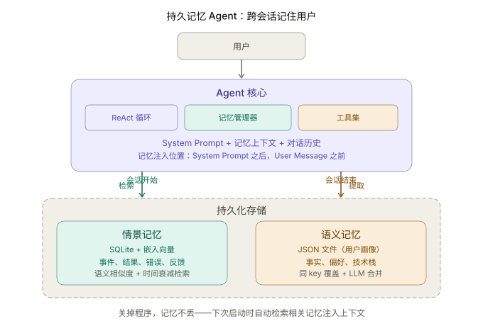
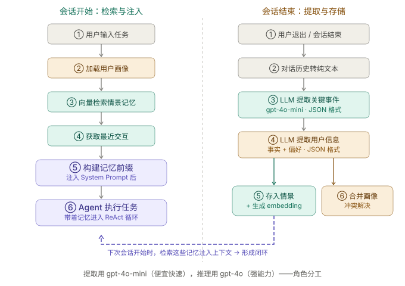

+++
title = "持久记忆实战：让 Agent 跨会话记住用户"
date = 2026-03-30T10:00:00+08:00
draft = false
author = "Hex4C59"
description = "用 Python 构建一个具备跨会话持久记忆的对话 Agent——通过情景记忆和语义记忆的分层设计，让 Agent 记住过去发生了什么、用户是谁、喜欢什么，真正实现「每次对话都比上次更懂你」。"
summary = "前面所有实战教程的 Agent 一关就忘。这篇构建一个带持久记忆的 Agent：会话结束时自动提取关键事件存入情景记忆，从交互中累积用户画像存入语义记忆，下次启动时检索注入——让 Agent 跨会话保持连续性。"
tags = ["Agent", "Memory", "Persistent Memory", "Episodic Memory", "Semantic Memory"]
categories = ["Agent"]
series = ["agent-engineering"]
series_order = 23
difficulty = "intermediate"
article_type = "tutorial"
topics = ["memory", "persistent-memory", "episodic-memory", "semantic-memory", "user-modeling"]
frameworks = ["OpenAI"]
ShowToc = true
+++

前面六篇实战教程——[Coding Agent](/agent/build-cli-coding-agent/)、[Research Agent](/agent/build-research-agent/)、[文件管理 Agent](/agent/build-file-management-agent/)、[代码审查](/agent/build-multi-agent-code-review/)、[MCP 集成](/agent/build-mcp-agent/)、[Skill 专家 Agent](/agent/build-skill-expert-agent/)——有一个共同的缺陷：**一关就忘。**

你告诉 Agent 你喜欢简洁的回答，下次对话它又回到了冗长模式。你上周让它帮你修了一个 bug 的解决方案，这周遇到类似问题它从零开始分析。你花了三轮对话教它你项目的目录结构，关掉终端一切归零。

[记忆那篇概念文章](/agent/memory-types-and-design/) 把这个问题拆清楚了——Agent 需要四种记忆，但前面的教程只实现了第一种（短期记忆，即 context window）。情景记忆、语义记忆、程序记忆全部缺失。

这篇文章补上最关键的两块：**情景记忆**（发生过什么）和**语义记忆**（用户是谁）。构建一个真正能跨会话记住你的 Agent。

---

## 先给结论

1. **持久记忆的核心不是存储，是提取。** 对话里 90% 的内容不值得记住——关键是用 LLM 从每次交互中提取值得长期保留的信息，扔掉噪音。
2. **情景记忆和语义记忆解决不同的问题。** 情景记忆回答「上次发生了什么」，语义记忆回答「用户是谁」。前者是事件列表，后者是用户画像。它们的写入时机、检索策略、更新方式完全不同。
3. **记忆注入的位置很重要。** 检索回来的记忆放在 System Prompt 和用户消息之间，作为「背景知识」存在——不是指令，不是约束，是 Agent 的「已知信息」。
4. **语义记忆必须支持冲突解决。** 用户上个月说「我用 Python 3.9」，这个月说「我升级到 3.12 了」——如果语义记忆只增不改，Agent 会拿到矛盾信息。需要 LLM 驱动的合并策略。
5. **不是每次对话都值得写入记忆。** 「今天天气怎么样」不需要记住，「我的项目从 Flask 迁移到 FastAPI 了」需要。写入决策本身需要智能判断。

---

## 整体架构



*图 1：Agent 在会话开始时从记忆存储中检索相关信息注入上下文，在会话结束时从对话中提取关键事件和用户信息写入记忆。情景记忆用向量数据库存储，语义记忆用结构化 JSON 存储。*

---

## 项目结构

```
memory-agent/
├── agent/
│   ├── __init__.py
│   ├── core.py              # ReAct 循环
│   ├── memory_manager.py    # 记忆管理（提取、存储、检索）
│   ├── memory_store.py      # 存储后端（SQLite + 向量搜索）
│   └── prompts.py           # System prompt
├── data/                     # 持久化数据目录
│   ├── episodes.db           # 情景记忆（SQLite）
│   └── user_profiles/        # 语义记忆（JSON 文件）
├── main.py
└── requirements.txt
```

和前面教程的核心区别：多了 `memory_manager.py`（记忆的提取与检索逻辑）和 `memory_store.py`（持久化后端）。`data/` 目录是 Agent 的「长期记忆」所在——关掉程序，数据不会丢。

---

## 第一步：记忆存储后端

先解决最基础的问题：怎么把记忆存下来、读出来。

用 SQLite 做底层存储——不需要额外安装数据库，一个文件就是整个记忆库。情景记忆存成带嵌入向量的记录（支持语义搜索），语义记忆存成结构化 JSON（支持精确读写）。

```python
# agent/memory_store.py
import json
import sqlite3
import hashlib
from pathlib import Path
from datetime import datetime
from dataclasses import dataclass, field

import openai

client = openai.OpenAI()


@dataclass
class Episode:
    """一条情景记忆：某次交互中发生的一个关键事件。"""
    id: str
    summary: str            # 事件摘要
    category: str           # 分类：task_result, user_feedback, error, discovery
    importance: int          # 重要性：1-5
    timestamp: str           # ISO 格式时间戳
    session_id: str          # 来源会话 ID
    embedding: list[float] = field(default_factory=list)


@dataclass
class UserProfile:
    """用户的语义记忆：关于用户的持久化认知模型。"""
    user_id: str
    facts: list[dict] = field(default_factory=list)
    # 每个 fact: {"key": "编程语言", "value": "Python 3.12", "confidence": 0.9, "updated_at": "..."}
    preferences: list[dict] = field(default_factory=list)
    # 每个 preference: {"key": "回答风格", "value": "简洁直接", "updated_at": "..."}
    last_updated: str = ""


class MemoryStore:
    """
    持久化记忆存储。
    情景记忆：SQLite + 嵌入向量（余弦相似度检索）。
    语义记忆：JSON 文件（按用户 ID 分文件存储）。
    """

    def __init__(self, data_dir: str = "data"):
        self.data_dir = Path(data_dir)
        self.data_dir.mkdir(parents=True, exist_ok=True)
        self.profiles_dir = self.data_dir / "user_profiles"
        self.profiles_dir.mkdir(exist_ok=True)

        # 初始化 SQLite
        self.db_path = self.data_dir / "episodes.db"
        self._init_db()

    def _init_db(self):
        """创建情景记忆表。"""
        conn = sqlite3.connect(self.db_path)
        conn.execute("""
            CREATE TABLE IF NOT EXISTS episodes (
                id TEXT PRIMARY KEY,
                summary TEXT NOT NULL,
                category TEXT NOT NULL,
                importance INTEGER NOT NULL,
                timestamp TEXT NOT NULL,
                session_id TEXT NOT NULL,
                embedding TEXT  -- JSON 序列化的向量
            )
        """)
        conn.commit()
        conn.close()

    # ===== 情景记忆 =====

    def save_episode(self, episode: Episode):
        """写入一条情景记忆。"""
        conn = sqlite3.connect(self.db_path)
        conn.execute(
            """INSERT OR REPLACE INTO episodes
               (id, summary, category, importance, timestamp, session_id, embedding)
               VALUES (?, ?, ?, ?, ?, ?, ?)""",
            (
                episode.id,
                episode.summary,
                episode.category,
                episode.importance,
                episode.timestamp,
                episode.session_id,
                json.dumps(episode.embedding),
            ),
        )
        conn.commit()
        conn.close()

    def search_episodes(
        self, query: str, top_k: int = 5, min_importance: int = 1
    ) -> list[Episode]:
        """
        检索情景记忆：语义相似度 + 时间衰减 + 重要性加权。
        这是情景记忆最核心的方法——检索质量直接决定记忆质量。
        """
        # 1. 生成查询向量
        query_embedding = self._get_embedding(query)

        # 2. 从数据库取出所有候选
        conn = sqlite3.connect(self.db_path)
        rows = conn.execute(
            "SELECT * FROM episodes WHERE importance >= ? ORDER BY timestamp DESC",
            (min_importance,),
        ).fetchall()
        conn.close()

        if not rows:
            return []

        # 3. 计算混合得分：语义相似度 × 0.6 + 时间衰减 × 0.2 + 重要性 × 0.2
        scored = []
        now = datetime.now()

        for row in rows:
            ep = Episode(
                id=row[0],
                summary=row[1],
                category=row[2],
                importance=row[3],
                timestamp=row[4],
                session_id=row[5],
                embedding=json.loads(row[6]) if row[6] else [],
            )

            # 语义相似度（余弦）
            if ep.embedding and query_embedding:
                similarity = self._cosine_similarity(query_embedding, ep.embedding)
            else:
                similarity = 0.0

            # 时间衰减：越近的事件得分越高
            try:
                ep_time = datetime.fromisoformat(ep.timestamp)
                days_ago = (now - ep_time).days
                recency = max(0, 1 - days_ago / 30)  # 30 天内线性衰减
            except (ValueError, TypeError):
                recency = 0.5

            # 重要性归一化到 0-1
            importance_score = ep.importance / 5.0

            # 混合得分
            score = similarity * 0.6 + recency * 0.2 + importance_score * 0.2
            scored.append((ep, score))

        scored.sort(key=lambda x: x[1], reverse=True)
        return [ep for ep, _ in scored[:top_k]]

    def get_recent_episodes(self, limit: int = 10) -> list[Episode]:
        """获取最近的 N 条情景记忆（不做语义检索，纯按时间排序）。"""
        conn = sqlite3.connect(self.db_path)
        rows = conn.execute(
            "SELECT * FROM episodes ORDER BY timestamp DESC LIMIT ?",
            (limit,),
        ).fetchall()
        conn.close()

        return [
            Episode(
                id=row[0], summary=row[1], category=row[2],
                importance=row[3], timestamp=row[4], session_id=row[5],
                embedding=json.loads(row[6]) if row[6] else [],
            )
            for row in rows
        ]

    # ===== 语义记忆 =====

    def load_user_profile(self, user_id: str) -> UserProfile:
        """加载用户画像。不存在则返回空画像。"""
        path = self.profiles_dir / f"{user_id}.json"
        if path.exists():
            data = json.loads(path.read_text(encoding="utf-8"))
            return UserProfile(**data)
        return UserProfile(user_id=user_id)

    def save_user_profile(self, profile: UserProfile):
        """持久化用户画像。"""
        profile.last_updated = datetime.now().isoformat()
        path = self.profiles_dir / f"{profile.user_id}.json"
        path.write_text(
            json.dumps(
                {
                    "user_id": profile.user_id,
                    "facts": profile.facts,
                    "preferences": profile.preferences,
                    "last_updated": profile.last_updated,
                },
                ensure_ascii=False,
                indent=2,
            ),
            encoding="utf-8",
        )

    # ===== 工具方法 =====

    def _get_embedding(self, text: str) -> list[float]:
        """调用 OpenAI embedding API 生成文本向量。"""
        try:
            response = client.embeddings.create(
                model="text-embedding-3-small",
                input=text,
            )
            return response.data[0].embedding
        except Exception as e:
            print(f"  ⚠️ Embedding 生成失败: {e}")
            return []

    @staticmethod
    def _cosine_similarity(a: list[float], b: list[float]) -> float:
        """计算两个向量的余弦相似度。"""
        if len(a) != len(b):
            return 0.0
        dot = sum(x * y for x, y in zip(a, b))
        norm_a = sum(x * x for x in a) ** 0.5
        norm_b = sum(x * x for x in b) ** 0.5
        if norm_a == 0 or norm_b == 0:
            return 0.0
        return dot / (norm_a * norm_b)
```

这段代码有几个值得说明的设计决策：

**为什么用 SQLite 而不是专门的向量数据库？** 对于记忆量在几万条以内的场景，SQLite + 暴力余弦相似度已经足够快。引入 Chroma 或 Pinecone 会增加依赖复杂度，但对于个人 Agent 来说收益不大。如果你的 Agent 面向企业级场景、记忆量达到几十万条，换向量数据库。

**为什么语义记忆用 JSON 文件而不是也放 SQLite？** 因为语义记忆的访问模式是「读取整个用户画像、更新、写回」，不是按条件查询。JSON 文件简单直观，调试时一眼能看到存了什么。

**检索得分的 0.6/0.2/0.2 权重从哪来？** 是经验值。语义相似度权重最高，因为「和当前任务相关」是最重要的维度。时间衰减和重要性各占 20%，防止纯语义检索忽略了时间因素。你可以根据场景调整。

---

## 第二步：记忆管理器

记忆管理器是整个系统的大脑——它决定什么值得记住、怎么提取、怎么检索、怎么注入。

```python
# agent/memory_manager.py
import json
import hashlib
from datetime import datetime

import openai

from agent.memory_store import MemoryStore, Episode, UserProfile

client = openai.AsyncOpenAI()


class MemoryManager:
    """
    记忆管理器——连接 Agent 核心和记忆存储。
    负责：会话开始时检索记忆 → 会话结束时提取并存储记忆。
    """

    def __init__(self, store: MemoryStore, user_id: str = "default"):
        self.store = store
        self.user_id = user_id
        self.session_id = datetime.now().strftime("%Y%m%d_%H%M%S")

    # ===== 会话开始：检索记忆，构建上下文 =====

    async def build_memory_context(self, user_message: str) -> str:
        """
        会话开始时调用。根据用户的输入检索相关记忆，
        构建要注入 context 的「记忆前缀」。
        """
        parts = []

        # 1. 加载用户画像（语义记忆）
        profile = self.store.load_user_profile(self.user_id)
        profile_context = self._format_profile(profile)
        if profile_context:
            parts.append(profile_context)

        # 2. 检索相关情景记忆
        relevant_episodes = self.store.search_episodes(
            query=user_message, top_k=5, min_importance=2
        )
        if relevant_episodes:
            parts.append(self._format_episodes(relevant_episodes))

        # 3. 获取最近的交互（即使语义不相关，最近的事也有价值）
        recent = self.store.get_recent_episodes(limit=3)
        # 去重：已经在 relevant_episodes 里的不重复加
        recent_ids = {ep.id for ep in relevant_episodes}
        recent_new = [ep for ep in recent if ep.id not in recent_ids]
        if recent_new:
            parts.append(self._format_recent(recent_new))

        if not parts:
            return ""

        return "# 你已知的背景信息（来自历史交互记忆）\n\n" + "\n\n".join(parts)

    def _format_profile(self, profile: UserProfile) -> str:
        """把用户画像格式化为可注入上下文的文本。"""
        if not profile.facts and not profile.preferences:
            return ""

        lines = ["## 关于用户"]

        if profile.facts:
            lines.append("**已知信息：**")
            for fact in profile.facts:
                lines.append(f"- {fact['key']}：{fact['value']}")

        if profile.preferences:
            lines.append("**偏好设置：**")
            for pref in profile.preferences:
                lines.append(f"- {pref['key']}：{pref['value']}")

        return "\n".join(lines)

    def _format_episodes(self, episodes: list[Episode]) -> str:
        """把情景记忆格式化为上下文文本。"""
        lines = ["## 相关的历史经历"]
        for ep in episodes:
            lines.append(f"- [{ep.category}] {ep.summary}（{ep.timestamp[:10]}）")
        return "\n".join(lines)

    def _format_recent(self, episodes: list[Episode]) -> str:
        """格式化最近的交互记录。"""
        lines = ["## 最近的交互"]
        for ep in episodes:
            lines.append(f"- {ep.summary}（{ep.timestamp[:10]}）")
        return "\n".join(lines)

    # ===== 会话结束：提取记忆，持久化 =====

    async def extract_and_save(self, conversation: list[dict]):
        """
        会话结束时调用。用 LLM 从对话中提取值得记住的信息，
        分别存入情景记忆和语义记忆。

        这是整个记忆系统最关键的方法——提取质量决定记忆质量。
        """
        if len(conversation) < 4:
            # 太短的对话（不到 2 轮）通常不值得提取
            return

        # 准备对话摘要（不传完整对话，避免 token 浪费）
        conversation_text = self._conversation_to_text(conversation)

        # 并行提取情景和语义记忆
        print("\n💾 提取记忆...")

        episodes = await self._extract_episodes(conversation_text)
        profile_updates = await self._extract_profile_updates(conversation_text)

        # 存储情景记忆
        if episodes:
            for ep_data in episodes:
                episode = Episode(
                    id=hashlib.md5(
                        f"{self.session_id}:{ep_data['summary']}".encode()
                    ).hexdigest(),
                    summary=ep_data["summary"],
                    category=ep_data.get("category", "general"),
                    importance=ep_data.get("importance", 3),
                    timestamp=datetime.now().isoformat(),
                    session_id=self.session_id,
                    embedding=self.store._get_embedding(ep_data["summary"]),
                )
                self.store.save_episode(episode)
            print(f"  ✓ 存入 {len(episodes)} 条情景记忆")

        # 更新语义记忆
        if profile_updates:
            await self._merge_profile_updates(profile_updates)
            print(f"  ✓ 更新了用户画像")

        if not episodes and not profile_updates:
            print("  - 未发现值得记忆的新信息")

    async def _extract_episodes(self, conversation_text: str) -> list[dict]:
        """
        用 LLM 从对话中提取关键事件。

        重点：不是所有对话内容都值得记住。
        Agent 需要判断什么是「下次可能用到的信息」。
        """
        response = await client.chat.completions.create(
            model="gpt-4o-mini",  # 提取用便宜模型就够
            response_format={"type": "json_object"},
            messages=[
                {
                    "role": "system",
                    "content": """你是一个记忆提取器。分析对话内容，提取值得长期记住的关键事件。

只提取以下类型的事件：
- task_result：任务的最终结果或结论
- user_feedback：用户对 Agent 行为的反馈（满意/不满意/纠正）
- error：遇到的重要错误和解决方案
- discovery：发现的重要事实（项目结构、技术选型等）

不要提取：
- 日常寒暄
- Agent 的中间推理步骤
- 没有结论的探索性操作

以 JSON 返回：
{
  "episodes": [
    {
      "summary": "一句话描述发生了什么",
      "category": "task_result | user_feedback | error | discovery",
      "importance": 1到5的整数
    }
  ]
}

如果对话中没有值得记住的事件，返回 {"episodes": []}。""",
                },
                {
                    "role": "user",
                    "content": f"对话内容：\n{conversation_text}",
                },
            ],
        )

        try:
            result = json.loads(response.choices[0].message.content)
            return result.get("episodes", [])
        except (json.JSONDecodeError, KeyError):
            return []

    async def _extract_profile_updates(self, conversation_text: str) -> dict | None:
        """
        用 LLM 从对话中提取关于用户的新信息。

        这个方法只负责提取，不负责合并——
        合并（冲突解决）由 _merge_profile_updates 处理。
        """
        response = await client.chat.completions.create(
            model="gpt-4o-mini",
            response_format={"type": "json_object"},
            messages=[
                {
                    "role": "system",
                    "content": """你是一个用户建模助手。分析对话内容，提取关于**用户**的新信息。

提取两类信息：
1. facts（客观事实）：用户的技术栈、项目信息、角色、工作环境等
2. preferences（主观偏好）：回答风格偏好、工具偏好、习惯等

注意：
- 只提取**明确表达**的信息，不要推测
- 只提取**关于用户**的信息，不是关于任务的
- 如果用户纠正了 Agent 的行为，推断出对应的偏好

以 JSON 返回：
{
  "facts": [
    {"key": "类别名", "value": "具体信息"}
  ],
  "preferences": [
    {"key": "类别名", "value": "具体偏好"}
  ]
}

如果没有发现用户信息，返回 {"facts": [], "preferences": []}。""",
                },
                {
                    "role": "user",
                    "content": f"对话内容：\n{conversation_text}",
                },
            ],
        )

        try:
            result = json.loads(response.choices[0].message.content)
            if result.get("facts") or result.get("preferences"):
                return result
            return None
        except (json.JSONDecodeError, KeyError):
            return None

    async def _merge_profile_updates(self, updates: dict):
        """
        把新提取的用户信息合并进现有画像。
        核心挑战：冲突解决。

        用户上个月说「我用 Python 3.9」，这个月说「我升级到 3.12 了」。
        简单追加会导致矛盾——需要 LLM 判断哪个信息更新、更准确。
        """
        profile = self.store.load_user_profile(self.user_id)
        now = datetime.now().isoformat()

        # 处理 facts
        for new_fact in updates.get("facts", []):
            merged = False
            for i, existing in enumerate(profile.facts):
                if existing["key"].lower() == new_fact["key"].lower():
                    # 同一个 key，用新值覆盖旧值
                    profile.facts[i] = {
                        "key": new_fact["key"],
                        "value": new_fact["value"],
                        "confidence": 0.9,
                        "updated_at": now,
                    }
                    merged = True
                    break
            if not merged:
                profile.facts.append({
                    "key": new_fact["key"],
                    "value": new_fact["value"],
                    "confidence": 0.9,
                    "updated_at": now,
                })

        # 处理 preferences
        for new_pref in updates.get("preferences", []):
            merged = False
            for i, existing in enumerate(profile.preferences):
                if existing["key"].lower() == new_pref["key"].lower():
                    profile.preferences[i] = {
                        "key": new_pref["key"],
                        "value": new_pref["value"],
                        "updated_at": now,
                    }
                    merged = True
                    break
            if not merged:
                profile.preferences.append({
                    "key": new_pref["key"],
                    "value": new_pref["value"],
                    "updated_at": now,
                })

        self.store.save_user_profile(profile)

    def _conversation_to_text(self, conversation: list[dict]) -> str:
        """
        把对话历史转换为纯文本，供 LLM 分析。
        只保留 user 和 assistant 消息，跳过 system 和 tool 消息。
        同时截断过长的消息，控制总 token 量。
        """
        lines = []
        for msg in conversation:
            role = msg.get("role", "")
            content = msg.get("content", "")
            if role in ("user", "assistant") and content:
                # 截断单条消息，避免工具结果占太多空间
                if len(content) > 500:
                    content = content[:500] + "..."
                prefix = "用户" if role == "user" else "助手"
                lines.append(f"[{prefix}] {content}")
        return "\n\n".join(lines[-20:])  # 最多保留最近 20 条
```



*图 2：记忆系统的完整数据流。会话开始时：加载用户画像 + 检索相关情景 → 构建记忆前缀注入上下文。会话结束时：LLM 提取关键事件 → 存入情景记忆；LLM 提取用户信息 → 合并入语义记忆。两个方向形成闭环。*

这段代码的核心是 `_extract_episodes` 和 `_extract_profile_updates`——它们的 prompt 设计决定了 Agent 能记住什么、忘掉什么。

几个关键的 prompt 设计决策：

**显式列出「不要提取」的内容。** 如果不告诉 LLM 什么不值得记，它会把每一步操作都提取出来，导致记忆库充满噪音。

**用 `gpt-4o-mini` 做提取。** 记忆提取不需要强推理能力，快速和低成本更重要。提取结果的质量主要靠 prompt 控制，不靠模型。

**情景记忆带 `importance` 评分。** 不是所有事件都同等重要。检索时可以过滤低重要性的记忆，提高检索精度。

---

## 第三步：构建 ReAct 循环

ReAct 循环和前面教程几乎一样，唯一的区别是加了记忆的注入和提取：

```python
# agent/core.py
import json
import openai
from agent.memory_manager import MemoryManager

client = openai.AsyncOpenAI()
MODEL = "gpt-4o"
MAX_ITERATIONS = 15

SYSTEM_PROMPT = """你是一个智能助手，能够记住跨会话的交互历史。

## 关于记忆
你可能会在上下文中看到「你已知的背景信息」章节——这些是你从之前的对话中记住的内容。
请自然地利用这些信息：
- 如果你知道用户的偏好，默认遵循
- 如果你记得之前解决过类似问题，参考上次的方案
- 如果用户提到了你应该知道的事情（你之前记过），不要假装不知道

## 重要原则
- 不要主动"展示"你的记忆（不要说"根据我的记忆..."），自然地使用它
- 如果记忆中的信息和用户当前说的矛盾，以用户当前说的为准
- 记忆可能不完整或有遗漏，这是正常的

## 工具使用
你有文件读写和命令执行的能力。先了解情况，再行动。
"""

TOOL_SCHEMAS = [
    {
        "type": "function",
        "function": {
            "name": "read_file",
            "description": "读取文件内容。",
            "parameters": {
                "type": "object",
                "properties": {
                    "path": {"type": "string", "description": "文件路径"}
                },
                "required": ["path"],
            },
        },
    },
    {
        "type": "function",
        "function": {
            "name": "write_file",
            "description": "写入文件内容。",
            "parameters": {
                "type": "object",
                "properties": {
                    "path": {"type": "string", "description": "文件路径"},
                    "content": {"type": "string", "description": "文件内容"},
                },
                "required": ["path", "content"],
            },
        },
    },
    {
        "type": "function",
        "function": {
            "name": "run_command",
            "description": "执行 shell 命令。",
            "parameters": {
                "type": "object",
                "properties": {
                    "command": {"type": "string", "description": "命令"}
                },
                "required": ["command"],
            },
        },
    },
]


def _read_file(path: str) -> dict:
    try:
        with open(path, encoding="utf-8") as f:
            return {"success": True, "content": f.read()}
    except Exception as e:
        return {"success": False, "error": str(e)}


def _write_file(path: str, content: str) -> dict:
    try:
        from pathlib import Path
        Path(path).parent.mkdir(parents=True, exist_ok=True)
        with open(path, "w", encoding="utf-8") as f:
            f.write(content)
        return {"success": True, "bytes": len(content.encode())}
    except Exception as e:
        return {"success": False, "error": str(e)}


def _run_command(command: str) -> dict:
    import subprocess
    try:
        result = subprocess.run(
            command, shell=True, capture_output=True, text=True, timeout=30
        )
        return {
            "success": result.returncode == 0,
            "stdout": result.stdout[:2000],
            "stderr": result.stderr[:500],
        }
    except Exception as e:
        return {"success": False, "error": str(e)}


TOOL_REGISTRY = {
    "read_file": _read_file,
    "write_file": _write_file,
    "run_command": _run_command,
}


async def run_agent(
    user_message: str,
    memory: MemoryManager,
    conversation_history: list[dict],
):
    """
    运行带持久记忆的 Agent。

    和前面教程的 ReAct 循环只有两处区别（用注释标出）：
    1. 会话开始时注入记忆上下文
    2. 工具列表没有变——记忆是透明的，Agent 通过 context 感知它
    """
    conversation_history.append({"role": "user", "content": user_message})

    # 区别 1：检索记忆并构建上下文
    memory_context = await memory.build_memory_context(user_message)

    # 组装 system 消息
    system_messages = [{"role": "system", "content": SYSTEM_PROMPT}]
    if memory_context:
        system_messages.append({"role": "system", "content": memory_context})
        print(f"🧠 已注入记忆上下文（{len(memory_context)} 字符）")

    for iteration in range(MAX_ITERATIONS):
        print(f"\n[第 {iteration + 1} 轮]")

        messages = system_messages + conversation_history[-30:]

        response = await client.chat.completions.create(
            model=MODEL,
            messages=messages,
            tools=TOOL_SCHEMAS,
        )

        choice = response.choices[0]
        message = choice.message

        assistant_msg = {"role": "assistant", "content": message.content}
        if message.tool_calls:
            assistant_msg["tool_calls"] = [
                {
                    "id": tc.id,
                    "type": "function",
                    "function": {
                        "name": tc.function.name,
                        "arguments": tc.function.arguments,
                    },
                }
                for tc in message.tool_calls
            ]
        conversation_history.append(assistant_msg)

        if message.content:
            print(f"\n{message.content}")

        if choice.finish_reason == "stop":
            print("\n[✓ 任务完成]")
            break

        if choice.finish_reason == "tool_calls":
            for tc in message.tool_calls:
                tool_name = tc.function.name
                tool_args = json.loads(tc.function.arguments)

                print(f"  [工具] {tool_name}({json.dumps(tool_args, ensure_ascii=False)[:100]})")

                result = TOOL_REGISTRY[tool_name](**tool_args)
                result_str = json.dumps(result, ensure_ascii=False)
                if len(result_str) > 3000:
                    result_str = result_str[:3000] + "\n[截断]"

                print(f"  [结果] {result_str[:200]}")

                conversation_history.append({
                    "role": "tool",
                    "tool_call_id": tc.id,
                    "content": result_str,
                })
```

注意 System Prompt 里有一条微妙的指导：**「不要主动展示你的记忆」**。

如果不加这条，Agent 在每次对话开头都会说「根据我之前的记忆，你是一个 Python 开发者...」——这感觉很机械。好的记忆应该是透明的：Agent 自然地遵循你的偏好，不需要告诉你它记住了什么。

---

## 第四步：入口与会话管理

```python
# main.py
import asyncio
from agent.core import run_agent
from agent.memory_manager import MemoryManager
from agent.memory_store import MemoryStore


async def main():
    # 1. 初始化记忆系统
    store = MemoryStore(data_dir="data")
    memory = MemoryManager(store=store, user_id="hex4c59")

    print("🧠 持久记忆 Agent")
    print("=" * 50)

    # 显示已有记忆概况
    profile = store.load_user_profile("hex4c59")
    recent = store.get_recent_episodes(limit=5)

    if profile.facts or profile.preferences:
        print(f"📋 已知用户信息：{len(profile.facts)} 条事实，{len(profile.preferences)} 条偏好")
    if recent:
        print(f"📖 最近记忆：{len(recent)} 条")
        for ep in recent[:3]:
            print(f"   - {ep.summary[:60]}")

    print("\n输入任务开始对话。/memory 查看记忆，/forget 清空，/exit 退出。")
    print("=" * 50)

    conversation_history = []

    while True:
        try:
            user_input = input("\n> ").strip()
        except (KeyboardInterrupt, EOFError):
            break

        if not user_input:
            continue
        if user_input == "/exit":
            break

        if user_input == "/memory":
            _show_memory(store, "hex4c59")
            continue

        if user_input == "/forget":
            print("⚠️  清空所有记忆？(y/n)")
            confirm = input("> ").strip()
            if confirm.lower() == "y":
                import shutil
                shutil.rmtree("data", ignore_errors=True)
                store = MemoryStore(data_dir="data")
                memory = MemoryManager(store=store, user_id="hex4c59")
                print("✓ 记忆已清空")
            continue

        await run_agent(user_input, memory, conversation_history)

    # 会话结束时提取记忆
    if conversation_history:
        await memory.extract_and_save(conversation_history)

    print("\n再见！")


def _show_memory(store: MemoryStore, user_id: str):
    """展示当前记忆库内容。"""
    print("\n--- 语义记忆（用户画像）---")
    profile = store.load_user_profile(user_id)
    if profile.facts:
        for f in profile.facts:
            print(f"  [{f['key']}] {f['value']}")
    else:
        print("  （空）")

    if profile.preferences:
        print("\n  偏好：")
        for p in profile.preferences:
            print(f"  [{p['key']}] {p['value']}")

    print("\n--- 情景记忆（最近 10 条）---")
    episodes = store.get_recent_episodes(limit=10)
    if episodes:
        for ep in episodes:
            print(f"  [{ep.category}] ★{ep.importance} {ep.summary} ({ep.timestamp[:10]})")
    else:
        print("  （空）")
    print()


if __name__ == "__main__":
    asyncio.run(main())
```

关键设计：**记忆提取发生在会话结束时**（`await memory.extract_and_save(conversation_history)`），不是每轮对话后。原因是：

1. 每轮都提取会大幅增加 API 调用次数和延迟
2. 很多中间轮次的内容在最终结论出来后就不值得记了（比如几次失败的尝试，只有最终成功的方案值得记）
3. 会话结束时 LLM 能看到完整的对话上下文，提取质量更高

---

## 一次完整的执行过程

### 第一次会话（Agent 还没有任何记忆）

```text
🧠 持久记忆 Agent
==================================================
输入任务开始对话。/memory 查看记忆，/forget 清空，/exit 退出。

> 我是后端开发者，主要用 Python 3.12 和 FastAPI。帮我写一个简单的健康检查接口

[第 1 轮]
好的，我来创建一个 FastAPI 健康检查接口。

  [工具] write_file({"path": "main.py", "content": "from fastapi import Fast..."})
  [结果] {"success": true, "bytes": 289}

[第 2 轮]
已创建 main.py，包含：
- GET /health 接口，返回状态和时间戳
- 使用 Python 3.12 的新特性（type 语句）

运行方式：uvicorn main:app --reload

[✓ 任务完成]

> /exit

💾 提取记忆...
  ✓ 存入 1 条情景记忆
  ✓ 更新了用户画像
```

用 `/memory` 看看存了什么：

```text
--- 语义记忆（用户画像）---
  [职业] 后端开发者
  [编程语言] Python 3.12
  [Web 框架] FastAPI

--- 情景记忆（最近 10 条）---
  [task_result] ★3 创建了 FastAPI 健康检查接口 (2026-03-30)
```

### 第二次会话（Agent 已经记住了用户信息）

```text
🧠 持久记忆 Agent
==================================================
📋 已知用户信息：3 条事实，0 条偏好
📖 最近记忆：1 条
   - 创建了 FastAPI 健康检查接口

> 帮我给这个项目加个数据库连接

🧠 已注入记忆上下文（186 字符）

[第 1 轮]
  [工具] read_file({"path": "main.py"})
  [结果] {"success": true, "content": "from fastapi import Fast..."}

[第 2 轮]
让我来给你的 FastAPI 项目加上 SQLAlchemy 异步数据库连接。

  [工具] write_file({"path": "database.py", "content": "from sqlalchemy.ext.asyncio..."})
  [工具] write_file({"path": "main.py", "content": "..."})

[第 3 轮]
已添加：
- database.py：异步 SQLAlchemy 引擎和会话管理
- 更新 main.py：添加启动时创建表、关闭时断开连接
- 使用 asyncpg 作为 PostgreSQL 异步驱动（符合你的 async FastAPI 风格）

[✓ 任务完成]
```

注意 Agent **没有问用户用什么框架**——它从记忆中知道用户用 FastAPI，直接用了对应的异步模式。这就是持久记忆的价值：减少重复沟通，提高交互效率。

---

## 记忆的维护策略

记忆不是存下来就完事了。和人类一样，Agent 的记忆也需要维护——过时的信息要更新，无关的信息要清理。

### 冲突解决

当前实现用「同 key 覆盖」策略：用户说「我升级到 Python 3.12 了」会覆盖之前的「Python 3.9」。

对于简单的事实类信息，这已经够用。但对于更复杂的场景（比如用户的偏好在不同项目间不同），可以引入 LLM 驱动的合并：

```python
async def smart_merge(existing_profile: str, new_observations: str) -> str:
    """
    用 LLM 做智能合并——不只是覆盖，而是理解上下文。

    例：
    - 旧：「偏好 Python」
    - 新：「这个项目用 Go」
    - 合并：「主要用 Python，也会用 Go」（补充，不覆盖）

    例：
    - 旧：「Python 3.9」
    - 新：「升级到 Python 3.12」
    - 合并：「Python 3.12」（更新，覆盖旧值）
    """
    response = await client.chat.completions.create(
        model="gpt-4o-mini",
        response_format={"type": "json_object"},
        messages=[{
            "role": "system",
            "content": """合并用户画像。规则：
1. 如果新信息更新了旧信息（如版本升级），用新值替换旧值
2. 如果新信息补充了旧信息（如新增技能），合并两者
3. 如果新旧矛盾且无法判断哪个更新，保留新值并标注不确定

返回合并后的完整画像 JSON。""",
        }, {
            "role": "user",
            "content": f"现有画像：\n{existing_profile}\n\n新观察：\n{new_observations}",
        }],
    )
    return response.choices[0].message.content
```

### 记忆容量管理

情景记忆会随时间积累。如果不做清理，几个月后检索性能会下降，噪音也会增多。

```python
def cleanup_old_episodes(store: MemoryStore, max_age_days: int = 90, keep_important: int = 3):
    """
    清理过旧的低重要性记忆。
    重要性 >= keep_important 的记忆永远保留。
    """
    import sqlite3
    from datetime import datetime, timedelta

    cutoff = (datetime.now() - timedelta(days=max_age_days)).isoformat()

    conn = sqlite3.connect(store.db_path)
    deleted = conn.execute(
        "DELETE FROM episodes WHERE timestamp < ? AND importance < ?",
        (cutoff, keep_important),
    ).rowcount
    conn.commit()
    conn.close()

    if deleted:
        print(f"🧹 清理了 {deleted} 条过期记忆")
```

高重要性的记忆（★4-5）永远保留——它们是 Agent 最有价值的长期知识。低重要性的记忆在 90 天后自动清除，保持记忆库的精简。

---

## 记忆系统的工程权衡

### 延迟预算

当前实现在会话开始时多了一次 embedding API 调用（检索用）和一次 SQLite 查询。在会话结束时多了两次 `gpt-4o-mini` 调用（提取情景 + 提取用户信息）和若干次 embedding 调用。

对于交互式 Agent，会话开始的延迟最敏感。embedding 生成约 200ms，SQLite 查询几毫秒——总额外延迟约 300ms，用户基本感知不到。会话结束的提取在后台异步执行，不影响体验。

### 存储成本

`text-embedding-3-small` 的向量维度是 1536，每条记忆的存储约 12KB（向量 + 元数据）。10000 条情景记忆约 120MB——对于个人 Agent 来说小得可以忽略。

### 什么时候不需要持久记忆

不是所有 Agent 都需要记忆。以下场景不需要持久记忆：

- **一次性任务 Agent**：用完即走，不需要跨会话
- **无状态服务 Agent**：每次请求独立，没有用户概念
- **隐私敏感场景**：用户不希望被记住

持久记忆最有价值的场景是：**和同一个用户反复交互的、面向个人的助手型 Agent**。

---

## 和其他方案的对比

| | 本文方案（SQLite + JSON） | 向量数据库（Chroma/Pinecone） | MCP Memory Server |
|---|---|---|---|
| 依赖复杂度 | 零额外依赖 | 需要安装向量数据库 | 需要 MCP 运行时 |
| 检索能力 | 够用（暴力余弦） | 强（ANN 索引） | 取决于具体实现 |
| 适用规模 | < 5 万条 | 不限 | 不限 |
| 部署方式 | 单文件 | 需要单独进程 | 需要 MCP Server 进程 |
| 最适合 | 个人 Agent、原型验证 | 企业级、大规模 | 已有 MCP 生态 |

Anthropic 官方的 [`server-memory`](https://github.com/modelcontextprotocol/servers) 通过 MCP 协议提供知识图谱式的记忆服务。如果你的 Agent 已经用了 [MCP 集成](/agent/build-mcp-agent/)，可以直接接入——不需要本文这样自己实现存储层。

但自己实现的好处是：**你完全控制了提取逻辑和检索策略**。MCP Memory Server 的记忆提取由 Server 端决定，你无法定制「什么值得记住」的判断标准。

---

## 常见问题与解决

### Agent 过度使用记忆

Agent 在每次回答里都引用记忆中的信息，哪怕完全不相关。

根本原因：注入的记忆上下文对 Agent 的注意力产生了过强的影响。

修复：在 System Prompt 里明确说「记忆是参考信息，只在相关时使用」。同时限制注入的记忆条数——当前实现最多注入 5 条相关情景 + 3 条最近情景，这个数量已经是一个平衡点。

### 记忆提取质量不高

LLM 提取的记忆要么太泛（「用户问了一个 Python 问题」），要么太细（把每一步操作都记下来了）。

修复：在提取 prompt 里加更多的正面和反面示例。比如：
```
好的提取：「用户的项目从 Flask 迁移到 FastAPI，数据库用 PostgreSQL」
差的提取：「用户发了一条消息」
差的提取：「Agent 调用了 read_file 工具读取了 main.py 文件」
```

### 语义记忆膨胀

经过几十次会话后，用户画像里积累了大量条目，其中很多是重复或细粒度过高的。

修复：定期（比如每 10 次会话）用 LLM 做一次画像「压缩」——把零散的条目归纳为更高层的描述：

```python
# 压缩前：
# [编程语言] Python 3.12
# [IDE] VS Code
# [终端] iTerm2
# [操作系统] macOS
# [包管理] uv

# 压缩后：
# [开发环境] macOS + VS Code + iTerm2，Python 3.12，使用 uv 管理包
```

---

## 总结

持久记忆改变的不是 Agent 的推理方式——ReAct 循环完全没变——它改变的是 **Agent 和用户的关系**。从「每次都是第一次见面的陌生人」变成「记得你是谁、知道你喜欢什么、了解你做过什么的助手」。

关键收获：

- **记忆的核心挑战是提取，不是存储。** 用 LLM 从对话中智能甄别什么值得记住。
- **情景记忆和语义记忆分开存储、分开检索。** 情景用向量搜索，语义用结构化读写。
- **记忆注入要透明。** Agent 自然地使用记忆，不要「展示」它知道什么。
- **记忆需要维护。** 过时的要更新，矛盾的要合并，无关的要清理。

从更大的视角看，这篇文章实现的是 [记忆概念篇](/agent/memory-types-and-design/) 里的情景记忆和语义记忆两层——四层记忆架构里最中间的两层。短期记忆（context window）在前面每篇教程里都有，程序记忆（Skill 文件）在 [上一篇](/agent/build-skill-expert-agent/) 里实现了。加上这篇，四层记忆就齐了。

---

*上一篇：[Skill 实战：教 Agent 写你风格的博客](/agent/build-skill-expert-agent/)*
