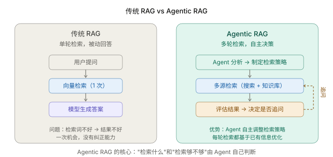
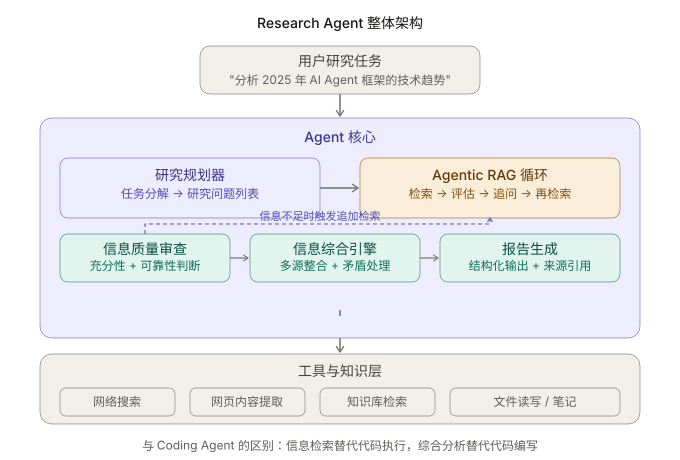
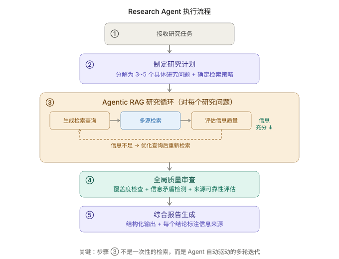

+++
title = "Research Agent 实战：从 RAG 到自主研究"
date = 2026-03-28T18:00:00+08:00
draft = false
author = "Hex4C59"
description = "从传统 RAG 的局限出发，用 Python 构建一个能自主制定检索策略、多轮迭代收集信息、评估信息质量并生成结构化研究报告的 Research Agent。"
summary = "不只是造一个 RAG 问答系统——这篇文章构建一个能自主研究的 Agent：研究规划、多轮 Agentic RAG 检索、信息质量审查、矛盾处理，以及带来源引用的结构化报告输出。"
tags = ["Agent", "RAG", "Research Agent", "Agentic RAG", "Tool Use", "ReAct"]
categories = ["Agent"]
series = ["agent-engineering"]
series_order = 17
difficulty = "advanced"
article_type = "tutorial"
topics = ["research-agent", "agentic-rag", "multi-step-retrieval", "information-synthesis", "tool-use"]
frameworks = ["OpenAI"]
ShowToc = true
+++

在 [什么是 RAG](/agent/what-is-rag/) 那篇文章的结尾，我说过要写一篇关于 Research Agent 的实战文章。这篇就是。

传统 RAG 解决的是"模型不知道某些知识"的问题——从知识库里检索相关内容，塞进上下文，让模型基于这些内容回答。这个流程有效，但它的检索是**被动的**：用户问什么，就检索什么，检索一次，回答一次。

Research Agent 要做的事情本质上不同。它不只是回答一个已知答案的问题，而是要**研究**一个可能没有现成答案的复杂主题。研究意味着：制定检索策略、从多个来源收集信息、发现信息里的矛盾和空白、追问补充细节、最终把碎片化的信息综合成一份有结构的报告。

这个过程中，"检索什么"和"检索结果够不够好"不再由开发者预设，而是由 Agent 自己判断——这就是 Agentic RAG。

---

## 先给结论

1. **传统 RAG 是被动的一次性检索，Agentic RAG 是 Agent 主动驱动的多轮迭代检索。** 区别在于"谁决定检索什么"和"谁判断结果够不够"——传统 RAG 里这些由代码硬编码，Agentic RAG 里由 Agent 自己判断。
2. **Research Agent 的核心不是检索能力，而是信息质量判断能力。** 能不能搜到东西不难，难的是搜到之后能不能判断这些信息是否足以支撑结论、是否来源可靠、是否存在矛盾。
3. **研究规划决定研究质量的上限。** 一个好的研究计划把模糊的任务拆解成具体的、可检索的研究问题，让后续的每一次检索都有明确目标，而不是漫无目的地搜索。
4. **信息综合比信息收集更难。** 从 5 个来源收集到 20 条信息碎片，要把它们组织成一份逻辑自洽、结论有据的报告，这需要矛盾检测、置信度判断和来源归属。
5. **来源引用不是可选的。** Research Agent 的输出如果不标注信息来源，用户就无法验证结论的可靠性。每一个关键事实都必须可追溯。

---

## 传统 RAG 的局限

在 [RAG 那篇文章](/agent/what-is-rag/) 里，我们已经建立了 RAG 的基本工作流程：切片 → 向量化 → 检索 → 增强生成。这个流程对"有明确答案的问题"效果很好：

```text
用户问：我们的退款政策是什么？
检索到：退款政策文档的相关片段
模型回答：根据公司政策，购买后 30 天内可申请全额退款...
```

但当任务变成"研究"时，传统 RAG 的三个局限就暴露了：

**局限一：检索策略是固定的。** 传统 RAG 用用户的原始问题直接做向量检索。但很多研究型问题的检索词和最终答案之间距离很远。用户问"2025 年 AI Agent 框架的技术趋势"，你不能直接用这句话去搜——你需要先搞清楚有哪些主流框架，然后逐一搜索它们的近期变化，再综合分析趋势。**检索策略本身需要规划。**

**局限二：一次检索不够。** 第一次检索的结果可能揭示你之前不知道的信息，这些信息会引发新的问题。比如你搜到"LangGraph 在 2025 年重写了状态管理"，这会引发追问："重写成了什么？和之前有什么区别？其他框架有类似的变化吗？" **研究是一个迭代过程，不是一次性查询。**

**局限三：没有信息质量判断。** 传统 RAG 把检索到的内容直接传给模型，不关心这些内容是否足够、是否可靠、是否存在矛盾。它假设"检索到就是对的"。但在研究场景中，**同一问题的不同来源可能给出矛盾的答案，需要 Agent 去判断和取舍。**



*图 1：传统 RAG 做一次检索就生成回答，无纠正能力；Agentic RAG 的 Agent 自主决定检索策略，根据结果质量决定是否追加检索。*

---

## 整体架构

Research Agent 由三层组成：用户任务层接收研究请求，Agent 核心层负责规划和执行研究过程，工具层提供检索和信息处理能力。



*图 2：Research Agent 的三层结构。与 [CLI Coding Agent](/agent/build-cli-coding-agent/) 的最大区别在于核心层——Coding Agent 的核心是 ReAct 循环驱动的代码修改，Research Agent 的核心是 Agentic RAG 驱动的信息研究。*

---

## 项目结构

```
research-agent/
├── agent/
│   ├── __init__.py
│   ├── core.py          # Agent 主循环
│   ├── planner.py       # 研究规划器
│   ├── researcher.py    # Agentic RAG 研究循环
│   ├── synthesizer.py   # 信息综合与报告生成
│   └── prompts.py       # 各模块的 System Prompt
├── tools/
│   ├── __init__.py
│   ├── search.py        # 网络搜索工具
│   ├── reader.py        # 网页内容提取工具
│   └── notes.py         # 研究笔记管理
├── requirements.txt
└── README.md
```

和 Coding Agent 一样，`core.py` 不依赖具体工具实现，`tools/` 不依赖 LLM。每一层可以独立替换。

---

## 第一步：定义工具集

Research Agent 的工具集和 Coding Agent 完全不同。它不需要读写代码文件和执行命令，它需要的是**从外部获取信息的能力**和**组织信息的能力**。

```python
# tools/search.py
import os
import json
import httpx


async def web_search(query: str, num_results: int = 5) -> dict:
    """
    执行网络搜索，返回结果列表。
    这里使用 Tavily API 作为搜索后端。
    你也可以替换为 SerpAPI、Brave Search 或 Google Custom Search。
    """
    api_key = os.environ.get("TAVILY_API_KEY")
    if not api_key:
        return {"success": False, "error": "TAVILY_API_KEY 未设置"}

    try:
        async with httpx.AsyncClient() as client:
            response = await client.post(
                "https://api.tavily.com/search",
                json={
                    "api_key": api_key,
                    "query": query,
                    "max_results": num_results,
                    "include_raw_content": False,
                    "search_depth": "advanced",
                },
                timeout=30,
            )
            data = response.json()

        results = []
        for item in data.get("results", []):
            results.append({
                "title": item.get("title", ""),
                "url": item.get("url", ""),
                "snippet": item.get("content", "")[:500],
                "score": item.get("score", 0),
            })

        return {
            "success": True,
            "query": query,
            "num_results": len(results),
            "results": results,
        }
    except Exception as e:
        return {"success": False, "error": str(e)}
```

```python
# tools/reader.py
import httpx
from html.parser import HTMLParser


class SimpleHTMLExtractor(HTMLParser):
    """从 HTML 中提取纯文本，跳过 script 和 style 标签。"""

    def __init__(self):
        super().__init__()
        self.text_parts = []
        self.skip = False

    def handle_starttag(self, tag, attrs):
        if tag in ("script", "style", "nav", "footer", "header"):
            self.skip = True

    def handle_endtag(self, tag):
        if tag in ("script", "style", "nav", "footer", "header"):
            self.skip = False

    def handle_data(self, data):
        if not self.skip:
            text = data.strip()
            if text:
                self.text_parts.append(text)

    def get_text(self) -> str:
        return "\n".join(self.text_parts)


async def read_webpage(url: str, max_length: int = 5000) -> dict:
    """
    提取网页的文本内容。
    max_length: 返回内容长度上限，防止注入过多上下文。
    """
    try:
        async with httpx.AsyncClient(follow_redirects=True) as client:
            response = await client.get(
                url,
                timeout=15,
                headers={"User-Agent": "ResearchAgent/1.0"}
            )
            response.raise_for_status()

        extractor = SimpleHTMLExtractor()
        extractor.feed(response.text)
        content = extractor.get_text()

        # 截断过长的内容
        if len(content) > max_length:
            content = content[:max_length] + f"\n\n[内容已截断，原始长度 {len(content)} 字符]"

        return {
            "success": True,
            "url": url,
            "content": content,
            "length": len(content),
        }
    except Exception as e:
        return {"success": False, "url": url, "error": str(e)}
```

```python
# tools/notes.py

class ResearchNotes:
    """
    研究笔记管理器：存储和组织 Agent 在研究过程中收集的信息。
    每条笔记包含内容、来源 URL 和置信度标注。
    """

    def __init__(self):
        self.notes: list[dict] = []

    def add_note(
        self,
        content: str,
        source_url: str,
        research_question: str,
        confidence: str = "medium"
    ) -> dict:
        """
        添加一条研究笔记。
        confidence: high / medium / low，表示信息的可靠程度。
        """
        note = {
            "id": len(self.notes) + 1,
            "content": content,
            "source_url": source_url,
            "research_question": research_question,
            "confidence": confidence,
        }
        self.notes.append(note)
        return {"success": True, "note_id": note["id"]}

    def get_notes(
        self,
        research_question: str | None = None
    ) -> dict:
        """获取笔记，可按研究问题过滤。"""
        if research_question:
            filtered = [
                n for n in self.notes
                if n["research_question"] == research_question
            ]
        else:
            filtered = self.notes

        return {
            "success": True,
            "count": len(filtered),
            "notes": filtered,
        }

    def get_all_sources(self) -> list[str]:
        """获取所有引用来源的去重列表。"""
        return list(set(n["source_url"] for n in self.notes))
```

工具的设计思路和 [工具接口设计那篇](/agent/tool-interface-design/) 里讲的原则一致：返回值要丰富（搜索结果包含 score、笔记包含 confidence），错误信息要可读。但与 Coding Agent 的工具有一个根本区别：**Research Agent 的工具全部是信息获取类的，没有不可逆的写操作**——这让安全模型简单得多，不需要像 [Guardrails 那篇](/agent/guardrails-safety-boundary/) 里讨论的多级权限确认。

---

## 第二步：研究规划器

研究的第一步不是开始搜索，而是**搞清楚要搜索什么**。

一个好的研究计划把模糊的任务拆解成 3-5 个具体的、可以通过检索回答的研究问题。这比直接用原始任务去搜索要有效得多，因为原始任务通常太宽泛、太模糊，没法直接作为检索查询。

```python
# agent/planner.py
import openai
import json

client = openai.OpenAI()


async def create_research_plan(task: str) -> dict:
    """
    将用户的研究任务分解为具体的研究问题和检索策略。
    """
    response = await client.chat.completions.create(
        model="gpt-4o",
        messages=[{
            "role": "system",
            "content": """你是一个研究规划专家。将用户的研究任务分解为可执行的研究计划。

规划原则：
- 每个研究问题必须具体到可以通过搜索回答
- 研究问题之间按逻辑依赖关系排序（先搜基础事实，再搜分析性问题）
- 3~5 个研究问题为宜，不要过于细碎
- 为每个问题给出 2~3 个推荐的检索查询词

输出 JSON 格式：
{
  "task_understanding": "对任务的一句话理解",
  "research_questions": [
    {
      "id": 1,
      "question": "具体的研究问题",
      "why": "为什么需要回答这个问题",
      "suggested_queries": ["检索查询词1", "检索查询词2"],
      "expected_sources": "预期从什么类型的来源获取信息"
    }
  ],
  "synthesis_focus": "最终报告应该聚焦回答什么核心问题"
}"""
        }, {
            "role": "user",
            "content": f"研究任务：{task}"
        }],
        response_format={"type": "json_object"},
        temperature=0.3,
    )

    plan = json.loads(response.choices[0].message.content)
    return plan
```

来看一个实际的规划输出：

```text
任务："分析 2025 年主流 AI Agent 框架的技术趋势"

研究计划：
  task_understanding: "梳理 2025 年主要 Agent 框架的技术方向变化"

  research_questions:
    ① 2025 年主流 Agent 框架有哪些？各自的定位是什么？
       suggested_queries: ["top AI agent frameworks 2025", "LangGraph vs CrewAI vs AutoGen 2025"]
       why: 先建立基本的框架全景图

    ② 这些框架在 2025 年有什么重大更新或架构变化？
       suggested_queries: ["LangGraph changelog 2025", "CrewAI v3 features"]
       why: 了解具体的技术变化，是趋势分析的基础

    ③ 这些框架在状态管理和工具调用上的设计有什么演进？
       suggested_queries: ["agent framework state management comparison", "tool calling patterns 2025"]
       why: 状态管理和工具调用是 Agent 框架最核心的差异点

    ④ 开发者社区对这些框架的评价和采用情况如何？
       suggested_queries: ["LangGraph developer experience 2025", "agent framework adoption rate"]
       why: 社区反馈反映了趋势的实际影响

  synthesis_focus: "2025 年 Agent 框架在架构设计上的主要趋势方向"
```

注意研究问题的排序：从"有哪些框架"（基础事实）到"有什么变化"（具体信息）到"怎么评价"（综合分析），逻辑上层层递进。这和 [Planning 那篇](/agent/planning-plan-and-execute/) 里讨论的"任务分解应按依赖关系排序"是同一个原则。

---

## 第三步：Agentic RAG 研究循环

这是整篇文章的核心。Agentic RAG 和传统 RAG 的根本区别在于：**Agent 自己决定检索什么、检索到的信息够不够、需不需要追加检索。**



*图 3：从任务接收到报告输出的完整流程。步骤 ③ 的 Agentic RAG 循环是核心——它不是一次性检索，而是 Agent 自动驱动的多轮迭代。*

```python
# agent/researcher.py
import openai
import json
from tools.search import web_search
from tools.reader import read_webpage
from tools.notes import ResearchNotes

client = openai.OpenAI()

TOOL_SCHEMAS = [
    {
        "type": "function",
        "function": {
            "name": "web_search",
            "description": "搜索互联网，返回与查询相关的网页列表。用于发现新信息来源。",
            "parameters": {
                "type": "object",
                "properties": {
                    "query": {
                        "type": "string",
                        "description": "搜索查询词。尽量具体，包含关键实体和时间范围。"
                    },
                    "num_results": {
                        "type": "integer",
                        "description": "返回结果数量，默认 5",
                    }
                },
                "required": ["query"],
            },
        },
    },
    {
        "type": "function",
        "function": {
            "name": "read_webpage",
            "description": "提取指定 URL 的网页文本内容。用于深入阅读搜索结果中的页面。",
            "parameters": {
                "type": "object",
                "properties": {
                    "url": {
                        "type": "string",
                        "description": "要读取的网页 URL"
                    }
                },
                "required": ["url"],
            },
        },
    },
    {
        "type": "function",
        "function": {
            "name": "save_note",
            "description": "保存一条研究笔记。每当发现有用的信息，都应保存笔记用于后续综合分析。",
            "parameters": {
                "type": "object",
                "properties": {
                    "content": {
                        "type": "string",
                        "description": "笔记内容：提取的关键信息"
                    },
                    "source_url": {
                        "type": "string",
                        "description": "信息来源的 URL"
                    },
                    "confidence": {
                        "type": "string",
                        "enum": ["high", "medium", "low"],
                        "description": "信息可靠度：high=官方文档/权威来源，medium=技术博客/社区讨论，low=未经验证/单一来源"
                    }
                },
                "required": ["content", "source_url", "confidence"],
            },
        },
    },
    {
        "type": "function",
        "function": {
            "name": "get_notes",
            "description": "查看当前已收集的研究笔记。用于在检索过程中回顾已有信息、发现信息空白。",
            "parameters": {
                "type": "object",
                "properties": {},
            },
        },
    },
]


TOOL_REGISTRY = {
    "web_search": web_search,
    "read_webpage": read_webpage,
}


async def research_question(
    question: str,
    suggested_queries: list[str],
    notes: ResearchNotes,
    max_iterations: int = 8,
) -> dict:
    """
    对单个研究问题执行 Agentic RAG 循环。
    Agent 自主决定检索策略、评估结果质量、决定是否追加检索。
    """

    system_prompt = f"""你是一个专业的研究员，正在调查以下研究问题：

研究问题：{question}

你的目标是通过多轮搜索和阅读，收集足够的信息来回答这个问题。

## 工作流程

1. 使用 web_search 搜索相关信息
2. 对有价值的搜索结果，使用 read_webpage 深入阅读
3. 发现有用的信息后，用 save_note 保存笔记（必须标注来源和置信度）
4. 用 get_notes 回顾已收集的信息，判断是否足够
5. 如果信息不足，调整检索策略，继续搜索

## 检索策略建议

推荐的初始查询词：{json.dumps(suggested_queries, ensure_ascii=False)}
你不必局限于这些查询词——根据搜索结果随时调整策略。

## 信息收集标准

信息充分的判断条件：
- 至少有 2 个独立来源对关键事实达成一致
- 没有明显的信息空白（即你知道应该有的信息，但还找不到）
- 你能基于收集的信息给出一个有据可查的回答

当你判断信息已经充分时，直接输出一段文字说明你的结论，不要再调用工具。"""

    messages = [
        {"role": "system", "content": system_prompt},
        {"role": "user", "content": f"请开始研究：{question}"},
    ]

    for iteration in range(max_iterations):
        response = await client.chat.completions.create(
            model="gpt-4o",
            messages=messages,
            tools=TOOL_SCHEMAS,
        )

        choice = response.choices[0]
        message = choice.message

        # 构建 assistant 消息
        assistant_msg = {"role": "assistant", "content": message.content}
        if message.tool_calls:
            assistant_msg["tool_calls"] = [
                {
                    "id": tc.id,
                    "type": "function",
                    "function": {
                        "name": tc.function.name,
                        "arguments": tc.function.arguments,
                    },
                }
                for tc in message.tool_calls
            ]
        messages.append(assistant_msg)

        # 模型决定结束研究
        if choice.finish_reason == "stop":
            return {
                "question": question,
                "iterations": iteration + 1,
                "conclusion": message.content,
                "notes_collected": len(notes.get_notes(question)["notes"]),
            }

        # 处理工具调用
        if choice.finish_reason == "tool_calls":
            for tc in message.tool_calls:
                tool_name = tc.function.name
                tool_args = json.loads(tc.function.arguments)
                tool_call_id = tc.id

                # 执行工具
                if tool_name == "save_note":
                    result = notes.add_note(
                        content=tool_args["content"],
                        source_url=tool_args["source_url"],
                        research_question=question,
                        confidence=tool_args.get("confidence", "medium"),
                    )
                elif tool_name == "get_notes":
                    result = notes.get_notes(question)
                elif tool_name in TOOL_REGISTRY:
                    result = await TOOL_REGISTRY[tool_name](**tool_args)
                else:
                    result = {"success": False, "error": f"未知工具：{tool_name}"}

                result_str = json.dumps(result, ensure_ascii=False, indent=2)

                # 截断过长的工具返回
                if len(result_str) > 4000:
                    result_str = result_str[:4000] + "\n[结果已截断]"

                messages.append({
                    "role": "tool",
                    "tool_call_id": tool_call_id,
                    "content": result_str,
                })

    return {
        "question": question,
        "iterations": max_iterations,
        "conclusion": "达到最大检索轮次，基于已收集信息得出结论。",
        "notes_collected": len(notes.get_notes(question)["notes"]),
    }
```

这个实现有几个值得注意的设计决策：

**Agent 自己判断"够不够"。** System prompt 里定义了信息充分的标准——至少 2 个独立来源一致、没有明显的信息空白。Agent 基于这些标准自主决定什么时候停止检索。这和传统 RAG 的"检索 Top-K 就结束"完全不同。

**笔记作为结构化记忆。** `save_note` 不只是保存文本，还要求 Agent 标注来源 URL 和置信度。这些元数据在后续的信息综合阶段非常关键——它让 Agent 可以区分"来自官方文档的高可信信息"和"来自某篇博客的低可信观点"。

**检索策略可以动态调整。** 推荐的初始查询词只是起点。如果第一轮搜索发现了一个 Agent 之前不知道的框架名称，它会用这个名称作为新的查询词继续搜索。这就是"信息引发新问题"的迭代过程。

---

## 第四步：信息综合与报告生成

收集完信息之后，最难的部分来了：**把碎片化的笔记综合成一份有逻辑、有结构、有来源的研究报告。**

```python
# agent/synthesizer.py
import openai
import json

client = openai.OpenAI()


async def synthesize_report(
    task: str,
    research_plan: dict,
    question_results: list[dict],
    notes: "ResearchNotes",
) -> str:
    """
    基于研究笔记生成结构化的研究报告。
    """
    all_notes = notes.get_notes()["notes"]
    sources = notes.get_all_sources()

    # 按研究问题组织笔记
    notes_by_question = {}
    for note in all_notes:
        q = note["research_question"]
        if q not in notes_by_question:
            notes_by_question[q] = []
        notes_by_question[q].append(note)

    notes_text = ""
    for question, question_notes in notes_by_question.items():
        notes_text += f"\n### 研究问题：{question}\n"
        for n in question_notes:
            notes_text += (
                f"- [{n['confidence']}] {n['content']}\n"
                f"  来源：{n['source_url']}\n"
            )

    response = await client.chat.completions.create(
        model="gpt-4o",
        messages=[{
            "role": "system",
            "content": """你是一个严谨的研究报告撰写专家。基于研究员收集的笔记，撰写结构化的研究报告。

## 报告要求

1. **结构清晰**：使用标题层级组织内容，每个研究问题对应一个章节
2. **结论有据**：每个关键结论后面用 [来源](URL) 标注信息来源
3. **矛盾说明**：如果不同来源对同一事实有矛盾的说法，明确指出矛盾并说明你的判断依据
4. **置信度标注**：对不确定的结论使用"据有限信息显示"等措辞
5. **低置信笔记谨慎使用**：标记为 low 的笔记不应作为核心结论的唯一依据
6. **总结与展望**：在报告末尾给出核心发现的总结和进一步研究的建议

## 禁止行为
- 不要编造笔记中没有的信息
- 不要省略来源引用
- 不要对没有数据支撑的趋势做过于确定的判断"""
        }, {
            "role": "user",
            "content": f"""原始任务：{task}

研究计划的综合焦点：{research_plan.get('synthesis_focus', task)}

收集到的研究笔记：
{notes_text}

所有引用来源：
{chr(10).join(f'- {s}' for s in sources)}

请基于以上笔记撰写研究报告。"""
        }],
        temperature=0.3,  # 低温度：报告需要严谨，不需要创造性
    )

    return response.choices[0].message.content


async def check_report_quality(task: str, report: str) -> dict:
    """
    对报告做质量检查——这是 Reflection 机制在研究场景的应用。
    """
    response = await client.chat.completions.create(
        model="gpt-4o",
        messages=[{
            "role": "system",
            "content": """你是一个研究报告的审查员。检查报告的质量。

审查标准：
1. 完整性：报告是否回答了原始任务的所有方面？
2. 来源标注：每个关键结论是否都有来源？
3. 矛盾处理：是否指出了不同来源之间的矛盾？
4. 逻辑性：推理链是否连贯？结论是否真的从信息中得出？
5. 客观性：是否存在无依据的推断或过于确定的表述？

输出 JSON：
{
  "overall_score": 1-10,
  "issues": [
    {
      "type": "completeness|sourcing|contradiction|logic|objectivity",
      "description": "问题描述",
      "severity": "高|中|低",
      "suggestion": "改进建议"
    }
  ],
  "needs_revision": true/false
}"""
        }, {
            "role": "user",
            "content": f"原始任务：{task}\n\n研究报告：\n{report}"
        }],
        response_format={"type": "json_object"},
        temperature=0,
    )

    return json.loads(response.choices[0].message.content)
```

`check_report_quality` 是 [Reflection](/agent/reflection-agent/) 在研究场景的直接应用。它对报告做五个维度的审查，如果发现严重问题（`needs_revision = true`），Agent 可以基于审查意见修正报告。

---

## 第五步：组装完整的 Agent

把规划、研究、综合三个模块串起来：

```python
# agent/core.py
import asyncio
import json
from agent.planner import create_research_plan
from agent.researcher import research_question
from agent.synthesizer import synthesize_report, check_report_quality
from tools.notes import ResearchNotes


async def run_research_agent(
    task: str,
    max_revision_rounds: int = 1,
    verbose: bool = True,
) -> str:
    """
    执行完整的研究流程：规划 → 研究 → 综合 → 审查 → 输出。
    """
    notes = ResearchNotes()

    # ============ 阶段一：研究规划 ============
    if verbose:
        print("\n📋 正在制定研究计划...\n")

    plan = await create_research_plan(task)

    if verbose:
        print(f"  任务理解：{plan['task_understanding']}")
        print(f"  研究问题：{len(plan['research_questions'])} 个")
        for q in plan["research_questions"]:
            print(f"    {q['id']}. {q['question']}")
        print()

    # ============ 阶段二：逐一研究每个问题 ============
    if verbose:
        print("🔍 开始研究...\n")

    question_results = []
    for rq in plan["research_questions"]:
        if verbose:
            print(f"  ── 研究问题 {rq['id']}：{rq['question']}")

        result = await research_question(
            question=rq["question"],
            suggested_queries=rq.get("suggested_queries", []),
            notes=notes,
            max_iterations=8,
        )
        question_results.append(result)

        if verbose:
            print(
                f"     完成：{result['iterations']} 轮检索，"
                f"收集 {result['notes_collected']} 条笔记\n"
            )

    # ============ 阶段三：综合报告 ============
    if verbose:
        total_notes = len(notes.get_notes()["notes"])
        total_sources = len(notes.get_all_sources())
        print(f"📝 生成研究报告（共 {total_notes} 条笔记，{total_sources} 个来源）...\n")

    report = await synthesize_report(task, plan, question_results, notes)

    # ============ 阶段四：质量审查 ============
    for round_idx in range(max_revision_rounds):
        if verbose:
            print(f"🔎 质量审查（第 {round_idx + 1} 轮）...")

        quality = await check_report_quality(task, report)

        if verbose:
            print(f"   质量评分：{quality['overall_score']}/10")
            if quality["issues"]:
                for issue in quality["issues"]:
                    print(f"   [{issue['severity']}] {issue['description']}")

        if not quality.get("needs_revision", False):
            if verbose:
                print("   ✓ 报告质量达标\n")
            break

        # 如果需要修正，把审查意见传给综合模块重新生成
        if verbose:
            print("   → 正在修正报告...\n")

        revision_prompt = (
            f"原始报告需要修正。审查意见：\n"
            + "\n".join(
                f"- [{i['severity']}] {i['description']}：{i['suggestion']}"
                for i in quality["issues"]
            )
        )
        # 此处简化为重新生成，实际可以做更精细的局部修正
        report = await synthesize_report(
            task + "\n\n" + revision_prompt,
            plan,
            question_results,
            notes,
        )

    # 附加来源列表
    sources = notes.get_all_sources()
    if sources:
        report += "\n\n---\n\n## 参考来源\n\n"
        for i, url in enumerate(sources, 1):
            report += f"{i}. {url}\n"

    return report


# 入口
if __name__ == "__main__":
    task = input("请输入研究任务：")
    result = asyncio.run(run_research_agent(task))
    print("\n" + "=" * 60)
    print(result)
```

---

## 一次完整的执行过程

以"分析 2025 年主流 Coding Agent 的技术架构差异"为例：

```text
📋 正在制定研究计划...
  任务理解：对比主流 Coding Agent 的技术架构
  研究问题：4 个
    1. 2025 年主流 Coding Agent 有哪些？
    2. 它们各自的核心架构设计是什么？
    3. 工具系统和上下文管理有什么关键差异？
    4. 开发者的实际使用体验和评价如何？

🔍 开始研究...

  ── 研究问题 1：2025 年主流 Coding Agent 有哪些？
     [搜索] "top coding agents 2025 comparison"
     [搜索] "Claude Code vs Cursor vs Copilot 2025"
     [读取] https://...一篇对比文章...
     [笔记] Claude Code、Cursor、GitHub Copilot、Cline 为主流选手 [high]
     完成：4 轮检索，收集 3 条笔记

  ── 研究问题 2：它们各自的核心架构设计是什么？
     [搜索] "Claude Code architecture design"
     [读取] https://...Anthropic 的技术博客...
     [笔记] Claude Code 使用 Agent 循环 + 本地工具集 [high]
     [搜索] "Cursor agent mode implementation"
     [读取] https://...Cursor 的文档...
     [笔记] Cursor 区分 Tab 补全和 Agent 模式 [medium]
     [搜索] "Cline architecture open source"
     ...
     完成：7 轮检索，收集 6 条笔记

  ── 研究问题 3：...
     完成：5 轮检索，收集 4 条笔记

  ── 研究问题 4：...
     完成：5 轮检索，收集 5 条笔记

📝 生成研究报告（共 18 条笔记，12 个来源）...

🔎 质量审查（第 1 轮）...
   质量评分：8/10
   [中] 缺少对 Cline 工具调用机制的具体说明
   ✓ 报告质量达标

========================================
# 2025 年主流 Coding Agent 技术架构分析

## 一、主流 Coding Agent 全景

据多个来源 [1][2] 的对比...
...
```

注意几个关键行为：
- 研究问题 2 用了 7 轮检索——因为它需要分别搜索多个产品的架构细节
- 笔记的置信度标注区分了官方文档（high）和社区讨论（medium）
- 质量审查在第一轮就通过了，因为信息收集阶段已经做了足够的深度

---

## 关键工程决策

### 为什么先规划再研究

直觉上，直接搜索似乎更快。但没有规划的研究有两个常见问题：

1. **搜索漫无目的**：Agent 搜了很多东西，但这些信息之间没有逻辑关系，最终无法组织成连贯的报告。
2. **重复搜索**：同一个概念被反复用不同关键词搜索，因为 Agent 没有全局视图来判断"这个问题已经够了"。

规划的成本很低（一次 LLM 调用），但它给后续的每一次检索都提供了明确的目标。

### 为什么用笔记而不是直接传递原文

把搜索结果和网页内容直接拼接进上下文，会快速耗尽上下文窗口。更重要的是，原始内容里大量信息是无关的——一篇 5000 字的文章里可能只有 2 句话和当前研究问题相关。

笔记机制让 Agent 在阅读时就完成了**信息提取和压缩**：只保留关键事实，标注来源和置信度。这和 [上下文与记忆那篇](/agent/context-memory-state-management/) 里讨论的"压缩以保持上下文预算"是同一个策略。

### 信息矛盾怎么处理

研究过程中经常遇到不同来源说法矛盾的情况。比如一个来源说"LangGraph 的市场份额在增长"，另一个说"LangGraph 的满意度在下降"。这两个说法可能同时为真（用的人多了但体验变差了），也可能其中一个是错的。

我们在 `synthesize_report` 的 prompt 里明确要求："如果不同来源对同一事实有矛盾的说法，明确指出矛盾并说明你的判断依据。"同时，笔记的置信度标注帮助 Agent 在矛盾中做权衡——来自官方文档的 `high` 优先于来自个人博客的 `low`。

---

## 常见失败模式

### 搜索深度不够

Agent 只用了最初的推荐查询词搜索一次就停了，没有根据搜索结果调整策略继续深入。通常发生在 system prompt 里"信息充分"的标准太宽松时。

修复：在 prompt 里明确要求"至少从 2 个独立来源验证关键事实"，并在 `get_notes` 的返回中加入覆盖度分析。

### 信息收集多但综合差

Agent 收集了很多笔记，但最终报告只是简单地分类列举，没有真正的分析和综合。

修复：在综合 prompt 里区分"信息汇总"和"分析报告"，要求 Agent 在列举事实之后给出自己的分析判断——趋势是什么、为什么、对谁有影响。

### 来源同质化

Agent 的多轮搜索找到的都是同一类来源（比如全是技术博客），缺少多样性。

修复：在研究规划阶段加入来源多样性要求——比如"至少包含官方文档、社区讨论和第三方评测三类来源"。

### 过度搜索不停止

Agent 总是觉得信息不够，不停地追加搜索。这和 [Reflection 那篇](/agent/reflection-agent/) 里讨论的"反思循环"是类似的问题。

修复：`max_iterations = 8` 是硬上限。同时在 prompt 里告诉 Agent "不需要完美，只需要足够回答核心问题"。

---

## 从这里出发，能扩展什么

这个 Research Agent 的骨架可以向几个方向演进：

**知识库集成**：在 `web_search` 之外加入本地知识库的向量检索。Agent 可以同时从互联网和私有文档中获取信息，这是企业级 Research Agent 的标准配置。工具层加一个 `search_knowledge_base`，Agent 核心不需要改动。

**多 Agent 协作**：把"搜索"和"综合"拆成两个 Agent——一个 Research Agent 专注于信息收集，一个 Analyst Agent 专注于分析综合。它们通过 [多 Agent 协作](/agent/multi-agent-collaboration/) 里讨论的 Handoff 模式交接上下文。

**持久化记忆**：把 `ResearchNotes` 持久化到数据库，让 Agent 记住之前的研究成果。下次研究相似主题时，可以先查阅历史笔记，减少重复搜索。这是 [记忆的四种形态](/agent/memory-types-and-design/) 里讨论的"语义记忆"在研究场景的应用。

**报告格式化**：把输出从纯文本 Markdown 扩展为带图表的报告。可以集成图表生成工具，让 Agent 在综合阶段自动生成数据可视化。

---

## 安装与运行

```bash
pip install openai httpx

export OPENAI_API_KEY=sk-...
export TAVILY_API_KEY=tvly-...  # 用于网络搜索

python agent/core.py
```

Tavily 提供免费额度，适合开发测试。如果不想用 Tavily，把 `tools/search.py` 替换为 SerpAPI 或 Brave Search 的实现即可，Agent 核心代码不需要任何修改——这就是工具层和核心层解耦的好处。

---

## 总结

Research Agent 和 Coding Agent 的核心架构是一样的——都是 ReAct 循环驱动的工具调用。区别在于工具集的类型和 Agent 的推理重心：Coding Agent 的重心在"怎么改代码"，Research Agent 的重心在"怎么找信息和怎么综合信息"。

Agentic RAG 和传统 RAG 的核心区别是决策权的转移。传统 RAG 里"检索什么"和"检索几次"由代码硬编码；Agentic RAG 里这些决策由 Agent 自主做出。这让它能应对无法预定义检索策略的复杂研究任务。

研究规划是高投入回报比的环节。一次 LLM 调用的成本，换来的是后续每一次检索都有明确目标。没有规划的研究就像没有地图的探险——你可能也能到达目的地，但路上会浪费大量时间在无关的方向上。

信息综合比信息收集更难，也更能体现 Agent 的价值。任何人都可以搜索到碎片信息，但把碎片组织成有逻辑、有来源、对矛盾做了处理的结构化报告——这是 Research Agent 的核心能力。

---

*上一篇：[Guardrails：如何约束 Agent 不做错事](/agent/guardrails-safety-boundary/)*

*下一篇预告：带 Guardrails 的文件管理 Agent——当 Agent 的操作可能不可逆时，安全护栏怎么嵌入执行循环*
