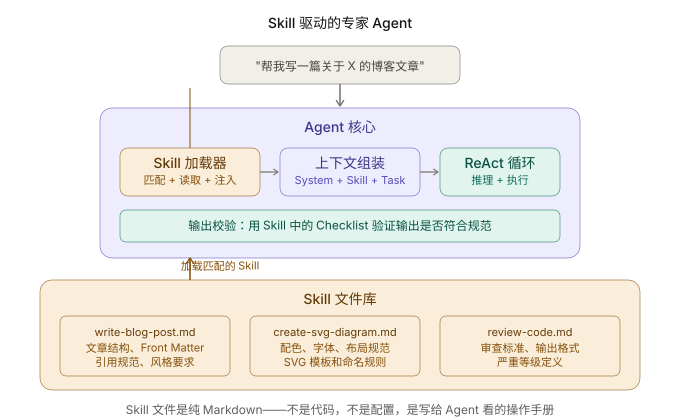
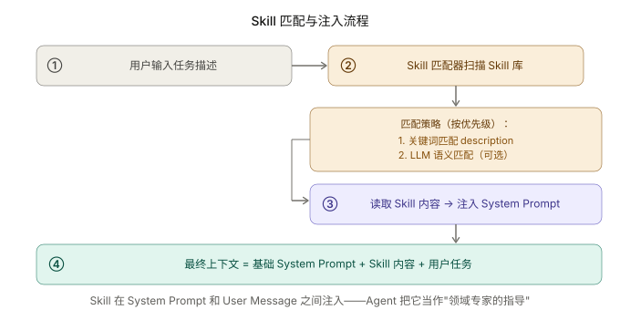

+++
title = "Skill 实战：教 Agent 写你风格的博客"
date = 2026-03-29T18:00:00+08:00
draft = false
author = "Hex4C59"
description = "用 Python 构建一个 Skill 驱动的写作 Agent——通过可插拔的 Skill 文件教它你的博客风格、文章结构和技术规范，展示 Skill 如何让 Agent 从通用工具变成领域专家。"
summary = "前面所有 Agent 的领域知识都写在 System Prompt 里。这篇展示一种更好的方式：把领域知识抽离成独立的 Skill 文件，Agent 根据任务动态加载——改 Skill 文件就能改变 Agent 行为，不用动一行代码。"
tags = ["Agent", "Skill", "Prompt Engineering", "Writing", "Knowledge"]
categories = ["Agent"]
series = ["agent-engineering"]
series_order = 22
difficulty = "intermediate"
article_type = "tutorial"
topics = ["skill", "knowledge", "prompt-engineering", "writing-agent", "domain-expert"]
frameworks = ["OpenAI"]
ShowToc = true
+++

前面五篇实战教程里，Agent 的"专业知识"都是硬编码在 System Prompt 里的。

[Coding Agent](/agent/build-cli-coding-agent/) 的 prompt 写着"先探索再行动"；[Research Agent](/agent/build-research-agent/) 的 prompt 写着搜索策略和笔记格式；[文件管理 Agent](/agent/build-file-management-agent/) 的 prompt 写着分类原则；[代码审查 Agent](/agent/build-multi-agent-code-review/) 的 prompt 写着每个审查维度的重点。

这种方式有一个明显的问题：**当你想让 Agent 学会新的领域知识，你必须修改代码。**

想让 Coding Agent 学会你团队的编码规范？改 System Prompt。想让 Research Agent 学会医学论文的搜索策略？改 System Prompt。想让写作 Agent 学会你的博客风格？改 System Prompt。

[Skill 那篇概念文章](/agent/skill-teach-agent-how-to-work/) 讲了一种更好的方式：**把领域知识从代码中抽离出来，放到独立的 Skill 文件里。** Agent 根据任务动态加载需要的 Skill——改 Skill 文件就能改变 Agent 的行为，不用动一行代码。

这篇文章把这个概念落地：构建一个 Skill 驱动的写作 Agent，教它写「你风格」的博客文章。

---

## 先给结论

1. **Skill 文件是纯 Markdown，不是代码。** 任何人都能写 Skill、改 Skill——不需要编程能力，只需要把自己的领域知识用 Agent 能理解的方式写下来。
2. **Skill 的加载点在 System Prompt 之后、User Message 之前。** Agent 把 Skill 内容当作"领域专家的指导"——它提供的是操作规范和质量标准，不是任务指令。
3. **一个 Agent 可以同时加载多个 Skill。** 写博客文章需要「文章结构规范」和「SVG 图表规范」两个 Skill，Agent 把它们合并到上下文里，同时遵循两套规范。
4. **Skill 的匹配机制是关键设计决策。** 手动指定最精确但不自动，关键词匹配够用且简单，LLM 语义匹配最智能但增加延迟和成本。
5. **Skill 带来的最大改变是：Agent 的能力边界由非工程师决定。** 产品经理、设计师、领域专家都可以通过写 Skill 来扩展 Agent 的能力。

---

## 整体架构



*图 1：Agent 核心不直接包含领域知识。Skill 加载器根据任务匹配 Skill 文件，读取后注入上下文。Skill 文件是纯 Markdown，修改它不需要改任何代码。*

---

## 项目结构

```
skill-agent/
├── agent/
│   ├── __init__.py
│   ├── core.py           # ReAct 循环
│   ├── skill_loader.py   # Skill 发现与加载
│   └── prompts.py        # 基础 System Prompt
├── skills/                # Skill 文件目录
│   ├── write-blog-post.md
│   ├── create-svg-diagram.md
│   └── review-code.md
├── tools/
│   ├── __init__.py
│   └── file_tools.py     # 文件读写工具
├── main.py
└── requirements.txt
```

注意 `skills/` 目录——这是整个项目的"知识库"。每个 `.md` 文件是一个独立的 Skill。添加新领域知识只需要在这里加一个文件。

---

## 第一步：编写 Skill 文件

Skill 文件的质量直接决定了 Agent 的输出质量。一个好的 Skill 应该像你写给新同事的 onboarding 文档——足够具体、有示例、明确说明什么该做什么不该做。

### Skill 示例：写博客文章

```markdown
---
name: write-blog-post
description: >-
  Write blog posts for the Hugo + PaperMod Agent engineering series.
  Use when the user asks to write, draft, or create a blog article.
triggers:
  - 写文章
  - 写博客
  - 写一篇
  - draft
  - blog post
  - 文章
---

# 博客文章写作规范

## Front Matter 格式（必须严格遵循）

使用 TOML 格式（+++ 包裹），不要用 YAML（---）：

\```toml
+++
title = "文章标题"
date = 2026-03-28T10:00:00+08:00
draft = false
author = "Hex4C59"
description = "一句话描述文章核心内容"
summary = "2-3 句话的摘要"
tags = ["Agent", "相关标签"]
categories = ["Agent"]
series = ["agent-engineering"]
series_order = 下一个序号
difficulty = "beginner | intermediate | advanced"
article_type = "concept | tutorial"
ShowToc = true
+++
\```

注意事项：
- 时区必须是 +08:00
- series_order 递增，查看现有文章确定下一个数字
- article_type 只有两种：概念文章用 concept，实战教程用 tutorial

## 文章结构（必须包含以下章节）

1. **开头引用**：引用系列中之前的文章作为上下文铺垫
2. **先给结论**：用编号列表给出 5 条核心结论，每条 1-2 句话
3. **正文章节**：由浅入深展开，每节有清晰的小标题
4. **代码示例**：使用 Python + OpenAI SDK，代码必须可独立运行
5. **总结**：回顾核心要点，预告下一篇

## 写作风格

- 语气直接，避免学术化表达，像在和同事对话
- 多用类比解释抽象概念（如"MCP 之于 Agent 就像 USB 之于外设"）
- 每个代码块后面跟一段解释，说明"为什么这样设计"
- 用表格对比不同方案的优劣
- 图文并茂：每篇至少 2 张 SVG 配图

## 代码风格

- 使用 async/await 风格
- 函数和类有中文注释说明设计意图
- 关键变量用有意义的名称，不用 a b c
- 代码示例保持模块化，一个代码块只做一件事

## 不要做的事情

- 不要用 YAML front matter
- 不要用 JavaScript 代码示例（除非主题要求）
- 不要在结论之前放长篇背景介绍
- 不要使用"本文将介绍..."这种空洞的开场
- 不要漏掉系列文章的交叉引用

## 质量检查清单

- [ ] front matter 使用 TOML 格式
- [ ] 包含"先给结论"章节
- [ ] 结论是 5 条编号列表
- [ ] 代码使用 Python + OpenAI SDK
- [ ] 有至少 2 处对其他文章的引用
- [ ] 有至少 1 张 SVG 配图的说明
- [ ] 有"总结"章节
- [ ] 时区是 +08:00
```

### Skill 示例：SVG 配图

```markdown
---
name: create-svg-diagram
description: >-
  Create SVG diagrams for Agent engineering blog posts.
  Use when the user asks to create a diagram, chart, or illustration.
triggers:
  - SVG
  - 画图
  - 配图
  - 图表
  - diagram
---

# SVG 配图规范

## 全局字体

\```
font-family="Inter, -apple-system, BlinkMacSystemFont, system-ui, sans-serif"
\```

## 配色方案

| 用途 | 背景 | 描边 | 文字 |
|------|------|------|------|
| Agent/推理 | rgb(238, 237, 254) | rgb(83, 74, 183) | rgb(60, 52, 137) |
| 工具/外部 | rgb(250, 238, 218) | rgb(133, 79, 11) | rgb(99, 56, 6) |
| 成功/输出 | rgb(225, 245, 238) | rgb(15, 110, 86) | rgb(8, 80, 65) |
| 错误/警告 | rgb(252, 230, 227) | rgb(201, 77, 61) | rgb(140, 41, 29) |
| 中性/容器 | rgb(241, 239, 232) | rgb(95, 94, 90) | rgb(68, 68, 65) |

## SVG 模板

\```xml
<svg width="100%" viewBox="0 0 680 400"
     xmlns="http://www.w3.org/2000/svg"
     role="img" aria-labelledby="title desc">
  <title id="title">图表标题</title>
  <desc id="desc">图表描述</desc>
  <!-- 内容 -->
</svg>
\```

## 规则

- viewBox 宽度固定 680
- 圆角矩形 rx="10"（容器）、rx="6"（内部元素）
- 箭头使用 marker-end 定义
- 标题文字 14px font-weight 500
- 正文文字 12px
- 小号文字 11px
```

这两个 Skill 文件的关键特征：

1. **YAML front matter 里有 `triggers`**：用于自动匹配，后面的 Skill 加载器会用到
2. **有正面示例也有反面约束**："不要做的事情"和"要做的事情"一样重要
3. **有可验证的 Checklist**：Agent 可以用它来自我检查输出质量

---

## 第二步：Skill 加载器



*图 2：用户输入任务 → Skill 匹配器扫描 Skill 库找到相关 Skill → 读取内容注入 System Prompt → Agent 带着领域知识开始执行。*

```python
# agent/skill_loader.py
import os
import re
from pathlib import Path
from dataclasses import dataclass, field


@dataclass
class Skill:
    """一个 Skill 的完整信息。"""
    name: str
    description: str
    triggers: list[str]
    content: str            # Markdown 正文（不含 front matter）
    file_path: str


class SkillLoader:
    """
    Skill 发现、匹配和加载。
    支持三种匹配方式：手动指定、关键词匹配、全部加载。
    """

    def __init__(self, skills_dir: str):
        self.skills_dir = Path(skills_dir)
        self.skills: list[Skill] = []
        self._load_all_skills()

    def _load_all_skills(self):
        """扫描 skills 目录，解析所有 Skill 文件。"""
        if not self.skills_dir.is_dir():
            print(f"⚠️  Skill 目录不存在：{self.skills_dir}")
            return

        for path in sorted(self.skills_dir.glob("*.md")):
            try:
                skill = self._parse_skill_file(path)
                self.skills.append(skill)
            except Exception as e:
                print(f"⚠️  解析 Skill 失败 {path.name}: {e}")

        print(f"📚 加载了 {len(self.skills)} 个 Skill:")
        for s in self.skills:
            print(f"   - {s.name}: {s.description[:60]}")

    def _parse_skill_file(self, path: Path) -> Skill:
        """解析一个 Skill 文件——YAML front matter + Markdown 正文。"""
        text = path.read_text(encoding="utf-8")

        # 提取 YAML front matter
        fm_match = re.match(r'^---\s*\n(.*?)\n---\s*\n', text, re.DOTALL)
        if not fm_match:
            raise ValueError("缺少 YAML front matter")

        fm_text = fm_match.group(1)
        content = text[fm_match.end():]

        # 简易 YAML 解析（避免引入 pyyaml 依赖）
        name = self._extract_field(fm_text, "name") or path.stem
        description = self._extract_field(fm_text, "description") or ""
        triggers = self._extract_list(fm_text, "triggers")

        return Skill(
            name=name,
            description=description,
            triggers=triggers,
            content=content.strip(),
            file_path=str(path),
        )

    def get_by_name(self, name: str) -> Skill | None:
        """按名称精确获取 Skill。"""
        for s in self.skills:
            if s.name == name:
                return s
        return None

    def match_by_task(self, task: str) -> list[Skill]:
        """
        根据用户任务描述自动匹配 Skill。
        匹配策略：检查任务文本中是否包含 Skill 的 triggers 关键词。
        """
        matched = []
        task_lower = task.lower()

        for skill in self.skills:
            for trigger in skill.triggers:
                if trigger.lower() in task_lower:
                    matched.append(skill)
                    break  # 一个 trigger 命中就够了

        return matched

    def build_skill_context(self, skills: list[Skill]) -> str:
        """
        把多个 Skill 的内容合并成一个上下文块，
        准备注入到 System Prompt 中。
        """
        if not skills:
            return ""

        parts = [
            "# 领域知识（以下规范来自 Skill 文件，请严格遵循）\n"
        ]

        for skill in skills:
            parts.append(f"## Skill: {skill.name}\n")
            parts.append(skill.content)
            parts.append("\n---\n")

        return "\n".join(parts)

    def _extract_field(self, text: str, field: str) -> str | None:
        """从 YAML 文本中提取单值字段。"""
        # 处理多行值（>- 语法）
        pattern = rf'^{field}:\s*>-?\s*\n((?:\s+.*\n)*)'
        match = re.search(pattern, text, re.MULTILINE)
        if match:
            lines = match.group(1).strip().splitlines()
            return " ".join(line.strip() for line in lines)
        # 处理单行值
        match = re.search(rf'^{field}:\s*(.+)$', text, re.MULTILINE)
        if match:
            return match.group(1).strip().strip('"').strip("'")
        return None

    def _extract_list(self, text: str, field: str) -> list[str]:
        """从 YAML 文本中提取列表字段。"""
        pattern = rf'^{field}:\s*\n((?:\s+-\s+.*\n)*)'
        match = re.search(pattern, text, re.MULTILINE)
        if not match:
            return []
        items = []
        for line in match.group(1).strip().splitlines():
            item = line.strip().lstrip("- ").strip()
            if item:
                items.append(item)
        return items
```

`SkillLoader` 的设计刻意保持简单——**没有用 LLM 做语义匹配，只用关键词匹配**。原因是：

1. 大多数场景下，keyword triggers 足够精确。用户说"帮我写一篇文章"，trigger 里有"写文章"，直接命中。
2. LLM 语义匹配会增加一次额外的 API 调用，增加延迟和成本。对于 Skill 数量 < 20 的场景，不值得。
3. 如果关键词匹配不够用，你可以很容易地扩展匹配策略——加一个 `match_by_embedding` 方法就行。

---

## 第三步：把 Skill 嵌入 ReAct 循环

```python
# agent/core.py
import json
import openai
from agent.skill_loader import SkillLoader
from agent.prompts import BASE_SYSTEM_PROMPT

client = openai.AsyncOpenAI()
MODEL = "gpt-4o"
MAX_ITERATIONS = 15

TOOL_SCHEMAS = [
    {
        "type": "function",
        "function": {
            "name": "read_file",
            "description": "读取文件内容。用于查看现有文章的结构和风格作为参考。",
            "parameters": {
                "type": "object",
                "properties": {
                    "path": {"type": "string", "description": "文件路径"}
                },
                "required": ["path"],
            },
        },
    },
    {
        "type": "function",
        "function": {
            "name": "write_file",
            "description": "创建或覆盖文件。用于写入生成的文章内容。",
            "parameters": {
                "type": "object",
                "properties": {
                    "path": {"type": "string", "description": "文件路径"},
                    "content": {"type": "string", "description": "文件内容"},
                },
                "required": ["path", "content"],
            },
        },
    },
    {
        "type": "function",
        "function": {
            "name": "list_directory",
            "description": "列出目录内容。用于了解现有文章的目录结构。",
            "parameters": {
                "type": "object",
                "properties": {
                    "path": {"type": "string", "description": "目录路径"}
                },
                "required": ["path"],
            },
        },
    },
]


def _read_file(path: str) -> dict:
    try:
        with open(path, "r", encoding="utf-8") as f:
            return {"success": True, "content": f.read()}
    except Exception as e:
        return {"success": False, "error": str(e)}


def _write_file(path: str, content: str) -> dict:
    try:
        from pathlib import Path
        Path(path).parent.mkdir(parents=True, exist_ok=True)
        with open(path, "w", encoding="utf-8") as f:
            f.write(content)
        return {"success": True, "path": path, "bytes": len(content.encode())}
    except Exception as e:
        return {"success": False, "error": str(e)}


def _list_directory(path: str) -> dict:
    try:
        from pathlib import Path
        p = Path(path)
        items = [
            {"name": item.name, "type": "dir" if item.is_dir() else "file"}
            for item in sorted(p.iterdir())
            if not item.name.startswith(".")
        ]
        return {"success": True, "items": items}
    except Exception as e:
        return {"success": False, "error": str(e)}


TOOL_REGISTRY = {
    "read_file": _read_file,
    "write_file": _write_file,
    "list_directory": _list_directory,
}


async def run_agent(
    user_message: str,
    skill_loader: SkillLoader,
    conversation_history: list[dict],
    skill_names: list[str] | None = None,
):
    """
    运行 Skill 驱动的 Agent。

    Skill 的加载有两种模式：
    1. 手动指定：传入 skill_names
    2. 自动匹配：根据 user_message 自动匹配 triggers
    """

    # ===== Skill 加载 =====
    if skill_names:
        # 手动模式：按名称加载
        skills = [
            s for name in skill_names
            if (s := skill_loader.get_by_name(name))
        ]
    else:
        # 自动模式：关键词匹配
        skills = skill_loader.match_by_task(user_message)

    if skills:
        print(f"📎 加载 Skill: {[s.name for s in skills]}")
    else:
        print("📎 未匹配到 Skill，使用通用模式")

    # ===== 组装上下文 =====
    skill_context = skill_loader.build_skill_context(skills)

    # Skill 注入位置：System Prompt 之后，作为独立的 system 消息
    system_messages = [
        {"role": "system", "content": BASE_SYSTEM_PROMPT},
    ]
    if skill_context:
        system_messages.append(
            {"role": "system", "content": skill_context}
        )

    conversation_history.append({"role": "user", "content": user_message})

    # ===== ReAct 循环 =====
    for iteration in range(MAX_ITERATIONS):
        print(f"\n[第 {iteration + 1} 轮]")

        messages = system_messages + conversation_history[-20:]

        response = await client.chat.completions.create(
            model=MODEL,
            messages=messages,
            tools=TOOL_SCHEMAS,
        )

        choice = response.choices[0]
        message = choice.message

        assistant_msg = {"role": "assistant", "content": message.content}
        if message.tool_calls:
            assistant_msg["tool_calls"] = [
                {
                    "id": tc.id,
                    "type": "function",
                    "function": {
                        "name": tc.function.name,
                        "arguments": tc.function.arguments,
                    },
                }
                for tc in message.tool_calls
            ]
        conversation_history.append(assistant_msg)

        if message.content:
            print(f"\n{message.content[:300]}")

        if choice.finish_reason == "stop":
            # ===== Skill 质量检查 =====
            if skills:
                await _skill_quality_check(
                    message.content, skills, conversation_history
                )
            print("\n[✓ 任务完成]")
            break

        if choice.finish_reason == "tool_calls":
            for tc in message.tool_calls:
                tool_name = tc.function.name
                tool_args = json.loads(tc.function.arguments)

                print(f"  [工具] {tool_name}({list(tool_args.keys())})")

                result = TOOL_REGISTRY[tool_name](**tool_args)
                result_str = json.dumps(result, ensure_ascii=False)
                if len(result_str) > 3000:
                    result_str = result_str[:3000] + "\n[截断]"

                conversation_history.append({
                    "role": "tool",
                    "tool_call_id": tc.id,
                    "content": result_str,
                })


async def _skill_quality_check(
    output: str,
    skills: list,
    conversation_history: list[dict],
):
    """
    用 Skill 中的 Checklist 验证 Agent 的输出质量。
    这是 Reflection 的一种落地形式——用 Skill 标准替代泛用的自我检查。
    """
    checklists = []
    for skill in skills:
        if "质量检查清单" in skill.content or "checklist" in skill.content.lower():
            checklists.append(f"[{skill.name}] 的检查项")

    if not checklists:
        return

    check_response = await client.chat.completions.create(
        model="gpt-4o-mini",
        messages=[{
            "role": "system",
            "content": (
                "你是一个质量审查员。根据以下 Skill 规范中的检查清单，"
                "验证 Agent 的输出是否符合要求。"
                "对每个检查项标注 ✓ 或 ✗，并简要说明原因。"
            ),
        }, {
            "role": "user",
            "content": f"Skill 规范：\n{[s.content for s in skills]}\n\nAgent 输出：\n{output[:3000]}",
        }],
    )

    print(f"\n📋 质量检查结果：")
    print(check_response.choices[0].message.content)
```

Skill 和 Agent 的集成点有三个：

1. **加载时机**：在 ReAct 循环开始之前，根据任务匹配并加载 Skill
2. **注入位置**：作为第二个 `system` 消息，在 Base System Prompt 之后。Agent 把它当作"领域专家的指导"
3. **质量检查**：在 Agent 完成任务后，用 Skill 中的 Checklist 做一次自动验证

---

## 第四步：基础 System Prompt

```python
# agent/prompts.py

BASE_SYSTEM_PROMPT = """你是一个写作助手，帮助用户创建高质量的技术博客文章。

## 工作流程
1. 先查看现有文章的目录结构和风格（用 list_directory 和 read_file）
2. 参考现有文章的结构和规范
3. 按照规范撰写新文章的完整内容
4. 用 write_file 工具写入文件

## 重要原则
- 如果加载了 Skill 规范，**必须严格遵循其中的每一条规则**
- Skill 规范优先于你的默认习惯——如果 Skill 说用 TOML，哪怕你习惯 YAML，也用 TOML
- 写作前先阅读至少 2 篇现有文章，理解风格后再动笔

## 你不需要做的事
- 不需要自己决定文章风格——Skill 会告诉你
- 不需要猜测 front matter 格式——Skill 会给出模板
"""
```

注意这个 Base System Prompt 故意保持精简。它只定义了工作流程和原则，**没有任何领域特定的规范**。所有的风格要求、格式规范、质量标准都在 Skill 文件里。

这就是 Skill 的核心价值：**Base Prompt 写一次，不同领域的能力通过不同的 Skill 文件扩展。**

---

## 一次完整的执行过程

```text
📚 加载了 3 个 Skill:
   - write-blog-post: Write blog posts for the Hugo + PaperMod Agent...
   - create-svg-diagram: Create SVG diagrams for Agent engineering...
   - review-code: Review code changes following team standards...

> 帮我写一篇关于 Prompt Caching 的博客文章

📎 加载 Skill: ['write-blog-post']

[第 1 轮]
好的，我先看看现有文章的结构。
  [工具] list_directory(['content/agent'])
  [工具] read_file(['content/agent/prompt-design-agent/index.md'])

[第 2 轮]
好的，我已经了解了文章结构。根据 Skill 规范：
- 使用 TOML front matter
- series_order = 23（当前最大是 22）
- 必须包含"先给结论"章节

让我再读一篇最近的文章，确认代码风格。
  [工具] read_file(['content/agent/build-mcp-agent/index.md'])

[第 3 轮]
已经理解了代码风格。现在开始撰写文章。
  [工具] write_file({
    path: 'content/agent/prompt-caching/index.md',
    content: '+++\ntitle = "Prompt Caching：...'
  })

[第 4 轮]
文章已写入 content/agent/prompt-caching/index.md。

📋 质量检查结果：
  ✓ front matter 使用 TOML 格式
  ✓ 包含"先给结论"章节
  ✓ 结论是 5 条编号列表
  ✓ 代码使用 Python + OpenAI SDK
  ✓ 有 3 处对其他文章的引用
  ✗ 缺少 SVG 配图说明（文中提到了图但未标注图号）
  ✓ 有"总结"章节
  ✓ 时区是 +08:00

1 项未通过——建议补充 SVG 图表的图号标注。

[✓ 任务完成]
```

质量检查发现了一个遗漏：文中提到了图但没有标注图号。这个检查是 Skill 的 Checklist 驱动的——如果没有 Skill，Agent 不会知道"你的系列文章需要给图标图号"这个规范。

---

## Skill 的进阶用法

### 组合多个 Skill

当任务涉及多个领域时，Agent 同时加载多个 Skill：

```python
# 用户说：帮我写一篇文章并配图
matched_skills = skill_loader.match_by_task("帮我写一篇关于 X 的文章，画几张图")
# 命中：['write-blog-post', 'create-svg-diagram']
```

两个 Skill 的内容被合并注入上下文。Agent 同时遵循文章规范和 SVG 配图规范。

### 动态 Skill：Agent 自己创建 Skill

一个更高级的模式——Agent 在工作过程中，把学到的新知识记录成 Skill 文件：

```python
CREATE_SKILL_SCHEMA = {
    "type": "function",
    "function": {
        "name": "create_skill",
        "description": (
            "创建一个新的 Skill 文件。当你在任务中发现了用户"
            "的特定规范或偏好（用户纠正了你的输出、告诉了你某个约定），"
            "把它记录为 Skill 供以后使用。"
        ),
        "parameters": {
            "type": "object",
            "properties": {
                "name": {"type": "string", "description": "Skill 名称"},
                "description": {"type": "string", "description": "适用场景"},
                "triggers": {
                    "type": "array",
                    "items": {"type": "string"},
                    "description": "触发关键词",
                },
                "content": {"type": "string", "description": "Skill 正文"},
            },
            "required": ["name", "description", "triggers", "content"],
        },
    },
}
```

当用户说"我的文章里代码注释要用中文"，Agent 可以把这条偏好写入一个新 Skill。下次写文章时，这条规范会被自动加载。

这其实是 [记忆](/agent/memory-types-and-design/) 的一种实现——通过 Skill 文件做持久化的语义记忆。

---

## Skill 和其他方案的对比

| | System Prompt 硬编码 | Skill 文件 | 微调 |
|---|---|---|---|
| 修改方式 | 改代码 | 改 Markdown 文件 | 准备数据+训练 |
| 修改成本 | 需要开发者 | 任何人都能改 | 需要 ML 工程师 |
| 生效时间 | 重启 Agent | 重启 Agent | 几小时~几天 |
| 知识容量 | 受 prompt 长度限制 | 可加载多个 Skill | 编码到权重中 |
| 可复用性 | 不可复用 | Skill 文件可共享 | 模型可共享 |
| 最适合 | 核心行为定义 | 领域知识和规范 | 风格/能力深度内化 |

关键认知：**这三种方式不是互斥的，是互补的。**

- System Prompt 定义 Agent 的核心行为模式（"你是一个写作助手"）
- Skill 文件提供特定领域的知识和规范（"文章要用 TOML front matter"）
- 微调改变模型的底层能力（"生成更接近某种写作风格的文本"）

大多数场景下，前两种的组合就够了。微调只在你有大量高质量的领域数据、并且 prompt + Skill 确实达不到要求时才值得考虑。

---

## 常见失败模式

### Skill 内容太长，挤占上下文

如果一个 Skill 有 3000 字，三个 Skill 加起来 9000 字，上下文窗口就被 Skill 占了大半。Agent 能用来推理和记忆工具返回值的空间就少了。

修复：给 Skill 设字数上限（建议 1500 字以内）。如果规范确实很多，拆成多个 Skill，只加载最相关的。

### Agent 选择性遵循 Skill

Agent 可能遵循了 Skill 里的大部分规则，但漏掉了几条。特别是 Skill 越长，末尾的规则越容易被忽略。

修复：把最重要的规则放在 Skill 的开头（"先说结论"原则同样适用于 Skill 本身）。用质量检查步骤强制验证关键规则。

### 多 Skill 之间的冲突

两个 Skill 对同一件事给出了不同的指导（一个说代码用缩进 2 空格，另一个说 4 空格）。

修复：在 Skill 设计时约定好职责边界——类似 [Multi-Agent 里给每个 Agent 定义"不在你职责范围内的事情"](/agent/build-multi-agent-code-review/)。

---

## 总结

Skill 机制的核心思想很简单：**把 Agent 需要的领域知识从代码中分离出来，放到可维护、可共享、可组合的独立文件中。**

实现上没有黑魔法——Skill 文件是纯 Markdown，Skill 加载器是不到 100 行的文件扫描和文本拼接，注入方式就是追加到 System Prompt 后面。但这个简单的抽象带来了巨大的工程价值：

- **非工程师可以扩展 Agent 能力。** 产品经理、技术作者、领域专家都能写 Skill。
- **Agent 的行为可以不改代码地演进。** 新增一份文档就等于教会了 Agent 一项新技能。
- **质量标准可以被编码和验证。** Skill 里的 Checklist 让"符不符合规范"变成了可自动检查的事情。

从更大的视角看，Skill 解决的是 [Skill 概念篇](/agent/skill-teach-agent-how-to-work/) 里说的那个核心问题：**通用模型很聪明，但它不知道你的具体场景。** 与其等模型训练覆盖你的场景，不如花 30 分钟写一份 Skill 文件，直接告诉它。

---

*上一篇：[MCP 集成实战：让 Agent 连接真实服务](/agent/build-mcp-agent/)*

*下一篇：[持久记忆实战：让 Agent 跨会话记住用户](/agent/build-persistent-memory-agent/)*
