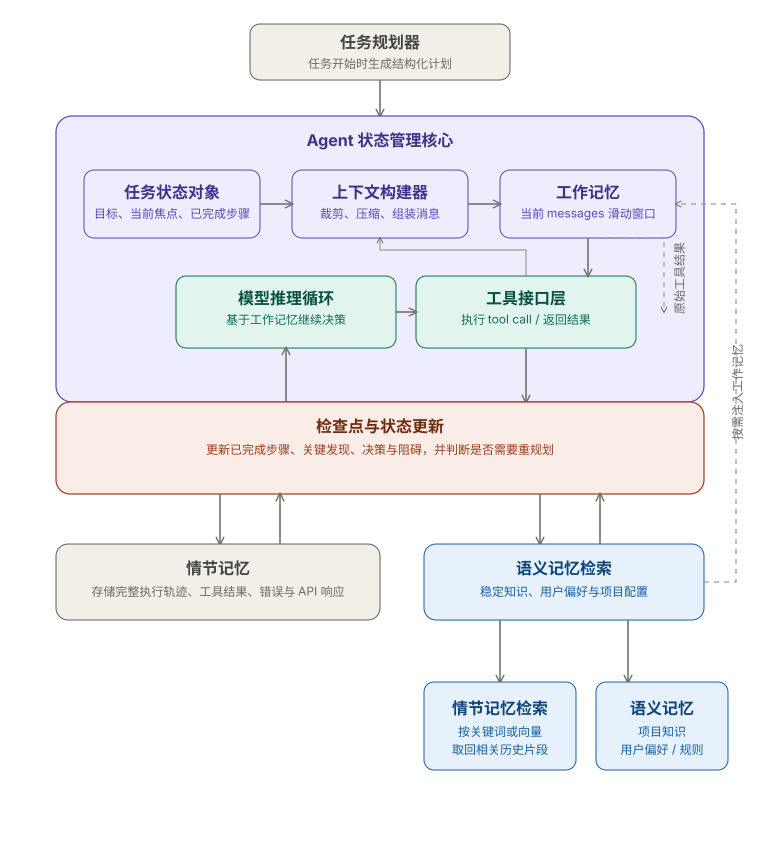

+++
title = "上下文与记忆：Agent 为什么会在长任务中失去方向，以及如何设计状态管理"
date = 2026-03-22T20:30:00+08:00
draft = false
author = "Hex4C59"
description = "解释 Agent 在长任务中出现“失忆”、目标漂移与重复调用工具的根本原因，并给出可落地的状态管理设计。"
summary = "从 context window、工作/情节/语义记忆分层出发，系统分析长任务中的记忆问题，并给出任务状态对象、上下文压缩、滑动窗口与检查点等工程模式。"
tags = ["Agent", "Memory", "Context Window", "State Management", "LLM"]
categories = ["Agent"]
series = ["agent-engineering"]
series_order = 3
difficulty = "advanced"
article_type = "concept"
topics = ["context-window", "memory", "state-management", "agent", "long-horizon-tasks"]
frameworks = ["OpenAI", "Anthropic"]
ShowToc = true
+++

在前两篇文章里，我们把 Agent 的核心结构拆清楚了：它需要目标、上下文、决策能力、执行能力和反馈闭环；而 Tool Use 是让它真正能行动的关键接口。

但有一个问题一直没有正面回答：**当任务变长、工具调用变多、对话轮次增加之后，Agent 为什么开始犯低级错误、忘记之前的结论、甚至原地打转？**

这篇文章就专门回答这个问题，以及如何设计状态管理来解决它。

---

## 先给结论

1. **Agent 的“失忆”不是模型变笨了，而是上下文窗口的物理限制和信息质量问题共同导致的。**
2. **Context Window 是 Agent 的工作记忆，它有容量上限，而且越靠后的信息越重要。** 如何填充这个窗口，比窗口多大更关键。
3. **Agent 需要三类记忆：工作记忆（当前上下文）、情节记忆（历史执行记录）、语义记忆（可检索的知识库）。** 大多数失败的 Agent 系统只实现了第一类。
4. **状态管理的本质是：在每一轮推理前，确保模型拿到的是“对当前决策最有价值的信息”，而不是“完整的历史记录”。**
5. **好的状态管理不是让 Agent 记住更多，而是让它在任何时刻都知道自己在哪、做了什么、下一步应该做什么。**

---

## 失忆是怎么发生的

先把失忆的机制讲清楚，后面的设计决策才有依据。

### Context Window 的本质

语言模型没有持久化的内部状态。每次调用模型，它看到的只有当前传入的 messages 列表。它没有“上一次调用时记得什么”，也没有“后台一直在运行的记忆”。

所谓的“对话历史”，本质上是每次调用时把之前的消息都重新传给模型。模型每次都是从头看完整个历史，然后生成下一条消息。

这意味着两件事：

**第一，context window 是有上限的。** 不管是 128k 还是 200k tokens，它是有限的。当历史消息 + 工具结果 + 当前输入超过这个上限，要么截断，要么报错。

**第二，模型对上下文的注意力不是均匀分布的。** 研究表明，模型对上下文开头和结尾的注意力更高，对中间部分的注意力较弱——这就是所谓的“Lost in the Middle”问题。当你的关键信息被淹没在大量工具调用结果的中间，模型很容易“看不见”它。

### 工具调用是上下文的主要消耗者

在一个典型的 Agent 执行流里，每次工具调用会往 messages 里追加至少两条消息：

```
[assistant] → tool_call: {name: "search_web", arguments: {...}}
[tool]      → tool_result: {content: "...搜索结果，可能几百到几千 tokens..."}
```

如果一个任务需要 20 次工具调用，而每次工具结果平均 500 tokens，光工具结果就消耗了 10,000 tokens。再加上系统提示词、用户消息、模型的中间推理，context window 消耗得非常快。

更麻烦的是：**这些工具结果大多数是“用完就没用了”的**。第 3 次搜索的结果，在第 15 次推理时可能完全不相关，但它仍然占据着宝贵的 context window 空间。

### 失忆的三种典型表现

**1. 重复工具调用**

Agent 忘记了几轮前已经查过某个信息，再次调用相同的工具，拿到同样的结果，形成循环。

**2. 目标漂移**

任务执行到一半，Agent 开始偏离原始目标，被某个工具结果里的细节带跑，忘记最初要做什么。

**3. 前后矛盾**

Agent 在第 5 轮得出了“方案 A 不可行”的结论，但在第 12 轮上下文被稀释后，又重新考虑方案 A，甚至给出相反的建议。

这三种表现背后的根本原因是一样的：**关键信息在上下文中的信噪比太低，或者直接被挤出了窗口。**

---

## 记忆的三个层次

要解决失忆问题，先要搞清楚 Agent 需要什么类型的记忆。

借用认知科学里的分类，Agent 的记忆可以分三层：

### 工作记忆（Working Memory）

对应 context window。这是模型每次推理时能直接“看到”的信息，也是唯一能直接影响模型输出的记忆类型。

特点：**容量有限、访问速度最快、每次推理都会重建。**

工作记忆里应该放什么？只放“当前这一步决策需要的信息”，不是“完整的历史记录”。

### 情节记忆（Episodic Memory）

记录 Agent 的历史执行轨迹：做了什么、用了哪些工具、拿到了什么结果、做出了哪些决策。

特点：**体量大、需要外部存储、按需检索。**

情节记忆不住在 context window 里，而是存在外部（数据库、文件、向量存储）。当 Agent 需要回顾历史时，通过检索把相关片段取回来放进工作记忆。

### 语义记忆（Semantic Memory）

存储领域知识、用户偏好、任务相关的结构化信息。比如“这个用户偏好 Python”、“项目使用 PostgreSQL”、“API 的鉴权方式是 Bearer Token”。

特点：**相对稳定、高密度、跨任务复用。**

语义记忆通常以结构化格式存储，可以在任务开始时直接注入 context，也可以按需检索。

### 大多数 Agent 系统只实现了工作记忆

这是最常见的问题。开发者把完整对话历史塞进 messages，然后奇怪为什么 Agent 在长任务里表现越来越差。

真正健壮的 Agent 需要三层记忆协同工作：工作记忆处理当前推理，情节记忆支持历史回顾，语义记忆提供稳定的知识基础。

---

## 状态管理的核心设计

有了记忆分层的框架，现在来看具体的设计模式。

### 模式一：任务状态对象（Task State）

与其让 Agent 从对话历史里“回想”当前进展，不如显式维护一个结构化的任务状态对象，在每轮推理时注入 context。

```python
from dataclasses import dataclass, field
from typing import Optional
from enum import Enum

class TaskStatus(Enum):
    IN_PROGRESS = "in_progress"
    BLOCKED = "blocked"
    COMPLETED = "completed"
    FAILED = "failed"

@dataclass
class SubTask:
    id: str
    description: str
    status: TaskStatus
    result: Optional[str] = None
    tool_used: Optional[str] = None

@dataclass
class TaskState:
    goal: str                              # 原始目标，永远不变
    current_focus: str                     # 当前正在做什么
    completed_subtasks: list[SubTask] = field(default_factory=list)
    pending_subtasks: list[SubTask] = field(default_factory=list)
    key_findings: list[str] = field(default_factory=list)   # 关键发现，蒸馏后保留
    blockers: list[str] = field(default_factory=list)       # 当前阻碍
    decisions_made: list[str] = field(default_factory=list) # 已经做出的决策

    def to_context_string(self) -> str:
        """把任务状态转成注入 context 的字符串"""
        lines = [
            f"## 当前任务状态",
            f"**目标**：{self.goal}",
            f"**当前焦点**：{self.current_focus}",
            "",
        ]
        if self.completed_subtasks:
            lines.append("**已完成步骤**：")
            for st in self.completed_subtasks:
                result_summary = f" → {st.result[:100]}..." if st.result else ""
                lines.append(f"  - ✅ {st.description}{result_summary}")
        if self.pending_subtasks:
            lines.append("**待执行步骤**：")
            for st in self.pending_subtasks:
                lines.append(f"  - ⬜ {st.description}")
        if self.key_findings:
            lines.append("**关键发现**：")
            for f in self.key_findings:
                lines.append(f"  - {f}")
        if self.decisions_made:
            lines.append("**已确定决策**：")
            for d in self.decisions_made:
                lines.append(f"  - {d}")
        if self.blockers:
            lines.append("**当前阻碍**：")
            for b in self.blockers:
                lines.append(f"  - ⚠️ {b}")
        return "\n".join(lines)
```

每轮推理时，把 `task_state.to_context_string()` 注入 system prompt 或 user message 的开头。这样模型无论看不看历史消息，都能立刻知道任务的当前状态。

```python
def build_messages(task_state: TaskState, user_input: str, history: list) -> list:
    system = f"""你是一个任务执行 Agent。

{task_state.to_context_string()}

---
根据以上任务状态，继续执行任务。如果当前焦点已完成，更新任务状态并推进到下一步。
"""
    messages = [{"role": "system", "content": system}]

    # 只保留最近 N 轮历史，不是全部
    recent_history = history[-10:]  # 后面会详细说这个策略
    messages.extend(recent_history)
    messages.append({"role": "user", "content": user_input})
    return messages
```

这个模式的核心思想是：**把隐式的“对话历史”转化为显式的“结构化状态”**。状态是稠密的、精确的，而历史是稀疏的、充满噪音的。

### 模式二：上下文压缩（Context Compression）

当工具结果很长时，不要把原始结果全部存入 messages，而是先压缩再存储。

```python
async def compress_tool_result(
    tool_name: str,
    raw_result: str,
    task_context: str,
    max_tokens: int = 500
) -> str:
    """
    在工具结果进入 context 之前，用一次轻量级 LLM 调用把它压缩成
    与当前任务相关的关键信息摘要。
    """
    if len(raw_result.split()) < 200:
        # 短结果不需要压缩
        return raw_result

    response = await client.chat.completions.create(
        model="gpt-4o-mini",   # 压缩用便宜模型就够了
        max_tokens=max_tokens,
        messages=[
            {
                "role": "system",
                "content": (
                    "你的任务是提取工具返回结果中与当前任务直接相关的关键信息，"
                    "去除无关内容，输出简洁的摘要。"
                    "保留具体的数据、结论、错误信息。不要添加分析，只做提取和压缩。"
                )
            },
            {
                "role": "user",
                "content": (
                    f"当前任务上下文：{task_context}\n\n"
                    f"工具名称：{tool_name}\n"
                    f"工具返回结果：\n{raw_result}"
                )
            }
        ]
    )
    return response.choices[0].message.content
```

这个模式有几个注意点：

**压缩不是摘要。** 摘要会丢失细节，压缩是在保留关键信息的前提下减少体积。在 prompt 里要明确说“保留具体数据、结论、错误信息”。

**只压缩长结果。** 短结果压缩反而增加开销，设一个阈值，低于阈值直接使用原文。

**压缩本身有成本。** 额外的 LLM 调用意味着延迟和费用。用便宜的模型（gpt-4o-mini、haiku）做压缩，用强模型做推理，是合理的分工。

### 模式三：滑动窗口历史（Sliding Window History）

不要无限追加历史消息，维护一个固定长度的滑动窗口。

```python
class ContextWindow:
    def __init__(self, max_messages: int = 20, max_tokens: int = 8000):
        self.messages: list[dict] = []
        self.max_messages = max_messages
        self.max_tokens = max_tokens
        self.archived: list[dict] = []  # 滑出窗口的消息存档

    def add(self, message: dict):
        self.messages.append(message)
        self._trim()

    def _trim(self):
        """
        裁剪策略：
        1. 如果消息数量超过上限，把最老的消息移入 archived
        2. 工具调用消息（assistant + tool）要成对保留或成对移除，
           避免出现孤立的 tool_result 没有对应的 tool_call
        """
        while len(self.messages) > self.max_messages:
            # 找到第一对完整的 tool_call + tool_result 或普通消息
            if self.messages[0]["role"] == "assistant" and \
               hasattr(self.messages[0].get("content"), "__iter__") and \
               self.messages[1]["role"] == "tool":
                # 成对移除 tool_call + tool_result
                self.archived.append(self.messages.pop(0))
                self.archived.append(self.messages.pop(0))
            else:
                self.archived.append(self.messages.pop(0))

    def get_messages(self) -> list[dict]:
        return self.messages

    def search_archived(self, keyword: str) -> list[dict]:
        """在归档历史中检索相关消息，用于情节记忆检索"""
        return [m for m in self.archived
                if keyword.lower() in str(m.get("content", "")).lower()]
```

滑动窗口有一个容易踩的坑：**tool_call 和 tool_result 必须成对出现**。如果把一个 `assistant` 消息（里面包含 tool_call）移走，但保留了它对应的 `tool` 消息，API 会报错。裁剪时要检查消息的配对关系。

### 模式四：显式规划 + 检查点（Planning + Checkpoints）

对于需要多步执行的复杂任务，在开始执行前先让 Agent 生成一个结构化计划，然后在每个检查点更新计划状态。

```python
async def create_execution_plan(goal: str, context: str) -> dict:
    """任务开始前，先生成结构化执行计划"""
    response = await client.chat.completions.create(
        model="gpt-4o",
        messages=[
            {
                "role": "system",
                "content": "你是一个任务规划专家。根据给定目标和上下文，生成结构化执行计划。"
            },
            {
                "role": "user",
                "content": f"""
目标：{goal}
上下文：{context}

请生成执行计划，格式如下（JSON）：
{{
  "goal_summary": "一句话总结目标",
  "steps": [
    {{
      "id": "step_1",
      "description": "步骤描述",
      "depends_on": [],
      "success_criteria": "什么情况下这步算完成",
      "tools_likely_needed": ["tool_name"]
    }}
  ],
  "key_constraints": ["约束条件"],
  "definition_of_done": "整体任务完成的判断标准"
}}
"""
            }
        ]
    )
    return json.loads(response.choices[0].message.content)


async def checkpoint(plan: dict, completed_step_id: str,
                     result_summary: str, agent_notes: str) -> dict:
    """每完成一步，调用检查点更新计划状态"""
    # 更新步骤状态
    for step in plan["steps"]:
        if step["id"] == completed_step_id:
            step["status"] = "completed"
            step["result_summary"] = result_summary
            break

    # 让模型评估是否需要调整计划
    response = await client.chat.completions.create(
        model="gpt-4o",
        messages=[
            {
                "role": "user",
                "content": f"""
当前执行计划：
{json.dumps(plan, ensure_ascii=False, indent=2)}

刚完成步骤：{completed_step_id}
执行结果摘要：{result_summary}
执行者备注：{agent_notes}

请判断：
1. 是否需要调整后续步骤？（比如某个结果改变了后续的方向）
2. 如果需要调整，给出调整后的步骤列表
3. 整体任务是否已经完成？

以 JSON 格式返回：
{{
  "needs_replan": true/false,
  "updated_steps": [...] or null,
  "task_completed": true/false,
  "next_step_id": "step_x" or null,
  "notes": "调整原因或完成说明"
}}
"""
            }
        ]
    )
    checkpoint_result = json.loads(response.choices[0].message.content)

    if checkpoint_result["needs_replan"] and checkpoint_result["updated_steps"]:
        plan["steps"] = checkpoint_result["updated_steps"]

    return plan, checkpoint_result
```

显式规划的最大价值是：**它把“任务目标”固化成了一个可以随时查阅的结构化文档**，而不是埋在对话历史的某条消息里。哪怕 context window 只剩下最近 5 条消息，只要规划对象还在，Agent 就不会迷失方向。

---

## 一个完整的状态管理架构

把上面几个模式组合起来，一个完整的状态管理系统大致是这样的：



*图 1：一个完整的 Agent 状态管理架构，把任务规划器、任务状态对象、上下文构建器、工作记忆、工具接口层，以及情节记忆与语义记忆连接成一个闭环。*

各层职责：

**任务规划器**：任务开始时生成结构化计划，中途在检查点评估是否需要调整。

**任务状态对象**：实时记录目标、当前焦点、已完成步骤、关键发现、已确定决策。每轮推理前注入 context，是 Agent 方向感的核心锚点。

**上下文构建器**：负责在每轮推理前把“任务状态 + 近期历史 + 必要的语义记忆”组装成 messages 列表，控制总 token 量不超过预算。

**工作记忆（Messages）**：滑动窗口，只保留最近 N 条，超出的归档到情节记忆。

**情节记忆**：存储完整的历史执行轨迹，支持关键词或向量检索，在需要回溯时按需取回相关片段。

**语义记忆**：稳定的结构化知识，任务开始时注入，或在特定触发条件下更新。

---

## 实际工程中的几个决策点

### 决策点 1：压缩 vs 截断

当 context 快满时，有两种选择：直接截断最老的消息，或者先压缩再保留。

一般建议：对工具结果做压缩，对推理过程做截断。工具结果里可能有不可再现的数据（比如搜索结果、API 响应），压缩后保留摘要比直接扔掉要好。推理过程（模型的 assistant 消息）通常可以从任务状态里重建，截断成本更低。

### 决策点 2：什么时候做检查点

不是每步都需要做检查点，过于频繁的规划重评估会增加延迟和成本。实践中通常在以下时机触发：

- 完成一个预定义的“阶段性目标”
- 工具调用失败或返回了意外结果
- 模型的输出里出现了不确定性信号（“我不确定是否应该……”）
- 已完成的步骤数达到计划步骤数的 50%

### 决策点 3：语义记忆放多少进 context

语义记忆是稳定的，但不是无限的。放太多会占用工作记忆空间，放太少又起不到作用。

一个可行策略：把语义记忆分成“核心知识”和“扩展知识”两部分。核心知识（用户偏好、项目基础配置）永远注入；扩展知识通过向量检索，只在与当前任务相关时才取入 context。

### 决策点 4：任务状态对象应该多详细

任务状态对象的粒度需要平衡：太粗糙提供不了足够信息，太细致又会膨胀占用 context 空间。

实践中的经验：`key_findings` 和 `decisions_made` 的每一条都应该是一句话的结论性陈述，不是原始数据。原始数据放情节记忆，结论放状态对象。

---

## 常见的状态管理失误

**1. 用日志代替状态**

把所有工具调用结果堆进 context，期望模型自己从中提炼状态。这本质上是把状态管理的工作外包给了模型，而模型并不擅长做这件事——它的注意力不是均匀分布的。

**2. 状态对象和 messages 双轨但不同步**

维护了任务状态对象，但忘记在工具调用完成后更新它，导致状态对象和实际执行历史出现偏差。解决方法是在工具执行的 postprocessing 钩子里自动更新状态。

**3. 压缩时过度摘要**

压缩工具结果时把具体数据也丢掉了，只保留了高层总结。结果模型后续需要具体数据时找不到，只好再次调用工具。保留具体数字、错误码、关键字段，丢弃的是格式化标记和冗余文字。

**4. 没有“失败记忆”**

任务状态里只记录成功的步骤和发现，不记录失败的尝试和原因。导致 Agent 后续会重复相同的失败路径。`blockers` 和失败记录和成功记录一样重要，甚至更重要。

---

## 总结

Agent 在长任务里失忆，根本原因是：它赖以推理的工作记忆（context window）是有限的，而执行过程产生的信息是无限增长的。不做主动管理，这个矛盾会随着任务复杂度线性恶化。

解决方案不是“让 context window 更大”，而是建立有结构的状态管理：

- 用**任务状态对象**固化目标和方向，让 Agent 在任何时刻都知道自己在哪
- 用**上下文压缩**提高工作记忆的信息密度
- 用**滑动窗口历史**控制 context 体积不失控
- 用**显式规划和检查点**在长任务中保持执行的连贯性
- 用**情节记忆和语义记忆**把工作记忆装不下的信息外化存储，按需取回

这些机制组合起来，不是让 Agent 记住更多，而是让它在每一轮推理时拿到的信息都是“当前决策最需要的那些”。

方向感不来自记忆的完整性，而来自状态的清晰度。

---

