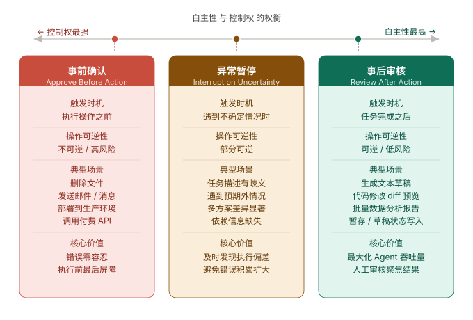
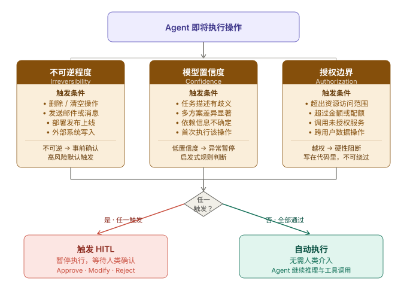
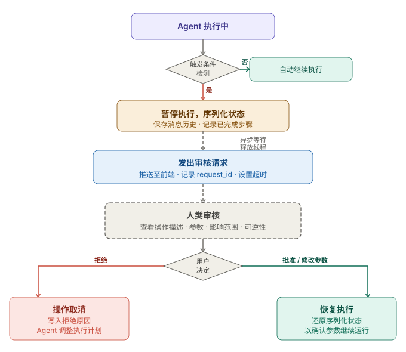

+++
title = "Human-in-the-Loop：Agent 什么时候应该停下来问你"
date = 2026-05-10T10:00:00+08:00
draft = false
author = "Hex4C59"
description = "从全自动 Agent 的真实风险出发，系统讲解 HITL 的三种介入模式、触发时机设计、暂停与恢复的工程实现，以及如何避免 Alert Fatigue 让 HITL 形同虚设。"
summary = "Agent 不是越自动越好。本文系统分析 Human-in-the-Loop 的三种介入强度、触发逻辑、工程实现与常见陷阱，帮你在自主性与安全性之间找到合理的平衡点。"
tags = ["Agent", "HITL", "Human-in-the-Loop", "Safety", "Guardrails", "Autonomy"]
categories = ["Agent"]
series = ["agent-engineering"]
series_order = 24
difficulty = "intermediate"
article_type = "concept"
topics = ["hitl", "human-in-the-loop", "safety", "autonomy", "agent-design"]
frameworks = ["OpenAI"]
ShowToc = true
+++

在 [Guardrails](/agent/guardrails-safety-boundary/) 那篇里，我们讲了如何用代码层面的防护边界约束 Agent 的行为——权限分级、沙箱隔离、输出过滤。这些机制有一个共同的假设：**防护逻辑在设计时就能写清楚**。

但现实里有一类问题是写不清楚的。

"帮我清理这个项目里过时的依赖"——什么算过时？哪些可以删？删之前需要测试吗？"帮我回复这封客户邮件"——用什么语气？要不要提价格？能不能承诺交付时间？这些判断涉及语境、业务规则、用户偏好，没有一个通用的代码能替你做决定。

这就是 Human-in-the-Loop（HITL）要解决的问题：**不是用更多规则来约束 Agent，而是在合适的节点把决策权还给人。**

HITL 不是 Agent 不够聪明时的临时补丁。它是生产级 Agent 系统的标准设计组件——不是你能力不够才用，而是你想把 Agent 真正用在重要任务上才必须有。

---

## 先给结论

1. **全自动 Agent 在生产环境里几乎不存在。** 真正在生产中跑的 Agent 系统——无论是 Claude Code、Cursor 还是各类 SaaS 工作流自动化——都有明确的人类介入节点。自主性是程度问题，不是有无问题。
2. **HITL 有三种介入强度：事前确认、异常暂停、事后审核。** 三者的适用场景不同，不能互相替代。好的设计是根据操作风险和可逆程度选择合适的介入模式，而不是一律要求确认。
3. **触发 HITL 的核心逻辑只有三类：不可逆操作、低置信度判断、超出授权边界。** 其他场景通常不需要打断用户。
4. **Alert Fatigue 是 HITL 最大的工程问题。** 过多的确认请求会让用户开始自动点"确认"，防护形同虚设。HITL 的质量不是靠增加打断次数来保证的。
5. **HITL 的目标是：让人类在关键节点上花最少的时间，对最高风险的决策保持最高控制权。** 打断越精准，用户越愿意认真对待每一次打断。

---

## 为什么全自动 Agent 在生产中几乎不存在

让我描述一个看起来很美好的场景：你给 Agent 一个任务，它自动完成，你只看最终结果。

这在演示里很酷。在生产里，问题是：**你对 Agent 的信任程度需要和它执行的操作风险等级匹配。**

来看三个递增的例子：

**场景一：读取数据，生成报告**

Agent 读取日志文件，分析异常，生成一份 Markdown 报告。这个任务完全可以全自动——操作是只读的，结果是可验证的，即使报告有错你也能发现并纠正。全自动合理。

**场景二：批量修改代码**

Agent 分析一个大型代码仓库，自动重构某类模式。它改了 127 个文件。改完之后你发现它误解了你的意图，有 40 个文件的改法不对。

没有 HITL，你现在面对的是：用 git 一个一个 revert，还是重新跑一遍？无论哪个选项都很痛苦。如果在开始执行前 Agent 展示了它的改动计划并让你确认，这个问题就不会发生。

**场景三：自动回复客户**

Agent 分析客户 support ticket，自动给 100 位客户发了回复邮件。其中有 3 封邮件的措辞不当，承诺了你没法做到的事情。

这时候已经没有"撤回"了。邮件发出去了。客户截图了。

这三个场景的区别不是 Agent 够不够聪明，而是**操作的不可逆程度**和**错误的代价**不同。越不可逆、代价越高，越需要人类在执行前参与判断。

---

## HITL 的三种介入模式

HITL 不是一个开关，而是一个连续谱。根据介入的时机和深度，分为三种模式：



*图 1：三种介入模式在自主性和安全性之间的位置——事后审核自主性最高，事前确认控制权最强，异常暂停是两者之间的平衡点。*

### 模式一：事前确认（Approve Before Action）

Agent 在执行高风险操作**之前**，暂停并展示它打算做什么，等待用户批准。

**适合场景**：
- 不可逆的写操作（删除文件、发送消息、提交代码）
- 涉及真实资源消耗（API 调用、付费服务、外部系统写入）
- 超出日常授权范围的操作

**交互形式**：
```
Agent：我打算执行以下操作：
  - 删除 /data/backup/2023/ 目录（共 847MB，312 个文件）
  - 原因：该目录下的文件创建于 18 个月前，且没有任何引用

是否继续？[y/N]
```

注意这里 Agent 不只是说"我要删文件"，而是展示了**具体的操作内容和执行理由**。用户有足够的信息来做判断。

### 模式二：异常暂停（Interrupt on Uncertainty）

Agent 在执行过程中遇到**不确定情况**时，主动暂停并向用户提问，获取澄清后继续。

**适合场景**：
- 任务描述存在歧义，Agent 无法确定用户意图
- 遇到了预期之外的情况（文件不存在、权限被拒绝、返回了异常数据）
- 有两个以上的合理选项，需要用户做选择

**交互形式**：
```
Agent：在处理用户列表时，我发现 23 条记录的 `email` 字段为空。

有两种处理方式：
  A. 跳过这些记录，只处理有 email 的用户（共 1,847 条）
  B. 停止处理，等你确认如何处理缺失值

你希望怎么做？
```

异常暂停的核心是**及时发现偏差**，而不是在任务结束后才告诉用户"有 23 条失败了"。

### 模式三：事后审核（Review After Action）

Agent 自主完成任务，**完成后**将结果提交给用户审核，用户可以批准、修改或回滚。

**适合场景**：
- 操作本身可逆（草稿、预览、暂存状态）
- 错误代价可接受（内容生成、数据分析）
- 需要最大化 Agent 的吞吐量（批量任务）

**交互形式**：
```
Agent：已完成 PR 草稿，包含以下修改：
  - 重构了 UserService 类，拆分为 3 个更小的模块
  - 更新了相关测试，新增 12 个测试用例
  - 更新了 README 中的 API 文档

[查看完整 diff] [批准并提交] [需要修改]
```

事后审核适合那些"Agent 的草稿比从零写要好得多，但还需要人工把关"的场景。

---

## 什么时候触发 HITL

三种模式解决了"怎么介入"，但更核心的问题是"**什么时候**介入"。

触发 HITL 的判断逻辑有三类：



*图 2：HITL 触发的三条判断路径——不可逆程度、置信度、授权边界，任一触发则介入。*

### 触发条件一：操作不可逆程度

按不可逆程度从高到低：

| 操作类型 | 可逆性 | 建议介入模式 |
|---|---|---|
| 发送邮件、短信、消息 | 完全不可逆 | 事前确认 |
| 删除文件（无回收站） | 不可逆 | 事前确认 |
| 提交代码、发布到生产 | 难以逆转 | 事前确认 |
| 修改数据库记录 | 可逆（需手动） | 事前确认或异常暂停 |
| 写文件到磁盘 | 可覆盖回滚 | 异常暂停或事后审核 |
| 生成文本、分析数据 | 完全可逆 | 事后审核或无需介入 |

### 触发条件二：模型置信度

Agent 的决策可以附带一个置信度估算。当置信度低于阈值时，触发 HITL。

置信度不需要是精确的概率——通常用启发式规则就够了：
- 任务描述里有歧义词（"清理一下"、"整理一下"、"优化一下"）
- 有多个候选操作，且差异显著
- 依赖的外部信息不确定（文档缺失、数据异常）
- 当前操作是 Agent 第一次执行的操作类型

### 触发条件三：超出授权边界

每个 Agent 实例应该有明确的操作授权范围。当 Agent 的决策超出这个范围时，必须触发 HITL，无论置信度多高。

常见的授权边界：
- **资源范围**：只能操作 `/workspace/project/` 目录，不能操作其他路径
- **金额上限**：单次 API 调用费用不超过 $5
- **服务范围**：只能调用已授权的 API，不能发现并调用新 API
- **用户范围**：只能操作当前用户的数据，不能跨用户操作

授权边界触发的 HITL 必须是**硬性的**——写在代码里，不能被 prompt 覆盖。这和 [Guardrails](/agent/guardrails-safety-boundary/) 里讲的原则一致：真正的安全边界不能依赖 prompt 指令。

---

## 工程实现：暂停与恢复

HITL 最核心的工程问题是：**如何在异步执行的 Agent 中安全地暂停，等待人类响应，然后从断点继续。**

这比听起来复杂。Agent 的执行是有状态的——它有当前的 context window、已执行的工具调用历史、中间变量。暂停时需要保存这些状态，恢复时需要还原。



*图 3：Agent 遇到触发条件时的完整执行流程——检测触发、序列化状态、异步等待人类审核、根据审核结果恢复或放弃。*

### 基础结构

```python
import asyncio
from dataclasses import dataclass, field
from enum import Enum
from typing import Any, Callable, Awaitable
from openai import AsyncOpenAI

client = AsyncOpenAI()


class ApprovalStatus(Enum):
    """人类审核状态"""
    PENDING = "pending"    # 等待审核
    APPROVED = "approved"  # 已批准
    REJECTED = "rejected"  # 已拒绝
    MODIFIED = "modified"  # 已修改（用户改了参数）


@dataclass
class HumanApprovalRequest:
    """
    发给人类的审核请求。
    包含足够的上下文，让人类能做出有意义的判断。
    """
    request_id: str
    action_type: str           # 操作类型，例如 "delete_file"
    description: str           # 用自然语言描述 Agent 打算做什么
    parameters: dict           # 具体参数
    reason: str                # Agent 为什么要做这个操作
    reversible: bool           # 操作是否可逆
    estimated_impact: str      # 预估影响范围


@dataclass
class HumanApprovalResponse:
    """人类的审核响应"""
    request_id: str
    status: ApprovalStatus
    modified_parameters: dict | None = None  # 如果 status 是 MODIFIED，这里有修改后的参数
    feedback: str | None = None              # 用户的文字反馈（可选）


@dataclass
class ExecutionState:
    """
    Agent 执行状态快照。
    暂停时保存，恢复时还原。
    """
    task_id: str
    messages: list[dict]           # 完整的消息历史
    pending_tool_calls: list[dict] # 待执行的工具调用
    completed_steps: list[str]     # 已完成的步骤列表
    context: dict = field(default_factory=dict)  # 任务上下文
```

### 暂停与恢复机制

```python
class HITLAgent:
    """
    带 Human-in-the-Loop 机制的 Agent。
    
    核心逻辑：
    - 在执行工具调用前，检查是否需要人类确认
    - 需要确认时，发送请求并等待响应
    - 响应到达后，根据用户决定继续、放弃或修改参数
    """

    def __init__(
        self,
        model: str = "gpt-4o",
        approval_handler: Callable[[HumanApprovalRequest], Awaitable[HumanApprovalResponse]] | None = None,
    ):
        self.model = model
        # approval_handler 是实际发送审核请求的函数
        # 可以是 CLI 交互、Web 回调、Slack 消息等
        self.approval_handler = approval_handler or self._default_cli_approval

    async def run(self, task: str, tools: list[dict]) -> str:
        """执行任务，在关键节点插入人类确认"""
        messages = [{"role": "user", "content": task}]

        while True:
            response = await client.chat.completions.create(
                model=self.model,
                messages=messages,
                tools=tools,
                tool_choice="auto",
            )

            msg = response.choices[0].message

            # 没有工具调用，任务完成
            if not msg.tool_calls:
                return msg.content or ""

            messages.append(msg)

            # 处理每个工具调用
            tool_results = []
            for tool_call in msg.tool_calls:
                result = await self._handle_tool_call(tool_call)
                tool_results.append({
                    "role": "tool",
                    "tool_call_id": tool_call.id,
                    "content": result,
                })

            messages.extend(tool_results)

    async def _handle_tool_call(self, tool_call) -> str:
        """
        处理单个工具调用。
        如果工具需要人类确认，先获取确认再执行。
        """
        import json
        tool_name = tool_call.function.name
        params = json.loads(tool_call.function.arguments)

        # 判断是否需要人类确认
        if self._requires_approval(tool_name, params):
            approved_params = await self._request_approval(tool_name, params)
            if approved_params is None:
                # 用户拒绝了操作
                return f"操作已被用户取消：{tool_name}"
            # 使用用户可能修改过的参数
            params = approved_params

        # 执行工具
        return await self._execute_tool(tool_name, params)

    def _requires_approval(self, tool_name: str, params: dict) -> bool:
        """
        判断工具调用是否需要人类确认。
        这个判断逻辑是系统最关键的部分，需要根据业务场景仔细设计。
        """
        # 硬性规则：特定工具类型必须确认
        HIGH_RISK_TOOLS = {
            "delete_file", "delete_directory",
            "send_email", "send_message",
            "execute_command", "deploy",
            "write_database", "call_payment_api",
        }
        if tool_name in HIGH_RISK_TOOLS:
            return True

        # 参数级别的规则：某些参数组合需要确认
        if tool_name == "write_file" and params.get("overwrite", False):
            return True

        return False

    async def _request_approval(
        self,
        tool_name: str,
        params: dict,
    ) -> dict | None:
        """
        向人类发送审核请求，等待响应。
        返回最终使用的参数（用户可能修改过），或 None（用户拒绝）。
        """
        import uuid
        request = HumanApprovalRequest(
            request_id=str(uuid.uuid4()),
            action_type=tool_name,
            description=self._describe_action(tool_name, params),
            parameters=params,
            reason="Agent 判断此操作是完成任务所必需的",
            reversible=self._is_reversible(tool_name),
            estimated_impact=self._estimate_impact(tool_name, params),
        )

        response = await self.approval_handler(request)

        if response.status == ApprovalStatus.APPROVED:
            return params
        elif response.status == ApprovalStatus.MODIFIED:
            return response.modified_parameters
        else:  # REJECTED
            return None

    async def _default_cli_approval(
        self,
        request: HumanApprovalRequest,
    ) -> HumanApprovalResponse:
        """
        默认的 CLI 审核处理器。
        生产环境应替换为 Web UI 回调或异步消息队列。
        """
        print(f"\n{'='*50}")
        print(f"⚠️  需要确认：{request.action_type}")
        print(f"描述：{request.description}")
        print(f"参数：{request.parameters}")
        print(f"可逆：{'是' if request.reversible else '否'}")
        print(f"影响：{request.estimated_impact}")
        print(f"{'='*50}")

        choice = input("操作选项 [y=确认 / n=拒绝 / q=放弃整个任务]：").strip().lower()

        if choice == "y":
            return HumanApprovalResponse(
                request_id=request.request_id,
                status=ApprovalStatus.APPROVED,
            )
        else:
            return HumanApprovalResponse(
                request_id=request.request_id,
                status=ApprovalStatus.REJECTED,
            )

    def _describe_action(self, tool_name: str, params: dict) -> str:
        """将工具调用转化为人类可读的自然语言描述"""
        descriptions = {
            "delete_file": lambda p: f"删除文件：{p.get('path', '?')}",
            "send_email": lambda p: f"发送邮件给 {p.get('to', '?')}，主题：{p.get('subject', '?')}",
            "execute_command": lambda p: f"执行命令：{p.get('command', '?')}",
        }
        describe = descriptions.get(tool_name)
        return describe(params) if describe else f"执行 {tool_name}，参数：{params}"

    def _is_reversible(self, tool_name: str) -> bool:
        IRREVERSIBLE = {"delete_file", "send_email", "send_message", "deploy"}
        return tool_name not in IRREVERSIBLE

    def _estimate_impact(self, tool_name: str, params: dict) -> str:
        if tool_name == "delete_file":
            return f"文件 {params.get('path', '?')} 将被永久删除"
        if tool_name == "send_email":
            return f"邮件将发送给 {params.get('to', '?')}，无法撤回"
        return "影响范围未知"

    async def _execute_tool(self, tool_name: str, params: dict) -> str:
        """实际执行工具——此处为示例占位"""
        return f"工具 {tool_name} 执行完成，参数：{params}"
```

### 异步等待：Web 场景下的 HITL

CLI 场景里 `input()` 可以阻塞等待。但在 Web 应用里，Agent 通常是异步服务——它不能一直占着一个线程等用户点击按钮。

这时候需要把 HITL 变成一个**异步回调流程**：

```python
import asyncio
from collections import defaultdict


class AsyncApprovalQueue:
    """
    异步审核队列。
    Agent 发出审核请求后释放线程，
    等用户在 Web UI 操作后通过回调恢复执行。
    """

    def __init__(self):
        # 每个 request_id 对应一个 Future
        self._pending: dict[str, asyncio.Future] = {}

    async def request(
        self,
        request: HumanApprovalRequest,
        timeout: float = 3600.0,  # 默认等待 1 小时
    ) -> HumanApprovalResponse:
        """
        发出审核请求，挂起等待响应。
        超时后自动拒绝（避免任务无限挂起）。
        """
        loop = asyncio.get_event_loop()
        future = loop.create_future()
        self._pending[request.request_id] = future

        # 这里应该把 request 推送给前端（WebSocket、轮询接口等）
        await self._notify_frontend(request)

        try:
            return await asyncio.wait_for(future, timeout=timeout)
        except asyncio.TimeoutError:
            # 超时视为用户未响应，保守处理：拒绝操作
            del self._pending[request.request_id]
            return HumanApprovalResponse(
                request_id=request.request_id,
                status=ApprovalStatus.REJECTED,
                feedback="审核超时，操作已自动取消",
            )

    def respond(self, response: HumanApprovalResponse) -> bool:
        """
        由 Web API 调用：用户在前端操作后，将结果回写进来。
        返回 True 表示成功，False 表示 request_id 已过期或不存在。
        """
        future = self._pending.pop(response.request_id, None)
        if future and not future.done():
            future.set_result(response)
            return True
        return False

    async def _notify_frontend(self, request: HumanApprovalRequest):
        """将审核请求推送给前端——具体实现依赖你的架构"""
        # 例如：await websocket.send(request.to_json())
        pass
```

这个结构的关键在于：Agent 协程在 `await asyncio.wait_for(future, timeout)` 这一行**真正地挂起**了——它不占 CPU，不占线程，就是等一个 Future 被 set。当用户点击"批准"按钮，Web 后端调用 `queue.respond()`，Future 被 set，Agent 协程被唤醒继续执行。

---

## 置信度驱动的动态 HITL

除了基于工具类型的硬性规则，还可以让 Agent 自己判断当前是否需要人类介入：

```python
async def should_interrupt(
    self,
    task: str,
    current_step: str,
    available_options: list[str],
) -> tuple[bool, str]:
    """
    让模型评估当前步骤是否需要人类确认。
    返回 (是否需要确认, 需要确认的原因)。
    """
    prompt = f"""你正在执行任务：{task}

当前步骤：{current_step}

可选方案：
{chr(10).join(f"- {opt}" for opt in available_options)}

请判断：你对当前最优方案有多大把握？
- 如果你有清晰的判断，直接执行，回复 {{"needs_human": false}}
- 如果存在以下任一情况，需要人类确认：
  - 任务描述有歧义，你的理解可能与用户意图不符
  - 多个方案的差异很大，你无法确定用户的偏好
  - 当前情况超出了你的预期，需要用户提供额外信息
  
回复 JSON 格式：{{"needs_human": true/false, "reason": "说明原因"}}"""

    response = await client.chat.completions.create(
        model="gpt-4o",
        messages=[{"role": "user", "content": prompt}],
        response_format={"type": "json_object"},
    )

    import json
    result = json.loads(response.choices[0].message.content)
    return result["needs_human"], result.get("reason", "")
```

这种方式把置信度判断交给模型自己，但要注意：**模型倾向于过度自信**。纯粹依赖模型的自我评估通常会导致打断过少。建议把置信度检查作为补充，核心触发逻辑还是基于操作类型的硬性规则。

---

## Alert Fatigue：HITL 最大的陷阱

Alert Fatigue 是安全领域的经典问题：当系统产生太多告警，操作员开始忽略它们，甚至养成了自动点"确认"的习惯，真正的风险就被埋没在噪音里了。

同样的问题会发生在 HITL 里。

一个设计不好的 Agent 可能每执行 3 步就弹一个确认框。用户在前 5 次还会认真看，从第 6 次开始开始快速点"确认"，到第 10 次已经在边刷手机边点了。这时候 HITL 没有提供任何保护——它只是增加了用户的烦躁感。

**Alert Fatigue 的三个来源：**

### 1. 确认粒度太细

```
# 错误做法：每个文件操作都要求确认
Agent：我要读取 config.json，是否允许？[y/N]
Agent：我要读取 package.json，是否允许？[y/N]  
Agent：我要读取 README.md，是否允许？[y/N]
```

读操作通常不需要确认。即使需要，也应该批量确认（"允许读取以下 3 个文件"），而不是逐个询问。

### 2. 确认信息质量差

```
# 错误做法：确认请求没有足够信息
Agent：我要执行一个操作，是否允许？[y/N]

# 正确做法：提供足够的上下文
Agent：我要删除 /tmp/build/old_artifacts/ 目录（共 234MB，这些是上次构建遗留的临时文件）
原因：该目录占用了磁盘空间，且不影响当前构建
是否继续？[y/N]
```

用户只有在信息充分时才能做出有意义的判断。确认请求信息越少，用户越倾向于直接点"确认"而不思考。

### 3. 确认时机不对

```
# 错误做法：任务执行到一半才确认
Agent：（已经处理了 800 条记录）
Agent：我发现第 801 条记录有个异常，是否继续？[y/N]

# 正确做法：在开始前确认处理策略
Agent：任务开始前，请确认异常处理策略：
  A. 跳过异常记录，继续处理
  B. 遇到异常立即停止，等待确认
  C. 记录异常，全部完成后汇报
```

在任务中途打断不只是烦人，还会让用户陷入"已经做了 800 条，如果说不，那前面的工作怎么办"的压力里，导致用户更容易说"是"。

**衡量 HITL 质量的一个指标**：用户在看到确认请求后，真正修改或拒绝的比例。如果这个比例接近 0%，说明你的 HITL 触发了太多不必要的请求。

---

## 真实产品中的 HITL 设计

### Claude Code

Claude Code 采用了精细的权限分级策略。默认情况下，读操作完全自主，写操作会标记但不必须确认，只有执行命令（`bash`）时才需要明确授权。

它的一个值得借鉴的设计是"会话级授权"：用户在会话开始时可以声明"这次会话里允许自动执行 bash 命令"，之后整个会话不再每次询问。这减少了重复确认，同时把授权决策提前到了用户注意力充足的时刻。

### Cursor

Cursor 把 HITL 做成了"diff 预览 + 批准"的模式——Agent 先生成所有修改，以 diff 的形式展示，用户可以逐文件审查，然后整体批准或拒绝。

这是一个典型的事后审核模式，适合代码修改场景——因为代码修改有明确的 diff 格式，用户可以高效地审查大量变更。

### 工作流自动化产品（如 n8n、Zapier AI）

这类产品通常采用"审批节点"概念：在工作流里显式地放置一个"人工审批"节点，该节点之前的步骤自动执行，触达审批节点时向指定用户发送通知（邮件、Slack），用户批准后后续步骤才继续。

这种设计的优点是审批节点在流程图里可视，团队所有人都知道哪里有人工介入。

---

## 常见的 HITL 实现问题

### 1. 暂停后恢复时上下文丢失

Agent 被暂停时，context window 里有大量的任务状态。如果恢复时只是"继续执行"，但中间时间过长导致消息历史被截断，或者系统重启丢失了状态，Agent 恢复后可能不知道自己在做什么。

解决方式：暂停时持久化完整的 `ExecutionState`，恢复时显式地将状态注入 context：

```python
async def resume_from_state(self, state: ExecutionState) -> str:
    """
    从保存的状态中恢复执行。
    在消息历史前插入状态摘要，确保模型知道自己在做什么。
    """
    resume_context = {
        "role": "system",
        "content": (
            f"你正在恢复一个被暂停的任务。\n"
            f"任务 ID：{state.task_id}\n"
            f"已完成步骤：{', '.join(state.completed_steps)}\n"
            f"当前上下文：{state.context}\n"
            f"请从暂停点继续执行，不要重复已完成的步骤。"
        )
    }
    messages = [resume_context] + state.messages
    # 继续执行循环...
```

### 2. 用户"批准"了，但 Agent 理解的操作和用户以为的不一样

这通常发生在确认描述不够精确时。用户以为自己批准的是"重命名这个文件"，实际上 Agent 做的是"删除旧文件，创建新文件"。

解决方式：确认请求里展示的应该是**操作的实际效果**，而不是操作的意图：

```python
# 不好的描述
"我要重命名 config.json"

# 好的描述
"我要将 config.json 复制到 config.json.bak，然后删除原始文件 config.json，再创建新的 config.json"
```

### 3. 用户拒绝后，Agent 反复尝试变体

用户拒绝了一个操作后，Agent 有时候会用略微不同的参数再次请求确认，或者绕一条路径达到同样的效果。

这是因为 Agent 的目标是完成任务，拒绝一个工具调用不等于告诉它"不要完成这个子目标"。

解决方式：用户拒绝时，给 Agent 一个明确的指令，而不只是"操作被取消"：

```python
if response.status == ApprovalStatus.REJECTED:
    rejection_message = (
        f"工具 {tool_name} 的调用已被用户明确拒绝。"
        f"用户反馈：{response.feedback or '无'}\n"
        f"请调整你的执行计划，不要尝试通过其他方式达到相同目的，"
        f"除非用户明确指示可以这样做。"
    )
    return rejection_message
```

### 4. 对话式 Agent 里 HITL 的边界模糊

在对话式 Agent 里，用户本来就在和 Agent 聊天。"需要确认"和"正常对话"的界限很容易模糊。

区别在于：HITL 确认是关于**将要发生的行动**，不是关于信息交换。确认请求应该有明确的格式和行动选项，而不是变成一段对话：

```
# 错误：模糊成对话
Agent：我打算删除那个文件，你觉得可以吗？

# 正确：明确的行动确认
Agent：⚠️ 待确认操作
  操作：删除文件 /data/users/export_2023.csv
  原因：该文件已超过数据保留期限（90天）
  影响：不可逆，删除后无法恢复
  
  [确认删除] [取消] [查看文件内容]
```

---

## 总结

1. **HITL 是自主性和安全性的平衡器，不是 Agent 能力不足的补丁。** 生产中运行的 Agent 系统几乎都有 HITL 机制，区别只是在哪里介入、介入多少。
2. **三种介入模式对应三类场景：** 事前确认用于不可逆操作，异常暂停用于不确定情况，事后审核用于可逆的高吞吐场景。
3. **触发 HITL 的核心判断逻辑只有三类：** 操作不可逆程度、模型置信度、授权边界。触发条件应该写在代码里，不能只写在 prompt 里。
4. **Alert Fatigue 是 HITL 最大的工程问题。** 衡量指标是用户真正修改或拒绝的比例——这个比例越高，说明你的 HITL 触发越精准。
5. **HITL 和 Guardrails 是互补的，不是替代关系。** Guardrails 处理可以规则化的边界，HITL 处理需要人类判断的模糊地带。两者结合，才能覆盖生产级 Agent 系统的安全需求。

*上一篇：[持久记忆实战：让 Agent 跨会话记住用户](/agent/build-persistent-memory-agent/)*