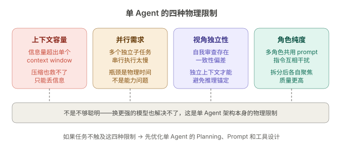
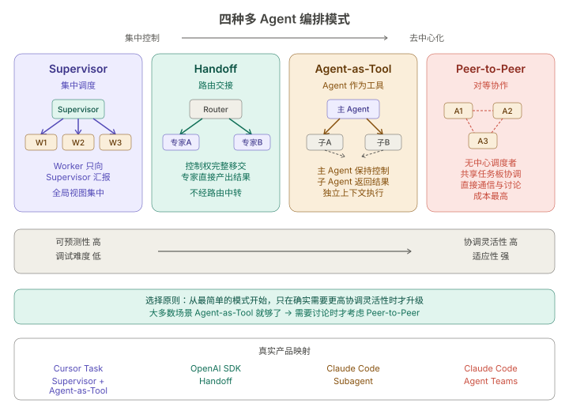

+++
title = "多 Agent 协作：当一个 Agent 不够用时，如何让多个 Agent 分工合作"
date = 2026-03-23T16:00:00+08:00
draft = false
author = "Hex4C59"
description = "解释为什么单 Agent 存在天花板，以及多 Agent 系统的四种编排模式、真实产品中的实现方式与常见失败场景。"
summary = "系统分析多 Agent 协作的核心编排模式（Supervisor、Handoff、Agent-as-Tool、Peer-to-Peer），结合 Claude Code、Cursor、OpenAI Agents SDK 的真实架构，说明多 Agent 系统的设计取舍与工程落地方式。"
tags = ["Agent", "Multi-Agent", "Orchestration", "Coordination", "LLM"]
categories = ["Agent"]
series = ["agent-engineering"]
series_order = 10
difficulty = "intermediate"
article_type = "concept"
topics = ["multi-agent", "orchestration", "coordination", "supervisor", "handoff"]
frameworks = ["OpenAI", "Anthropic", "LangGraph", "CrewAI"]
ShowToc = true
+++

前面九篇文章把单 Agent 的能力栈拆得很清楚了：[Tool Use](/agent/tool-use-core-of-agent/) 让它能行动，[上下文管理](/agent/context-memory-state-management/)让它在长任务中保持方向感，[ReAct](/agent/react-paradigm/) 和 [Planning](/agent/planning-plan-and-execute/) 给了它推理和规划能力，[Reflection](/agent/reflection-agent/) 让它能审视自己的输出，[Prompt 设计](/agent/prompt-design-agent/)和[工具接口设计](/agent/tool-interface-design/)是把这些能力组装起来的工程手段，[评测](/agent/agent-evaluation/)告诉你它到底做得怎么样。

但有一类问题，单 Agent 做得再好也不够：**当任务本身需要多个独立视角、多条并行路径、或者超出单个上下文窗口的承载能力时，你需要多个 Agent 协作。**

这篇文章要回答的是：多 Agent 系统有哪些编排模式，真实产品是怎么做的，以及什么时候该用、什么时候不该用。

---

## 先给结论

1. **多 Agent 的核心价值不是"更多的 Agent"，而是任务分解后的独立执行与结果聚合。** 每个 Agent 有自己的上下文窗口、角色定义和工具集，各自负责一个子问题，最终由编排层把结果组合起来。
2. **四种主流编排模式覆盖了绝大多数场景：Supervisor（集中调度）、Handoff（路由交接）、Agent-as-Tool（Agent 作为工具调用）、Peer-to-Peer（对等协作）。** 它们的复杂度、协调开销和适用场景各不相同。
3. **真实产品已经验证了这些模式。** Claude Code 的 Subagent 和 Agent Teams 分别对应 Agent-as-Tool 和 Peer-to-Peer；Cursor 的 Task 工具是典型的 Supervisor + Agent-as-Tool；OpenAI Agents SDK 原生支持 Handoff 和 Agent-as-Tool 两种模式。
4. **多 Agent 系统最常见的失败不是"协作不起来"，而是"协调开销超过了任务本身的复杂度"。** 大多数被设计成多 Agent 的系统，其实单 Agent 就能搞定。
5. **判断是否需要多 Agent 的标准很简单：任务能否自然地分解成互相独立的子任务？** 如果子任务之间强耦合、需要频繁同步上下文，多 Agent 反而比单 Agent 更慢、更贵、更难调试。

---

## 单 Agent 的天花板在哪里

在决定引入多 Agent 之前，先搞清楚单 Agent 到底在哪里不够用。不是所有"复杂任务"都需要多 Agent——很多时候是 Planning 和工具设计没做好。

单 Agent 真正触及天花板的场景有四类：

**1. 上下文窗口物理不够用**

即使做了压缩和滑动窗口，当任务涉及的信息量本身就超过单个 context window 的容量时，单 Agent 只能丢信息。比如同时审查一个 PR 的安全性、性能影响和测试覆盖率——三个维度各自需要阅读大量代码，放在一个上下文里互相挤占。

**2. 任务天然可并行，但串行太慢**

前端、后端、测试三个模块的修改互相独立。单 Agent 只能一个一个做，三个 Agent 各做一个，wall-clock time 直接除以三。这不是能力问题，是物理时间问题。

**3. 需要独立视角避免偏见**

[Reflection](/agent/reflection-agent/) 那篇讲过自我一致性陷阱——模型倾向于认为自己的输出是合理的。当任务需要真正的批判性审查时（比如竞品分析、代码安全审计），用一个独立的 Agent 做审查，效果比让同一个 Agent 自我审查好得多，因为审查者没有被执行者的推理路径"锚定"。

**4. 角色差异太大，放在一个 prompt 里互相干扰**

一个 Agent 同时扮演"调研员"和"写作者"两个角色，它的 system prompt 需要同时包含调研规范和写作规范，两套指令会互相干扰。拆成两个 Agent，各自只做一件事，prompt 更清晰，执行质量更高。



*图 1：单 Agent 的天花板不在于"不够聪明"，而在于上下文容量、并行需求、视角独立性和角色纯度四个物理限制。*

如果你的任务不属于这四种情况，先回去优化单 Agent 的 Planning、Prompt 和工具设计。多 Agent 不是单 Agent 做不好的升级方案——它是任务结构本身要求的不同解法。

---

## 四种编排模式

多 Agent 系统的核心问题是：**谁来决定哪个 Agent 做什么？Agent 之间怎么传递信息？最终结果由谁汇总？**

不同的编排模式给出了不同的答案。

### 模式一：Supervisor（集中调度）

一个"主管 Agent"负责接收任务、分解子任务、分配给 Worker Agent 执行，然后收集结果并汇总。所有的协调逻辑集中在 Supervisor 身上。

```python
import openai
import json
import asyncio

client = openai.AsyncOpenAI()

async def run_worker(
    worker_name: str,
    worker_instructions: str,
    task: str,
    tools: list | None = None,
) -> str:
    """启动一个 Worker Agent 执行子任务"""
    messages = [
        {"role": "system", "content": worker_instructions},
        {"role": "user", "content": task},
    ]

    for _ in range(10):
        response = await client.chat.completions.create(
            model="gpt-4o",
            messages=messages,
            tools=tools,
        )
        choice = response.choices[0]

        if choice.finish_reason == "stop":
            return choice.message.content

        if choice.finish_reason == "tool_calls":
            messages.append(choice.message)
            for tc in choice.message.tool_calls:
                result = await dispatch_tool(tc.function.name,
                                             json.loads(tc.function.arguments))
                messages.append({
                    "role": "tool",
                    "tool_call_id": tc.id,
                    "content": str(result),
                })

    return f"[{worker_name}] 执行超时"


async def supervisor_orchestrate(goal: str, workers: list[dict]) -> str:
    """
    Supervisor 模式的核心编排逻辑。

    workers 格式：
    [
        {"name": "researcher", "instructions": "...", "tools": [...]},
        {"name": "analyst", "instructions": "...", "tools": [...]},
    ]
    """

    # 第一步：Supervisor 分解任务
    plan_response = await client.chat.completions.create(
        model="gpt-4o",
        messages=[{
            "role": "system",
            "content": (
                "你是一个任务协调者。根据目标和可用的 Worker 列表，"
                "把任务分解成子任务并分配给合适的 Worker。"
                "输出 JSON 格式。"
            ),
        }, {
            "role": "user",
            "content": f"""
目标：{goal}

可用 Workers：
{json.dumps([{"name": w["name"], "capabilities": w["instructions"][:200]}
             for w in workers], ensure_ascii=False, indent=2)}

输出格式：
{{
  "assignments": [
    {{"worker": "worker_name", "task": "具体子任务描述"}},
  ],
  "synthesis_plan": "如何汇总各 Worker 的结果"
}}
""",
        }],
        response_format={"type": "json_object"},
    )

    plan = json.loads(plan_response.choices[0].message.content)
    worker_map = {w["name"]: w for w in workers}

    # 第二步：并行分发子任务给 Workers
    tasks = []
    for assignment in plan["assignments"]:
        w = worker_map[assignment["worker"]]
        tasks.append(run_worker(
            worker_name=w["name"],
            worker_instructions=w["instructions"],
            task=assignment["task"],
            tools=w.get("tools"),
        ))

    results = await asyncio.gather(*tasks)

    # 第三步：Supervisor 汇总结果
    result_summary = "\n\n".join([
        f"=== {plan['assignments'][i]['worker']} ===\n{results[i]}"
        for i in range(len(results))
    ])

    synthesis = await client.chat.completions.create(
        model="gpt-4o",
        messages=[{
            "role": "system",
            "content": "你是一个任务协调者。根据各 Worker 的执行结果，汇总出最终答案。",
        }, {
            "role": "user",
            "content": f"目标：{goal}\n\n各 Worker 结果：\n{result_summary}\n\n汇总计划：{plan['synthesis_plan']}",
        }],
    )

    return synthesis.choices[0].message.content
```

**Supervisor 模式的核心特征：**

- 所有 Worker 只向 Supervisor 汇报，Worker 之间不直接通信
- Supervisor 拥有全局视图，能根据各 Worker 的结果动态调整
- 调试相对简单：所有协调逻辑集中在一个地方

**适用场景：** 任务可以清晰地分解成独立子任务，Worker 之间不需要交流，最终需要一个统一的汇总输出。比如：多维度报告生成、并行代码审查、多源信息调研。

**主要风险：** Supervisor 是单点瓶颈。如果子任务数量多，Supervisor 的上下文窗口也会被各 Worker 的结果撑满。

### 模式二：Handoff（路由交接）

不是一个 Agent 调度多个 Agent，而是一个"路由 Agent"判断当前任务应该交给哪个专家 Agent 处理，然后把对话控制权完整移交。被选中的专家 Agent 直接面对用户（或下游系统），不再经过路由 Agent 中转。

```python
from dataclasses import dataclass
from typing import Callable

@dataclass
class SpecialistAgent:
    name: str
    description: str
    instructions: str
    tools: list | None = None
    condition: Callable[[str], bool] | None = None


async def handoff_router(
    user_message: str,
    specialists: list[SpecialistAgent],
    conversation_history: list[dict],
) -> tuple[str, str]:
    """
    路由 Agent 决定交给哪个专家处理，然后移交控制权。
    返回 (specialist_name, response)。
    """

    specialist_descriptions = "\n".join([
        f"- {s.name}: {s.description}" for s in specialists
    ])

    routing_response = await client.chat.completions.create(
        model="gpt-4o",
        messages=[{
            "role": "system",
            "content": f"""你是一个路由 Agent。根据用户的请求，选择最合适的专家来处理。

可用专家：
{specialist_descriptions}

只输出 JSON：{{"specialist": "专家名称", "reason": "选择原因"}}""",
        }] + conversation_history + [{
            "role": "user",
            "content": user_message,
        }],
        response_format={"type": "json_object"},
    )

    routing = json.loads(routing_response.choices[0].message.content)
    chosen = next(s for s in specialists if s.name == routing["specialist"])

    # 控制权完整移交给专家——专家直接处理，不经过路由中转
    response = await run_worker(
        worker_name=chosen.name,
        worker_instructions=chosen.instructions,
        task=user_message,
        tools=chosen.tools,
    )

    return chosen.name, response
```

**Handoff 与 Supervisor 的关键区别：**

- Supervisor 保持控制权，Worker 把结果交回 Supervisor 汇总
- Handoff 释放控制权，专家 Agent 直接产出最终结果

**适用场景：** 不同类型的请求需要完全不同的处理方式——不同的 prompt、不同的工具集、甚至不同的模型。比如：客服系统根据问题类型路由到不同的专家；开发工具根据任务类型（写代码 / 改配置 / 跑测试）路由到不同的 Agent。

OpenAI Agents SDK 把 Handoff 作为一等公民支持，用 `handoff()` 函数声明 Agent 之间的交接关系，框架自动处理对话上下文的传递。

### 模式三：Agent-as-Tool（Agent 作为工具）

把一个 Agent 包装成 Tool，让主 Agent 像调用普通工具一样调用它。被调用的 Agent 在自己的上下文里独立执行任务，完成后把结果返回给主 Agent。

```python
def agent_as_tool(
    name: str,
    description: str,
    agent_instructions: str,
    agent_tools: list | None = None,
) -> dict:
    """把一个 Agent 包装成 Tool 定义"""
    return {
        "type": "function",
        "function": {
            "name": name,
            "description": description,
            "parameters": {
                "type": "object",
                "properties": {
                    "task": {
                        "type": "string",
                        "description": "要交给这个 Agent 完成的任务描述",
                    },
                },
                "required": ["task"],
            },
        },
        "_agent_config": {
            "instructions": agent_instructions,
            "tools": agent_tools,
        },
    }


async def dispatch_tool(name: str, args: dict) -> str:
    """工具调度——如果是 Agent Tool，启动子 Agent 执行"""
    tool_registry = get_tool_registry()
    tool_def = tool_registry[name]

    if "_agent_config" in tool_def:
        config = tool_def["_agent_config"]
        return await run_worker(
            worker_name=name,
            worker_instructions=config["instructions"],
            task=args["task"],
            tools=config.get("tools"),
        )

    return await call_regular_tool(name, args)
```

**Agent-as-Tool 的核心特征：**

- 主 Agent 决定何时、是否调用子 Agent——调用时机由模型的推理决定，不是预先编排的
- 子 Agent 有完全独立的上下文窗口，不会污染主 Agent 的上下文
- 子 Agent 只返回结果摘要，不返回完整的推理过程

**这正是 Claude Code 的 Subagent 和 Cursor 的 Task 工具采用的模式。** 主 Agent 在执行过程中发现某个子任务适合委托出去——可能是因为需要独立上下文、需要并行执行、或者是为了避免当前上下文被无关信息污染——于是把子任务作为一次"工具调用"分发出去。

**适用场景：** 主 Agent 需要保持对整体任务的控制，但某些子任务最好在独立上下文中完成。比如：Coding Agent 在修改代码时，需要一个子 Agent 去独立探索代码库、另一个子 Agent 去跑测试。

### 模式四：Peer-to-Peer（对等协作）

没有中心调度者。多个 Agent 地位对等，通过共享的通信机制（消息队列、共享文件、任务列表）直接交流，自行认领任务、分享发现、挑战彼此的结论。

```python
import time
from dataclasses import dataclass, field

@dataclass
class SharedTaskBoard:
    """Agent 之间的共享任务板——协调的核心数据结构"""
    tasks: list[dict] = field(default_factory=list)
    messages: list[dict] = field(default_factory=list)
    findings: list[dict] = field(default_factory=list)

    def add_task(self, task_id: str, description: str, depends_on: list[str] | None = None):
        self.tasks.append({
            "id": task_id,
            "description": description,
            "status": "pending",
            "claimed_by": None,
            "depends_on": depends_on or [],
        })

    def claim_task(self, task_id: str, agent_name: str) -> bool:
        for t in self.tasks:
            if t["id"] == task_id and t["status"] == "pending":
                deps_done = all(
                    any(d["id"] == dep and d["status"] == "completed" for d in self.tasks)
                    for dep in t["depends_on"]
                )
                if not deps_done:
                    return False
                t["status"] = "in_progress"
                t["claimed_by"] = agent_name
                return True
        return False

    def complete_task(self, task_id: str, result: str):
        for t in self.tasks:
            if t["id"] == task_id:
                t["status"] = "completed"
                t["result"] = result
                break

    def post_message(self, sender: str, recipient: str | None, content: str):
        """发消息：recipient=None 表示广播"""
        self.messages.append({
            "sender": sender,
            "recipient": recipient,
            "content": content,
            "timestamp": time.time(),
        })

    def get_messages_for(self, agent_name: str) -> list[dict]:
        return [
            m for m in self.messages
            if m["recipient"] is None or m["recipient"] == agent_name
        ]


async def peer_agent_loop(
    agent_name: str,
    instructions: str,
    board: SharedTaskBoard,
    tools: list | None = None,
):
    """单个 Peer Agent 的执行循环"""
    while True:
        available = [
            t for t in board.tasks
            if t["status"] == "pending" and not t["claimed_by"]
        ]
        if not available and all(t["status"] == "completed" for t in board.tasks):
            break

        new_messages = board.get_messages_for(agent_name)
        context = build_peer_context(agent_name, board, new_messages)

        response = await client.chat.completions.create(
            model="gpt-4o",
            messages=[
                {"role": "system", "content": instructions},
                {"role": "user", "content": context},
            ],
            response_format={"type": "json_object"},
        )

        action = json.loads(response.choices[0].message.content)

        if action.get("claim_task"):
            board.claim_task(action["claim_task"], agent_name)
        elif action.get("complete_task"):
            board.complete_task(action["complete_task"], action["result"])
        elif action.get("send_message"):
            board.post_message(agent_name, action["send_message"]["to"],
                               action["send_message"]["content"])
        elif action.get("post_finding"):
            board.findings.append({
                "agent": agent_name,
                "finding": action["post_finding"],
            })
```

**Peer-to-Peer 的核心特征：**

- 没有中心调度者，每个 Agent 自主决定做什么
- Agent 之间通过共享状态（任务板、消息、文件系统）协调
- 协调是"涌现"的，不是预先编排的

**这正是 Claude Code Agent Teams 的设计。** Team Lead 创建任务列表后，Teammate 自行认领任务、互相发消息讨论、挑战彼此的发现。协调通过文件系统上的 JSON 文件进行，不依赖中心化的消息代理。

**适用场景：** 任务需要多个独立视角互相碰撞——竞争性假设调查、对抗性审查、需要讨论和辩论才能收敛的开放性问题。

**主要风险：** 协调开销最高，token 消耗最大，调试最困难。如果任务不真正需要 Agent 之间的交互讨论，这个模式的成本远高于 Supervisor 或 Agent-as-Tool。

---

## 四种模式的对比



*图 2：四种编排模式的核心差异在于控制权的分配方式——从集中控制（Supervisor）到完全去中心（Peer-to-Peer），协调灵活性上升，但可预测性和调试便利性下降。*

|  | Supervisor | Handoff | Agent-as-Tool | Peer-to-Peer |
|--|-----------|---------|---------------|-------------|
| 控制权 | 集中在 Supervisor | 移交给专家 | 主 Agent 保持 | 完全分散 |
| Agent 间通信 | 不通信，只和 Supervisor 交互 | 不通信 | 不通信，只返回结果 | 直接通信 |
| 适合的任务结构 | 可分解的并行子任务 | 类型明确的路由分发 | 主任务中的独立子问题 | 需要讨论和碰撞的开放问题 |
| 协调开销 | 中 | 低 | 低 | 高 |
| Token 消耗 | 中 | 低 | 低~中 | 高 |
| 调试难度 | 低 | 低 | 中 | 高 |

选择的原则很简单：**从最简单的模式开始，只在确实需要更高协调灵活性时才升级。**

大多数场景下，Agent-as-Tool 就够了。只有当子任务之间真正需要互相交流时，才考虑 Peer-to-Peer。

---

## 真实产品中的多 Agent 设计

理论讲完了，来看真实产品是怎么做的。

### Claude Code：Subagent 与 Agent Teams

Claude Code 同时实现了两种多 Agent 机制，分别对应不同的协作需求：

**Subagent（Task 工具）** 是 Agent-as-Tool 模式。主 Agent 在执行过程中通过 Task 工具生成一个子 Agent，子 Agent 在独立的上下文窗口中完成任务，把结果返回给主 Agent。子 Agent 不能生成更多子 Agent，也不能和其他子 Agent 通信。

适用场景是：主 Agent 需要委托一个聚焦的子任务（比如"去搜索一下这个函数的所有调用者"或"在这个文件夹里找到相关的测试文件"），只关心结果，不关心过程。Token 成本低，因为只有结果摘要回到主上下文。

**Agent Teams** 是 Peer-to-Peer 模式。一个 Team Lead 创建团队，生成多个 Teammate，每个 Teammate 是独立的 Claude Code 实例。它们通过共享的任务列表协调工作，通过 Mailbox 机制互相发消息，可以直接挑战彼此的发现。

Agent Teams 的协调架构值得仔细看：

- **任务列表**存储在 `~/.claude/tasks/{team-name}/`，以 JSON 文件形式存在
- **消息投递**是自动的——Teammate 发消息后，接收方自动收到
- **任务认领**使用文件锁防止竞争条件
- 每个 Teammate **加载相同的项目上下文**（CLAUDE.md、MCP 服务器），但**不继承** Team Lead 的对话历史

Anthropic 在文档中明确建议：Agent Teams 的团队规模控制在 3-5 个 Teammate，每个 Teammate 分配 5-6 个任务。超过这个规模，协调开销的增长会超过并行执行的收益。

### Cursor：层级化 Subagent

Cursor 的 Agent 模式采用的是 Supervisor + Agent-as-Tool 的混合模式。主 Agent 拥有一个 `Task` 工具，可以启动不同类型的子 Agent：

- **explore** 子 Agent：快速探索代码库，查找文件和代码模式
- **generalPurpose** 子 Agent：处理复杂的多步任务
- **shell** 子 Agent：执行终端命令
- **best-of-n-runner** 子 Agent：在隔离的 git worktree 中运行实验性修改

每种子 Agent 类型有不同的工具集和能力范围，主 Agent 根据当前需要选择启动哪种子 Agent。这种设计的核心优势在于：

1. **主 Agent 的上下文保持干净。** 代码探索、测试运行这些"脏活"在子 Agent 的独立上下文里完成，只有精炼后的结果回到主上下文。
2. **可以并行启动多个子 Agent。** 主 Agent 在一次响应中可以同时启动多个 Task，它们并行执行。
3. **子 Agent 不能再生成子 Agent。** 这个约束防止了递归嵌套导致的控制链过长和成本失控。

### OpenAI Agents SDK：Handoff 与 Agent-as-Tool

OpenAI Agents SDK 把两种编排模式做成了框架级原语：

**`handoff()`** 声明 Agent 之间的交接关系。一个 Triage Agent 可以把对话完整移交给一个 Specialist Agent，Specialist Agent 带着对话上下文继续处理，不再经过 Triage Agent 中转。

**`agent.asTool()`** 把一个 Agent 包装成工具。Manager Agent 可以调用多个 Specialist Agent 作为工具，收集它们的结果后自己汇总最终答案。

OpenAI 的建议是：**当你需要一个 Agent 掌控最终输出时用 Agent-as-Tool，当你需要专家直接面对用户时用 Handoff。** 两种模式可以在同一个系统里混用——Triage Agent 通过 Handoff 把对话交给一个 Specialist，这个 Specialist 又可以通过 Agent-as-Tool 调用其他 Agent 做子任务。

---

## 多 Agent 协作的常见失败模式

### 1. 协调开销超过任务复杂度

最常见的失败。开发者把一个单 Agent 能在 10 轮工具调用内完成的任务拆成 3 个 Agent，结果光是 Supervisor 的任务分解、分配、结果汇总就消耗了更多的 token 和时间。

**判断标准：** 如果子任务之间有超过 30% 的信息需要共享，多 Agent 的协调成本很可能不划算。

### 2. 上下文割裂导致信息丢失

子 Agent 有独立的上下文窗口，这是优势也是劣势。主 Agent 知道的背景信息，子 Agent 并不自动知道。如果分配任务时没有把必要的上下文传递给子 Agent，子 Agent 会基于不完整的信息做出错误决策。

Claude Code 的 Agent Teams 文档专门强调了这一点：Teammate 不会继承 Team Lead 的对话历史，你需要在 spawn prompt 中包含所有必要的上下文。

```python
# 反面示例：子 Agent 缺少关键上下文
await run_worker(
    worker_name="reviewer",
    worker_instructions="审查代码质量",
    task="审查 src/auth/ 模块",  # 没有说明项目的认证方案和技术栈
)

# 正面示例：传递必要上下文
await run_worker(
    worker_name="reviewer",
    worker_instructions="审查代码质量",
    task=(
        "审查 src/auth/ 模块的安全性。"
        "项目使用 JWT + httpOnly cookie 方案，"
        "后端是 Express.js，数据库是 PostgreSQL。"
        "重点关注 token 过期处理和 CSRF 防护。"
    ),
)
```

### 3. 文件冲突和状态竞争

当多个 Agent 并行修改同一个代码库时，文件冲突几乎不可避免。两个 Agent 同时修改同一个文件，后写入的会覆盖先写入的修改。

Claude Code 的最佳实践是：**让每个 Teammate 拥有不同的文件集。** 如果无法避免重叠，使用 Git worktree 让每个 Agent 在独立的工作目录中操作，最后再合并。

### 4. 责任扩散

多个 Agent 都"以为"某个子任务会被其他 Agent 处理，结果没有任何 Agent 真正去做。这在 Peer-to-Peer 模式下尤其常见，因为没有中心调度者确保每个任务都有人认领。

解决方案：**显式的任务列表 + 认领机制。** 每个任务必须被一个具名的 Agent 认领后才能开始执行。

### 5. 成本和延迟失控

每个 Agent 都是一个独立的模型实例，有自己的 token 消耗。Claude Code 的文档明确说：Agent Teams 的 token 消耗大约是单 Agent 的 2 倍以上，因为每个 Teammate 都有独立的上下文窗口。

Peer-to-Peer 模式的成本增长尤其快：Agent 之间的每次消息交换都是额外的模型调用，5 个 Agent 互相讨论一轮就是 5 次模型调用。如果讨论三轮，就是 15 次。

---

## 什么时候用多 Agent

做一个简单的决策检查：

```text
1. 任务能否自然分解成互相独立的子任务？
   → 否：用单 Agent + Planning
   → 是：继续

2. 子任务是否需要并行执行以节省时间？
   → 否：用单 Agent 串行执行
   → 是：继续

3. 子任务之间是否需要互相交流和讨论？
   → 否：用 Agent-as-Tool 或 Supervisor
   → 是：用 Peer-to-Peer（但要接受高成本）

4. 是否有明确的请求类型需要路由到不同专家？
   → 是：用 Handoff
```

**多 Agent 不是"更高级"的 Agent 架构。** 它是一种在特定任务结构下才有优势的设计选择。如果单 Agent 能搞定，单 Agent 永远是更好的选择——更简单、更便宜、更容易调试。

---

## 总结

单 Agent 的天花板不在于"不够聪明"，而在于上下文容量、并行需求、视角独立性和角色纯度四个物理限制。当任务触及这些限制时，多 Agent 是结构性的解法，不是单 Agent 的"升级版"。

四种编排模式覆盖了从简单到复杂的协作需求：Agent-as-Tool 最轻量，子 Agent 在独立上下文中完成任务后返回结果；Handoff 把控制权交给专家；Supervisor 集中调度多个 Worker 并汇总结果；Peer-to-Peer 让多个 Agent 自主协调，适合需要讨论和碰撞的开放性问题。

真实产品的选择印证了一个原则：**从最简单的模式开始。** Claude Code 默认用 Subagent（Agent-as-Tool），只有在需要 Agent 间交流时才升级到 Agent Teams。Cursor 用 Supervisor + Agent-as-Tool 混合模式，子 Agent 不能再嵌套。OpenAI Agents SDK 把 Handoff 和 Agent-as-Tool 作为两个正交的原语，让开发者按需组合。

多 Agent 系统最大的风险不是技术实现的复杂度，而是在不需要多 Agent 的场景下引入了多 Agent。协调有成本，通信有开销，调试难度指数上升。在引入之前，先确认任务结构真的需要——如果子任务之间高度耦合，多 Agent 不会让事情变好，只会让调试变难。

---

*下一篇：[MCP：让 Agent 的工具生态不再各自为战](/agent/mcp-model-context-protocol/)*
