+++
title = "Planning：当 ReAct 不够用时，Agent 如何提前分解目标"
date = 2026-03-22T23:00:00+08:00
draft = false
author = "Hex4C59"
description = "解释 Planning 为什么是复杂 Agent 任务的必要上层结构，以及 Plan-and-Execute 如何把任务分解、执行与检查点串成稳定闭环。"
summary = "系统分析 ReAct 在长任务中的局限，说明 Planning 的核心思想、Plan-and-Execute 的执行结构、代码实现与常见失败模式。"
tags = ["Agent", "Planning", "ReAct", "Task Decomposition", "LLM"]
categories = ["Agent"]
series = ["agent-engineering"]
difficulty = "intermediate"
article_type = "concept"
topics = ["planning", "plan-and-execute", "agent", "task-decomposition", "reflection"]
frameworks = ["OpenAI", "Anthropic"]
ShowToc = true
+++

在上一篇《ReAct：模型如何让推理与行动交替运转》里，我们把 ReAct 的局限性说清楚了：

> ReAct 是一个“反应式”范式——它在每一步根据当前观察决定下一步，没有全局规划。对于需要提前规划、分解目标、并行执行的复杂长任务，纯 ReAct 往往不够。

这篇文章就是要回答：**不够用的时候，怎么办。**

---

## 先给结论

1. **ReAct 的核心缺陷是“只看当下”。** 它每一步只根据最新的 Observation 决定下一步，没有对整个任务的全局视图。任务越长、越复杂，这个缺陷就越明显。
2. **Planning 的本质是“先想清楚再做”。** 在执行任何动作之前，先生成一份结构化的执行计划，把目标分解成可执行的子任务序列。
3. **Plan-and-Execute 是最常见的 Planning 范式。** 规划阶段生成计划，执行阶段按计划推进，检查点阶段评估是否需要调整。三个阶段分工明确。
4. **Planning 不是 ReAct 的替代品，而是它的上层结构。** 好的 Agent 系统里，Planning 负责任务分解和全局协调，ReAct 负责每个子任务内部的推理与工具调用。
5. **计划的刚性是工程上最重要的设计决策。** 计划太刚性，遇到意外就崩；计划太灵活，和没有计划没区别。找到合适的刚性程度，是 Planning 系统设计的核心挑战。

---

## ReAct 在哪里失效

先通过一个具体场景理解 ReAct 的天花板。

假设任务是：**“分析我们产品过去一个季度的用户流失情况，找出主要原因，并给出改进建议。”**

这个任务包含：
- 从数据库查询流失用户数据
- 对数据进行多维度分析（时间趋势、用户分群、行为路径）
- 查询用户反馈和客服记录
- 综合多个来源的信息得出原因假设
- 验证假设
- 生成结构化报告

用 ReAct 来做，大致会发生什么：

```text
Thought: 我需要分析用户流失情况，先查查数据。
Action: query_database("SELECT * FROM churned_users WHERE ...")
Observation: 返回了 5000 条记录...

Thought: 数据量很大，我来看看流失趋势。
Action: analyze_data("按月统计流失率")
Observation: 1月 3.2%，2月 4.1%，3月 5.8%...

Thought: 流失率在上升，我来看看具体原因...
（继续一步一步走，每步只看当前结果）
```

问题在哪里：

**没有全局结构。** ReAct 不知道“分析流失原因”这件事总共需要几个步骤，哪些步骤是必须的，哪些可以并行，哪些依赖于其他步骤的结果。它只是走一步看一步。

**容易迷失在细节里。** 当某个工具返回了有趣的数据，ReAct 很容易被吸引过去深挖，偏离了原始目标。没有全局计划约束，任务路径很难保持连贯。

**无法保证完整性。** 没有计划意味着没有“完成检查表”。任务执行完后，你不知道是否覆盖了所有必要的分析角度，很容易遗漏关键步骤。

**对长任务来说上下文消耗失控。** 前面[上下文与记忆](/agent/context-memory-state-management/)那篇已经讲过这个问题：没有结构的执行会让 context window 很快被工具结果填满，导致后续推理质量下降。

这些问题，都不是换个更强的模型能解决的。它们是“反应式执行”这个设计本身的局限。

---

## Planning 的核心思想

Planning 的答案直接了当：**在开始执行之前，先生成一份结构化的计划。**

这份计划要回答三个问题：

1. **这个任务可以分解成哪些子任务？**
2. **子任务之间的依赖关系是什么？**（哪些必须先做，哪些可以并行）
3. **每个子任务完成的判断标准是什么？**

有了这份计划，执行阶段就不再是“走一步看一步”，而是在一个明确的框架内推进。

用上面的流失分析任务来对比，有了 Planning 之后：

```text
[规划阶段]
Goal: 分析 Q1 用户流失原因并给出改进建议

Plan:
  Step 1: 提取流失数据（数据库查询）
    → 依赖：无
    → 完成标准：获得完整的流失用户列表和基础指标

  Step 2: 流失趋势分析（基于 Step 1 结果）
    → 依赖：Step 1
    → 完成标准：得出按时间、用户群体的流失率变化

  Step 3: 用户行为路径分析（基于 Step 1 结果）
    → 依赖：Step 1
    → 完成标准：识别流失前的关键行为模式

  Step 4: 用户反馈分析（可与 Step 2、3 并行）
    → 依赖：无
    → 完成标准：提取主要投诉和流失原因关键词

  Step 5: 综合分析，生成假设
    → 依赖：Step 2、3、4
    → 完成标准：列出 3-5 个流失原因假设，每个有数据支撑

  Step 6: 生成改进建议报告
    → 依赖：Step 5
    → 完成标准：结构化报告包含原因、证据、建议三部分

[执行阶段]
按计划逐步执行，每步完成后更新状态
```

这样，Agent 在任何时刻都知道：整个任务的全貌、当前在哪一步、还有哪些步骤没完成、当前步骤的完成标准是什么。

---

## Plan-and-Execute 范式

把上面的思路结构化，就是 Plan-and-Execute 范式。它包含三个阶段：

**规划阶段（Plan）**：给定目标，生成结构化执行计划。

**执行阶段（Execute）**：按计划逐步执行，每个子任务内部可以用 ReAct 来处理工具调用。

**检查点阶段（Checkpoint）**：每完成一个子任务，评估结果，判断是否需要调整后续计划。

三个阶段的关系是：规划是起点，执行是主体，检查点是保险——它让计划在遇到意外时能够自我修正，而不是崩溃或继续执行一个已经不适用的计划。

---

## 代码实现

### 规划阶段

规划器的职责是把一个自然语言目标转化成结构化的执行计划：

```python
import openai
import json
from dataclasses import dataclass, field
from typing import Optional
from enum import Enum

client = openai.OpenAI()

class StepStatus(Enum):
    PENDING   = "pending"
    RUNNING   = "running"
    COMPLETED = "completed"
    FAILED    = "failed"
    SKIPPED   = "skipped"

@dataclass
class PlanStep:
    id: str
    description: str
    depends_on: list[str]
    success_criteria: str
    tools_needed: list[str]
    status: StepStatus = StepStatus.PENDING
    result_summary: Optional[str] = None
    notes: Optional[str] = None

@dataclass
class ExecutionPlan:
    goal: str
    steps: list[PlanStep]
    definition_of_done: str
    constraints: list[str] = field(default_factory=list)

    def get_next_steps(self) -> list[PlanStep]:
        """返回当前可以执行的步骤（依赖已完成，自身未开始）"""
        completed_ids = {s.id for s in self.steps if s.status == StepStatus.COMPLETED}
        return [
            s for s in self.steps
            if s.status == StepStatus.PENDING
            and all(dep in completed_ids for dep in s.depends_on)
        ]

    def is_done(self) -> bool:
        return all(
            s.status in (StepStatus.COMPLETED, StepStatus.SKIPPED)
            for s in self.steps
        )

    def summary(self) -> str:
        lines = [f"目标：{self.goal}", ""]
        for s in self.steps:
            icon = {"pending": "⬜", "running": "🔄",
                    "completed": "✅", "failed": "❌", "skipped": "⏭️"}[s.status.value]
            result = f" → {s.result_summary[:80]}..." if s.result_summary else ""
            lines.append(f"{icon} [{s.id}] {s.description}{result}")
        return "\n".join(lines)


def create_plan(goal: str, context: str = "") -> ExecutionPlan:
    """规划阶段：把目标分解成结构化执行计划"""
    response = client.chat.completions.create(
        model="gpt-4o",
        messages=[
            {
                "role": "system",
                "content": (
                    "你是一个任务规划专家。"
                    "根据给定目标，生成清晰的结构化执行计划。"
                    "计划要完整覆盖目标，步骤之间的依赖关系要准确。"
                    "只输出 JSON，不要有任何其他文字。"
                )
            },
            {
                "role": "user",
                "content": f"""
目标：{goal}
{f"背景信息：{context}" if context else ""}

生成执行计划，格式如下：
{{
  "goal": "目标描述",
  "definition_of_done": "整体任务完成的判断标准",
  "constraints": ["约束条件1", "约束条件2"],
  "steps": [
    {{
      "id": "step_1",
      "description": "步骤描述",
      "depends_on": [],
      "success_criteria": "这步完成的判断标准",
      "tools_needed": ["tool_name"]
    }}
  ]
}}
"""
            }
        ],
        response_format={"type": "json_object"}
    )

    data = json.loads(response.choices[0].message.content)
    steps = [PlanStep(**s) for s in data["steps"]]
    return ExecutionPlan(
        goal=data["goal"],
        steps=steps,
        definition_of_done=data["definition_of_done"],
        constraints=data.get("constraints", [])
    )
```

### 执行阶段

执行阶段负责按计划推进，每个子任务内部用 ReAct 处理：

```python
def execute_step(step: PlanStep, plan: ExecutionPlan, tools: list) -> str:
    """执行单个子任务，内部使用 ReAct 范式"""
    system = f"""你是一个任务执行 Agent。

当前任务计划：
{plan.summary()}

你现在需要执行的步骤：
- ID: {step.id}
- 描述: {step.description}
- 完成标准: {step.success_criteria}
- 可用工具: {', '.join(step.tools_needed)}

执行完成后，输出一段简洁的结果摘要，说明完成了什么、关键发现是什么。
"""
    messages = [
        {"role": "system", "content": system},
        {"role": "user", "content": f"请执行步骤 {step.id}：{step.description}"}
    ]

    # 内部用 ReAct 执行（工具调用循环）
    for _ in range(10):  # 最多 10 轮
        response = client.chat.completions.create(
            model="gpt-4o",
            messages=messages,
            tools=tools
        )
        choice = response.choices[0]

        if choice.finish_reason == "stop":
            return choice.message.content

        if choice.finish_reason == "tool_calls":
            messages.append(choice.message)
            for tc in choice.message.tool_calls:
                args = json.loads(tc.function.arguments)
                result = dispatch_tool(tc.function.name, args)
                messages.append({
                    "role": "tool",
                    "tool_call_id": tc.id,
                    "content": str(result)
                })

    return "步骤执行超时，未能完成。"
```

### 检查点阶段

每完成一个步骤后，评估结果，判断是否需要调整计划：

```python
def checkpoint(plan: ExecutionPlan, completed_step: PlanStep) -> tuple[ExecutionPlan, bool]:
    """
    检查点：评估已完成步骤的结果，判断是否需要调整后续计划。
    返回 (更新后的计划, 是否需要重新规划)
    """
    # 构建当前完成情况的摘要
    completed_summaries = [
        f"[{s.id}] {s.description}: {s.result_summary}"
        for s in plan.steps
        if s.status == StepStatus.COMPLETED
    ]

    pending_steps = [
        f"[{s.id}] {s.description}"
        for s in plan.steps
        if s.status == StepStatus.PENDING
    ]

    response = client.chat.completions.create(
        model="gpt-4o",
        messages=[
            {
                "role": "user",
                "content": f"""
任务目标：{plan.goal}

已完成步骤：
{chr(10).join(completed_summaries)}

刚完成的步骤：[{completed_step.id}] {completed_step.description}
结果：{completed_step.result_summary}

待执行步骤：
{chr(10).join(pending_steps)}

请判断：
1. 根据刚才的结果，后续步骤是否需要调整？
2. 是否发现了计划中遗漏的重要步骤？
3. 任务是否已经可以提前完成？

输出 JSON：
{{
  "needs_replan": true/false,
  "reason": "说明原因",
  "updated_pending_steps": [
    {{"id": "step_x", "description": "...", "depends_on": [], "success_criteria": "...", "tools_needed": []}}
  ],
  "can_finish_early": true/false
}}
"""
            }
        ],
        response_format={"type": "json_object"}
    )

    result = json.loads(response.choices[0].message.content)

    if result["needs_replan"] and result.get("updated_pending_steps"):
        # 只更新待执行的步骤，已完成的不动
        completed = [s for s in plan.steps if s.status != StepStatus.PENDING]
        new_pending = [PlanStep(**s) for s in result["updated_pending_steps"]]
        plan.steps = completed + new_pending

    return plan, result.get("can_finish_early", False)


def run_plan_and_execute(goal: str, tools: list, context: str = "") -> str:
    """完整的 Plan-and-Execute 执行循环"""

    # 1. 规划阶段
    print("=== 规划阶段 ===")
    plan = create_plan(goal, context)
    print(plan.summary())

    # 2. 执行阶段
    print("\n=== 执行阶段 ===")
    while not plan.is_done():
        next_steps = plan.get_next_steps()

        if not next_steps:
            print("没有可执行的步骤，可能存在依赖死锁。")
            break

        # 取第一个可执行步骤（并行执行可以在这里扩展）
        step = next_steps[0]
        step.status = StepStatus.RUNNING
        print(f"\n执行: [{step.id}] {step.description}")

        result = execute_step(step, plan, tools)
        step.result_summary = result
        step.status = StepStatus.COMPLETED
        print(f"完成: {result[:100]}...")

        # 3. 检查点
        plan, can_finish = checkpoint(plan, step)
        if can_finish:
            print("检查点判断：任务可以提前完成。")
            break

    # 生成最终输出
    return generate_final_output(plan)
```

### 完整执行流程回顾

三个阶段串起来的完整流程如下图所示。规划阶段生成结构化计划后进入执行循环：每轮先找出依赖已满足的待执行步骤，用 ReAct 执行，经过检查点评估，直到 `is_done()` 为真才退出循环生成最终输出。否则分支经左侧回环，重新进入 `get_next_steps()`。



*图 1：Plan-and-Execute 由规划、执行、检查点三部分构成；当 `is_done()` 为否时，流程会回到 `get_next_steps()` 继续推进。*

---

## 计划的刚性：最重要的设计决策

前面提到，Planning 设计中最核心的挑战是：**计划应该有多刚性？**

这不是一个有标准答案的问题，需要根据任务性质做权衡。

### 完全刚性计划

规划阶段生成计划后，执行阶段严格按照计划走，中途不允许修改。

```python
# 完全刚性：不调用 checkpoint，直接按顺序执行
def strict_execute(plan: ExecutionPlan, tools: list):
    for step in plan.steps:
        if all(
            s.status == StepStatus.COMPLETED
            for s in plan.steps
            if s.id in step.depends_on
        ):
            result = execute_step(step, plan, tools)
            step.result_summary = result
            step.status = StepStatus.COMPLETED
```

适用场景：任务路径非常确定，每一步输出都可以预期，意外情况极少。比如定期运行的数据报告、标准化的文件处理流程。

风险：一旦某个步骤结果意外，后续步骤可能在错误的前提上继续执行，产生错误传播。

### 完全动态计划

每一步执行完都重新规划，计划随时可以完全推翻重来。

```python
def dynamic_execute(goal: str, tools: list):
    context = ""
    for _ in range(20):  # 最大步数
        # 每步都重新规划
        plan = create_plan(goal, context)
        next_step = plan.get_next_steps()[0]
        result = execute_step(next_step, plan, tools)
        context += f"\n已完成：{next_step.description} → {result}"
        if plan.is_done():
            break
```

适用场景：任务路径高度不确定，每一步结果都可能完全改变后续方向。

风险：每步都重新规划开销很大，而且容易失去对整体进度的把控，变成 ReAct 的另一种形式。

### 带检查点的自适应计划（推荐）

这是上面代码实现的方式：计划在执行中保持稳定，但在每个检查点有机会做局部调整。

核心原则：
- 已完成的步骤不可撤销
- 当前步骤完成后才触发检查点
- 检查点只修改**待执行**的步骤，不推翻整个计划
- 检查点的调整有明确触发条件（结果异常、发现遗漏、可提前完成）

这个设计在稳定性和灵活性之间找到了平衡：计划足够稳定，让执行有全局方向感；同时足够灵活，能应对执行过程中的意外。

---

## Planning 与 ReAct 的关系

一个容易产生的误解是：引入 Planning 之后，就不需要 ReAct 了。

不是这样的。两者在 Agent 系统里处于不同的层次，解决不同的问题：

**Planning 解决的是宏观问题**：
- 任务应该分解成哪些子任务？
- 子任务的执行顺序和依赖关系是什么？
- 整体进度如何追踪？

**ReAct 解决的是微观问题**：
- 在执行某个子任务时，应该调用哪个工具？
- 工具返回了意外结果，下一步怎么调整？
- 当前子任务是否已经完成？

在实际的 Agent 系统里，它们是嵌套关系：Planning 负责把大任务分解成子任务，ReAct 负责执行每一个子任务。`execute_step()` 函数里的工具调用循环，本质上就是 ReAct。

可以用一句话概括它们的分工：**Planning 决定做什么，ReAct 决定怎么做。**

---

## 常见的 Planning 失败模式

**1. 计划太细，失去灵活性**

把每一步都规划得非常具体（“调用 search_web，关键词用 X，过滤条件用 Y”），导致计划成了一个固化的脚本。任何意外都会让计划失效。

好的计划应该在“目标层”描述步骤，而不是在“实现层”。“查找竞品的最新定价信息”是好的步骤描述；“用 Google 搜索‘竞品名称 price 2026’”是实现细节，不应该写进计划。

**2. 计划太粗，无法指导执行**

步骤描述过于抽象，每个步骤都是一个大任务，没有给执行阶段足够的约束。比如“分析用户数据”这个步骤太宽泛，执行阶段不知道从哪里开始，分析什么维度，达到什么程度算完成。

**3. 忽略依赖关系**

所有步骤都写成串行的，没有标注真正的依赖关系。这样就无法发现哪些步骤可以并行，也无法在某步失败时判断哪些后续步骤受影响。

**4. 检查点调整过于激进**

每个检查点都大幅修改计划，导致计划频繁重构，执行进度难以追踪，而且重新规划本身也有成本（时间、token）。检查点的设计应该是“微调”而非“重建”。

**5. 没有完成标准**

步骤没有明确的 `success_criteria`，执行阶段不知道什么时候算完成，容易过度执行或过早停止。每个步骤的完成标准应该是可以客观判断的，而不是“做得差不多”。

---

## 什么时候需要 Planning

不是所有任务都值得引入 Planning。它会增加规划阶段的时间和 token 开销，也会增加系统复杂度。

**适合 Planning 的场景**：

- 任务包含 5 个以上有依赖关系的子任务
- 任务需要跨越多轮工具调用，且整体结构可以提前预判
- 任务失败的代价较高，需要在执行前做好全局把控
- 任务输出需要保证完整性（如报告、分析文档），不能遗漏关键步骤

**不适合 Planning 的场景**：

- 任务简单，ReAct 或单次工具调用就能完成
- 任务路径完全无法预判，每一步都依赖上一步的结果才能决定方向（这种情况纯 ReAct 反而更合适）
- 对响应时间非常敏感（规划阶段本身需要一次模型调用）

---

## 总结

ReAct 的价值在于让推理与行动交替，形成闭环。但它是“反应式”的，只看当前不看全局。当任务变得复杂，这个局限就开始显现。

Planning 不是来取代 ReAct 的，而是在它上面加了一层全局视图：

- 规划阶段把目标分解成结构化的子任务序列
- 执行阶段用 ReAct 处理每个子任务内部的工具调用
- 检查点阶段评估进度，在保持整体稳定的前提下做局部调整

这三层加在一起，才是一个真正能处理复杂任务的 Agent 结构。

计划的刚性是最需要根据场景权衡的设计决策。太刚性，遇到意外就崩；太灵活，和没有计划没区别。带检查点的自适应计划，是大多数场景下合理的起点。

---

*下一篇：如何评测一个 Agent——不只是看它“回答得好不好”，而是看它能不能稳定地把任务做完*
