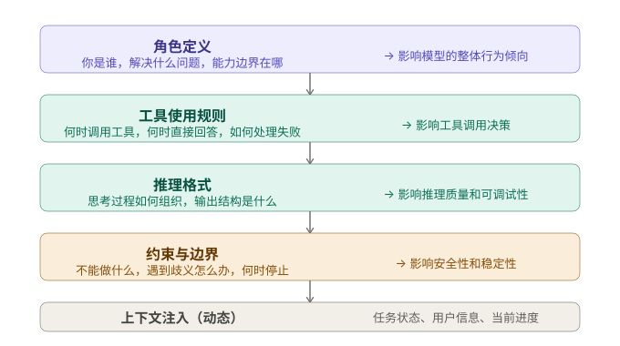

+++
title = "Prompt 设计：Agent 的系统提示词怎么写"
date = 2026-03-23T12:00:00+08:00
draft = false
author = "Hex4C59"
description = "系统解释 Agent 的 system prompt 应该包含哪些部分、为什么这些部分重要，以及常见 prompt 设计错误该如何避免。"
summary = "从角色定义、工具规则、推理格式、约束边界到动态上下文注入，完整拆解 Agent prompt 的设计方法与维护方式。"
tags = ["Agent", "Prompt", "System Prompt", "LLM"]
categories = ["Agent"]
series = ["agent-engineering"]
series_order = 7
difficulty = "intermediate"
article_type = "concept"
topics = ["prompt", "system-prompt", "context", "agent", "tool-use"]
frameworks = ["OpenAI", "Anthropic"]
ShowToc = true
+++

在前面几篇文章里，代码示例里都有一个 `system` 字段，每次都用几行占位文字一笔带过。这篇文章要把这件事正面讲清楚。

Prompt 设计是 Agent 工程里最容易被低估的环节。大多数人在搭好工具调用循环、跑通基本流程之后，就开始调模型参数或者换更强的模型，却没有意识到：**绝大多数 Agent 效果不好，根本原因是 prompt 写得太差，而不是模型不够强。**

这篇文章专门讲 Agent 的 system prompt 应该写什么、怎么写、以及常见的错误写法是什么样的。

## 先给结论

1. **Agent 的 system prompt 和普通聊天 prompt 是两件不同的事。** 聊天 prompt 主要定义风格和人格；Agent prompt 需要定义角色、能力边界、工具使用规则、推理格式和失败处理策略。
2. **Prompt 是 Agent 决策的隐性框架。** 模型在每一步推理时都在这个框架内做选择。框架设计得清不清晰，直接决定了 Agent 在边界情况下的行为质量。
3. **工具描述是 prompt 的一部分，而且往往比 system prompt 本身更重要。** 很多开发者在 system prompt 上花了大量精力，却把工具描述写得一塌糊涂。
4. **好的 prompt 不是越长越好。** 过长的 prompt 会分散模型注意力，把真正重要的指令淹没在冗余内容里。每一行都应该有存在的理由。
5. **Prompt 需要像代码一样维护。** 随着 Agent 功能的扩展和失败案例的积累，prompt 需要持续更新，而不是写完一次就不动了。

## Agent Prompt 的结构

一个完整的 Agent system prompt 通常包含五个部分，每个部分解决不同的问题：



*图 1：一个可维护的 Agent system prompt，通常由角色定义、工具使用规则、推理格式、约束与边界，以及动态上下文注入五个部分构成。*

前四个部分相对稳定，构成 prompt 的骨架；最后一个部分是动态的，每轮推理前根据当前状态更新注入。

## 角色定义：不只是“你是一个助手”

角色定义是 prompt 的第一句话，也是最容易写废的地方。

**常见的错误写法：**

```
你是一个有用的 AI 助手，帮助用户完成各种任务。
```

这句话几乎没有提供任何有效信息。“有用”是废话，“各种任务”没有范围，模型从中得不到任何关于自己应该如何行动的指引。

**更好的写法应该回答三个问题：**

1. 你在这个系统里扮演什么角色
2. 你的主要职责是什么
3. 你的能力边界在哪里

```python
# 代码调试 Agent 的角色定义
ROLE = """
你是一个代码调试 Agent。你的职责是：分析用户描述的代码问题，
通过读取代码文件、执行测试、搜索相关文档，定位 bug 的根本原因，
并给出可验证的修复方案。

你只处理代码相关的问题。如果用户的请求与代码调试无关，
礼貌地说明你的专注范围，不要尝试回答超出范围的问题。
"""

# 研究助手 Agent 的角色定义
ROLE = """
你是一个研究助手 Agent。给定一个研究问题，你负责：
系统性地搜集相关资料、整理关键信息、识别不同来源之间的矛盾，
最终输出一份有数据支撑的结构化分析报告。

你只陈述能从来源中找到证据的结论。当信息不足时，
明确说明"现有资料不足以得出结论"，不要推测或补充训练知识。
"""
```

注意：角色定义里包含了能力边界（“只处理代码相关的问题”）和信息使用规则（“只陈述能从来源中找到证据的结论”）。这些约束写在角色定义里，比写在后面的“约束”部分更容易被模型内化。

## 工具使用规则：最被忽视的关键部分

[Tool Use](/agent/tool-use-core-of-agent/) 那篇讲过，工具描述的质量直接影响模型的调用决策。但除了工具描述本身，system prompt 里还需要明确告诉模型**工具调用的整体策略**。

### 什么时候该调用工具

不写清楚这一点，模型会在两个极端之间随机漂移：有时在有现成知识的情况下还去调工具（浪费），有时在明明需要实时信息的情况下直接用训练知识回答（出错）。

```python
TOOL_RULES = """
工具调用原则：

需要调用工具的情况：
- 任务需要实时或动态信息（当前价格、最新文档、文件内容）
- 需要执行计算或代码验证
- 需要读写外部系统（数据库、文件、API）

不需要调用工具的情况：
- 问题可以直接用已有信息回答
- 用户只是在澄清上下文或确认理解
- 工具上一步已经返回了足够的信息

判断标准：如果我在不调用工具的情况下能给出准确、完整的答案，
就直接回答，不要为了"显得认真"而调用不必要的工具。
"""
```

### 工具失败时怎么办

这是很多 prompt 完全没有覆盖的地方，导致工具失败时模型行为完全不可预测。

```python
TOOL_FAILURE = """
工具调用失败的处理策略：

1. 工具返回空结果：
   - 分析是否是查询参数问题，调整参数重试（最多 2 次）
   - 如果仍然为空，在回答里说明"未找到相关信息"，不要推测

2. 工具返回错误：
   - 记录错误信息，判断是否可以换用其他工具达到同样目的
   - 如果无法绕过，明确告知用户工具不可用，不要继续执行

3. 工具返回了结果但结果可疑（与已知信息矛盾）：
   - 不要直接使用可疑结果
   - 尝试用其他工具验证，或在回答里标注"该信息需要进一步确认"

核心原则：工具失败不等于任务失败。要尝试恢复，
但不要在错误信息的基础上继续推进。
"""
```

### 过度调用的防止

模型有时会在信息已经足够时继续调用工具，这既浪费 token 也增加延迟。

```python
STOP_CRITERIA = """
停止调用工具的时机：

当以下条件满足时，直接整合已有信息给出答案，不再调用工具：
- 已经收集到回答问题所需的全部信息
- 新的工具调用不会带来增量信息
- 已经达到合理的信息饱和点（继续搜索只会找到重复内容）

不要为了"更全面"而无限调用工具。80% 的情况下，
3-5 次有针对性的工具调用已经足够完成任务。
"""
```

## 推理格式：让思考过程可见

[ReAct](/agent/react-paradigm/) 那篇讲过，显式的推理步骤对决策质量和可调试性都有显著提升。在 prompt 里明确要求推理格式，比依赖模型自发推理要稳定得多。

### 结构化推理格式

```python
REASONING_FORMAT = """
每次决策前，按以下格式组织思考：

【当前状态】：简述目前已知的信息和完成进度
【下一步判断】：基于当前状态，判断下一步应该做什么
【行动】：如果需要调用工具，说明调用哪个工具和原因；
         如果信息已足够，说明准备给出最终答案

这个格式不需要在最终回答里显示给用户，
但在执行过程中要始终保持这样的思考结构。
"""
```

注意最后一句：推理格式是给模型自己的指令，不是给用户看的。如果你用原生 function calling，推理过程会通过 `reasoning` 参数字段传递；如果你用文本解析方式实现 ReAct，则会出现在 Thought 字段里。

### 输出格式

输出格式和推理格式是两回事。输出格式规定了最终回答的结构：

```python
OUTPUT_FORMAT = """
最终答案的格式要求：

- 直接回答问题，不要重复用户的问题
- 如果答案来自工具调用，说明信息来源
- 如果有多个步骤或要点，用清晰的结构组织（列表、小标题）
- 如果任务未能完成，说明原因和已经完成的部分
- 长度与任务复杂度匹配：简单问题给简洁答案，复杂分析给完整报告

不要在回答末尾加"如有其他问题请随时告知"之类的套话。
"""
```

## 约束与边界：防御性设计

约束部分定义了 Agent 不应该做的事。好的约束设计是防御性的——它预判了 Agent 可能出现的错误行为，提前在 prompt 里堵住。

常见需要约束的行为：

**幻觉引用**：模型在工具没有返回相关信息时，从训练知识里补充内容，但表现得像是从工具里得到的一样。

```python
"只使用工具返回的信息作为答案依据。如果工具没有返回某条信息，"
"不要从其他来源补充，即使你认为这条信息是正确的。"
```

**任务范围蔓延**：用户在对话中带偏了方向，Agent 跟着偏移，忘记了原始任务。

```python
"始终保持对原始任务目标的追踪。如果对话偏离了原始目标，"
"在完成偏离部分之前，先确认用户是否希望改变任务方向。"
```

**过度自信**：在信息不足的情况下仍然给出确定性的结论。

```python
"当现有信息不足以得出确定结论时，明确说明不确定性，"
"而不是用模糊的语言掩盖不确定性。"
"'根据目前的信息，X 的可能性更大，但需要进一步确认' 比 'X 是正确的' 更诚实。"
```

**危险操作的确认缺失**：对有副作用的工具调用（删除文件、发送邮件、修改数据库）没有二次确认。

```python
"以下操作在执行前必须向用户确认：删除或覆盖文件、"
"发送任何形式的外部通信、修改生产数据库、调用付费 API。"
"即使用户在任务描述里已经提到了这些操作，执行前也要再次确认。"
```

## 动态上下文注入

前四个部分构成了 prompt 的静态骨架，最后一个部分是动态的：每轮推理前，把当前任务状态、用户信息、执行进度等注入到 prompt 里。

[上下文与记忆](/agent/context-memory-state-management/) 那篇里详细讲过任务状态对象的设计，这里重点说注入的格式和位置。

### 注入位置

动态上下文有两个可选的注入位置：

```python
def build_system_prompt(static_prompt: str, task_state: TaskState) -> str:
    # 方式一：追加在 system prompt 末尾
    return static_prompt + "\n\n---\n" + task_state.to_context_string()

def build_messages(static_prompt: str, task_state: TaskState,
                   history: list, user_input: str) -> list:
    # 方式二：作为独立的 user 消息注入
    return [
        {"role": "system", "content": static_prompt},
        {"role": "user", "content": task_state.to_context_string()},
        {"role": "assistant", "content": "已了解当前任务状态，继续执行。"},
        *history[-10:],
        {"role": "user", "content": user_input}
    ]
```

方式一更简单，但随着任务进展，system prompt 会越来越长。方式二把任务状态作为对话历史的一部分，更符合模型对信息位置的注意力分布（开头和结尾比中间更受关注），但需要维护一个“状态确认”的对话轮次。

实践中，如果任务状态比较短（100 tokens 以内），追加在 system prompt 末尾更简单；如果任务状态较长，作为独立消息注入更合适。

### 注入格式

任务状态的注入格式要简洁、结构化，避免冗长的自然语言描述：

```python
def to_context_string(self) -> str:
    return f"""
## 当前任务状态

**目标**：{self.goal}
**当前步骤**：{self.current_focus}
**已完成**：{len(self.completed_subtasks)} 个步骤
**关键发现**：
{chr(10).join(f"- {f}" for f in self.key_findings[-5:])}
**已确定的决策**：
{chr(10).join(f"- {d}" for d in self.decisions_made[-3:])}
""".strip()
```

注意 `key_findings[-5:]` 和 `decisions_made[-3:]`——只注入最近的几条，不是全部历史。越靠近当前的信息越重要，远期历史可以通过情节记忆按需检索。

## 完整示例：一个代码调试 Agent 的 Prompt

把上面所有部分组合起来，看一个完整的例子：

```python
SYSTEM_PROMPT = """
你是一个代码调试 Agent。你的职责是：分析用户描述的代码问题，
通过读取代码文件、执行测试、搜索错误文档，定位 bug 的根本原因，
并给出可验证的修复方案。

你只处理代码相关的问题。对于与代码调试无关的请求，
礼貌说明专注范围，不要尝试回答。

---

## 工具使用原则

需要调用工具时：需要查看文件内容、运行代码验证、搜索错误文档。

不需要调用工具时：问题是通用的语言/框架知识，不依赖具体代码内容。

工具失败处理：
- 读取文件失败 → 请用户确认路径是否正确
- 执行代码报错 → 分析错误信息，这通常就是 bug 的线索
- 搜索无结果 → 换关键词重试一次，仍无结果则说明

---

## 推理要求

每次决策前在内部明确：当前已知什么 → 还缺少什么 → 下一步做什么。

不要在没有读取代码文件的情况下猜测 bug 原因。
不要在没有执行验证的情况下声称修复方案一定有效。

---

## 约束

- 只引用从工具中获取的代码内容，不要补充假设的代码片段
- 修改文件前必须向用户展示修改内容并确认
- 如果 bug 原因不明确，说明"目前无法确定根本原因"，
  给出排查方向，而不是给出不确定的猜测

---

## 输出格式

调试报告结构：
1. 问题定位：bug 在哪里，是什么
2. 根本原因：为什么会出现这个 bug
3. 修复方案：具体的代码修改（附修改前后对比）
4. 验证方式：如何确认修复有效

如果无法完成调试，说明：已完成的分析、遇到的阻碍、建议的下一步。
"""
```

这个 prompt 大约 400 tokens。不算短，但每一部分都有明确作用：角色定义限制了范围，工具规则控制了调用决策，推理要求防止了猜测，约束堵住了高风险操作，输出格式保证了结果的可用性。

## 常见的 Prompt 错误

### 错误一：用“请”和“尽量”代替明确指令

```python
# 错误：模糊的期望
"请尽量在调用工具之前先思考是否真的需要。"

# 正确：明确的规则
"只有在以下情况才调用工具：[具体条件]。其他情况直接回答。"
```

“请”和“尽量”传达的是偏好，不是规则。模型在边界情况下会把它们当作可以忽略的建议。

### 错误二：规则之间互相矛盾

```python
# 矛盾：同时要求快和全
"尽量减少工具调用次数，提高响应速度。"
"确保信息全面，不要遗漏任何重要细节。"
```

当这两条规则冲突时（快速 vs 全面），模型会随机选择，行为不可预测。需要明确优先级：

```python
"在保证核心问题有答案的前提下，控制工具调用在 5 次以内。
如果核心问题需要更多工具调用，优先完成核心问题，
再决定是否补充周边信息。"
```

### 错误三：Prompt 越写越长，关键规则被淹没

随着时间推移，很多团队的 prompt 会慢慢膨胀到 2000-3000 tokens，里面充满了针对各种历史 bug 打的补丁。结果是：每次新加一条规则，模型对旧规则的遵守率就会下降一点。

解决方法不是无限堆砌，而是定期重构：把功能相同的规则合并，把只在特定场景才需要的规则移到动态注入里，保持 prompt 骨架的精简。

### 错误四：忘记测试边界行为

写完 prompt 之后，大多数人只测试“正常路径”——用户提了一个清晰的问题，Agent 顺利完成了。但真正决定 prompt 质量的，是边界情况下的行为：

- 用户给了一个超出 Agent 能力范围的任务，怎么办？
- 工具连续失败三次，还要继续吗？
- 用户中途改变了任务目标，Agent 怎么响应？

这些边界情况应该明确写进测试用例（参考[评测篇](/agent/agent-evaluation/)），而不只是靠直觉判断。

## Prompt 版本管理

把 prompt 像代码一样管理，而不是散落在各个文件里的字符串。

```python
# prompts/debug_agent/v3.py

METADATA = {
    "version": "3.2.1",
    "last_updated": "2026-03-23",
    "changelog": [
        "3.2.1: 在工具失败处理里加了'不要继续在错误信息基础上执行'",
        "3.2.0: 重构输出格式，加入修改前后对比要求",
        "3.1.0: 加入范围约束，处理非代码相关请求",
    ],
    "eval_scores": {
        "task_completion": 0.83,
        "tool_precision":  0.91,
        "stability":       0.87,
    }
}

SYSTEM_PROMPT = """..."""
```

每次修改 prompt 都记录 changelog 和对应的评测分数。这样有两个好处：当某次修改导致指标下降时，可以快速定位是哪个版本引入了问题；当团队成员看到当前 prompt 时，能理解每条规则背后的来历，而不是把它当成不可动的黑盒。

## 总结

Agent 的 system prompt 不是一段介绍文字，而是一套决策框架。它定义了 Agent 在每个推理时刻的行为边界：什么时候调工具、怎么处理失败、如何组织思考、哪些事情不能做。

一个好的 Agent prompt 应该：

- 角色定义清晰，包含能力边界，而不只是笼统的“有用的助手”
- 工具调用规则明确，覆盖触发条件、失败处理和停止时机
- 推理格式显式，让思考过程可见、可调试
- 约束防御性设计，预判常见错误行为并提前堵住
- 动态上下文注入精简，只放当前决策需要的信息

写完不是终点。每次评测发现新的失败模式，都应该问一个问题：这个失败是因为 prompt 没有覆盖这种情况吗？如果是，就更新 prompt，记录变更，重新跑评测。

Prompt 和工具描述、代码逻辑一样，是需要持续维护的工程产物。

---

*下一篇：Reflection——Agent 如何在执行完成后审视自己的输出，发现并纠正错误*
