+++
title = "ReAct：模型如何让推理与行动交替运转"
date = 2026-03-22T22:00:00+08:00
draft = false
author = "Hex4C59"
description = "解释 ReAct 如何让模型在推理与行动之间交替运转，以及它为什么是 Agent 推理机制的基础范式。"
summary = "系统分析 ReAct 的来源、执行结构、工程实现、核心价值与适用边界，说明它如何把工具调用从盲目行动变成可读、可调试的推理闭环。"
tags = ["Agent", "ReAct", "Reasoning", "Tool Use", "LLM"]
categories = ["Agent"]
series = ["agent-engineering"]
series_order = 4
difficulty = "advanced"
article_type = "concept"
topics = ["react", "reasoning", "tool-use", "agent", "planning"]
frameworks = ["OpenAI", "Anthropic"]
ShowToc = true
+++

在前三篇文章里，我们已经把 Agent 的基础结构搭清楚了：

- [什么是 Agent](/agent/what-is-agent/)：目标 + 上下文 + 决策能力 + 执行能力 + 反馈闭环
- [Tool Use](/agent/tool-use-core-of-agent/)：工具是 Agent 与外部世界连接的接口层
- [上下文与记忆](/agent/context-memory-state-management/)：如何在长任务中维持方向感

但有一个问题一直没有正面回答：**模型在决定“下一步做什么”时，内部是如何推理的？** 它怎么知道该先搜索再总结，而不是直接给答案？它又怎么知道第一次搜索结果不够用，需要换个关键词再搜一次？

这就是 ReAct 要回答的问题。

---

## 先给结论

1. **ReAct 是一种让模型交替进行“推理”和“行动”的范式。** 它不是一个框架，也不是一个库，而是一种 prompt 设计模式。
2. **ReAct 的核心思想是：把模型的思考过程显式化。** 让模型在每次行动前先写出推理步骤，再决定调用什么工具、传什么参数。
3. **ReAct 解决的根本问题是“盲目行动”。** 没有显式推理的 Agent 更容易直接输出错误答案或随机调用工具；有了推理步骤，错误往往在行动之前就能被发现。
4. **ReAct 不是万能的，它有明确的适用边界。** 推理步骤会消耗 token，对简单任务是浪费；对复杂任务它是地基，但仅靠它也不够，还需要更完整的 Planning 机制（下一篇的主题）。

---

## ReAct 从哪里来

ReAct 来自 2022 年的一篇论文：*ReAct: Synergizing Reasoning and Acting in Language Models*（Yao et al., 2022）。

论文的核心观察是：单纯的“推理链”（Chain-of-Thought，CoT）和单纯的“行动序列”（Action-only）各有缺陷。

**纯推理链（CoT）的问题**：模型只在语言空间里推理，无法获取外部信息。遇到需要实时数据或验证的问题，它只能“编”——用训练时的知识猜测，而不是查询真实结果。

**纯行动序列的问题**：模型直接输出工具调用，没有中间推理步骤。它不知道“为什么要调用这个工具”，也无法根据上一步的结果判断“下一步该做什么不同的事”。遇到失败，它往往只是重复相同的操作。

ReAct 把两者结合：**在每次行动之前，先显式写出推理步骤**。

---

## ReAct 的结构

ReAct 的执行轨迹由三种元素交替组成：

```text
Thought: （模型的内部推理，解释当前的判断和下一步计划）
Action:  （决定调用什么工具，以及参数）
Observation: （工具返回的结果）

→ 然后再次 Thought → Action → Observation → ...

→ 直到模型判断任务完成：
Thought: 我已经拿到足够的信息，可以给出最终答案。
Answer: （最终回答）
```

用一个具体例子来看，假设用户问：“LangChain 和 LlamaIndex 目前哪个 GitHub star 更多？”

**没有 ReAct 的 Agent（直接行动）**：

```text
Action: search_web("LangChain vs LlamaIndex GitHub stars")
Observation: [搜索结果...]
Answer: LangChain 有更多 star。
```

这种方式存在问题：搜索词可能不够精确，返回的是对比文章而非实时数据；模型没有判断结果是否可信的过程，直接输出了答案。

**有 ReAct 的 Agent**：

```text
Thought: 用户想比较两个库的 GitHub star 数量。
        这需要实时数据，不能靠训练知识回答。
        我应该分别查询两个库的 star 数，而不是搜索对比文章。

Action: search_web("LangChain GitHub repository stars 2026")
Observation: LangChain 官方仓库目前有约 9.8 万 star。

Thought: 拿到了 LangChain 的数据。现在需要查 LlamaIndex。

Action: search_web("LlamaIndex GitHub repository stars 2026")
Observation: LlamaIndex 官方仓库目前有约 3.9 万 star。

Thought: 两个数据都拿到了，LangChain 约 9.8 万，LlamaIndex 约 3.9 万。
        数据来源可信，可以给出回答。

Answer: 目前 LangChain 的 GitHub star 数量（约 9.8 万）显著多于
        LlamaIndex（约 3.9 万）。
```

区别很明显：ReAct 版本里，模型在每次行动前都说清楚了“为什么”，在拿到结果后也解释了“接下来怎么看”。这个推理过程既帮助模型做出更好的决策，也让整个执行轨迹对开发者可读。

---

## 如何实现 ReAct

ReAct 本质上是一个 prompt 模式，实现它不需要任何特殊框架。核心是在 system prompt 里告诉模型用 Thought/Action/Observation 的格式进行推理。

### 方式一：原生 prompt 实现

```python
import openai
import json

client = openai.OpenAI()

SYSTEM_PROMPT = """你是一个任务执行 Agent，使用 ReAct 范式完成任务。

每次回复必须严格按照以下格式：

Thought: <你的推理过程，解释当前状态和下一步计划>
Action: <工具名称>
Action Input: <JSON 格式的工具参数>

当你认为已经收集到足够信息，可以给出最终答案时，使用：

Thought: <最终推理>
Answer: <最终答案>

规则：
- 每次只能输出一个 Action
- 必须先 Thought 再 Action，不能跳过推理步骤
- 收到 Observation 后，必须再次 Thought 再决定下一步
- 如果工具返回了错误或空结果，在 Thought 里分析原因并调整策略
"""

tools_description = """
可用工具：
- search_web(query: str) → 搜索网页，返回相关内容摘要
- get_weather(city: str) → 获取指定城市的当前天气
- calculate(expression: str) → 计算数学表达式
"""

def run_react_agent(user_query: str, max_steps: int = 10):
    messages = [
        {"role": "system", "content": SYSTEM_PROMPT + "\n\n" + tools_description},
        {"role": "user", "content": user_query}
    ]

    for step in range(max_steps):
        response = client.chat.completions.create(
            model="gpt-4o",
            messages=messages,
            temperature=0
        )
        output = response.choices[0].message.content
        messages.append({"role": "assistant", "content": output})

        print(f"\n--- Step {step + 1} ---")
        print(output)

        # 检查是否给出了最终答案
        if "Answer:" in output:
            answer = output.split("Answer:")[-1].strip()
            return answer

        # 解析 Action
        if "Action:" in output and "Action Input:" in output:
            action_line = [l for l in output.split('\n') if l.startswith("Action:")][0]
            input_line  = [l for l in output.split('\n') if l.startswith("Action Input:")][0]

            tool_name   = action_line.replace("Action:", "").strip()
            tool_input  = json.loads(input_line.replace("Action Input:", "").strip())

            # 执行工具
            observation = execute_tool(tool_name, tool_input)

            # 把 Observation 加入对话
            messages.append({
                "role": "user",
                "content": f"Observation: {observation}"
            })
        else:
            # 模型没有按格式输出，提醒它
            messages.append({
                "role": "user",
                "content": "请按照 Thought/Action/Action Input 或 Thought/Answer 格式回复。"
            })

    return "达到最大步数限制，任务未完成。"


def execute_tool(tool_name: str, tool_input: dict) -> str:
    """工具路由，实际项目里替换成真实实现"""
    if tool_name == "search_web":
        return mock_search(tool_input.get("query", ""))
    elif tool_name == "get_weather":
        return mock_weather(tool_input.get("city", ""))
    elif tool_name == "calculate":
        return str(eval(tool_input.get("expression", "0")))  # 演示用，生产环境用沙箱
    else:
        return f"错误：未知工具 '{tool_name}'"
```

这个实现的核心逻辑是：让模型按格式输出，解析 Action，执行工具，把 Observation 追加进对话，循环直到模型输出 Answer。

### 方式二：结合原生 Function Calling

现代 LLM API（OpenAI、Anthropic）都支持原生的 Function Calling，可以把 ReAct 的推理部分和原生工具调用结合起来：

```python
def run_react_with_function_calling(user_query: str):
    tools = [
        {
            "type": "function",
            "function": {
                "name": "search_web",
                "description": "搜索网页获取实时信息",
                "parameters": {
                    "type": "object",
                    "properties": {
                        "query": {"type": "string", "description": "搜索关键词"},
                        "reasoning": {
                            "type": "string",
                            "description": "解释为什么要搜索这个内容，以及你期望找到什么"
                        }
                    },
                    "required": ["query", "reasoning"]
                }
            }
        }
    ]

    system = """你是一个 ReAct Agent。
每次调用工具时，必须填写 reasoning 字段，说明你为什么调用这个工具。
拿到工具结果后，根据结果判断任务是否完成，或者是否需要继续调用工具。
"""
    messages = [
        {"role": "system", "content": system},
        {"role": "user", "content": user_query}
    ]

    while True:
        response = client.chat.completions.create(
            model="gpt-4o",
            messages=messages,
            tools=tools
        )
        choice = response.choices[0]

        if choice.finish_reason == "stop":
            return choice.message.content

        if choice.finish_reason == "tool_calls":
            messages.append(choice.message)
            for tc in choice.message.tool_calls:
                args = json.loads(tc.function.arguments)
                # 打印 reasoning，让执行过程可读
                print(f"[Reasoning] {args.get('reasoning', '')}")
                print(f"[Action] {tc.function.name}({args.get('query', '')})")

                result = execute_tool(tc.function.name, args)
                print(f"[Observation] {result[:200]}...")

                messages.append({
                    "role": "tool",
                    "tool_call_id": tc.id,
                    "content": result
                })
```

这种方式里，`reasoning` 字段就是 ReAct 里的 Thought——它被内嵌进工具调用参数里，强制模型在每次行动前写出推理理由。

---

## ReAct 的执行流程

把上面的实现抽象成流程图，一次完整的 ReAct 执行是这样的：



*图 1：ReAct 的标准循环。模型先进行 Thought 判断；如果信息不足，就进入 Action，调用外部工具并获得 Observation；Observation 再被追加进上下文，驱动下一轮推理；如果信息已经足够，则直接输出 Answer。*

循环的退出条件有三个：
1. 模型判断信息已足够，输出 Answer
2. 达到最大步数限制（防止无限循环）
3. 工具调用失败且无法恢复

---

## ReAct 的真正价值：推理轨迹的可读性

除了让模型做出更好的决策，ReAct 还有一个工程价值经常被低估：**它产生了可读的执行轨迹**。

在没有 ReAct 的 Agent 里，当某个任务失败时，你看到的可能是：

```text
[tool_call] search_web("xxx")
[result] 返回了不相关的结果
[tool_call] search_web("xxx")  ← 完全相同的调用，为什么？
[result] 还是不相关
[output] 抱歉，我无法找到相关信息。
```

你不知道模型为什么重复调用，也不知道它是否意识到结果不对。调试几乎无从下手。

有了 ReAct，同样的失败变成：

```text
Thought: 我需要查找 XXX 的最新数据。

Action: search_web
Action Input: {"query": "xxx"}
Observation: 返回了不相关的结果，主要是关于 YYY 的内容。

Thought: 搜索结果不相关，可能是关键词太宽泛。
        我应该加上更具体的限定词，比如年份或者具体的场景。

Action: search_web
Action Input: {"query": "xxx 2026 specific-context"}
```

现在你可以看到：第二次调用是有意识的调整，不是盲目重复。模型的推理是透明的。这对于 Agent 的调试、评测和优化来说，是质的差别。

---

## ReAct 的局限性

ReAct 不是银弹，了解它的边界和适用条件一样重要。

### 局限一：推理步骤消耗 token

每个 Thought 都是额外的输出。对于简单的单步任务（“帮我把这段文字翻译成英文”），强制走 ReAct 流程是浪费。ReAct 的价值在多步骤、需要中间判断的任务上才能充分体现。

### 局限二：Thought 不等于正确推理

显式写出 Thought 不代表推理一定正确。模型有时会写出听起来合理但实际有误的推理步骤，然后基于错误的推理做出错误的决策。ReAct 让推理可见，但并不保证推理的质量，这依赖于模型本身的能力和 prompt 的设计。

### 局限三：对长任务力不从心

ReAct 是一个“反应式”（reactive）范式——它在每一步根据当前观察决定下一步，没有全局规划。对于需要提前规划、分解目标、并行执行的复杂长任务，纯 ReAct 往往不够，需要在它之上加入 Planning 层。这也是下一篇要讨论的内容。

### 局限四：格式脆弱性

如果用原生 prompt 实现 ReAct（方式一），模型有时会输出不符合格式的内容，导致解析失败。用原生 Function Calling（方式二）可以规避这个问题，但会牺牲一些推理步骤的灵活性。实际工程中需要在两者之间权衡。

---

## ReAct 与相关范式的关系

ReAct 在 Agent 范式家族里处于什么位置？

**Chain-of-Thought（CoT）**：只有推理，没有行动。适合数学、逻辑等不需要外部信息的问题。ReAct 是在 CoT 基础上加入了行动能力。

**ReAct**：推理 + 行动交替，适合需要工具调用的单目标任务。核心特点是“反应式”——每一步根据当前 Observation 决定下一步。

**Plan-and-Execute**：先生成完整计划，再按计划执行。适合结构清晰、步骤可以预先确定的任务。与 ReAct 的区别在于：ReAct 是动态的，Plan-and-Execute 是静态的（但可以在执行中调整计划）。

**Reflection / Self-Critique**：在 ReAct 执行完成后（或执行过程中），让模型评估自己的输出质量，必要时重新执行。是 ReAct 的扩展，增加了自我纠错能力。

这几个范式不是互斥的，实际的 Agent 系统经常把它们组合使用：用 ReAct 处理单步工具调用，用 Plan-and-Execute 管理多阶段任务，用 Reflection 做质量保证。

---

## 什么时候用 ReAct

**适合 ReAct 的场景**：

- 任务需要多次工具调用，且下一步依赖上一步的结果
- 任务涉及信息检索、验证、对比等需要“边查边想”的过程
- 你需要 Agent 的执行过程可读、可调试
- 任务的路径不是完全固定的，需要根据中间结果动态调整

**不适合（或不需要）ReAct 的场景**：

- 单步任务（一次工具调用就能完成）
- 固定流程任务（步骤完全预先确定，用 Workflow 更合适）
- 对延迟非常敏感的场景（每个 Thought 都增加 token 消耗和响应时间）
- 任务复杂度超出 ReAct 能处理的范围（需要 Planning）

---

## 总结

ReAct 做的事情其实很简单：**在行动之前，先把想法写出来**。

这一个改变带来了三件事：

1. **更好的决策质量**：显式推理帮助模型做出更有依据的工具调用，而不是随机猜测
2. **更强的错误恢复**：模型能看到自己的推理轨迹，在观察到失败时有意识地调整策略
3. **可读的执行过程**：开发者能看懂 Agent 在做什么，调试和优化从“盲盒”变成了“透明箱”

它不是最复杂的 Agent 范式，但它是最基础的一个。后续的 Planning、Reflection、Multi-Agent 协作，几乎都建立在 ReAct 或类似“推理-行动”交替结构的基础上。

理解了 ReAct，你就掌握了 Agent 推理机制的地基。

---

