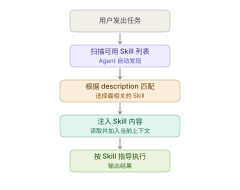
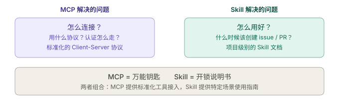

+++
title = "Skill：不改模型、不写代码，教会 Agent 做专家级别的事"
date = 2026-03-23T17:30:00+08:00
draft = false
author = "Hex4C59"
description = "从 Agent 的领域知识鸿沟出发，解释 Skill 这一新兴概念的设计动机、工作机制与实践价值，说明它为什么可能成为 Agent 能力扩展的主流范式。"
summary = "系统解析 Skill 的概念、动机、结构、发现机制与生态趋势，说明它和 Tool、Prompt、微调的区别，以及为什么「写一份文档」可能比「训练一个模型」更实用。"
tags = ["Agent", "Skill", "Prompt Engineering", "Knowledge", "LLM"]
categories = ["Agent"]
series = ["agent-engineering"]
series_order = 12
difficulty = "beginner"
article_type = "concept"
topics = ["skill", "knowledge", "prompt", "agent", "architecture"]
frameworks = ["Cursor", "OpenAI"]
ShowToc = true
+++

在这个系列里，我们花了大量篇幅讨论 Agent 的执行能力：[Tool Use](/agent/tool-use-core-of-agent/) 让它能连接外部世界，[MCP](/agent/mcp-model-context-protocol/) 让工具生态可以标准化复用，[工具接口设计](/agent/tool-interface-design/)让工具真正好用。

但有一个问题，讨论工具时往往不会深入触碰：**Agent 知道该怎么用这些工具吗？**

不是"能不能调用"的问题——模型显然可以生成工具调用请求。而是"知不知道在什么场景下、用什么策略、按什么顺序、以什么标准来使用它们"的问题。

举一个具体的例子：你给一个 Coding Agent 接上了文件读写、代码搜索、终端执行这些工具。它能用。但它知道你的项目用 Hugo 而不是 Next.js 吗？它知道你的博客文章要用 TOML front matter 而不是 YAML 吗？它知道你的 Agent 系列文章必须以"先给结论"开头吗？

这些不是工具能力的问题，是**领域知识**的问题。模型训练时不可能覆盖每个人的每个项目、每个团队的每套规范、每个领域的每种最佳实践。

**Skill 就是为了填补这个鸿沟而出现的。**

---

## 先给结论

1. **Skill 是一种结构化的知识模块，用来教 Agent 在特定领域或任务中如何正确行动。** 它不是工具，不改模型权重，本质上是"写给 Agent 看的操作手册"。
2. **Skill 解决的核心问题是：通用模型缺少特定领域的操作知识。** 模型很聪明，但它不知道你的项目结构、你的编码规范、你的部署流程——除非你告诉它。
3. **Skill 和 Tool 是互补关系，不是替代关系。** Tool 提供"能做什么"（能力），Skill 提供"该怎么做"（知识）。一个知道用锤子的人，和一个知道钉子该往哪钉的人，不是同一回事。
4. **Skill 的价值在于可复用、可共享、零训练成本。** 你写一次 Skill，Agent 永久拥有这项知识。不需要微调、不需要额外训练数据、不需要改动模型。
5. **Skill 正在从个人实践走向生态化。** Cursor、Codex 等产品已经原生支持 Skill 机制，社区共享的 Skill 库正在形成。

---

## 从一个真实场景说起

假设你有一个 Hugo 博客，里面有一个 Agent 专题系列。你希望 AI 助手帮你写下一篇文章。

你对它说："帮我写一篇关于 Guardrails 的博客。"

一个没有 Skill 的 Agent 会怎么做？它会生成一篇"看起来不错"的文章——可能用 Markdown 格式，可能有合理的结构——但大概率会踩到以下问题：

- front matter 用了 YAML 而不是 TOML
- 没有 `series_order`、`difficulty`、`article_type` 这些你自定义的字段
- 时区写成了 UTC 而不是 +08:00
- 缺少"先给结论"这个你的系列必有的章节
- 代码示例用了 JavaScript 而不是你习惯的 Python + OpenAI SDK
- 没有引用系列里其他文章的链接

这些问题每一个都很小，但组合起来，意味着你拿到的草稿需要大量手动修改。

而如果这个 Agent 在执行前先读了一份 Skill，里面清楚写着你的 front matter 格式、文章结构规范、代码风格偏好和跨文章引用惯例——它生成的内容就能直接接近你的标准。

**这就是 Skill 最直观的价值：让 Agent 从"通用地聪明"变成"在你的场景里真正好用"。**

---

## Skill 到底是什么

用最简单的定义：

> **Skill 是一份写给 Agent 看的结构化文档，告诉它在特定任务中应该遵循什么知识、什么流程、什么标准。**

它通常包含三个部分：

### 1. 元数据：Agent 怎么发现它

```yaml
---
name: write-agent-blog
description: >-
  Write blog posts for the Hugo + PaperMod Agent series. Use when the user asks
  to create, draft, or write a new Agent blog post.
---
```

`name` 是标识符，`description` 是触发条件。Agent 在接到任务时，会扫描可用的 Skill 列表，根据 `description` 判断哪个 Skill 和当前任务相关，然后自动读取并遵循。

这意味着 Skill 的发现不是手动的——你不需要每次都对 Agent 说"先读一下那个文件"。Agent 自己会判断什么时候需要用哪个 Skill。

### 2. 知识内容：Agent 需要知道什么

这是 Skill 的核心部分。它可以包含：

- **项目结构信息**：哪些目录放什么文件、配置文件在哪
- **格式规范**：front matter 模板、代码风格、命名约定
- **工作流程**：创建新内容的步骤、部署流程、测试流程
- **领域概念**：特定业务的术语定义、设计约束
- **示例**：好的输出长什么样、坏的输出长什么样

关键原则是**只写 Agent 不可能自己知道的东西**。模型已经知道怎么写 Markdown、怎么用 Python、怎么组织文章结构——你不需要在 Skill 里重复这些。你需要写的是：你的项目里 Markdown 的 front matter 长什么样、Python 代码应该用什么 SDK、文章结构有什么特殊要求。

### 3. 参考资料：太长的内容怎么办

如果某些知识量很大（比如完整的 API 文档、几十条编码规则），不应该全塞进一份文件里。正确的做法是**渐进式披露**：

```markdown
## 快速上手
[核心指令，30 行以内]

## 详细参考
- 完整的 front matter 字段说明，见 [reference.md](reference.md)
- 历史文章的风格示例，见 [examples.md](examples.md)
```

Agent 会先读主文件，只在需要时才去读补充文件。这样既不浪费上下文窗口，又保证了完整性。

---

## Skill 和其他概念的区别

这是很多人初次接触 Skill 时最容易混淆的地方。

### Skill vs Tool

这是最根本的区别。

| | Tool | Skill |
|---|---|---|
| 本质 | 可执行的能力 | 结构化的知识 |
| 做什么 | 让 Agent 能"做"某件事 | 让 Agent 知道"怎么做好"某件事 |
| 形态 | API、函数、命令行工具 | 文档、指令、模板、示例 |
| 运行时行为 | Agent 调用它来产生副作用 | Agent 读取它来指导决策 |
| 例子 | `read_file`、`search_web`、`run_command` | "如何写 Agent 博客"、"代码审查标准" |

一个比喻：Tool 是 Agent 的**手**，Skill 是 Agent 的**经验**。

你可以给一个人一把手术刀（Tool），但如果他不知道人体解剖结构（Skill），这把刀没有意义。反过来，一个外科医生没有手术刀也做不了手术。两者缺一不可。

### Skill vs System Prompt

System prompt 也可以给 Agent 传递指令，但两者的设计目标不同。

| | System Prompt | Skill |
|---|---|---|
| 作用范围 | 全局，影响所有对话 | 按需加载，只影响相关任务 |
| 内容量 | 通常较短（几百到几千 token） | 可以很长（通过渐进式披露） |
| 可复用性 | 绑定在单个 Agent 配置里 | 可以跨项目、跨 Agent 共享 |
| 发现方式 | 手动配置 | Agent 自动匹配 |
| 适合的内容 | 身份设定、全局行为规则 | 特定任务的领域知识和操作流程 |

简单说：System prompt 定义 Agent "是谁"，Skill 定义 Agent "在某个领域里该怎么做"。

### Skill vs Fine-tuning

这是一个更重要的对比，因为两者在某种程度上解决的是同一个问题——让模型在特定领域表现更好。

| | Fine-tuning | Skill |
|---|---|---|
| 修改对象 | 模型权重 | 上下文（prompt / 文档） |
| 成本 | 高（需要训练数据、GPU、时间） | 极低（写一份文档） |
| 生效速度 | 慢（训练 + 部署） | 即时（保存即生效） |
| 迭代速度 | 慢（重新训练） | 快（修改文档即可） |
| 适用模型 | 只影响被微调的那个模型 | 适用于任何能读上下文的模型 |
| 深度 | 深（改变模型的内在行为模式） | 浅（引导模型的当前行为） |
| 适合场景 | 需要改变模型核心行为（风格、格式、推理方式） | 需要补充领域知识和操作规范 |

**Skill 不是 fine-tuning 的替代品，但在大多数实际场景中，Skill 是更务实的选择。**

因为大部分时候，模型的"基础能力"是够用的——它会写代码、会分析文档、会组织内容。它缺的只是你的项目的具体细节。为了这些细节去微调一个模型，投入产出比太低了。

---

## Skill 是怎么工作的

一个完整的 Skill 工作流程：



### 关键机制：自动发现

Skill 系统最巧妙的地方在于**自动发现**——Agent 不需要用户显式指定使用哪个 Skill，而是通过 `description` 字段自动匹配。

这意味着 `description` 的写法直接决定了 Skill 能不能被正确触发。

**好的 description：**

```yaml
description: >-
  Write blog posts for the Hugo + PaperMod Agent series. Use when the user asks
  to create, draft, or write a new Agent blog post, or when they want to add
  content to the Agent section of the blog.
```

这段描述同时包含了两个关键信息：**做什么**（Write blog posts for the Agent series）和**什么时候触发**（when the user asks to create, draft, or write）。

**不好的 description：**

```yaml
description: "帮助写作"
```

太模糊了。Agent 无法判断这个 Skill 是帮写博客、帮写邮件还是帮写代码注释。

### 存储位置

Skill 通常有两种存储位置：

| 类型 | 路径 | 适用场景 |
|------|------|---------|
| 个人级别 | `~/.cursor/skills/skill-name/SKILL.md` | 你个人的通用规范（代码风格、commit 格式） |
| 项目级别 | `.cursor/skills/skill-name/SKILL.md` | 特定项目的规范（跟代码一起提交，团队共享） |

项目级别的 Skill 尤其值得关注：它可以跟着代码仓库走，意味着**团队里每个人的 Agent 都会自动获得同样的领域知识**。新人入职，clone 项目，Agent 就已经"知道"这个项目的规范了——不需要任何额外配置。

---

## 怎么设计一个好的 Skill

### 原则一：只写 Agent 不知道的

这是最重要的原则。Agent 的上下文窗口是有限的，Skill 占据的每一个 token 都在和其他信息竞争空间。

```markdown
<!-- 不需要写这些 -->
Markdown 是一种轻量级标记语言，使用 # 表示标题...
Python 是一种编程语言，使用 def 定义函数...

<!-- 需要写这些 -->
本项目使用 TOML 格式的 front matter，不是 YAML。
所有 Agent 系列文章必须包含 series = ["agent-engineering"]。
代码示例统一使用 Python + openai SDK，async 风格。
```

### 原则二：具体胜过泛化

```markdown
<!-- 太泛了，Agent 不知道具体要怎么做 -->
请写出高质量的文章。

<!-- 具体到可执行 -->
每篇文章必须以"先给结论"章节开头，包含 3-5 条编号的核心判断。
每条判断必须加粗关键句，然后用 1-2 句话展开。
```

### 原则三：用示例传递隐性知识

有些知识很难用规则描述清楚，但一看示例就懂了。

```markdown
## 文章开头的写法

好的开头示例（从已有文章中提取）：

> 在前面几篇文章里，我们把 Agent 的执行能力搭起来了：ReAct 让它边推理边行动，
> Planning 让它在长任务里保持全局视图。但有一个能力一直没有专门讨论……

特点：引用系列前文 → 提出空白点 → 引出本篇主题。
避免：不要用"大家好，今天我们来聊聊……"这类开头。
```

### 原则四：控制长度，渐进披露

Skill 的主文件建议控制在 **500 行以内**。超出的内容拆分到参考文件中。

```markdown
## 快速上手
[核心规则和模板，150 行]

## 深入了解
- 完整字段说明：[reference.md](reference.md)
- 风格示例库：[examples.md](examples.md)
```

Agent 只会在主文件的指引下按需读取参考文件，不会一次性加载所有内容。

---

## 一个完整的 Skill 示例

以"给 Hugo 博客写 Agent 系列文章"这个场景为例：

```
write-agent-blog/
├── SKILL.md           # 主文件：核心规范和流程
```

**SKILL.md 的核心内容（节选）：**

```markdown
---
name: write-agent-blog
description: >-
  Write blog posts for the Hugo + PaperMod Agent series. Use when the user asks
  to create, draft, or write a new Agent blog post.
---

# Write Agent Blog Post

## Front Matter 模板

每篇 Agent 文章使用 TOML front matter：

（模板内容）

## 文章结构

1. 开头 2-3 段：设定问题，引用系列前文
2. 先给结论：3-5 条核心判断
3. 问题分析：为什么这件事重要
4. 核心概念：定义和架构
5. 实现细节：Python 代码示例
6. 失败场景：至少 2-3 个
7. 总结：3-5 条要点

## 代码风格

- Python + openai SDK，async/await
- 代码注释用中文
- 使用 gpt-4o 作为默认模型
```

当用户对 Agent 说"帮我写一篇关于 Guardrails 的博客"时，Agent 会：

1. 发现 `write-agent-blog` 这个 Skill 和任务相关
2. 读取 SKILL.md，获得项目规范
3. 按照规范中的 front matter 模板、文章结构和代码风格来生成内容

整个过程对用户来说是透明的——你不需要每次都告诉 Agent "记得用 TOML"、"记得写先给结论"。

---

## Skill 和 MCP 的关系

在 [MCP](/agent/mcp-model-context-protocol/) 那篇里，我们讨论了工具生态的标准化。MCP 解决的是"Agent 怎么连接外部工具"的问题。

Skill 解决的是另一半："Agent 连上工具之后，怎么用好它们。"



两者可以组合使用。MCP 提供标准化的工具接入能力，Skill 提供特定场景下的使用指南。MCP 是"万能钥匙"，Skill 是"开锁说明书"。

---

## Skill 的生态趋势

Skill 不是某个产品的私有概念，它正在成为 Agent 生态中的一个通用模式。

### 已经支持 Skill 机制的产品

- **Cursor**：通过 `.cursor/skills/` 目录支持项目级和个人级 Skill
- **Codex (OpenAI)**：通过 `~/.codex/skills/` 支持 Skill，并提供可安装的 Skill 列表
- **Claude Code**：通过 `CLAUDE.md` 文件实现类似机制（虽然叫法不同，但本质一样）
- **Windsurf**：通过 `.windsurfrules` 支持项目级规则

不同产品的叫法不同——有的叫 Skill，有的叫 Rule，有的叫 Instructions——但核心思路是一致的：**让用户用自然语言文档来定制 Agent 的行为。**

### Skill 共享与社区

当 Skill 的格式和存储方式变得标准化之后，社区共享就成了自然的下一步。

想象一个场景：你要开始一个新的 Python 项目，你可以直接安装社区里已有的 Skill：

```bash
# 假设的 Skill 安装命令
codex skills install python-best-practices
codex skills install git-commit-conventions
codex skills install docker-deployment
```

安装完成后，你的 Agent 就自动具备了 Python 编码规范、Git commit 格式和 Docker 部署流程的知识。不需要你写一行配置，不需要微调任何模型。

这和 npm / pip 包管理的逻辑是一样的——只不过管理的不是代码依赖，而是**知识依赖**。

---

## Skill 的局限性

Skill 不是万能的，了解它的边界同样重要。

### 上下文窗口的限制

Skill 的内容需要被注入到模型的上下文中。如果 Skill 太长（几千行），它会显著压缩模型可用于处理任务本身的上下文空间。这就是为什么渐进式披露如此重要——核心内容要精简，详细参考按需加载。

### 不能替代深层能力

如果模型本身不具备某种能力（比如精确的数学计算、特定编程语言的高级语法），Skill 教不会它。Skill 能教"怎么做"，但前提是模型有"做"的基础能力。

这就像给一个不会游泳的人写一份详细的游泳教程——教程再好，他跳进水里还是可能出问题。Skill 的价值建立在模型已有能力的基础上。

### 依赖 description 质量

如果 Skill 的 `description` 写得模糊或者与任务不匹配，Agent 可能根本不会触发这个 Skill。自动发现机制的质量，完全取决于 description 的精确度。

### 版本管理和一致性

当项目规范变化时，Skill 也需要同步更新。如果 Skill 过时了但没人维护，Agent 反而会按照过时的规范行事，造成更多混乱。好在项目级 Skill 跟代码放在一起，可以跟随代码一起做版本管理。

---

## 总结

回到最初的问题：Agent 有了工具之后，还缺什么？缺的是知识——不是通用知识，是**你的场景里的特定知识**。

Skill 用一种极其轻量的方式解决了这个问题：写一份文档，Agent 立刻就能用。不需要训练数据、不需要 GPU、不需要重新部署模型。

五个核心要点：

1. **Skill 是写给 Agent 看的操作手册。** 它不改模型、不写代码，用自然语言文档告诉 Agent 在特定领域该怎么做。
2. **Tool 提供能力，Skill 提供知识。** 两者互补。工具让 Agent 能做事，Skill 让 Agent 做对事。
3. **Skill 最大的价值是低成本、高复用。** 写一次，永久生效，跨项目共享，团队成员的 Agent 自动对齐。
4. **好的 Skill 只包含 Agent 不可能自己知道的信息。** 不要重复模型已有的知识，只补充你的项目、你的团队、你的领域特有的规范和经验。
5. **Skill 生态正在形成。** 从个人文档到团队共享，再到社区安装，Skill 有潜力成为 Agent 知识层的"包管理器"。

从更长远的视角看，Skill 代表了一种新的人机协作模式：**你不需要成为 AI 专家才能让 Agent 在你的领域里变得专业，你只需要把你的专业知识写成 Agent 能理解的格式。** 这可能是 Agent 走向真正普及的关键一步。

---

*上一篇：[MCP：让 Agent 的工具生态不再各自为战](/agent/mcp-model-context-protocol/)*
