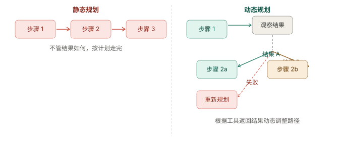
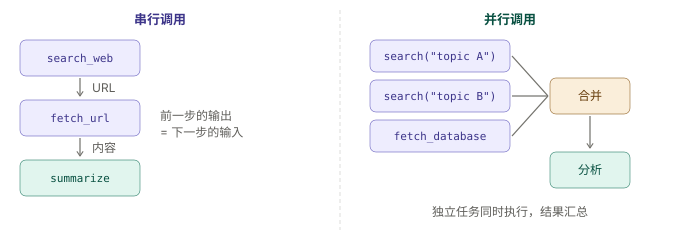

+++
title = "Tool Use：为什么它是 Agent 的核心能力"
date = 2026-03-22T18:00:00+08:00
draft = false
author = "Hex4C59"
description = "从模型的封闭性出发，解释 Tool Use 为什么是 Agent 与外部世界连接的关键接口，以及工程上如何把工具系统设计到真正可用。"
summary = "系统分析 Tool Use 在 Agent 中的角色，涵盖函数调用协议、执行闭环、工具设计、并发调用、安全边界与 MCP。"
tags = ["Agent", "Tool Use", "Function Calling", "LLM"]
categories = ["Agent"]
series = ["agent-engineering"]
series_order = 2
difficulty = "advanced"
article_type = "concept"
topics = ["tool-use", "function-calling", "architecture", "llm"]
frameworks = ["OpenAI", "Anthropic"]
ShowToc = true
+++

在上一篇文章《什么是 Agent：从聊天助手到可执行系统》里，我提到过一个判断：如果让我只选一个最关键的能力，我会优先选 Tool Use。

这句话听上去很绝对，但我现在依然这么认为。原因并不是规划、记忆、反思这些能力不重要，而是如果一个系统根本无法连接外部世界，那么后面的很多能力都很难真正产生工程价值。一个只能在上下文里“想”和“说”的模型，再聪明，也很难变成真正能干活的 Agent。

这篇文章，我会从模型能力边界出发，解释为什么语言模型本身是一个封闭系统，Tool Use 是如何把这种封闭打破的，它在执行层面到底是怎么工作的，以及为什么一个工程上可用的 Agent，必须认真设计自己的工具层，而不能只把它理解成“让模型调几个函数”。

## 先给结论

先把核心判断摆出来。

1. **语言模型本质上是一个封闭的文本函数，它能生成，但不能访问、不能执行、也不能感知外部状态。**
2. **Tool Use 是模型与外部世界之间的接口层，它把“生成能力”扩展成了“行动能力”。**
3. **Tool Use 不是简单的函数调用，而是一个持续的结构化决策过程：是否调用、调用哪个、传什么参数、结果回来后怎么继续。**
4. **工具设计质量会直接决定 Agent 的上限。** 描述不清、粒度不合理、错误信息不可读，都会让模型系统性地做出错误决策。
5. **没有 Tool Use，很多所谓的执行闭环其实是假的。** 模型最多只能告诉你“下一步应该怎么做”，但它自己做不到。

换句话说，如果说模型是 Agent 的“大脑”，那 Tool Use 更像它的“手脚”和“感官接口”。没有这一层，Agent 很难真正从“会回答”变成“会做事”。

## 模型为什么天然是封闭的

要理解 Tool Use 的价值，必须先理解语言模型的能力边界。

从工程视角看，一个语言模型可以被抽象成一个很简单的函数：它接收上下文文本，然后输出下一段文本。无论它看上去多智能，这个本质都没有变。

可以把它理解成这样：

```text
f(context: string) -> text: string
```

这意味着模型天生存在几个限制：

- 它不知道当前时间，除非你显式告诉它
- 它不能自己访问网页，除非你把网页内容放进上下文
- 它不能读你的本地代码、数据库或文件系统，除非你先把这些信息取出来
- 它写出来的代码不会自动运行
- 它的知识有训练时间边界，之后发生的事情它天然不知道

这些限制不是某个模型做得不够好，而是语言模型这种架构本身的事实。它擅长的是对文本进行建模，而不是直接与外部环境交互。

但现实里的任务，往往恰恰需要和外部环境发生关系。比如：

- 查最新信息
- 读取本地文档或代码仓库
- 执行命令或运行代码
- 调用 API
- 写入数据库或发送消息

只要任务涉及这些动作，模型就必须获得一种“越过上下文边界”的能力。Tool Use 的意义，就在这里。



*图 1：语言模型本身是封闭的文本函数，Tool Use 作为接口层把模型与搜索、文件系统、代码执行、数据库 / API 以及 MCP 服务连接起来。*

## Tool Use 到底是什么

很多人第一次接触 Tool Use，会把它理解成“让模型调用函数”。这个理解没错，但只说到了一半。

如果只看最表层，它确实像函数调用：开发者注册一组工具，模型在某个时刻输出一个工具调用请求，系统执行后再把结果回传给模型。

但真正关键的地方在于：**工具调用的决策本身，是模型在运行时做出来的。**

这就让 Tool Use 和传统编程中的函数调用产生了根本区别。

在传统代码里，什么时候调用什么函数，是程序员提前写死的逻辑。而在 Agent 里，模型需要自己判断：

- 当前上下文的信息够不够
- 现在要不要调用工具
- 应该调用哪个工具
- 参数要怎么填
- 工具结果回来了之后，是继续调别的工具，还是结束任务

所以 Tool Use 不是“把函数开放给模型”这么简单，它本质上是一个**模型驱动的结构化决策协议**。

## Tool Use 在执行层面是怎么工作的

如果从协议流程上拆开来看，通常会经历下面四步。

### 1. 注册工具

在请求模型之前，系统先把可用工具的描述交给模型。这些描述一般包括：

- 工具名称
- 工具用途
- 输入参数 schema
- 参数含义和格式要求

例如一个搜索工具，可以长这样：

```json
{
  "name": "search_web",
  "description": "Search the web for current information. Use this when you need facts, news, or recent data not guaranteed to be in the model's training.",
  "input_schema": {
    "type": "object",
    "properties": {
      "query": {
        "type": "string",
        "description": "The search query"
      }
    },
    "required": ["query"]
  }
}
```

### 2. 模型决策

模型读取用户任务和工具描述后，判断当前是不是需要调用工具。如果需要，它不会像平时那样直接输出自然语言，而是输出一个结构化的工具调用请求。

例如：

```json
{
  "type": "tool_use",
  "name": "search_web",
  "input": {
    "query": "Claude 3.5 Sonnet release date"
  }
}
```

### 3. 执行与回传

系统拿到这个请求后，真正去执行搜索，然后把结果再回传给模型。

```json
{
  "role": "user",
  "content": [
    {
      "type": "tool_result",
      "tool_use_id": "toolu_123",
      "content": "Claude 3.5 Sonnet was released on June 20, 2024."
    }
  ]
}
```

### 4. 继续推理

模型看到工具结果后，会重新判断：

- 信息已经够了，可以直接回答
- 还不够，需要再调一次工具
- 当前路径不对，应该换个策略

这四步可能重复很多次，直到任务真正完成。

## 为什么关键不在“调用”，而在“决策”

真正让 Tool Use 变得重要的，并不是外层那个调用动作，而是模型内部持续发生的决策过程。

模型需要在每一步不断回答几个问题：

- 当前任务到底缺什么信息
- 现有上下文是否已经足够
- 哪个工具最适合当前目标
- 调用结果是否可信、是否完整
- 下一步是继续、回退还是结束

这就是为什么同样一组工具，不同模型表现会差很多。能力弱的模型，容易乱调工具、漏调工具、参数填错，或者结果已经够了还继续反复调用。能力强的模型，即使工具数量不多，也能更合理地组织多步执行。

所以 Tool Use 的上限，和模型本身的推理能力其实高度耦合。工具只是给了可能性，真正把这套可能性用好的，仍然是模型的判断能力。

## Tool Use 为什么能打通执行闭环

在上一篇里我把一个最小可用 Agent 拆成了五个部分：目标、上下文、决策能力、执行能力和反馈闭环。Tool Use 恰好位于这五个部分的连接点上。

这个循环看似简单，但它决定了 Agent 到底是真的在执行，还是只是在“模拟执行”。

没有 Tool Use 的情况下，模型最多只能说：

- “你现在可以去搜一下这个问题”
- “建议运行一下这段代码验证”
- “下一步应该去查数据库”

它说得再对，也只是建议，不是行动。

而一旦有了 Tool Use，模型就不只是描述动作，而是可以真正发起动作，再根据动作结果继续决策。执行闭环从这一刻才真正成立。



*图 2：一个最小可用的 Tool Use 闭环通常包含目标输入、模型推理、是否需要工具的判断、结构化工具调用、外部执行，以及 `tool_result` 回传后的再次推理。*

## 一个更直观的例子：Research Agent

如果只讲原理，还是会有点抽象。来看一个典型案例。

假设用户提出一个任务：**帮我调研 OpenAI 最近发布的模型，并整理成一张对比表。**

如果没有 Tool Use，模型只能依赖训练数据作答，信息很可能已经过时。

但如果它具备 Tool Use，执行过程就会完全不同。

### 第一轮

模型先判断：这是一个需要最新信息的问题，当前上下文不够，应该先搜索。

```text
[Tool Call] search_web("OpenAI latest model release 2025")
[Result] "OpenAI released o3 and o4-mini in April 2025..."
```

### 第二轮

模型发现还缺 benchmark 和定价，于是继续搜。

```text
[Tool Call] search_web("OpenAI o3 benchmark performance")
[Result] "o3 scored 87.5% on ARC-AGI..."

[Tool Call] search_web("OpenAI o4-mini pricing API")
[Result] "$1.1 per million input tokens..."
```

### 第三轮

模型判断：关键信息已经够了，可以开始组织最终输出。

```text
| 模型     | 发布时间  | 强项           | 定价（输入）    |
|---------|----------|---------------|----------------|
| o3      | 2025.04  | 推理、数学、编程 | $10/M tokens   |
| o4-mini | 2025.04  | 轻量、低成本     | $1.1/M tokens  |
```

这个过程最值得注意的地方是：模型并不是一开始就写好完整计划再机械执行，而是在每一次得到结果后，重新判断下一步。这就是动态执行，而 Tool Use 正是这个动态过程成立的前提。

## 为什么 Tool Use 和规划能力是绑在一起的

很多人会把“规划”和“工具调用”看成两个独立模块：先规划，再调用工具。但在工程上，这种划分往往太理想化了。

更真实的情况是：规划和工具调用通常是交织在一起的。

因为工具结果会直接改变模型对任务的理解，而理解一旦变化，原来的计划就可能要变。

这就引出了一个很重要的区分：静态规划和动态规划。



静态规划在流程稳定时可以工作，但在开放任务里很脆弱。动态规划根据工具结果实时调整路径，但依赖 Tool Use 提供的实时反馈。

这就是为什么没有 Tool Use 的“规划型 Agent”经常看起来很聪明，但实际一做复杂任务就容易偏离。因为它没有实时信息输入，计划是在“盲开”。

Tool Use 给了模型一种感知现实的方式，而这种感知能力，正是动态规划成立的基础。

## 工具设计为什么经常比 Prompt 更重要

很多人在做 Agent 时，首先想到的是调 prompt、换模型、加链式思维。但如果系统真的依赖工具完成任务，那么工具层的设计质量，往往才是决定上限的那个变量。

### 工具描述就是模型的使用手册

模型会不会正确调用工具，很大程度取决于你给它的说明是不是足够清楚。

一个很差的描述可能像这样：

```json
{
  "name": "get_data",
  "description": "Get data from the system"
}
```

这种描述几乎没有提供任何可执行判断。模型不知道：

- 这到底是什么数据
- 什么场景下该用
- 什么场景下不该用
- 参数要怎么填

更好的描述应该明确告诉模型：

- 工具是干什么的
- 什么时候应该使用
- 什么时候不要使用
- 参数的格式、取值范围和语义

例如：

```json
{
  "name": "get_user_orders",
  "description": "Retrieve the order history for a specific user. Use this when you need past purchases, order status, or spending patterns. Do NOT use this for product catalog queries.",
  "input_schema": {
    "type": "object",
    "properties": {
      "user_id": {
        "type": "string",
        "description": "The unique user identifier in UUID format"
      },
      "limit": {
        "type": "integer",
        "description": "Maximum number of orders to return, default 10, max 100"
      }
    },
    "required": ["user_id"]
  }
}
```

这类描述会显著降低模型误调工具的概率。

### 工具粒度也很关键

另一个常见问题是工具粒度不合理。

**太粗** 的工具，通常意味着一个接口想做太多事情。模型需要理解复杂参数组合，失败后也很难排查到底是哪一层出了问题。

**太细** 的工具，则会让工具列表膨胀，选择空间变得模糊，模型很容易在多个相近工具里摇摆不定。

我更认同一种折中原则：**一个工具对应一个清晰意图。**

如果你发现某个任务总是稳定地连续调用两个工具，并且这两个工具几乎绑定出现，那它们就可能应该在接口层做一定程度的合并。

### 错误处理一定要对模型友好

工具不会总成功。网络超时、权限问题、参数错误、速率限制，这些情况都会出现。

如果你只把错误粗暴地回传成一行字符串，比如：

```text
Error: 500 Internal Server Error
```

那模型很难知道下一步应该怎么办：

- 要不要重试
- 是不是参数错了
- 还是说明这个工具根本不该再用了

更好的做法，是返回结构化错误信息，例如：

```json
{
  "error": true,
  "error_type": "rate_limit",
  "message": "API rate limit exceeded. Please retry after 5 seconds.",
  "retryable": true,
  "retry_after_seconds": 5
}
```

清晰的错误语义，能让模型做出更合理的后续决策。

## 多工具调用：串行、并行与依赖关系

当 Agent 稍微复杂一点之后，任务通常不会只依赖一个工具，而是多个工具协同工作。

这里通常有两种模式。



现代主流模型接口已经支持在一次响应里输出多个工具调用请求，这意味着很多 Research Agent、数据分析 Agent 在信息收集阶段都可以显著提速。

工程上真正要做好的，是维护工具调用之间的依赖关系。哪些可以并发，哪些必须等上一步结果回来之后再执行，这一点决定了效率和复杂度。

## Tool Use 还带来了安全问题

只要 Agent 能调用工具，它就不再只是一个“说话系统”，而是可能真正影响外部系统的执行者。能力上去了，风险也就一起上来了。

一个设计不当的工具系统，可能导致：

- 敏感数据被读取或泄露
- 模型执行了不可逆操作，例如删文件、发邮件、提交代码
- 通过 Prompt Injection 间接触发了不该执行的工具

所以工具设计不能只看“能不能用”，还必须考虑“边界是否安全”。

我觉得至少有几个原则应该是默认项：

### 最小权限原则

工具只暴露完成任务所需的最小能力。一个只做资料整理的 Agent，根本不该有写文件或外发消息的权限。

### 操作分级

把工具区分成只读和有副作用两类。有副作用的操作，例如发送邮件、写数据库、执行命令，应该有更严格的确认流程，甚至要求人工批准。

### 参数验证

不要把模型生成的参数原样直接喂给工具执行层。无论模型多强，都应该在执行前做参数校验、清洗和边界限制。

### 审计日志

所有工具调用都应该可追踪：

- 什么时候调的
- 调了什么参数
- 返回了什么结果
- 为什么下一步会这么做

这不仅是安全需要，也是调试 Agent 行为最重要的证据链。

## 从 Tool Use 到 MCP

Tool Use 再往前走一步，就会碰到一个更大的问题：工具生态的标准化。

传统方式下，每个 Agent 系统都要自己定义工具接口、自己实现接入逻辑，工具很难复用，也不容易互操作。于是不同框架、不同应用之间，工具层经常是割裂的。

MCP（Model Context Protocol）想解决的，就是这个问题。

它本质上是在工具提供方和模型客户端之间定义一套标准协议。工具提供者实现 MCP Server，兼容 MCP 的 Agent 系统就可以直接接入，不需要每个项目都重复造一遍工具适配层。

从单个项目视角看，MCP 会显著降低工具接入成本；从整个生态角度看，它可能逐渐演化成 AI Agent 工具层的基础设施。

我在 [MCP：让 Agent 的工具生态不再各自为战](/agent/mcp-model-context-protocol/) 里对 MCP 的架构设计、核心原语、传输机制和安全模型做了完整的分析，感兴趣可以跳过去看。

## 总结

回到最开始的问题：为什么 Tool Use 是 Agent 的核心能力？

因为它解决的是语言模型最根本的局限——封闭性。

没有 Tool Use，模型再聪明，也更像一个只会给建议的顾问；有了 Tool Use，模型才真正获得了接触外部世界、驱动外部系统、根据实时结果调整策略的能力。Agent 从“会说”到“会做”的那一步，基本就是从这里开始的。

但 Tool Use 本身并不会自动把系统变好。真正决定效果的，往往是工具的设计质量：

- 描述是不是清楚
- 粒度是不是合理
- 错误是不是可理解
- 并发和依赖是不是组织得当
- 权限边界是不是足够安全

所以 Tool Use 是能力入口，但把这个入口设计好，本身就是一项严肃的工程工作。
