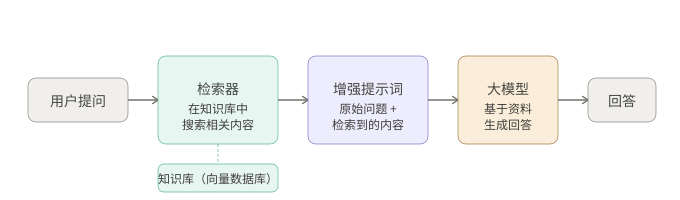
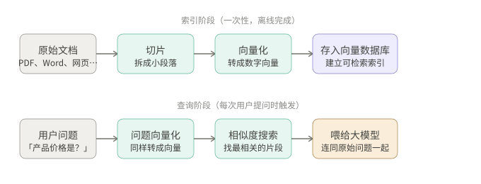

+++
title = "什么是 RAG：让大模型用上你自己的知识库"
date = 2026-03-25T12:00:00+08:00
draft = false
author = "Hex4C59"
description = "从检索增强生成的基本流程出发，说明索引、向量化、混合检索与重排序等关键环节，以及 RAG 与微调、Agent 的关系。"
summary = "解释 RAG 如何解决大模型知识过时、缺私有知识与幻觉问题，并梳理切片、Embedding、向量库、混合检索与上下文增强等工程要点。"
tags = ["Agent", "RAG", "Embedding", "向量检索", "LLM"]
categories = ["Agent"]
series = ["agent-engineering"]
series_order = 14
difficulty = "beginner"
article_type = "concept"
topics = ["rag", "retrieval", "embeddings", "vector-database", "agent"]
frameworks = ["OpenAI", "Anthropic"]
ShowToc = true
+++

你有没有遇到过这种情况：问大模型一个关于你公司产品的问题，它一本正经地给了你一个错误答案；或者问它最近发生的事，它说「我的知识截止到某某年，无法回答」。

这不是模型变笨了，这是模型的结构性限制：**它只知道训练时见过的数据，不知道你的私有知识，也不知道训练截止后发生的事情。**

RAG 就是解决这个问题最主流的方案。这篇文章从零开始，把 RAG 是什么、为什么需要它、它怎么工作、有哪些关键设计决策，系统讲清楚。

---

## 大模型的知识局限

在讲 RAG 之前，先把问题本身说清楚。

大语言模型的知识来自训练数据。训练完成之后，模型的参数就固定了。它不会自动更新，不能访问互联网，更不知道你公司内部的文档、数据库、产品手册里写了什么。

这带来三类具体问题：

**知识过时**：模型的训练数据有截止日期。2025 年发生的事，一个 2024 年训练的模型不可能知道。

**缺乏私有知识**：你的内部 Wiki、客户合同、产品规格书从来没有出现在模型的训练数据里。模型对它们一无所知。

**幻觉**：当模型不知道答案，但又被迫要回答时，它会「编」一个听起来合理的内容，这就是大家常说的幻觉（Hallucination）。RAG 提供了真实的信息来源，让模型有据可查，是目前减少幻觉最有效的工程手段之一。

解决这些问题有两条路：**微调（Fine-tuning）** 和 **RAG**。它们的本质区别是：

微调是把新知识「烧」进模型参数里，改变模型本身。就像给人补课，学完之后知识成了他自己的。

RAG 是在模型回答之前，先从外部找到相关资料，把资料塞给模型，让模型基于这些资料来回答。就像考试时允许带参考书——模型不需要背下来，只需要知道怎么查和用。

对大多数实际场景来说，RAG 比微调更实用：不需要重新训练模型，知识库随时可以更新，成本低，而且可以追溯答案来源。

---

## RAG 的基本思路

RAG 的全称是 Retrieval-Augmented Generation（检索增强生成）。这三个词本身就说清楚了它的工作方式：

- **Retrieval（检索）**：从知识库里找相关内容
- **Augmented（增强）**：把找到的内容加进模型的输入
- **Generation（生成）**：模型基于这些内容生成回答

一句话概括：**在用户问问题之前，先去知识库里查一下，把查到的相关内容一起喂给模型，让模型有依据地回答。**



*图 1：RAG 查询阶段的数据流*

这是最简单的 RAG 流程。现实中会更复杂，但核心逻辑就是这样。

---

## 知识库是怎么建立的

RAG 的问答流程（查询时）很直观，但在此之前，需要先把知识库建立起来。这个过程叫**索引（Indexing）**，发生在用户提问之前。



*图 2：离线索引与在线查询*

索引阶段通常只做一次（或当文档更新时重做），查询阶段在每次用户提问时都会触发。

### 第一步：切片（Chunking）

原始文档通常很长，无法整段放进模型的上下文。需要先把文档切成小片段，每个片段几百字左右。

切片听起来简单，实际有很多讲究。**切得太短**，每个片段缺少上下文，检索到的内容可能语义不完整；**切得太长**，片段包含太多无关内容，检索精度下降。

最直接的方式是按固定长度（比如每 500 个 token）切一刀，加上一点重叠区域（比如每个片段的开头包含上一片段末尾的 100 个 token），防止在切割点丢失上下文。更高级的方式是按语义边界切——在段落、章节、主题变换处切，而不是在句子中间硬切。

### 第二步：向量化（Embedding）

切好的文本片段，需要转换成「向量」——一串数字——才能被计算机高效地做相似度计算。

**向量（Embedding）**是语义的数学表示。意思相近的文本，转成向量后在数学空间里距离也更近。比如「猫喜欢睡觉」和「猫爱睡觉」，即使用词不同，它们的向量也会非常接近；而「猫喜欢睡觉」和「股市今天涨了」的向量则距离很远。

向量化通过专门的 Embedding 模型完成。常用的包括 OpenAI 的 `text-embedding-3-small`、Anthropic 推荐的 Voyage AI，以及各种开源模型。

### 第三步：存入向量数据库

向量化后的片段存入**向量数据库**（Vector Database）。向量数据库专门为「给我找和这个向量最相近的 K 个向量」这类查询优化，速度比普通数据库快几个数量级。常见的有 Pinecone、Weaviate、Qdrant、Chroma，或者用 PostgreSQL + pgvector 扩展。

### 查询时：找相关片段，塞进提示词

用户提问时，问题本身也经过同一个 Embedding 模型转成向量，然后在向量数据库里做**相似度搜索**，找出向量距离最近的几个片段——这些就是「最可能相关的内容」。

最后，把这些片段和用户的原始问题一起塞进提示词里，发给大模型。模型基于这些材料生成回答。

---

## 语义搜索为什么比关键词搜索更好

传统的关键词搜索（比如 Google 早期的方式）是「你搜什么词，我就找包含这些词的文档」。这有一个明显的问题：用词不同，就可能找不到。

比如你问「怎么退款」，知识库里的文档写的是「申请退货流程」。关键词搜索找不到，因为「退款」和「退货」不是同一个词；但语义搜索能找到，因为它们的含义高度相关，向量距离近。

语义搜索不匹配词语，匹配的是**意思**。

但语义搜索也有弱点：对精确匹配不擅长。如果用户查询「错误码 TS-999」，语义搜索可能找到一堆关于错误码的通用文档，却偏偏漏掉那篇包含「TS-999」具体说明的文档，因为语义上它们都差不多相关。

这就是为什么现代 RAG 系统通常**同时使用两种搜索**：向量相似度搜索（语义匹配）+ BM25 关键词搜索（精确匹配），然后把两者的结果合并排序。Anthropic 在 2024 年发布的 Contextual Retrieval 研究表明，这种混合检索比单纯用向量搜索能减少 49% 的检索失败率。

---

## 一个传统 RAG 的常见问题：上下文丢失

传统 RAG 有一个经典的陷阱，值得单独说明。

文档切片后，每个片段是独立的。假设你有一份 SEC 财报，里面有一段话：

> 「公司本季度营收同比增长 3%。」

这句话单独拿出来是没有意义的——哪家公司？哪个季度？读者完全不知道。但在原始文档里，前几段已经说清楚了是 ACME 公司 2023 年第二季度的数据。

**切片把这个上下文关系切断了。** 检索到这个片段时，模型看到的只是「增长了 3%」，无法知道是谁的数据。

Anthropic 提出的 Contextual Retrieval 方法用一个简单的方式解决了这个问题：在每个片段被存入数据库之前，先用模型为它生成一段简短的上下文说明，把这段说明加在片段开头一起存储：

```
[上下文说明] 本段来自 ACME 公司 2023 年第二季度 SEC 财报，
             报告期上一季度营收为 3.14 亿美元。
[原始片段]   公司本季度营收同比增长 3%。
```

这样，无论这个片段被单独检索出来，都携带了足够的上下文。根据 Anthropic 的实验数据，这个方法可以将检索失败率降低 35%，加上 BM25 混合检索后可降低 49%，再加上重排序（Reranking）可以降低 67%。

---

## 重排序：检索之后的精筛

向量数据库的相似度搜索通常会返回 Top-K 个结果（比如 Top-20、Top-50），但这些结果的排序不一定反映真实的相关度——向量相似度是一种近似，不是精确的相关性判断。

**重排序（Reranking）** 是在初次检索之后，用一个专门的重排序模型对这些候选片段做精细评分，按照与问题的真实相关度重新排序，然后只取前 K 个（比如 Top-5、Top-10）送给大模型。

重排序的代价是增加了一步额外的计算，但带来的收益通常显著：送给大模型的内容更精准，模型不需要在大量无关信息中寻找答案，回答质量更高，而且因为输入更短，成本和延迟也会下降。

---

## RAG 和 Fine-tuning 怎么选

这是最常见的问题，一张表说清楚：

| 维度 | RAG | Fine-tuning |
|---|---|---|
| 知识更新 | 随时更新知识库，无需重训练 | 知识更新需要重新训练 |
| 实施成本 | 相对低，无需 GPU 资源 | 高，需要大量计算资源 |
| 私有数据保护 | 数据留在知识库里，不进入模型 | 数据参与训练，进入模型参数 |
| 可追溯性 | 可以标注答案来源 | 答案来源不透明 |
| 适合场景 | 知识频繁更新、需要引用来源、私有知识问答 | 改变模型风格/语气、高度专业化领域任务 |

简单判断标准：**如果你的问题是「模型不知道某些知识」，用 RAG；如果你的问题是「模型的行为方式不对」，用 Fine-tuning。**

大多数企业场景用 RAG 就够了。Fine-tuning 更适合「我需要模型学会某种特定的推理方式或输出风格」的情况。

---

## RAG 在 Agent 体系里的位置

讲了这么多，回到这个系列的主线：RAG 和 Agent 是什么关系？

在 Agent 的工具体系里，RAG 本质上是**一个感知类工具**——它让 Agent 能够「读取」存储在外部知识库里的信息。Agent 在执行任务时，可以随时调用 RAG 工具来查阅相关知识，就像人类工作时可以随时查阅文档一样。

```
用户任务：分析我们的竞品定价策略

Agent 执行：
  Step 1 → 调用 RAG 工具：检索「竞品A 产品定价」
           → 返回：内部竞品分析报告中的相关片段

  Step 2 → 调用 RAG 工具：检索「我们的定价历史」
           → 返回：内部价格变动记录中的相关内容

  Step 3 → 基于检索到的内容，生成分析报告
```

这就是为什么这个系列里有「RAG Agent」这个方向——它不只是一个孤立的技术，而是 Agent 工程里知识获取能力的核心组件。下一篇文章会专门讲如何把 RAG 集成进 Agent 系统，构建能够自动检索和利用知识的 Research Agent。

---

## 总结

RAG 解决的是一个根本性的问题：大模型训练后知识就固定了，但世界在变，你的私有数据也不在它的训练集里。

它的工作方式直觉上很简单：问问题之前先查一下相关资料，把资料一起给模型，模型基于资料回答。

实现上有三个关键环节：

**切片**决定了知识的粒度——切得太粗或太细都会伤害检索精度。要保留语义边界，避免在句子中间硬切。

**向量化和检索**决定了「找得到」的能力——混合使用语义搜索（向量相似度）和关键词搜索（BM25），比单独用任何一种效果都好。Anthropic 的 Contextual Retrieval 通过给每个片段加上上下文说明，进一步解决了切片导致的上下文丢失问题。

**重排序**是检索后的精筛——从粗糙的 Top-N 结果中挑出真正相关的，减少模型处理无关信息的负担。

这三个环节的质量共同决定了 RAG 系统最终的表现。而 RAG 系统的表现，直接决定了依赖它的 Agent 能否基于正确的信息做出正确的决策。

---

*上一篇：[什么是 Agent：从聊天助手到可执行系统](/agent/what-is-agent/)*

*下一篇预告：Research Agent 实战——用 RAG + Agent 搭建一个能自动检索、分析、汇总信息的研究助手*
