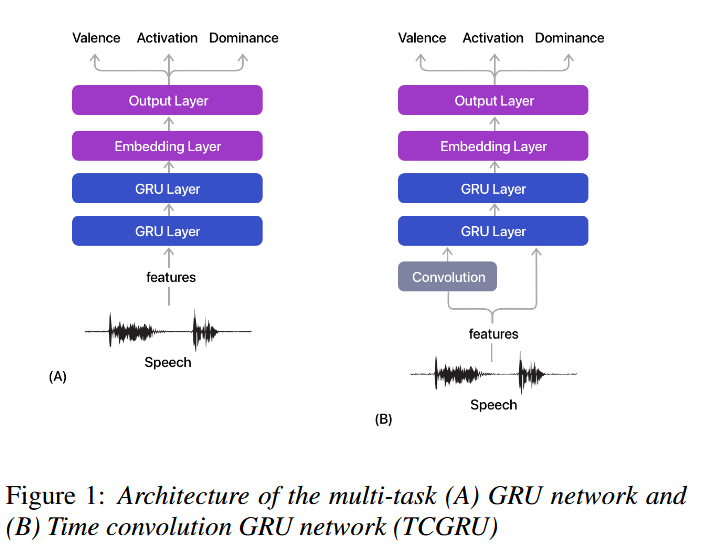

+++
title = "相关系数详解与应用"
date = 2025-09-15T19:48:36+08:00
draft = false
Toc = true
author = "Hex4C59"
tags = ["数学", "深度学习"]
math = true
+++

### 1 问题描述

我最近在复现一篇论文的实验:[Speech Emotion: Investigating Model Representations, Multi-Task Learning and Knowledge Distillation（Mitra et al. 2022）](https://arxiv.org/abs/2207.03334), 这是在[MSP-Podcast（Busso et al. 2025）](https://www.arxiv.org/pdf/2509.09791)这个语音情感数据集上做Arousal，Valence, Dominace三个维度的回归任务。论文模型结构图如下

我复现的是左边这个模型，它是先用预训练模型对数据进行特征提取，然后把特征送到 **two GRU Layer**——**Embedding Layer(其实就是Linear Layer)**——**Linear Layer** 这个网络结构里，这个模型用到的损失函数并不是MSE，而是自己定义，公式如下所示

$$
L_{ccc} := 1 - (\alpha CCC_v + \beta CCC_a + (1 - \alpha - \beta) CCC_d)
$$

$$
CCC = \frac{2\rho \sigma_x \sigma_y}{\sigma_x^2 + \sigma_y^2 + (\mu_x - \mu_y)^2}
$$

其中$\alpha = \beta = \frac{1}{3}$，$\rho$是皮尔逊相关系数，$\sigma_x$、$\sigma_y$分别为变量$x$和$y$的标准差，$\mu_x$、$\mu_y$分别为变量$x$、$y$的均值，$\sigma_x^2和\sigma_y^2$是衡量数据离散程度的指标。这个公式可以拆解为两个关键部分：

**A. 分子: $2\rho\sigma_x\sigma_y$**
这个部分与 $x$ 和 $y$ 之间的**协方差**紧密相关（协方差 = $\rho\sigma_x\sigma_y$）。它主要反映了两个变量的**相关性强度**。

**B. 分母: $\sigma_x^2 + \sigma_y^2 + (\mu_x - \mu_y)^2$**
这是理解 CCC 精髓的地方。它衡量了两个变量之间的差异，由三部分组成：

1. $\sigma_x^2$：预测值的离散程度。
2. $\sigma_y^2$：真实值的离散程度。
3. $(\mu_x - \mu_y)^2$：**位置偏移惩罚项**。这是 CCC 的核心！如果预测值的均值与真实值的均值不相等（即 $\mu_x \neq \mu_y$），这个惩罚项就会大于0，从而导致分母变大，最终使 CCC 的总分降低。

### 2 核心思想：从"相关"到"一致"

要理解CCC,首先要明白它与更常见的**皮尔逊相关系数（Pearson's Correlation Coefficient, 符号为**$\rho$）的区别

- 皮尔逊相关系数（$\rho$）:衡量的是两个变量之间的**线性相关性**。它关心当一个变量增加时，另一个变量是否也倾向于以线性的方式增加（正相关）或减少（负相关）。它不关心两个变量的绝对数值是否相等。
- **一致性相关系数（CCC）：**衡量的则是两个变量之间的**一致性或吻合度(Agreement)**。它不仅要求两个变量有很强的线性关系，还要求他们的数值本身非常接近。

### 2.1 示例场景

我们通过一个具体的例子，一步步手动计算皮尔逊相关系数 ($\rho$) 和一致性相关系数 (CCC)，来清晰地展示它们之间的核心区别。

假设有一个模型，其任务是预测一个范围在1-10的数值。我们有一组包含5个数据点的真实值和模型预测值。

- **真实值 (Y)**: `[1, 2, 3, 4, 5]`
- **模型预测值 (X)**: `[3, 4, 5, 6, 7]`

直观来看，这个模型的预测**趋势**是完美的，当真实值增加1时，预测值也恰好增加1。但是，它的预测值存在一个**系统性偏差**，即总是比真实值高2。

现在，我们来计算两个指标，看看它们如何评价这个模型。

---

#### 1. 皮尔逊相关系数 ($\rho$) 的计算

**公式:**
$$\rho = \frac{\sum_{i=1}^{n}(x_i - \mu_x)(y_i - \mu_y)}{\sqrt{\sum_{i=1}^{n}(x_i - \mu_x)^2 \sum_{i=1}^{n}(y_i - \mu_y)^2}}$$

**计算步骤:**

**第一步：计算均值 (μ)**

- 真实值均值: $\mu_y = (1+2+3+4+5) / 5 = 3$
- 预测值均值: $\mu_x = (3+4+5+6+7) / 5 = 5$

**第二步：计算每个数据点与均值的偏差**

| $y_i$ | $y_i - \mu_y$ | $x_i$ | $x_i - \mu_x$ |
| :---: | :---: | :---: | :---: |
| 1 | -2 | 3 | -2 |
| 2 | -1 | 4 | -1 |
| 3 | 0 | 5 | 0 |
| 4 | 1 | 6 | 1 |
| 5 | 2 | 7 | 2 |

**第三步：计算公式的分子 (协方差部分)**
将两列偏差相乘并求和:
$\sum(x_i - \mu_x)(y_i - \mu_y) = (-2 \times -2) + (-1 \times -1) + (0 \times 0) + (1 \times 1) + (2 \times 2) $$ = 4 + 1 + 0 + 1 + 4 = 10 $

**第四步：计算公式的分母 (标准差部分)**

- 计算Y的离差平方和: $\sum(y_i - \mu_y)^2 = (-2)^2 + (-1)^2 + 0^2 + 1^2 + 2^2 = 4+1+0+1+4 = 10$

- 计算X的离差平方和: $\sum(x_i - \mu_x)^2 = (-2)^2 + (-1)^2 + 0^2 + 1^2 + 2^2 = 4+1+0+1+4 = 10$

- 分母为: $\sqrt{10 \times 10} = \sqrt{100} = 10$

**第五步：计算最终的 $\rho$**
$$\rho = \frac{10}{10} = 1.0$$

**结论**：皮尔逊相关系数为1.0，表示模型的预测与真实值之间存在**完美的线性关系**。

---

#### 2. 一致性相关系数 (CCC) 的计算

**公式:**
$$CCC = \frac{2\rho\sigma_x\sigma_y}{\sigma_x^2 + \sigma_y^2 + (\mu_x - \mu_y)^2}$$

**计算步骤:**

**第一步：准备所需组件**

- 从上面的计算中，我们已知：
  - $\rho = 1.0$
  - $\mu_y = 3$
  - $\mu_x = 5$
- 我们还需要计算方差 ($\sigma^2$) 和标准差 ($\sigma$)。

**第二步：计算方差 ($\sigma^2$)**
方差是离差平方和的平均值。

- 真实值方差: $\sigma_y^2 = \frac{\sum(y_i - \mu_y)^2}{n} = \frac{10}{5} = 2$
- 预测值方差: $\sigma_x^2 = \frac{\sum(x_i - \mu_x)^2}{n} = \frac{10}{5} = 2$

**第三步：计算标准差 ($\sigma$)**

- $\sigma_y = \sqrt{2} \approx 1.414$

- $\sigma_x = \sqrt{2} \approx 1.414$

**第四步：计算CCC公式的分子**
$2 \rho \sigma_x \sigma_y = 2 \times 1.0 \times \sqrt{2} \times \sqrt{2} = 2 \times 2 = 4$

**第五步：计算CCC公式的分母**
这是最关键的一步，它包含了惩罚项。
$\sigma_x^2 + \sigma_y^2 + (\mu_x - \mu_y)^2 $$ = 2 + 2 + (5 - 3)^2 $
$= 4 + (2)^2 $$ = 4 + 4 = 8 $

**第六步：计算最终的 CCC**
$$CCC = \frac{4}{8} = 0.5$$

**结论**：一致性相关系数为0.5，表示模型的预测与真实值之间**一致性中等**。

这个例子清晰地表明，当评估一个需要产出精确数值的回归模型时，**皮尔逊相关系数可能会给出具有误导性的、过于乐观的评价**。而 **CCC 则提供了一个更真实、更可靠的性能度量**，因为它同时考虑了趋势（相关性）和数值的吻合度（一致性）。

### 3. 如何解读CCC的值？

CCC 的取值范围是 **-1 到 +1**：

- **+1**：表示**完美一致**。预测值与真实值完全相等。
- **0**：表示**完全不一致**或没有关系。
- **-1**：表示**完美不一致**（例如，预测值与真实值呈完美的相反线性关系）。

### 4. 未完待续
