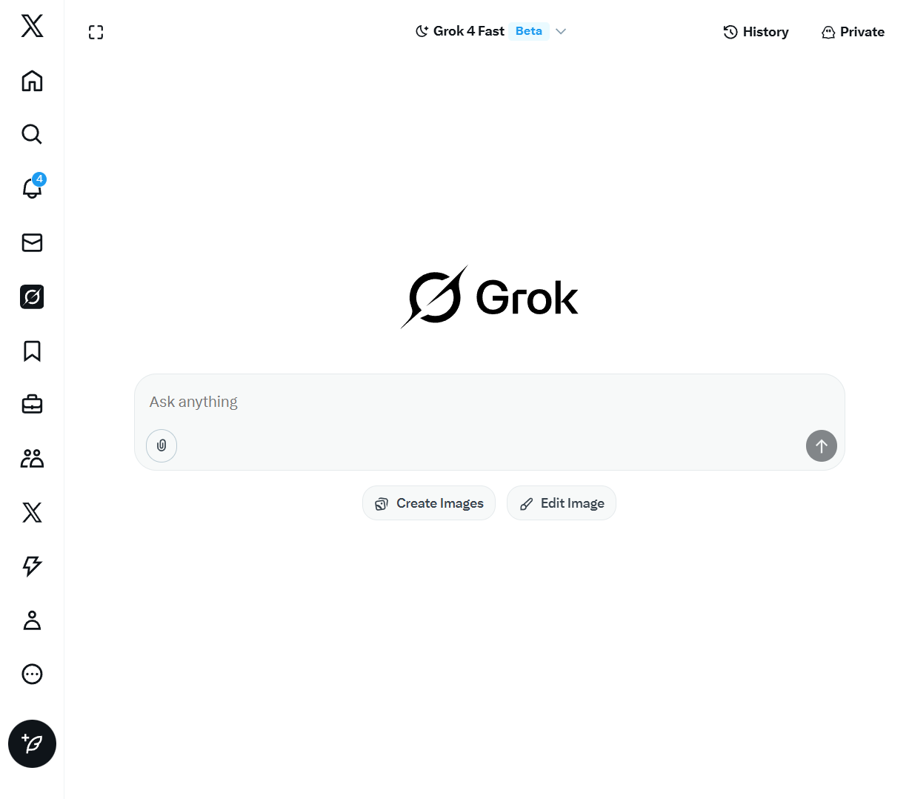
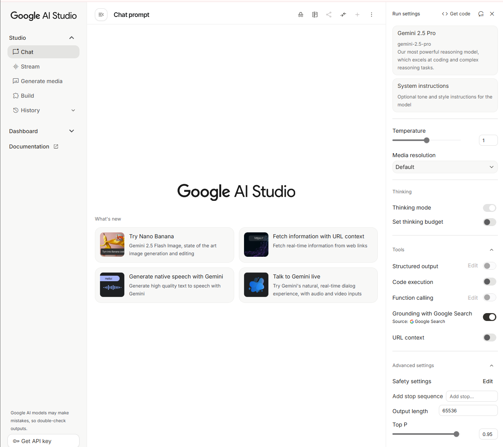

+++
title = "主流大语言模型全景指南：比较与实战选型"
date = 2025-09-28T12:21:41+08:00
draft = false
Toc = true
author = "Hex4C59"
tags = ['LLMs', '工具']
+++

从2022年底ChatGPT发布以来，到现在短短三年时间，大语言模型（LLMs）迅速崛起，市面上各种大模型层出不穷， 国外的如Chatgpt(openai), Gemini(Google), Grok(XAI), Claude(Anthropic)等，国内的有DeepSeek，阿里的通义千问， 字节的豆包，月之暗面的KIMI, 智谱的GLM，美团的LongCat等。虽然我介绍了这么多大模型，但从身边认识的人来看，大家对这些模型的了解仍然有限，很多人只知道DeepSeek、豆包、KIMI这些模型。因此，我写这篇文章的目的是为了全面介绍主流大语言模型的比较及实战选型，帮助读者理解这些模型的优势与不足，从而在实际应用中做出明智选择。

### 1. 大语言模型使用渠道

想要使用国内的大模型，其实非常简单：只需打开搜索引擎，输入你想用的大模型名称，通常搜索结果的第一条就是它的官方网站。

这里想强调一点：**不要用百度！不要用百度！不要用百度！**

建议优先使用Google(需要科学上网)，其次可以选择Bing。

这么简单的一件事，为什么还要专门提醒呢？因为真的有人不会操作。比如下图，就是我在某宝上随便找到的一家店铺

  <figure style="margin:0 0 18px;">
    
    <figcaption style="font-size:0.9em;color:#666;margin-top:8px;">某宝截图 1</figcaption>
  </figure>

  

  <figure style="margin:0;">
    
    <figcaption style="font-size:0.9em;color:#666;margin-top:8px;">某宝截图 2</figcaption>
  </figure>

---

接下来，说说怎么使用**国外的大模型**（比如 ChatGPT、Claude、Gemini 等）。

和国内模型不同，这些工具通常**无法直接在国内访问**，必须通过科学上网才能连接到它们的官网。比如：

- **ChatGPT**（OpenAI）：访问 https://chat.openai.com  
- **Claude**（Anthropic）：访问 https://claude.ai  
- **Gemini**（Google）：访问 https://gemini.google.com  
- **Grok**（XAI）：访问 https://grok.ai

使用前，你通常需要：
1. **稳定的梯子**（这是前提）；
2. 一个**支持国际服务的邮箱**（如 Gmail等）；  
3. 部分服务可能需要**绑定境外支付方式**（比如 ChatGPT Plus），但一般免费版足够使用；

这里想强调的几个点：首先，梯子挂的要是非香港的节点，否则有些服务依然无法访问。其次，Gmail 现在注册也需要手机号验证，目前只支持国外的手机号。如果Gmail邮箱未经过验证，是无法使用Claude模型的。

除了这些官网渠道外，还有一些第三方平台集成了这些大模型，用户可以通过这些平台间接使用大模型的功能。比如:
X里就集成了Grok模型。Gemini模型集成在Google的AI studio里。

  <figure style="margin:0 0 18px;">
    
    <figcaption style="font-size:0.9em;color:#666;margin-top:8px;">X里Grok截图 1</figcaption>
  </figure>

  

  <figure style="margin:0;">
    
    <figcaption style="font-size:0.9em;color:#666;margin-top:8px;">Google AI Studio截图</figcaption>
  </figure>

---
### 2. 主流大语言模型比较

| 模型名称 | 开发公司 | 主要特点 |
| --- | --- | --- |
| ChatGPT | OpenAI | 问答能力强，代码能力稍逊于Claude |
| Claude | Anthropic | 写代码永远滴神！ |
| Gemini | Google | 问答能力强，代码能力一般，英文输出内容比中文好 |
| Grok | XAI | 网络搜索能力强，适合信息检索 |
| DeepSeek |  | 问答能力和代码能力都不错，但比不上GPT和Claude |
| 通义千问 | 阿里 | qwen-coder 写代码还不错 |
| 豆包 | 字节 | 中规中矩，各方面都不突出，可以生成图片 |
| KIMI | 月之暗面 | 模型更拟人化，适合对话场景，KIMI 做PPT还不错 |
| GLM | 智谱 | API价格便宜 |
| LongCat | 美团 | 没怎么用过，待评估 |

总体来说，国内大模型在问答和代码生成能力上，目前还难以完全媲美国外的顶尖模型，但优势在于免费、无需翻墙、访问便捷。

而像 ChatGPT 和 Claude 这类国外模型，整体表现确实非常出色——尤其是 Claude，在代码生成方面尤为亮眼。但它们的高级版本（如 Claude Pro、ChatGPT Plus）订阅费用较高，对学生党来说不太友好。

相比之下，Gemini 显得有些特别：它的综合能力相对均衡，虽然官网上的高级功能需要付费，但在 Google AI Studio 中集成的版本却是完全免费的。我自己日常主力使用的，就是这个免费版的 Gemini。