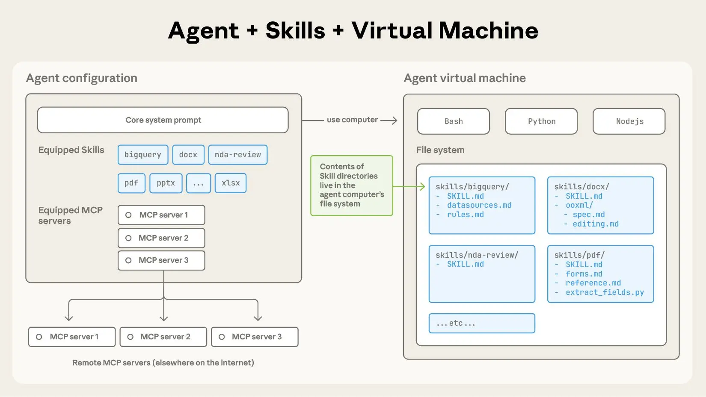
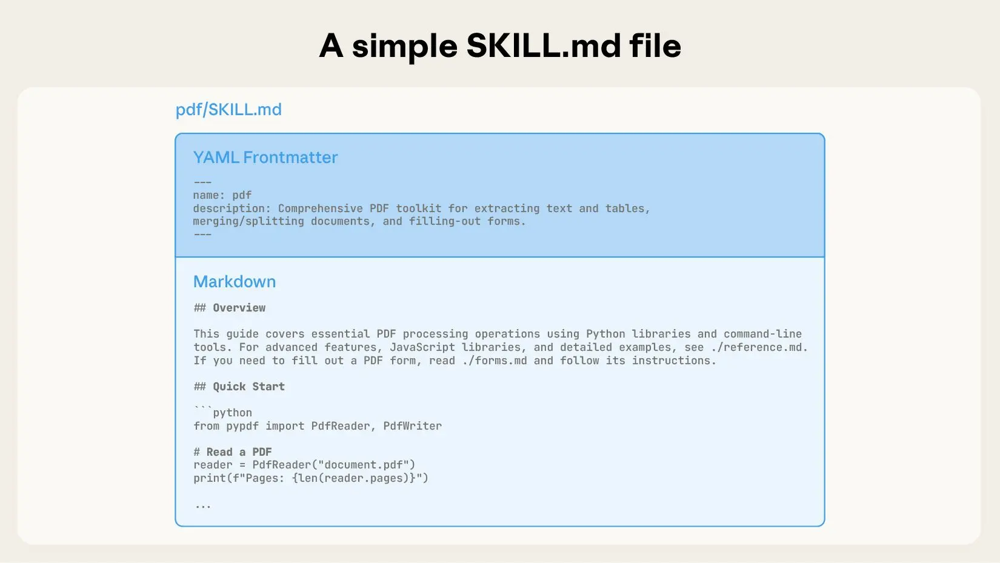
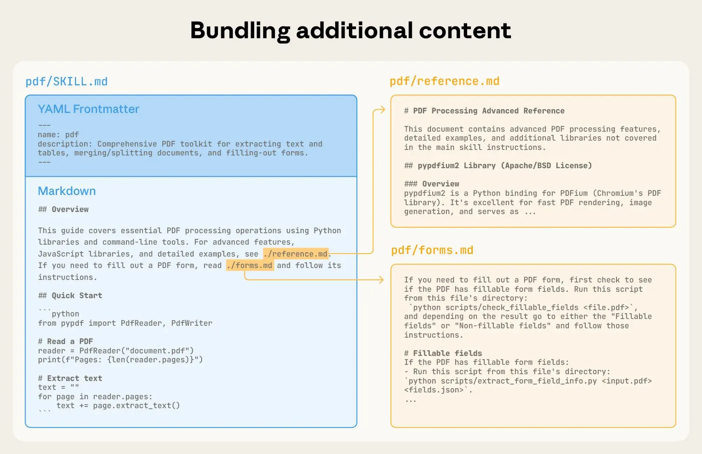
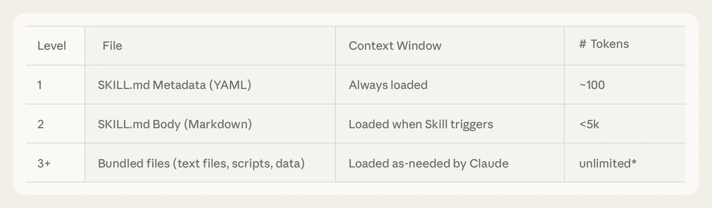
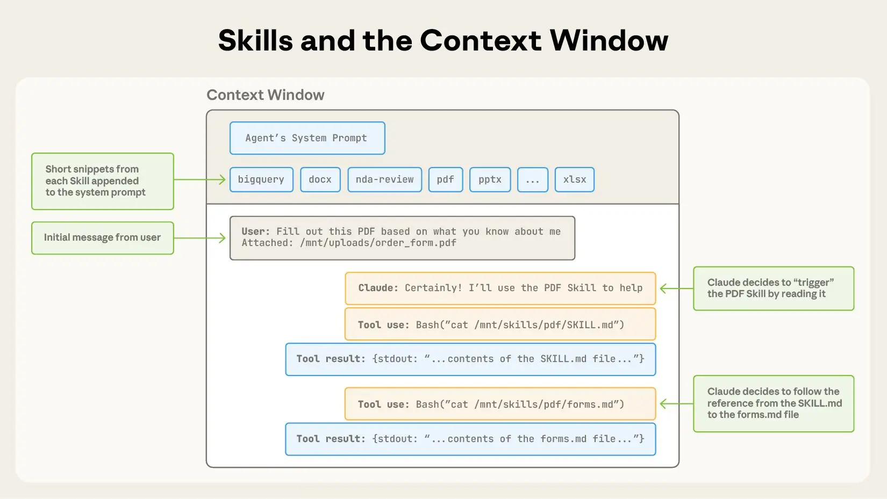
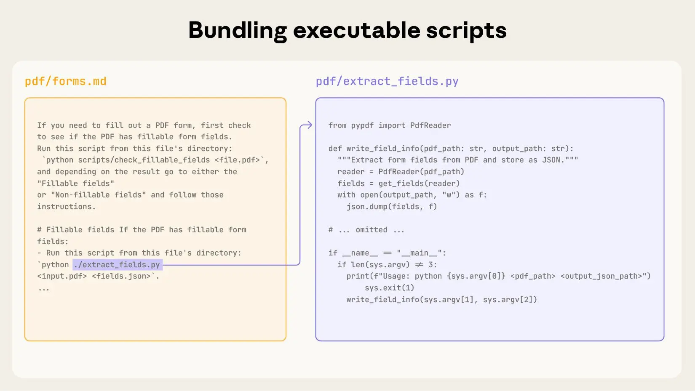

+++
title = "用 Agent Skills 为真实世界装备智能体"
date = 2026-03-25T12:00:00+08:00
lastmod = 2026-03-25T12:00:00+08:00
draft = false
author = "Hex4C59"
description = "介绍 Agent Skills：以文件与文件夹为智能体打包程序性知识与组织上下文，含渐进式披露、上下文加载顺序、可执行代码与编写评估及安全建议。"
summary = "把专长装进可组合的 Skill 目录，让通用智能体在特定任务上更可靠。"
tags = []
categories = ["Translations"]
topics = ["agent-skills", "claude-code", "claude"]
original_title = "Equipping agents for the real world with Agent Skills"
original_url = "https://claude.com/blog/equipping-agents-for-the-real-world-with-agent-skills"
original_author = "Barry Zhang, Keith Lazuka, Mahesh Murag"
original_date = "2025-10-16"
original_site = "Claude Blog"
ShowToc = true
+++

> **译文信息**  
> - 原文：[Equipping agents for the real world with Agent Skills](https://claude.com/blog/equipping-agents-for-the-real-world-with-agent-skills)  
> - 作者：Barry Zhang, Keith Lazuka, Mahesh Murag  
> - 原文发布：2025-10-16  
> - 翻译发布：2026-03-25（东八区）

Claude 能力很强，但真实工作还需要**程序性知识**与**组织语境**。本文介绍 **Agent Skills**：一种用文件与文件夹构建专用智能体的新方式。

**更新：**我们已将 [Agent Skills](https://agentskills.io/) 发布为跨平台可移植的开放标准。（2025-12-18）

随着模型能力持续提升，我们已经可以构建能与完整计算环境交互的通用智能体。例如 [Claude Code](https://claude.com/product/claude-code) 能借助本地代码执行与文件系统跨领域完成复杂任务。但智能体越强，就越需要**可组合、可扩展、可移植**的方式，为它们配备领域专长。

因此我们推出了 [Agent Skills](https://www.anthropic.com/news/skills)：由说明、脚本与资源组成的文件夹结构，智能体可以按需发现并动态加载，从而在特定任务上表现更好。Skills 把你的专长打包成 Claude 可用的可组合资源，扩展 Claude 的能力边界，把通用智能体变成更贴合你需求的专用智能体。

为智能体编写 skill，就像给新员工准备入职指南。你不必再为每个场景各造一套零散、定制化的智能体；任何人都可以通过沉淀与分享程序性知识，用可组合的能力为智能体「加专长」。下文说明 Skills 是什么、如何运作，并给出自建 skill 的实用建议。

要启用 skills，只需编写带自定义指引的 `SKILL.md` 文件。

*Skill 是一个目录，其中包含 `SKILL.md` 文件；该文件组织起说明、脚本与资源文件夹，为智能体赋予额外能力。（插图来源：原文）*

## Skill 的结构

下面用一个真实例子看 Skills 如何工作：它为 [Claude 近期推出的文档编辑能力](https://www.anthropic.com/news/create-files)提供支持。Claude 本就擅长理解 PDF，但直接操作 PDF（例如填写表单）能力有限。这个 [PDF skill](https://github.com/anthropics/skills/tree/main/document-skills/pdf) 让 Claude 获得这些新能力。

最简单的情况下，skill 就是一个**包含 `SKILL.md` 文件的目录**。该文件必须以 YAML front matter 开头，其中包含必填元数据：`name` 与 `description`。启动时，智能体会把每个已安装 skill 的 `name` 与 `description` **预加载**进系统提示。

这些元数据是**渐进式披露**（progressive disclosure）的**第一层**：只提供刚好足够的信息，让 Claude 知道何时该用某个 skill，而不必把整个 skill 都塞进上下文。文件正文则是**第二层**细节：若 Claude 判断当前任务与该 skill 相关，就会通过读取完整 `SKILL.md` 来加载该 skill。

*`SKILL.md` 必须以 YAML Front matter 开头，其中包含名称与描述；启动时它们会被载入系统提示。（插图来源：原文）*

随着 skill 变复杂，单份 `SKILL.md` 可能装不下全部上下文，或某些内容只在特定场景才需要。此时可以在 skill 目录内打包更多文件，并在 `SKILL.md` 中按文件名引用。这些被链接的文件是**第三层**（及更深）细节，Claude 可以只在需要时再导航、读取。

下文 PDF skill 示例中，`SKILL.md` 引用了两个额外文件（`reference.md` 与 `forms.md`），由 skill 作者与核心 `SKILL.md` 一并打包。把填表说明挪到单独文件（`forms.md`）后，作者能保持核心 skill 精简，并相信 Claude 只会在填表时去读 `forms.md`。

*你可以通过额外文件为 skill 注入更多上下文，并由 Claude 依据系统提示在合适时机触发。（插图来源：原文）*

**渐进式披露**是 Agent Skills 灵活、可扩展的核心设计原则。就像一本结构良好的手册：先有目录，再有各章，最后是附录；skills 让 Claude **只在需要时**加载信息：

*（插图来源：原文）*

具备文件系统与代码执行工具的智能体，在处理某项具体任务时，不必把整份 skill 都读进上下文窗口。因此，单个 skill 能打包的上下文量**实际上没有上限**。

### Skills 与上下文窗口

下图展示用户消息触发某个 skill 时，上下文窗口如何变化。

*Skills 通过系统提示在上下文窗口中被触发。（插图来源：原文）*

图示中的操作顺序为：

1. 初始时，上下文窗口包含核心系统提示、每个已安装 skill 的元数据，以及用户的首条消息；
2. Claude 通过调用 Bash 工具读取 `pdf/SKILL.md` 的内容，从而触发 PDF skill；
3. Claude 选择读取 skill 包内的 `forms.md`；
4. 在从 PDF skill 加载了相关说明后，Claude 继续执行用户的任务。

### Skills 与代码执行

Skills 还可以包含代码，供 Claude 视情况作为工具执行。

大语言模型在很多任务上很强，但某些操作更适合交给传统代码执行。例如，用生成 token 的方式给列表排序，远比直接跑排序算法昂贵。除效率外，许多应用还需要只有代码才能提供的**确定性可靠**结果。

在我们的示例中，PDF skill 包含一段预先写好的 Python 脚本，用于读取 PDF 并提取所有表单字段。Claude 可以运行该脚本，而**不必**把脚本或 PDF 本身载入上下文。又因为代码是确定性的，这一工作流稳定、可重复。

*根据任务性质，Skills 也可以包含代码，供 Claude 酌情作为工具执行。（插图来源：原文）*

## 开发与评估 skills

编写与测试 skills 时，可参考以下做法：

- **从评估入手：**在代表性任务上运行智能体，观察它们在哪些地方吃力或需要额外上下文，找出能力缺口；再逐步编写 skill 补齐。
- **为规模而设计：**当 `SKILL.md` 变得难以维护时，把内容拆到多个文件并在主文件中引用。若某些上下文互斥或很少同时出现，分路径存放有助于降低 token 消耗。此外，代码既可作可执行工具，也可作文档；应明确 Claude 该**直接运行**脚本，还是**读入上下文**作参考。
- **站在 Claude 的角度想：**在真实场景中观察 Claude 如何使用你的 skill，并据此迭代；留意意外路径或对某些上下文的过度依赖。尤其要重视 skill 的 `name` 与 `description`——Claude 会据此判断是否针对当前任务触发该 skill。
- **与 Claude 一起迭代：**协作完成任务时，可请 Claude 把成功做法与常见错误沉淀进 skill 里的可复用上下文与代码。若用 skill 完成任务时跑偏，可请它反思哪里出了问题。这样能发现 Claude **实际**需要哪些上下文，而不是一味事前猜测。

### 使用 Skills 时的安全考量

Skills 通过说明与代码为 Claude 赋予新能力；这既强大也意味着：**恶意 skill** 可能在你使用的环境中引入漏洞，或诱导 Claude 外泄数据、执行非预期操作。

我们建议只安装来自**可信来源**的 skill。若来源可信度较低，使用前请充分审计：先通读 skill 包内各文件以理解其行为，特别关注代码依赖以及图片、脚本等打包资源。同样要留意 skill 中指示 Claude 连接**可能不可信**的外部网络的说明或代码。

## Skills 的未来

[目前](https://www.anthropic.com/news/skills)，Agent Skills 已支持 [Claude.ai](https://claude.ai/)、Claude Code、Claude Agent SDK 与 Claude Developer Platform。

未来几周，我们会继续推出功能，覆盖创建、编辑、发现、分享与使用 Skills 的完整生命周期。我们特别期待 Skills 帮助组织与个人向 Claude 传递语境与工作流。我们还将探索 Skills 如何与 [Model Context Protocol](https://modelcontextprotocol.io/)（MCP）服务器互补，教会智能体更复杂、涉及外部工具与软件的工作流。

更长远地，我们希望让智能体能够**自行**创建、编辑与评估 Skills，把行为模式固化为可复用能力。

Skills 概念简单，格式也简单。这种简单性让组织、开发者与终端用户更容易构建定制化智能体并赋予新能力。

我们期待看到大家用 Skills 做出什么。欢迎从官方 [Skills 文档](https://docs.claude.com/en/docs/agents-and-tools/agent-skills/overview) 与 [cookbook](https://github.com/anthropics/claude-cookbooks/tree/main/skills) 入手。

## 致谢

本文由 Barry Zhang、Keith Lazuka 与 Mahesh Murag 撰写——他们都很喜欢文件夹。同时感谢 Anthropic 内外许多推动、支持并构建 Skills 的同事。
