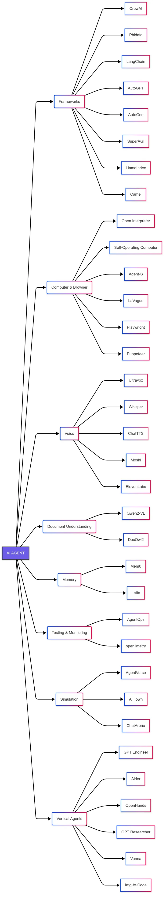

+++
title = "构建 AI Agent 的开源工具栈指南"
date = 2026-03-27T12:00:00+08:00
lastmod = 2026-03-27T12:00:00+08:00
draft = true
author = "Hex4C59"
description = "一份实战者的 AI Agent 开源工具精选——覆盖框架编排、浏览器控制、语音、文档理解、记忆、测试、监控、仿真与垂直 Agent 九大类别，聚焦真正好用、可落地的工具。"
summary = ""
tags = []
categories = ["Translations"]
topics = ["agents", "open-source", "orchestration", "llm", "tools", "voice"]
translation_category = "AI 与工具"
original_title = "The Open-Source Stack for AI Agents"
original_url = "https://medium.com/@paolo.perrone/the-open-source-stack-for-ai-agents"
original_author = "Paolo Perrone"
original_date = "2025-04-22"
original_site = "Medium"
ShowToc = true
+++

> **译文信息**
> - 原文：[The Open-Source Stack for AI Agents](https://medium.com/@paolo.perrone/the-open-source-stack-for-ai-agents)
> - 作者：Paolo Perrone
> - 原文发布：2025-04-22
> - 翻译发布：2026-03-27

---

我记得有个周末，我信心满满地坐下来，下定决心要做出一个像样的研究助手 Agent 原型。没什么复杂的——就是能读取一个 PDF、提取关键信息，也许再回答几个后续问题。听起来应该很简单，对吧？

结果，我花了将近两天时间，在文档残缺的仓库、死掉的 GitHub issue 和模糊的博客文章之间来回跳转。有个工具看起来很有希望，直到我发现它已经八个月没有更新了。另一个工具只是为了解析一份文档，就需要启动四个不同的服务。折腾到最后，我的「Agent」连文件名都读不利索，更别说读取文件内容了。

但让我坚持下去的不是挫败感，而是好奇心。我想知道：真正的构建者用的是什么工具？不是那些出现在光鲜 VC 图谱上的，而是那些你悄悄安装、留在技术栈里、对它深信不疑的工具——那些不需要三份 Notion 文档就能讲清楚的工具。

这番探寻，最终让我找到了一批出乎意料的优质开源库——轻量、可靠，而且是为开发者而生的。

所以，如果你正在壕沟里摸索，努力让 Agent 真正跑起来，这篇文章就是为你写的。

---

## 准备好构建 AI Agent 了吗？

你可能会问：

- 构建语音 Agent，大家用什么？
- 文档解析最好的开源工具是什么？
- 怎么给 Agent 加上记忆，而不是把向量数据库硬拼上去？

本指南不打算覆盖市面上所有工具——这是故意的。这是一份精选清单，收录的都是我亲自用过、留在技术栈里、在构建真实 Agent 原型时反复回头用的工具。不是那些 demo 里看起来酷炫或者刷屏各个热帖的，而是真正帮我从「有想法」走到「能跑起来」的那些。

以下是按类别整理的技术栈：

*AI Agent 开源技术栈全景图（引自原文）*

---

## 1. Agent 构建与编排框架

如果你从零开始构建，从这里入手。这些工具帮你搭建 Agent 的逻辑骨架——该做什么、什么时候做、如何调用工具。把它看作核心大脑，让原始语言模型变得更加自主。

- **CrewAI** — 编排多个 Agent 协同工作，适合需要协调分工、角色行为的任务。
- **Agno** — 专注于记忆、工具调用与长期交互，非常适合需要记住上下文并自我适应的助手。
- **Camel** — 为多 Agent 协作、仿真与任务专业化而设计。
- **AutoGPT** — 通过规划与执行的循环自动化复杂工作流，适合需要独立运行的 Agent。
- **AutoGen** — 让多个 Agent 相互通信、协作解决复杂问题。
- **SuperAGI** — 简化的配置流程，快速构建并上线自主 Agent。
- **Superagent** — 一套灵活的开源工具包，用于构建自定义 AI 助手。
- **LangChain & LlamaIndex** — 管理记忆、检索增强与工具链的首选工具。

---

## 2. 计算机与浏览器控制

Agent 能思考了，下一步是让它行动。这一类工具让 Agent 像真人一样点击按钮、填写表单、抓取数据，全面操控应用程序或网站。

- **Open Interpreter** — 将自然语言翻译成可在本机执行的代码。想移动文件或跑脚本？描述一下就够了。
- **Self-Operating Computer** — 赋予 Agent 对桌面环境的完整控制权，像人一样操作操作系统。
- **Agent-S** — 一套灵活的框架，让 AI Agent 像真实用户一样使用应用、工具与界面。
- **LaVague** — 让 Web Agent 实时导航网站、填写表单、自主决策，非常适合浏览器任务自动化。
- **Playwright** — 跨浏览器的 Web 操作自动化，方便测试或模拟用户操作流程。
- **Puppeteer** — 可靠的 Chrome/Firefox 控制工具，擅长网页抓取与前端行为自动化。

---

## 3. 语音

语音是人类与 AI Agent 交互最直觉化的方式之一。这些工具处理语音识别、语音合成与实时交互，让你的 Agent 更有人情味。

### 语音到语音（Speech2Speech）

- **Ultravox** — 顶级的语音到语音模型，实时对话流畅、响应迅速。
- **Moshi** — 另一个语音到语音的强力选项，实时语音交互可靠，但性能上 Ultravox 略胜一筹。
- **Pipecat** — 构建语音 Agent 的全栈框架，支持语音转文本、文本转语音，甚至视频交互。

### 语音转文本（Speech2Text）

- **Whisper** — OpenAI 的语音转文本模型，多语言转录与语音识别效果出色。
- **Stable-ts** — 对 Whisper 更友好的开发者封装，增加了时间戳和实时支持，非常适合对话 Agent。
- **Speaker Diarization 3.1** — Pyannote 的说话人识别模型，用于检测多说话人场景中「谁在什么时候说话」，多人会议音频必备。

### 文本转语音（Text2Speech）

- **ChatTTS** — 目前我找到的最佳模型。快速、稳定，大多数场景下可直接用于生产。
- **ElevenLabs**（商业产品）— 当质量比开源更重要时的首选，语音自然度极高，支持多种风格。
- **Cartesia**（商业产品）— 另一个强力商业选项，表现力强、保真度高，超越了开源模型的上限。

### 其他工具

以下工具不完全归属某一子类，但在构建或打磨语音 Agent 时非常实用：

- **Vocode** — 构建语音驱动 LLM Agent 的工具包，轻松连接语音输入/输出与语言模型。
- **Voice Lab** — 语音 Agent 的测试与评估框架，用于调优提示词、语音人格或模型配置。

---

## 4. 文档理解

大量有价值的业务数据仍以非结构化格式存在——PDF、扫描件、图文混排报告。这些工具帮助 Agent 真正读懂这些内容，无需脆弱的 OCR 流水线。

- **Qwen2-VL** — 阿里巴巴推出的强大视觉语言模型，在图文混排的文档任务上超越了 GPT-4 和 Claude 3.5 Sonnet，擅长处理复杂的真实世界格式。
- **DocOwl2** — 专为无 OCR 文档理解设计的轻量多模态模型，速度快、效率高，从杂乱输入中提取结构与语义的准确率令人惊喜。

---

## 5. 记忆

没有记忆，Agent 就会陷入死循环——把每次交互都当成第一次。这些工具帮助 Agent 回忆过往对话、追踪用户偏好、积累长期上下文，让一次性助手进化成真正有用的工具。

- **Mem0** — 自我改进的记忆层，让 Agent 能够适应过往交互，打造更个性化、更持久的 AI 体验。
- **Letta**（原 MemGPT）— 为 LLM Agent 增加长期记忆与工具调用能力，是需要记忆、推理与持续演进的 Agent 的脚手架。
- **LangChain** — 内置即插即用的记忆组件，用于跟踪对话历史与用户上下文，适合需要跨多轮保持状态的 Agent。

---

## 6. 测试与评估

当你的 Agent 开始做的不仅是聊天——浏览网页、自主决策、开口说话——你就需要知道它在边缘情况下会怎么表现。这些工具帮你测试 Agent 在不同场景下的行为，提前发现 bug，找出问题出在哪。

- **Voice Lab** — 语音 Agent 综合测试框架，确保语音识别准确、响应自然。
- **AgentOps** — 一套追踪与基准测试 AI Agent 的工具，帮你在上线前发现问题、优化性能。
- **AgentBench** — 跨任务、跨环境评估 LLM Agent 的基准工具，覆盖从网页浏览到游戏的多种场景，确保通用性与有效性。

---

## 7. 监控与可观测性

要让 AI Agent 在规模化场景下稳定高效地运行，你需要清晰的性能与资源使用视图。这些工具提供必要的洞察，让你监控 Agent 行为、优化资源、在问题影响用户前提前发现。

- **openllmetry** — 基于 OpenTelemetry 为 LLM 应用提供端到端可观测性，清晰展示 Agent 性能，帮助你快速排查与优化。
- **AgentOps** — 全面的监控工具，追踪 Agent 性能、成本与基准指标，确保 Agent 高效运行且在预算范围内。

---

## 8. 仿真

在正式部署前模拟真实环境是改变游戏规则的一步。这些工具让你构建可控的虚拟空间，Agent 可以在其中交互、学习、做决策，而不会在生产环境中造成意外后果。

- **AgentVerse** — 支持在多种应用与仿真场景中部署多个 LLM Agent，确保在不同环境中有效运作。
- **Tau-Bench** — 针对特定行业（如零售、航空）评估 Agent 与用户交互的基准工具，确保顺畅处理领域特定任务。
- **ChatArena** — 多 Agent 语言游戏环境，Agent 在其中相互交互，适合研究 Agent 行为、在安全可控的空间打磨沟通模式。
- **AI Town** — AI 角色社交互动的虚拟环境，用于测试决策逻辑与模拟现实场景，帮助微调 Agent 行为。
- **Generative Agents** — 斯坦福大学的研究项目，专注于构建能模拟复杂行为的类人 Agent，非常适合在社交上下文中测试记忆与决策机制。

---

## 9. 垂直 Agent

垂直 Agent 是为解决特定问题或优化特定行业任务而设计的专用工具。以下是我个人使用过且觉得特别实用的几款：

### 编程

- **OpenHands** — 由 AI 驱动的软件开发 Agent 平台，设计用于自动化编码任务、加速开发流程。
- **aider** — 直接集成到终端的结对编程工具，提供 AI 副驾驶，在你的编码环境中随时待命。
- **GPT Engineer** — 用自然语言构建应用：描述你想要什么，AI 会进一步确认需求并生成相应代码。
- **screenshot-to-code** — 将截图转换为完整可运行的网页（支持 HTML、Tailwind、React 或 Vue），非常适合将设计稿快速变成线上代码。

### 研究

- **GPT Researcher** — 自主 Agent，能进行全面的资料搜集、数据分析并撰写报告，大幅简化研究流程。

### SQL

- **Vanna** — 用自然语言与 SQL 数据库交互；告别复杂的 SQL 命令，直接提问，Vanna 帮你取回数据。

---

## 结语

回顾我当初构建研究助手的那些尝试，我能清晰地看到当时把事情想得太复杂了。整个项目乱成一锅粥——代码过时、工具半生不熟，系统连读取 PDF 这么简单的事都搞不定。

但矛盾的是，那恰恰是我收获最多的阶段。

关键不在于找到完美的工具，而在于坚守有效的东西、保持简单。那次失败让我明白：最可靠的 Agent，是用务实、直接的技术栈搭建的，而不是追着每一个闪亮的新玩意儿跑。

成功的 Agent 开发不需要重新发明轮子。

关键是为手头的工作选对工具，深思熟虑地整合它们，并持续打磨你的原型。无论是在自动化工作流、构建语音 Agent，还是解析文档，一套精心选择的技术栈都能让整个过程更顺畅、更高效。

所以，动手吧，大胆实验，让好奇心引路。这个生态系统正在快速演进，可能性是无限的。
